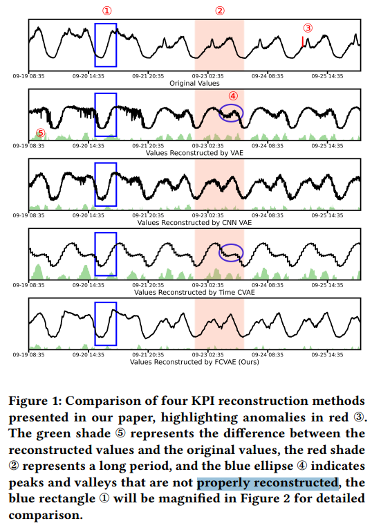
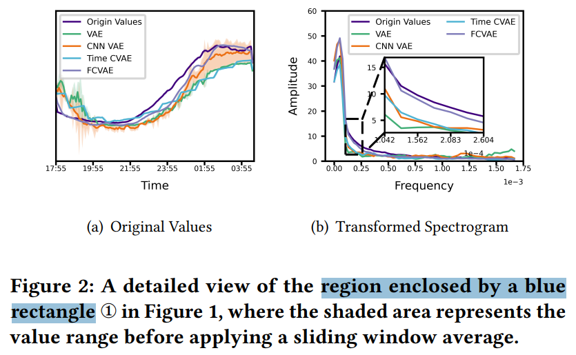
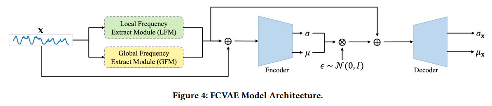
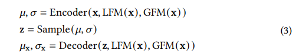
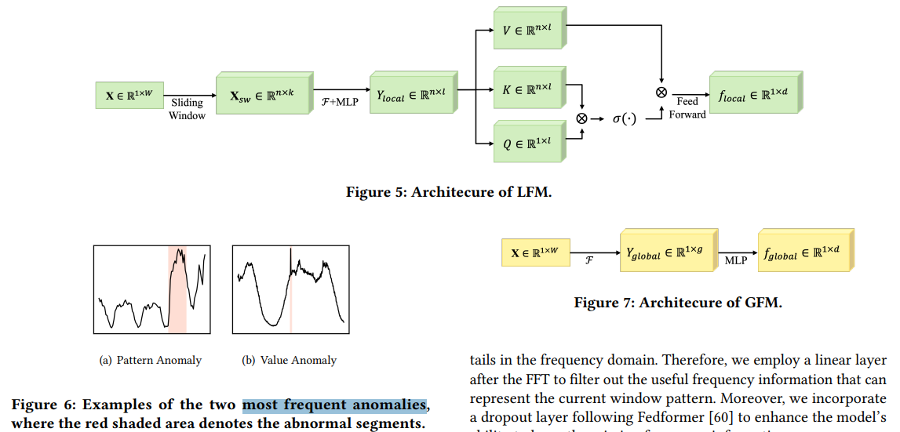
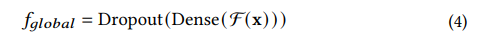
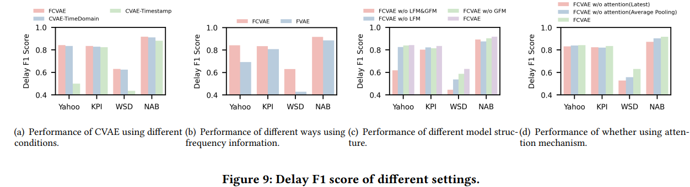

# Revisiting VAE for Unsupervised Time Series Anomaly Detection: A Frequency Perspective

> "Revisiting VAE for Unsupervised Time Series Anomaly Detection: A Frequency Perspective" WWW-2024, 2024 Feb 5
> [paper](http://arxiv.org/abs/2402.02820v1) [code](https://github.com/CSTCloudOps/FCVAE) [pdf](./2024_02_Arxiv_Revisiting-VAE-for-Unsupervised-Time-Series-Anomaly-Detection--A-Frequency-Perspective.pdf) [note](./2024_02_Arxiv_Revisiting-VAE-for-Unsupervised-Time-Series-Anomaly-Detection--A-Frequency-Perspective_Note.md)
> Authors: Zexin Wang, Changhua Pei, Minghua Ma, Xin Wang, Zhihan Li, Dan Pei, Saravan Rajmohan, Dongmei Zhang, Qingwei Lin, Haiming Zhang, Jianhui Li, Gaogang Xie

## Key-point

- Task: Time series Anomaly Detection (AD), VAE 优化
- Problems
  - However, our study reveals that VAE-based methods face challenges in **capturing long-periodic heterogeneous patterns** and detailed short-periodic trends simultaneously. 

- :label: Label:

## Contributions

- To address these challenges, we propose Frequency-enhanced Conditional Variational Autoencoder (FCVAE), a novel unsupervised AD method for univariate time series.
- FCVAE exploits an innovative approach to concurrently integrate both the **global and local frequency features** into the condition of Conditional Variational Autoencoder (CVAE) to significantly increase the accuracy of reconstructing the normal data
- Together with a carefully designed “target attention” mechanism, our approach allows the model to pick the most useful information from the frequency domain for better short-periodic trend construction


## Introduction

VAE 去重建 1D 时序信号有损失，提出的方法在高频还是有损失 :joy:




分析时域 & 频域，说明引入频域还可以




## methods






global frequency 模块



> F means FFT



**在 FFT 之后过一层 MLP 过滤一下，再加一层 dropout :star:**

> However, not all frequency information is useful. The frequencies resulted from the noise and anomalies in the time series data appear as long tails in the frequency domain. Therefore, we employ a linear layer after the FFT to filter out the useful frequency information that can represent the current window pattern.
>
> Moreover, we incorporate a dropout layer following Fedformer [60] to enhance the model’s ability to learn the missing frequency information

GFM 全局频域模块认为**只有 average frequency 信息？**

> Even in the absence of concept drift, GFM cannot capture local changes as it extracts the average frequency information from the entire window


### code

- Q：global 怎么和 local 一起用？？

> https://github.com/CSTCloudOps/FCVAE/blob/92a8c35ab176501b2d0c3eeff6afe6cc75997736/CVAE.py#L128

`output = torch.cat((f_global, f_local), -1)  # 在 C 维度 concat 起来`

特征维度 `--condition_emb_dim 64`

```python
    def get_conditon(self, x):
        x_g = x
        f_global = torch.fft.rfft(x_g[:, :, :-1], dim=-1)
        f_global = torch.cat((f_global.real, f_global.imag), dim=-1)
        f_global = self.emb_global(f_global)
        x_g = x_g.view(x.shape[0], 1, 1, -1)
        x_l = x_g.clone()
        x_l[:, :, :, -1] = 0
        unfold = nn.Unfold(
            kernel_size=(1, self.hp.kernel_size),
            dilation=1,
            padding=0,
            stride=(1, self.hp.stride),
        )
        unfold_x = unfold(x_l)
        unfold_x = unfold_x.transpose(1, 2)
        f_local = torch.fft.rfft(unfold_x, dim=-1)
        f_local = torch.cat((f_local.real, f_local.imag), dim=-1)
        f_local = self.emb_local(f_local)
        for enc_layer in self.atten:
            f_local, enc_slf_attn = enc_layer(f_local)
        f_local = self.out_linear(f_local)
        f_local = f_local[:, -1, :].unsqueeze(1)
        output = torch.cat((f_global, f_local), -1)  # 在 C 维度 concat 起来
        return output
```


Global Freq 的 MLP

```python
        self.emb_global = nn.Sequential(
            nn.Linear(self.hp.window, self.hp.condition_emb_dim),
            nn.Tanh(),
        )
        self.emb_local = nn.Sequential(
            nn.Linear(2 + self.hp.kernel_size, self.hp.d_model),
            nn.Tanh(),
        )
```


forward

> https://github.com/CSTCloudOps/FCVAE/blob/92a8c35ab176501b2d0c3eeff6afe6cc75997736/CVAE.py#L114

```
    def forward(self, input, mode, y):
        if mode == "train" or mode == "valid":
            condition = self.get_conditon(input)
            condition = self.dropout(condition)
            mu, var = self.encode(torch.cat((input, condition), dim=2))
            z = self.reparameterize(mu, var)
            mu_x, var_x = self.decode(torch.cat((z, condition.squeeze(1)), dim=1))
            rec_x = self.reparameterize(mu_x, var_x)
            loss = self.loss_func(mu_x, var_x, input, mu, var, y, z)
            return [mu_x, var_x, rec_x, mu, var, loss]
        else:
            y = y.unsqueeze(1)
            return self.MCMC2(input)
```


- Q：效果咋样？？

**把模块去掉看指标**，看 fig9c，指标确实高了一些

> However, do these two modules achieve our intended effects through their designs?
>
> Additionally, it is worth noting that GFM and LFM may overlap to some degree. Thus, we would like to determine if combining the two can further enhance the performance.



- Q：对比 CVAE

> In this study, we compare FCVAE with an improved frequency-based VAE (FVAE) model, in which the frequency information is integrated into VAE along with the input to reconstruct the original time series

使用 attention 可以的

> The findings in Figure 9(d) demonstrate that without attention, it is impossible to attain the original performance of FCVAE since it is not feasible to determine the specific weight of each small window in advance.


## setting

- The experiments were conducted on a 24GB memory 3090 GPU.

## Experiment

> ablation study 看那个模块有效，总结一下

## Limitations

## Summary :star2:

> learn what

### how to apply to our task

