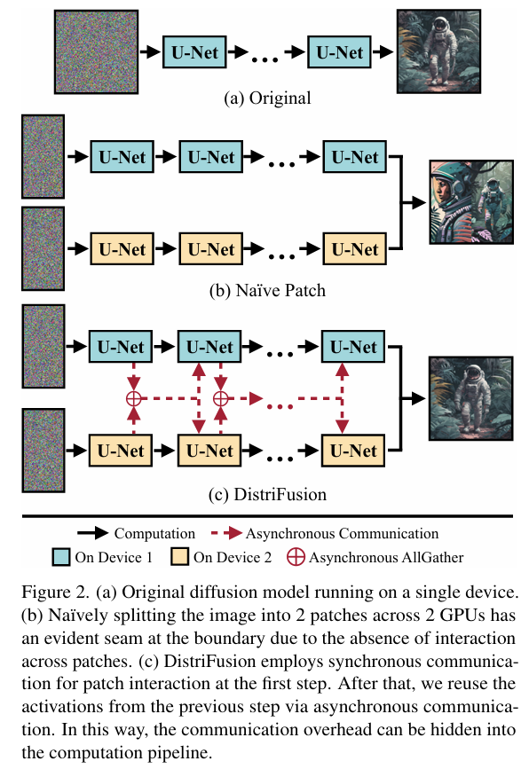

# DistriFusion: Distributed Parallel Inference for High-Resolution Diffusion Models

> "DistriFusion: Distributed Parallel Inference for High-Resolution Diffusion Models" CVPR, 2024 Feb 29
> [paper](http://arxiv.org/abs/2402.19481v4) [code](https://github.com/mit-han-lab/distrifuser.) [pdf](./2024_02_CVPR_DistriFusion--Distributed-Parallel-Inference-for-High-Resolution-Diffusion-Models.pdf) [note](./2024_02_CVPR_DistriFusion--Distributed-Parallel-Inference-for-High-Resolution-Diffusion-Models_Note.md)
> Authors: Muyang Li, Tianle Cai, Jiaxin Cao, Qinsheng Zhang, Han Cai, Junjie Bai, Yangqing Jia, Ming-Yu Liu, Kai Li, Song Han

## Key-point

- Task
- Problems
- :label: Label:

## Contributions

- 使用多块 GPU 推理同一张图，实现加速 & 不牺牲图像质量

> We introduce DistriFusion, a training-free algorithm to harness multiple GPUs to accelerate diffusion model inference without sacrificing image quality.

- On Stable Diffusion XL, our method achieves up to a 6.1× speedup on 8 NVIDIA A100s

## Introduction

## methods

将 VAE 特征打成 patch

每块卡自己的处理流程

## setting

## Experiment

> ablation study 看那个模块有效，总结一下

多卡推理后，在细节纹理位置还是有一些差异，但图像主体很接近

## Limitations

## Summary :star2:

> learn what

### how to apply to our task

