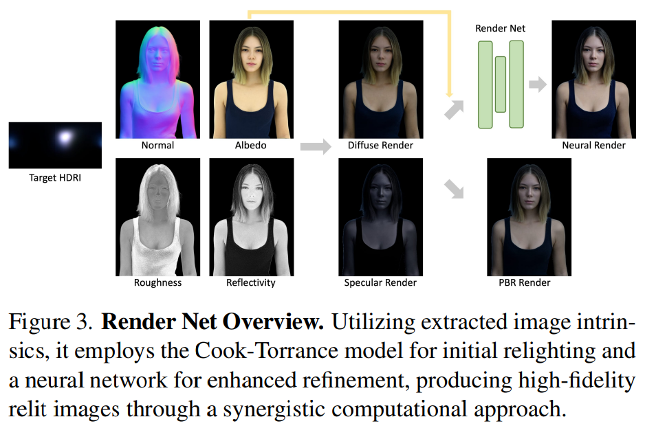

# SwitchLight: Co-design of Physics-driven Architecture and Pre-training Framework for Human Portrait Relighting

> "SwitchLight: Co-design of Physics-driven Architecture and Pre-training Framework for Human Portrait Relighting" CVPR, 2024 Feb 29
> [paper](http://arxiv.org/abs/2402.18848v1) [code]() [pdf](./2024_02_CVPR_SwitchLight--Co-design-of-Physics-driven-Architecture-and-Pre-training-Framework-for-Human-Portrait-Relighting.pdf) [note](./2024_02_CVPR_SwitchLight--Co-design-of-Physics-driven-Architecture-and-Pre-training-Framework-for-Human-Portrait-Relighting_Note.md)
> Authors: Hoon Kim, Minje Jang, Wonjun Yoon, Jisoo Lee, Donghyun Na, Sanghyun Woo

## Key-point

- Task: human portrait relight
- Problems
- :label: Label:

## Contributions

- 提出 relight framework 

  > We introduce a co-designed approach for human portrait relighting that combines a physics-guided architecture with a pre-training framework.

- 数据少 -> 使用 self-supervised 方式训练

  > Furthermore, to overcome the limitation of scarce high-quality lightstage data, we have developed a selfsupervised pre-training strategy

## Introduction

### Image Rendering

图像渲染，构造真实的平面和光影

> The primary goal of image rendering is to create a visual representation that accurately simulates the interactions between light and surfaces.

- n 法向量
- v 观测视角
- l 为入射光线方向
- h 为半程光量

> Specifically, n represents the surface normal, v is the view direction, l is the incident light direction,
>
> h is the half-vector computed from l and v. 

- Q：半程光量是啥？ :question:

> https://zhuanlan.zhihu.com/p/35002541

半程向量（Halfway Vector），也被称为半角向量，是指光线与视线夹角一半方向上的一个单位向量。

$L_o(v)$ 表示在**观测角度 v  下，感知到的光线强度**（**出射的辐射亮度**）。

- 式子是一个累积，**对物体周围一个小范围所有入射光线的累加**，这个范围 $\Omega$ 使用物体表面法向量近似
- 式子的核心 Bidirectional Reflectance Distribution Function (BRDF) $f(v,l)$

>  Central to this equation lies the **Bidirectional Reflectance Distribution Function (BRDF)**, denoted as f(v, l), describing the surface’s reflection characteristics.

### BRDF

CookTorrance model 基于微小平面假设。

> The CookTorrance model, based on microfacet theory, represents surfaces as a myriad of tiny, mirror-like facets.

计算微笑平面的反射率，融入 roughness $\alpha$ ，**微平面分布**函数 D，G **微平面的阴影**（geometric attenuation factor），指定入射角度 $f_0$ （法向量方向入射角）的 F 微平面**反射率**

> In this model, D is the microfacet distribution function, describing the orientation of the microfacets relative to the half-vector h, G is the geometric attenuation factor, accounting for the shadowing and masking of microfacets, and F is the Fresnel term, calculating the reflectance variation depending on the viewing angle, where f0 is the surface Fresnel reflectivity at normal incidence

BRDF 加入 diffuse & 镜面参数，得到一个新的表示，**这里面可以看到环境光照的参数 E**

A

## methods

参考 3D 纹理，**使用不同预训练的模型，将肖像分解为 albedo，reflectivity，光照等具有物理意义的特征** :star:

- Q：Estimating albedo is challenging due to the ambiguities in surface color and material properties

> albedo map Aˆ is then computed by dividing the predicted diffuse render by its diffuse shading

### Render

> The network utilizes extracted intrinsic surface attributes to produce the target relit images

## setting

> The entire training process takes one week to converge using 32 NVIDIA A6000 GPUs

- 多个 UNet 模型

> We pre-train a single U-Net architecture during this process. In the subsequent fine-tuning stage, the weights from this pre-trained model are transferred to multiple U-Nets - NormalNet, DiffuseNet, SpecularNet, and RenderNet.
>
> SwitchLight employs a UNet-based architecture, consistently applied across its Normal Net, Diffuse Net, Specular Net, and Render Net.

## Experiment

> ablation study 看那个模块有效，总结一下

## Limitations

## Summary :star2:

> learn what

### how to apply to our task

