# SORA

> "Video generation models as world simulators" 2024 Feb, Sora
> [website](https://openai.com/sora) [OpenAI_report](https://openai.com/research/video-generation-models-as-world-simulators) [note](2024_02_OpenAI_sora_Note.md)

## Key-point

- Task: video generation({text,image, video}2video)

- Problems

  先前方法生成视频只有几秒，内容运动起来一致性差；长时序地一致性差；能够支持的功能有限（视频转场，拓展。编辑）

- :label: Label:

**能够生成 1min 的高保真视频，能支持多种功能：视频拓展，视频拼接，视频编辑**

**OpenAI's largest model, Sora,** is capable of **generating a minute of high fidelity video**. Our results suggest that scaling video generation models is a promising path towards building general purpose simulators of the physical world.

 we train text-conditional diffusion models jointly on videos and images of variable durations, resolutions and aspect ratios. We leverage a transformer architecture that operates on spacetime patches of video and image latent codes. 

## Contributions

## Introduction

 generative modeling of video data using **recurrent networks**

- "Unsupervised learning of video representations using lstms"
- "Recurrent environment simulators"
- "World models"

 autoregressive transformers

- "Videogpt: Video generation using vq-vae and transformers"

diffusion

- "Photorealistic video generation with diffusion models"

**Sora is a generalist model of visual data—it can generate videos and images spanning diverse durations, aspect ratios and resolutions, up to a full minute of high definition video.**

## methods

> - 如何实现高分辨率训练

### Turning visual data into patches

LLMs have text tokens, Sora has visual *patches*‘

**先前工作验证了使用 patch 作为视频表示可行** 
Patches have previously been shown to be an effective representation for models of visual data.

- "ViViT: A Video Vision Transformer" ICCV, 2021 Mar
  [paper](http://arxiv.org/abs/2103.15691v2) [code](https://github.com/google-research/scenic/tree/main/scenic/projects/vivit) [note](./2021_03_ICCV_ViViT--A-Video-Vision-Transformer_Note.md)

在 t 维度也设置一个窗口，每个窗口为一个长方体 `t,h,w`；用 3D 卷积同时提取 `t,h,w` 维度的特征，此时 spatial&temporal 效果更好

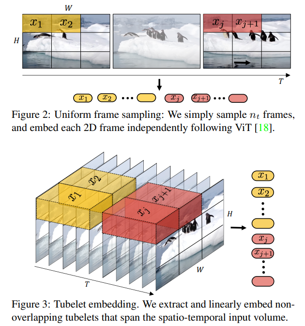

参考 `StableDiffusion` 经验，先将视频转到特征空间，再对特征分 patch

1. first compressing videos into a lower-dimensional latent space
2. subsequently decomposing the representation into spacetime patches.

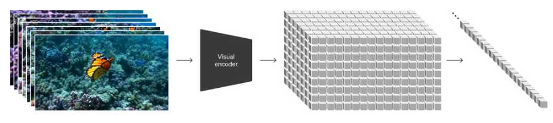

**参考下面工作，先训练一个网络把视频压缩为特征：在空间和时间维度均压缩**；同时也训练一个Decoder 把特征转回像素

> We **train a network that reduces the dimensionality of visual data**.This network takes raw video as input and outputs a latent representation that is compressed both temporally and spatially. 
>
> We also **train a corresponding decoder** model that maps generated latents back to pixel space.

- "Auto-Encoding Variational Bayes"
  [paper](https://arxiv.org/pdf/1312.6114.pdf)

### Spacetime latent patches

视频压缩到特征空间后，划分 spatial-time patch （类似 ViViT）

> extract a sequence of spacetime patches which act as transformer tokens.
>
> Our patch-based representation enables Sora to train on videos and images of variable resolutions, durations and aspect ratios. 
>
> **At inference time, we can control the size of generated videos** by arranging randomly-initialized patches in an appropriately-sized grid.

### Sora is a diffusion *transformer*

we find that diffusion transformers scale effectively as video models as well.

**Transformer + Diffusion 训练更久，生成的质量更好**

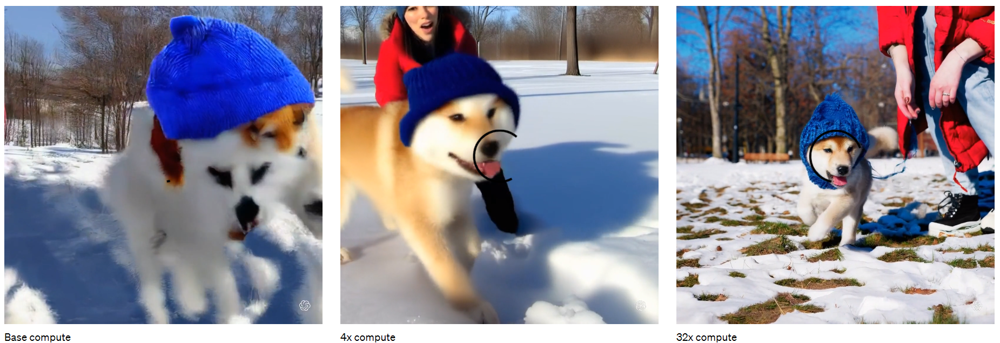

### 训练数据

**训练的视频数据，直接使用原始分辨率的视频** :star:

> Past approaches to image and video generation typically resize, crop or trim videos to a standard size—e.g., 4 second videos at 256x256
>
> **We find that instead training on data at its native size provides several benefits.**

**Sampling flexibility** 基于 patch 方式训练，模型能够适应 4K 分辨率附近范围的任意长宽比的视频生成

> Sora can sample widescreen 1920x1080p videos, vertical 1080x1920 videos and everything inbetween.

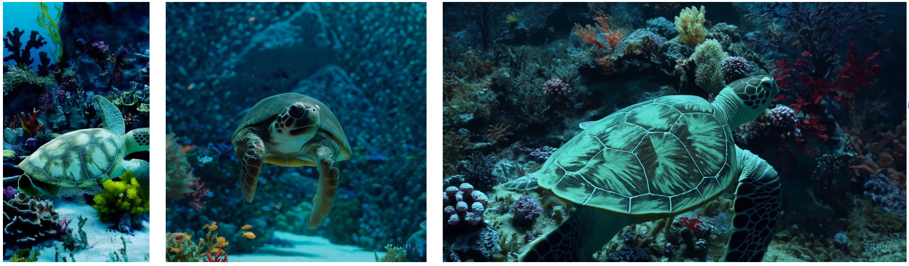

**Improved framing and composition** 生成的内容更好，基于正方形 patch 生成的内容主要物体不全

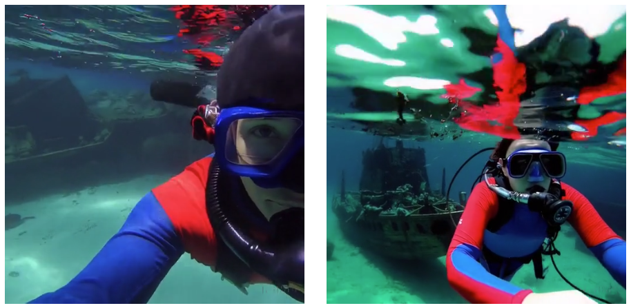

**参考 DALLE3 :star:，训练一个模型生成视频描述**，发现文本的质量影响很大；

> We apply the re-captioning technique introduced in DALL·E 3
>
> We first train a highly descriptive captioner model and then use it to produce text captions for all videos in our training set.
> **We find that training on highly descriptive video captions improves text fidelity as well as the overall quality of videos.**

- "Improving image generation with better captions."
  [paper](https://arxiv.org/abs/2006.11807) [code](https://github.com/Gitsamshi/WeakVRD-Captioning)

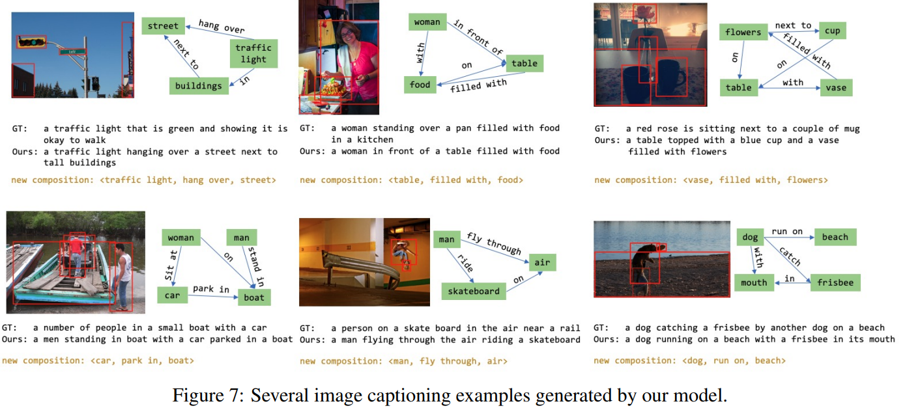

**利用 GPT 对用户输入较短的 prompts 进行补充**，得到更细节的 captions

> Similar to DALL·E 3, we also leverage GPT to turn short user prompts into longer detailed captions that are sent to the video model. This enables Sora to generate high quality videos that accurately follow user prompts.

### Prompting with images and videos

能够做视频编辑，修复，拓展

> Sora can also be prompted with other inputs, such as pre-existing images or video. This capability enables Sora to perform a wide range of image and video editing tasks—creating perfectly looping video, animating static images, extending videos forwards or backwards in time, etc.

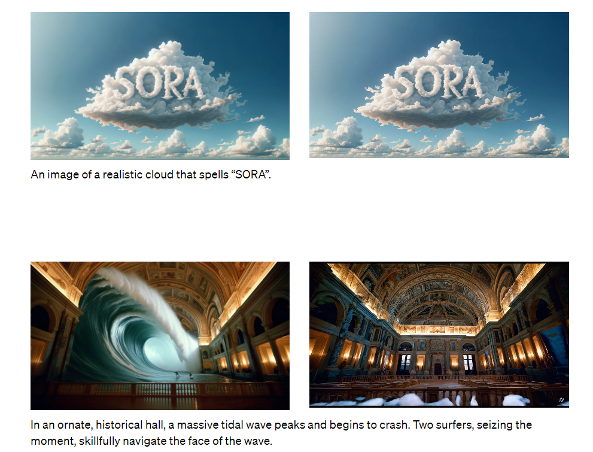

给一段视频，能够在 T 维度进行拓展；**能够实现视频在 T 上的前后拓展，实现无限循环**

> We can use this method to extend a video both forward and backward to produce a seamless infinite loop.

### Video-to-video editing

能够实现风格转换

> Below we apply one of these methods, SDEdit to Sora.

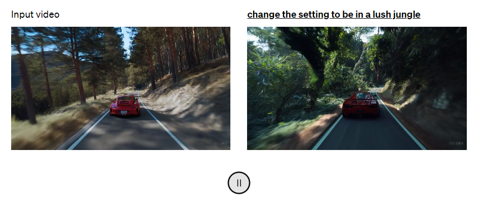

### Connecting videos

以生成方式创建更为自然的视频转场

> We can also use Sora to gradually interpolate between two input videos, creating seamless transitions between videos with entirely different subjects and scene compositions. 

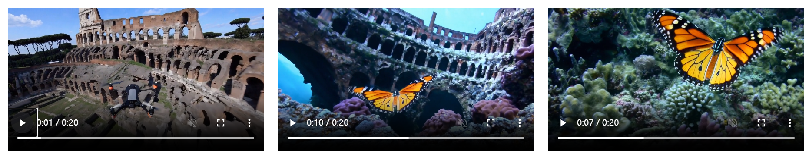

### Image generation capabilities

生成单帧的视频

> Sora is also capable of generating images. We do this by arranging patches of Gaussian noise in a spatial grid with a temporal extent of one frame. The model can generate images of variable **sizes—up to 2048x2048 resolution.**

### Emerging simulation capabilities

发现 Sora 用任意尺度的数据训练后，能够模拟真实世界的物体，不需要额外信息例如 3D object；**能够改变视频视角，而内容保持一致。**:star:

> **3D consistency.** Sora can generate videos with dynamic camera motion. As the camera shifts and rotates, people and scene elements move consistently through three-dimensional space.
>
> https://cdn.openai.com/tmp/s/simulation_1.mp4

### **Long-range coherence and object permanence** 

可以用遮挡前后的物体，判断生成的一致性 :star:

> We find that Sora is often, though not always, able to effectively model both short- and long-range dependencies.
>
> For example, **our model can persist people, animals and objects even when they are occluded or leave the frame.**  
> https://cdn.openai.com/tmp/s/simulation_2.mp4

### **Interacting with the world** 

生成的视频细节很真实，例如汉堡包上的牙印

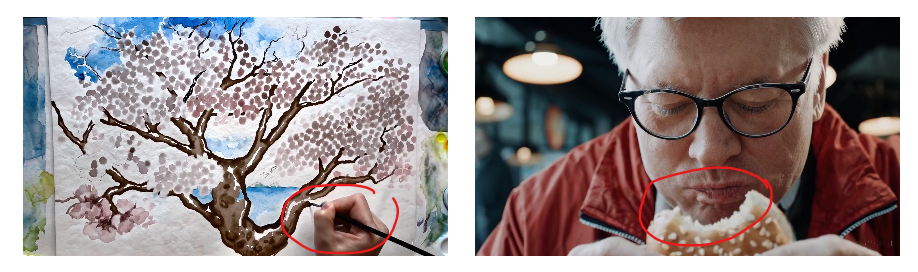

生成的视频，能够模拟电子游戏中的操作（跳到河里，画面向下）

> Sora is also able to simulate artificial processes–one example is video games. Sora can simultaneously control the player in Minecraft with a basic policy while also rendering the world and its dynamics in high fidelity. 

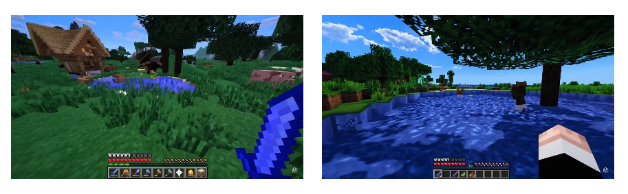

## Experiment

> ablation study 看那个模块有效，总结一下

## Limitations

还没发学习到一些物理运动。例如玻璃杯碎掉，只是生成了很逼真的物体，但物理运动很假

> Sora currently exhibits numerous limitations as a simulator. For example, it does not accurately model the physics of many basic interactions, like glass shattering.

sora 也许有能力作为 world simulator

> We believe the capabilities Sora has today demonstrate that continued scaling of video models is a promising path towards the development of capable simulators of the physical and digital world, and the objects, animals and people that live within them.

## Summary :star2:

> learn what & how to apply to our task

- 视频表示，先压缩到特征空间再做处理（基于 spatial-time patch 的处理）再 decode，足够生成丰富细节的内容。

  Sora 重新训练了一个 encoder-decoder

- 视频文本

  参考 DALLE3 :star:，训练一个模型生成视频描述，发现文本的质量影响很大；

  对用户输入的文本用 GPT 补充细化一下，能够让生产内容更贴近用户输入

  - "Improving image generation with better captions."
    [paper](https://arxiv.org/abs/2006.11807) [code](https://github.com/Gitsamshi/WeakVRD-Captioning)