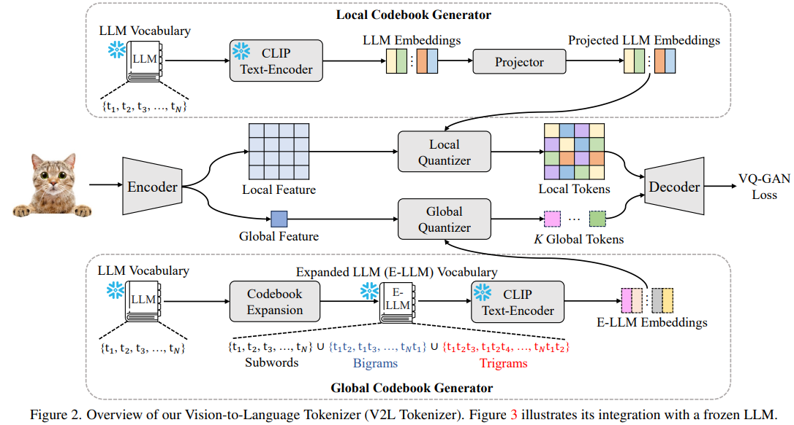

# Beyond Text: Frozen Large Language Models in Visual Signal Comprehension

> "Beyond Text: Frozen Large Language Models in Visual Signal Comprehension" Arxiv, 2024 Mar 12, `V2T-Tokenizer`
> [paper](http://arxiv.org/abs/2403.07874v1) [code](https://github.com/zh460045050/V2L-Tokenizer) [pdf](./2024_03_Arxiv_Beyond-Text--Frozen-Large-Language-Models-in-Visual-Signal-Comprehension.pdf) [note](./2024_03_Arxiv_Beyond-Text--Frozen-Large-Language-Models-in-Visual-Signal-Comprehension_Note.md)
> Authors: Lei Zhu, Fangyun Wei, Yanye Lu

## Key-point

- Task: LLM in image && codebook
- Problems
- :label: Label:

**用 LLM token 来表示图像**，发现具有 low-level restoration 的能力 && 不需要 finetune；支持多种下游任务 caption, VQA, denoising; 学习 **codebook**;

Low-Level 任务给一张完全的人脸，只是移一个位置 or 旋转，输出的人脸修复很烂

> LLM gains the ability not only for visual comprehension but also for image denoising and restoration in an auto-regressive fashion

## Contributions

## Introduction

## methods

## Experiment

> ablation study 看那个模块有效，总结一下

## Limitations

## Summary :star2:

> learn what & how to apply to our task

