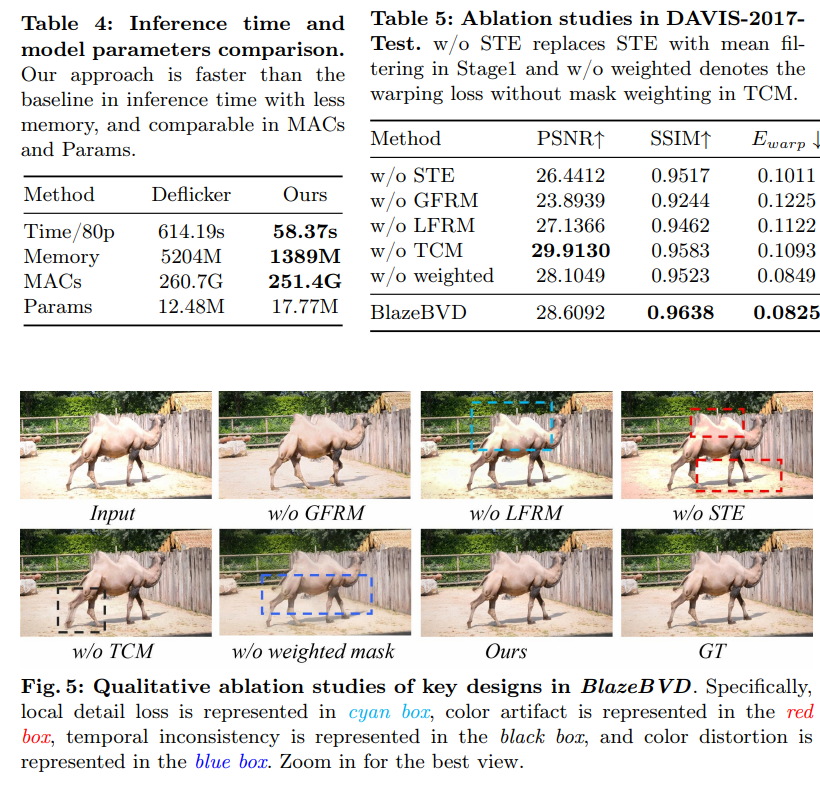

# BlazeBVD: Make Scale-Time Equalization Great Again for Blind Video Deflickering

> "BlazeBVD: Make Scale-Time Equalization Great Again for Blind Video Deflickering" ECCV, 2024 Mar 10
> [paper](http://arxiv.org/abs/2403.06243v1) [code]() [pdf](./2024_03_Arxiv_BlazeBVD--Make-Scale-Time-Equalization-Great-Again-for-Blind-Video-Deflickering.pdf) [note](./2024_03_Arxiv_BlazeBVD--Make-Scale-Time-Equalization-Great-Again-for-Blind-Video-Deflickering_Note.md)
> Authors: Xinmin Qiu, Congying Han, Zicheng Zhang, Bonan Li, Tiande Guo, Pingyu Wang, Xuecheng Nie

## Key-point

- Task
- Problems
- :label: Label:

## Contributions

## Introduction

## methods

### Stage1 修复亮度

### Stage2 Unet

先用 global flicker removal module (GFRM) 搞了一个 UNet，用亮度图去引导修复一下，再局部用光流修一下

光流 warp

### Stage3 光流 loss

>  TCM is developed based on the architecture by RTN [39], but with a temporal consistency loss of adaptive masks to refine local artifacts:

- perceptual loss
- 3DGAN loss
- 光流 warping loss

## setting

## Experiment

> ablation study 看那个模块有效，总结一下

光流 warping 有噪声-> TCM PSNR 帮助不大

## Limitations

## Summary :star2:

> learn what & how to apply to our task

