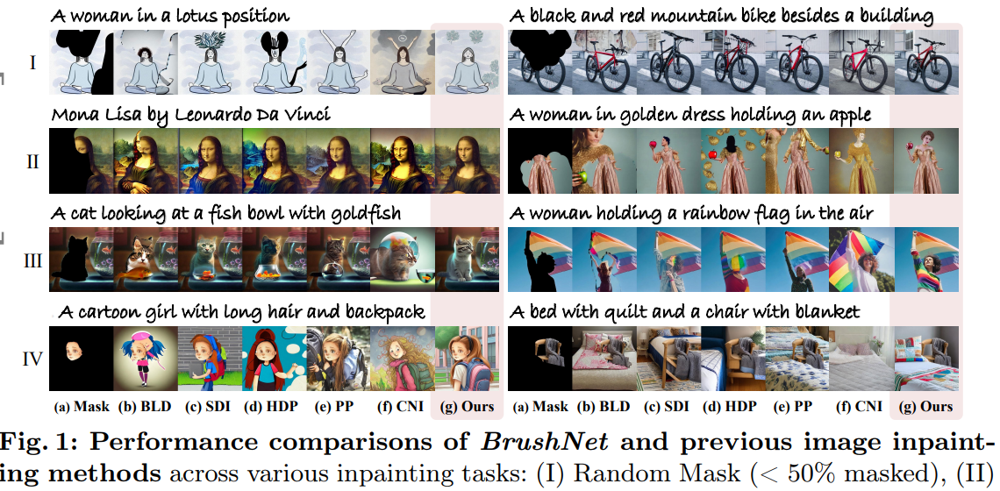
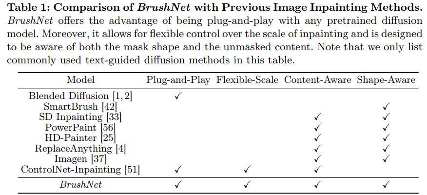

# BrushNet: A Plug-and-Play Image Inpainting Model with Decomposed Dual-Branch Diffusion

> "BrushNet: A Plug-and-Play Image Inpainting Model with Decomposed Dual-Branch Diffusion" Arxiv, 2024 Mar 11
> [paper](http://arxiv.org/abs/2403.06976v1) [code](https://github.com/tencentarc/brushnet) [pdf](./2024_03_Arxiv_BrushNet--A-Plug-and-Play-Image-Inpainting-Model-with-Decomposed-Dual-Branch-Diffusion.pdf) [note](./2024_03_Arxiv_BrushNet--A-Plug-and-Play-Image-Inpainting-Model-with-Decomposed-Dual-Branch-Diffusion_Note.md)
> Authors: Xuan Ju, Xian Liu, Xintao Wang, Yuxuan Bian, Ying Shan, Qiang Xu

## Key-point

- Task: Image Inpainting

- Problems 

  > 关注 paper 的 motivation，为什么要做？别人已经做过类似的了，为什么还要做; **Motivation :bulb:**

  当前 DM inpainting 方法会有语义信息不一致问题 && 降低图像质量的问题（看 introduction）

  > current DM adaptations for inpainting, which involve modifications to the sampling strategy or the development of inpainting-specific DMs, frequently suffer from **semantic inconsistencies and reduced image quality**

- :label: Label:

> our work introduces a novel paradigm: the division of masked image features and noisy latent into separate branches. This division dramatically diminishes the model’s learning load, facilitating a nuanced incorporation of essential masked image information

## Contributions

- we present BrushNet, a novel **plug-and-play dual-branch model engineered to embed pixel-level masked image features into any pre-trained DM**, guaranteeing coherent and enhanced image inpainting outcomes.
- introduce BrushData and BrushBench to facilitate segmentation-based inpainting training and performance assessment

## Introduction

> Commonly used diffusion-based text-guided inpainting methods can be roughly divided into two categories

### Sampling strategy modification

- Q: 生成 masked 区域再把 unmasked 区域直接贴上去，边缘不自然 & 生成的东西和 unmasked 区域一致性差

>  limited perceptual knowledge of mask boundaries and the unmasked image region context leads to incoherent inpainting results.

### Dedicated inpainting models

对 diffusion 输入在通道数上扩展，一起输出 corrupted image & mask

- Q：虽然效果更好，但作者质疑 **is this architecture the best fit for diffusion-based inpainting?** :star:

> While they enable the diffusion model to generate more satisfying results with specialized content-aware and shape-aware models, we argue, **is this architecture the best fit for diffusion-based inpainting?**
>
> - 如何验证现有框架的问题的？:star:

对比 ControlNet 架构和复制一个完整 UNet 的架构，

- Q：认为 framework a) 在 UNet 前几个 scale 就处理 masked 特征，**一堆特征混在一起学，容易导致需要学习的 masked feature 被 text-embedding 的学习干扰**

> dedicated inpainting models fuse noisy latent, masked image latent, mask, and text at an early stage. This architectural design **makes the masked image feature easily influenced by the text embedding, preventing subsequent layers in the UNet from obtaining pure masked image features due to the influence of text.**

- Q：认为让 controlnet 做法让 UNet decoder 自己一个分支负责生成 & 融合 condition 负担太大了；

对比复制一个 UNet 也有一点 decoder，也负责一点生成？

> Additionally, handling the condition and generation in a single branch imposes extra burdens on the UNet framework.

- Q：Fig2 里面的框架 a) diffusion b) controlnet 都需要微调 diffusion，训练消耗太大！

>  These approaches also necessitate fine-tuning in different variations of diffusion backbones, which can be time-consuming with limited transferability.

- Q: 让 UNet 同时处理 condition 和生成任务负担太大

>  handling the condition and generation in a single branch imposes extra burdens on the UNet framework

针对以上问题，**主要是 masked feature 没学好的问题**，作者猜测加一个分支去学习 masked feature 会更容易一些

> Adding **an additional branch dedicated to masked image feature extraction** could be a promising approach to tackle the issue above.

- Q：已经有 ControlNet 方法，做不了 or 不适合做吗？:star:

**发现了 ControlNet 生成的效果不行的现象 >> 分析了一下 controlnet 生成和这里 image inpainting 任务的差别，就是为什么用 controlnet 效果不好** （写论文时候把逻辑链倒着写，看起来高深莫测） >> 先前任务中的 condition 是抽象输入，用一个 UNet Encoder 就够了，但是这里是 image2image 信息很多没用上

controlnet 论文的 condition 主要是高度抽象化的输入，认为是 ControlNet 方法提取特征的能力不足，没法直接用于 inpainting 任务；

> ControlNet [51] lead to **inadequate information extraction and insertion** when directly applied to inpainting, which originates from **differences between controllable image generation and inpainting**
>
> inpainting requires pixel-to-pixel constraints with strong restrictive information instead of **sparse structural control** relying on text for content completion

- Q：视频修复复现了一下 PASD+ControlNet，文本用 “high-resolution” 等不含图像语义信息的词，是否能避免上述 text-embedding 的学习阻碍了 Image LQ 的学习？最后出的结果还 ok 但也不是很一致？:question:

**提出方法，需要看一下消融是否有效**

- Q：使用 VAE Encoder 代替 conv layers 提取 LQ image 特征，使得符合 Diffusion 特征分布？

> To improve the extraction of image features for adaptation to the UNet distribution, we use a VAE encoder instead of randomly initialized convolution layers

- Q： ControlNet 控制不了就在搞一个 UNet decoder 多加一点特征？

> To enable dense per-pixel control, we adopt a hierarchical approach by gradually incorporating the full UNet feature layer-by-layer into the pre-trained UNet

- Q：避免 controlNet 分支去学习 text-embedding 阻碍了 LQ image 的学习，把 text-cross-attn Layer 去掉了

  > To ensure pure image information is considered in the additional branch, we remove text cross-attention from UNet
  >
  > This design further **offers plug-and-play capabilities** and flexible unmasked region controllability to the inpainting process. 

- Q：生成内容的一致性问题 & 大范围 mask 的问题，提出 blurred blending strategy？

> For better consistency and a larger range of unmasked region controllability, we additionally propose a blurred blending strategy

要选 benchmark >> 探索了一下之前的应用场景，**random brush masks** and segmentation-based masks，

- "Imagen editor and editbench: Advancing and evaluating text-guided image inpainting", `EditBench`

> To ensure a comprehensive evaluation for real-life applications, we categorize inpainting tasks into two distinct types based on mask shape

造了一个数据集 BrushData 

> introduce a new training dataset BrushData and a new benchmark BrushBench

列举了先前 diffusion 方法，**列了个表格说自己支持的功能更多**，至少说明论文总结得很到位

> TODO

Section3.1 水了一下 diffusion 原理；Section3.2 水了一下先前 inpainting methods；Section3.3 把 introduction 里说的 motivation 又讲了一遍

## methods

- 修改了一下训练 diffusion 的 loss function
- 微调 VAE decoder？作为图像的出口，这里烂的影响会很大！
- Blending

### Blending

把 mask 弄模糊再涂上去

> we present a simple pixel space solution to address this issue by first blurring the mask and then performing copy-and-paste using the blurred mask. Although this approach may result in a slight loss of accuracy in preserving the details of the mask boundary, the error is nearly imperceptible to the naked eye and results in significantly improved coherence in the mask boundary.

## Experiment

> ablation study 看那个模块有效，总结一下

### setting

a base model of Stabe Diffusion v1.5 in 50 steps, with a guidance scale of 7.5

微调 43w iterations

>  430 thousands steps on 8 NVIDIA Tesla V100 GPUs, which takes around 3 days.

model trained on LAION-5B with random masks.

#### Dataset

> https://huggingface.co/datasets/random123123/BrushData

## Limitations

## Summary :star2:

> learn what & how to apply to our task

- 确认是否有 video inpainting 方式做修复的

  - "StreamMultiDiffusion: Real-Time Interactive Generation with Region-Based Semantic Control"
    [paper]() [code](https://github.com/ironjr/streammultidiffusion)

  - "Follow-Your-Click Open-domain Regional Image Animation via Short Prompts"
    [code](https://github.com/mayuelala/FollowYourClick?tab=readme-ov-file)

    achieve ×10 faster panorama generation 加速！

- 预测当前帧修复程度，修复不好没关系，看看其他的帧，之后回来再修
  - 待修复的照片为晚上，后面看到的同一个物体出现，但是是白天？

- 对要做的任务细看代码，还没有 idea 的时候粗看 or 了解具体模块即可

- 关注 Mamba 等最新方法，粗度论文才能发现这些，**一旦发现可以替换 or 提升性能直接尝试！！**；

- 提出 motivation 的方式

  对方法归类；

  - 每一类方法有什么缺陷
  - **方法一定要这么做吗，这么设计模型一定就适合这个任务吗**

