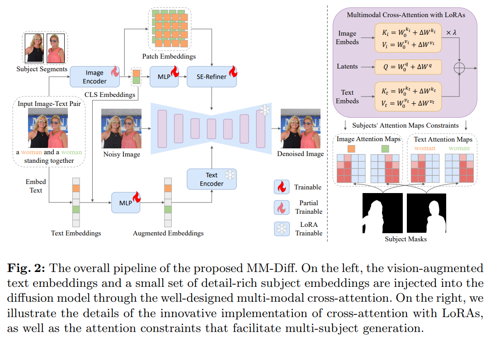
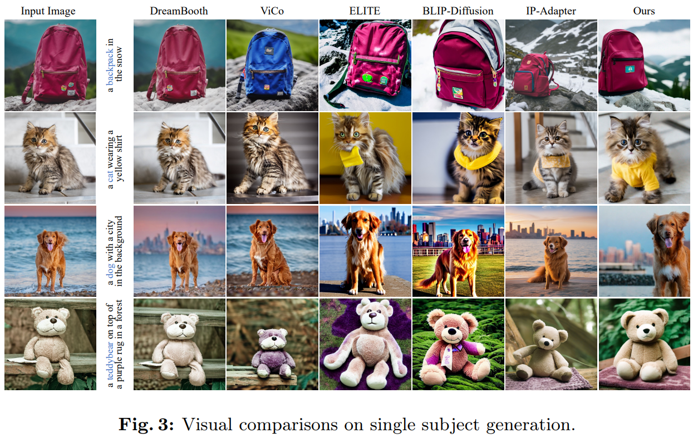
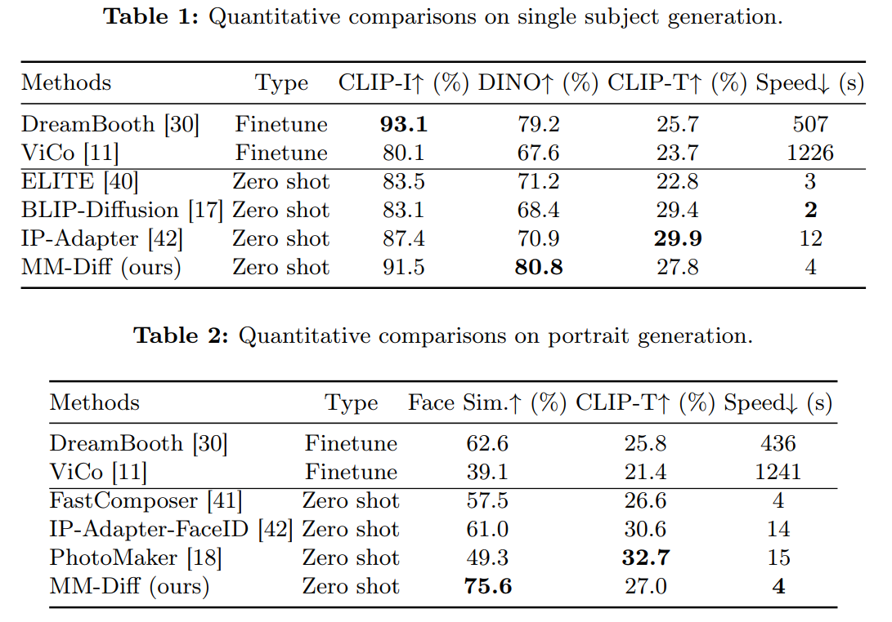

# MM-Diff: High-Fidelity Image Personalization via Multi-Modal Condition Integration

> "MM-Diff: High-Fidelity Image Personalization via Multi-Modal Condition Integration" Arxiv, 2024 Mar 22
> [paper](http://arxiv.org/abs/2403.15059v1) [code]() [pdf](./2024_03_Arxiv_MM-Diff--High-Fidelity-Image-Personalization-via-Multi-Modal-Condition-Integration.pdf) [note](./2024_03_Arxiv_MM-Diff--High-Fidelity-Image-Personalization-via-Multi-Modal-Condition-Integration_Note.md)
> Authors: Zhichao Wei, Qingkun Su, Long Qin, Weizhi Wang

## Key-point

- Task
- Problems
- :label: Label:

## Contributions

## Introduction

## methods

### Condition Injection

- 使用 CLIP 提取图像特征，分为两个特征：CLS 特征，patch-embedding，之后送入提出的 **SE-Refiner**

> we employ a pretrained CLIP [26] image encoder to extract visual embeddings of the reference image. We utilize both the CLS embeddings and patch-level embeddings, where the former exhibits strong alignment with text embeddings, and the latter encapsulates rich subject details.

> To obtain detail-rich visual condition, a MLP is utilized to project CLS embeddings into a small number of subject embeddings

- 用 CLIP-image 增强文本

> Similar to the approach in [23], we augment the text condition with image condition before the text encoder, but retain original text embeddings to provide class priors.

在文本里面找到人物对应的 token，用这个人物 text token 和 image-embedding concat 过 MLP

>  Specifically, for the given text prompt, we first get the word embeddings via lookup process. Next, we concatenate the word embeddings of entity (e.g., man) with the corresponding CLS embeddings and feed the augmented text embeddings into a MLP for fusion.

### Subject Embedding Refiner

> a straightforward approach might involve injecting dense patch embeddings into the UNet model, similar to the techniques described in [23,35]

- "GLIGEN: Open-Set Grounded Text-to-Image Generation" CVPR, 2023 Jan 17
  [paper](http://arxiv.org/abs/2301.07093v2) [code]() [pdf](./2023_01_CVPR_GLIGEN--Open-Set-Grounded-Text-to-Image-Generation.pdf) [note](./2023_01_CVPR_GLIGEN--Open-Set-Grounded-Text-to-Image-Generation_Note.md)
  Authors: Yuheng Li, Haotian Liu, Qingyang Wu, Fangzhou Mu, Jianwei Yang, Jianfeng Gao, Chunyuan Li, Yong Jae Lee
- "Subject-Diffusion:Open Domain Personalized Text-to-Image Generation without Test-time Fine-tuning" SIGGRAPH, 2023 Jul 21 :star: 
  [paper](http://arxiv.org/abs/2307.11410v2) [code](https://oppo-mente-lab.github.io/subject_diffusion/) [pdf](./2023_07_SIGGRAPH_Subject-Diffusion-Open-Domain-Personalized-Text-to-Image-Generation-without-Test-time-Fine-tuning.pdf) [note](./2023_07_SIGGRAPH_Subject-Diffusion-Open-Domain-Personalized-Text-to-Image-Generation-without-Test-time-Fine-tuning_Note.md) 
  Authors: Jian Ma, Junhao Liang, Chen Chen, Haonan Lu (OPPO-AI)

利用丰富的辅助信息：SegMap + Location + Text + CLIP-image

本文 cross-attn loss 代码基于

- "FastComposer: Tuning-Free Multi-Subject Image Generation with Localized Attention" Arxiv, 2023 May 17
  [paper](http://arxiv.org/abs/2305.10431v2) [code](https://github.com/mit-han-lab/fastcomposer) [pdf](./2023_05_Arxiv_FastComposer--Tuning-Free-Multi-Subject-Image-Generation-with-Localized-Attention.pdf) [note](./2023_05_Arxiv_FastComposer--Tuning-Free-Multi-Subject-Image-Generation-with-Localized-Attention_Note.md)
  Authors: Guangxuan Xiao, Tianwei Yin, William T. Freeman, Frédo Durand, Song Han

###  Attention Map Constraints

> Some works [9, 23, 41] suggest that this problem stems from the unrestricted nature of the cross-attention mechanism, whereby a single token related to one subject can simultaneously attend to tokens associated with other subjects.

- cross-attn map loss 参考 

> - "Subject-diffusion: Open domain person"
>
> - "FastComposer: Tuning-Free Multi-Subject Image Generation with Localized Attention" :star:
>   [code](https://github.com/mit-han-lab/fastcomposer)
>
>   训练代码下载 `wget -c https://hf-mirror.com/datasets/mit-han-lab/ffhq-fastcomposer/resolve/main/ffhq_fastcomposer.tgz?download=true -O ffhq_fastcomposer.tgz`

#### Image Cross-Attention Constraint

> For each subject embeddings of one entity, we could get its attention map Aica of size h×w.

## setting

## Experiment

> ablation study 看那个模块有效，总结一下

- SD 模型有能力实现背景虚化的！

- 不用太纠结性能指标！

## Limitations

## Summary :star2:

> learn what

### how to apply to our task

