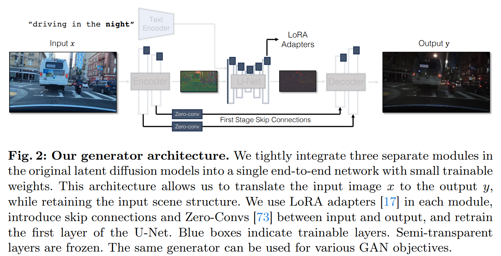

# One-Step Image Translation with Text-to-Image Models

> "One-Step Image Translation with Text-to-Image Models" Arxiv, 2024 Mar 18, `pix2pix-Turbo` 
> [paper](http://arxiv.org/abs/2403.12036v1) [code](https://github.com/GaParmar/img2img-turbo) [pdf](./2024_03_Arxiv_One-Step-Image-Translation-with-Text-to-Image-Models.pdf) [note](./2024_03_Arxiv_One-Step-Image-Translation-with-Text-to-Image-Models_Note.md)
> Authors: Gaurav Parmar, Taesung Park, Srinivasa Narasimhan, Jun-Yan Zhu

## Key-point

- Task

- Problems

  we address two limitations of existing conditional diffusion models: their **slow inference speed** due to the iterative denoising process and their **reliance on paired data for model fine-tuning.**

- :label: Label:


验证了 one-step SD-turbo 有足够的能力做 image 合成任务 && low-level 任务中，在 VAE Decoder 中加入 Encoder 特征能够减轻信息丢失问题

> our work suggests that **one-step pre-trained text-to-image models can serve as a strong and versatile backbone** for many downstream image synthesis tasks.


## Contributions

- introduce a **general method for adapting a single-step diffusion model to new tasks** and domains through adversarial learning objectives.

- SOTA

  unpaired settings, **our model CycleGAN-Turbo** outperforms existing GAN-based and diffusion-based methods for various scene translation tasks, such as day-to-night conversion and adding/removing weather effects like fog, snow, and rain.


## Introduction

- Q：Conditional diffusion models existing problems?

iterative nature of diffusion models makes **inference slow**

model training often requires curating large-scale **paired datasets,** 类似 CycleGAN

- [x] "Unpaired Image-to-Image Translation using Cycle-Consistent Adversarial Networks" ICCV, 2017 Mar 30, `CycleGAN` :star:
  [paper](http://arxiv.org/abs/1703.10593v7) [code]() [website](https://junyanz.github.io/CycleGAN/) [pdf](./2017_03_ICCV_Unpaired-Image-to-Image-Translation-using-Cycle-Consistent-Adversarial-Networks.pdf) [note](./2017_03_ICCV_Unpaired-Image-to-Image-Translation-using-Cycle-Consistent-Adversarial-Networks_Note.md) [blog](https://zhuanlan.zhihu.com/p/402819206) 
  Authors: Jun-Yan Zhu, Taesung Park, Phillip Isola, Alexei A. Efros

无监督方式实现非配对数据训练，用两组生成鉴别器形成一个 cycle；回环的 cycle 用 consistency loss （L1 Loss 足够） 来约束内容一致；用 Identity loss 保证不需要转换的数据输出还是不变


- Q: Motivation?

已有 SD-Turbo 能实现 1step inference. 文章目的在于迁移到新的任务上

> Our key idea is to efficiently adapt a **pre-trained text-conditional one-step diffusion model, such as SD-Turbo [54]**, to new domains and tasks via adversarial learning objectives.


- Q：在 SD-Turbo 上直接用 ControlNet 控制效果不好？

**1step SD turbo 发现 noise map 决定了 structure**；简单把 noise-map 和 condition 输入到额外分支（ControlNet）; 


- Q：发现 image translation 结果和输入对比，**内容上丢失了很多细节**？

>  many visual details in the input image are lost during image-to-image translation, due to imperfect reconstruction by the multi-stage pipeline (Encoder-UNet-Decoder) of the SD-Turbo model. 


提出新的 SD 架构，condition branch 将 condition 和 noise 一起输入；

> propose a new generator architecture that leverages **SD-Turbo weights** while **preserving the input image structure.**
>
> feed the conditioning information directly to the noise encoder branch of the UNet. This **enables the network to adapt to new controls directly**, avoiding conflicts between the noise map and the input control.
>
> we consolidate the three separate modules, Encoder, UNet, and Decoder

说是把 3 个模块强化一下，就是把 **VAE Encoder 的特征 zero-conv 拉到 Decoder 中**；UNet 用目标风格的 LoRA 调整风格，**减少微调时间** :zap:；

说这个架构可以迁移到 GAN 上面一样 ok


> We show that our model CycleGAN-Turbo significantly outperforms both existing GANs-based and diffusion-based methods in terms of distribution matching and input structure preservation, while achieving greater efficiency than diffusion-based methods


### SD-turbo

> [SD-Turbo_repo](https://huggingface.co/stabilityai/sd-turbo)

SD-Turbo是基于SD 2.1架构的蒸馏模型。
SDXL Turbo是在SDXL 1.0的基础上采用新的蒸馏方案，让模型只需要一步就可以生成高质量图像

- "Adversarial Diffusion Distillation" Arxiv, 2023 Nov 28, `SD-Turbo`
  [paper](http://arxiv.org/abs/2311.17042v1) [code](https://github.com/Stability-AI/generative-models) [pdf](./2023_11_Arxiv_Adversarial-Diffusion-Distillation.pdf) [note](./2023_11_Arxiv_Adversarial-Diffusion-Distillation_Note.md)
  Authors: Axel Sauer, Dominik Lorenz, Andreas Blattmann, Robin Rombach

> SD-Turbo is a distilled version of [Stable Diffusion 2.1](https://huggingface.co/stabilityai/stable-diffusion-2-1), trained for real-time synthesis. SD-Turbo is based on a novel training method called Adversarial Diffusion Distillation (ADD) 


生成图像质量对比，SDXL-turbo 生成质量更好一些

> SD-Turbo is a fast generative text-to-image model that can synthesize photorealistic images from a text prompt in a single network evaluation. We release SD-Turbo as a research artifact, and to study small, distilled text-to-image models. For increased quality and prompt understanding, we recommend [SDXL-Turbo](https://huggingface.co/stabilityai/sdxl-turbo/).


选取 ControlNet + OneStepSD 作为 baseline

- fast ODE solvers
- distilling slow multistep teacher models into fast few-step student、


### temporal-layer

AnimateDiff 有 SDv15, SDXL 训好的 temporal layer

> https://github.com/guoyww/animatediff/?tab=readme-ov-file#202311-animatediff-sdxl-beta


## methods




### Adding Conditioning

- Q：发现用 ControlNet 控制有一点效果，但出现了很多噪声？

融合后的特征出图不行，**验证方式：看一下相加的特征各自的 feature map(PCA)** :+1:

说是 ControlNet 给的特征和 SD 特征不同分布。。感觉这个理由只是表象

**做 image translation 两张图差的很多（结构都变了），简单替换 noise 很难弄**；没法说明是 ControlNet 不行，可能是融合方式不行：前面都说了 noise map 控制了 structure，直接用原图的 noise map 不行可以理解？


>  This Control Encoder takes the input image x, and outputs feature maps at multiple resolutions to the pre-trained Stable Diffusion model through residual connections.


**Figure3 实验表明，使用 one-step SD 初始噪声 noise map 决定了 structure!**

> Figure 3 also illustrates that the structure of the generated image by the pre-trained model is significantly influenced by the noise map z
>
> Unlike multi-step diffusion models, the noise map in the one-step model directly controls the layout and pose of generated images, often contradicting the structure of the input image


- **Q：更多风格控制咋搞？**

网上找 LoRA

> To allow the backbone model to adapt to new conditioning, we add several LoRA weights [17] to various layers in the U-Net (see Figure 2).


### details lost

- Q：Why details are lost？:star:

SD 特征降采样太多，信息丢失很多，不适合 image translation 任务；**造成文字模糊的原因之一！**

> The image encoder of Latent Diffusion Models (LDMs) compresses input images spatially by a factor of 8 while increasing the channel count from 3 to 4. This design speeds up the training and inference of diffusion models. However, it may not be ideal for image translation tasks


VAE Encoder 抽特征 zero-conv 加入 VAE Decoder

> extract four intermediate activations following each downsampling block within the encoder, process them via a 1×1 zero-convolution layer [73], and then feed them into the corresponding upsampling block in the decoder.


## Experiment

> ablation study 看那个模块有效，总结一下

### setting

use Stable Diffusion Turbo (v2.1) with one-step inference as the base network for all of our experiments.

LoRA 也是要训练的

> As depicted in Figure 2, we keep most layers frozen and only train the first convolutional layer and the added LoRA adapters.


**256x256 image translation 实验**

LoRA 方式也可以训练 256x256 


### ablation

- Config A, we train an unpaired model with randomly initialized weights rather than pre-trained weights

  Using pre-trained SD weights 效果好，不用贼烂

- Config B uses a ControlNet Encoder

- Config C uses the T2I-Adapter

- Config D directly feeds the input image to the base network without any additional branches.

**VAE EncoderDecoder 加残差很重要！**


- Q：DINO-structure distance?? indicating that the ControlNet encoder struggles to match the input’s structure

  FID;


- **对比 ControlNet or LoRA**；

  ControlNet 100 step 也是可以的但耗时，100-step ControlNet (runtime: 18.85s)；

  LoRA 效果比 ControlNet 好一些


## code

> https://github.com/GaParmar/img2img-turbo/blob/main/docs/training_pix2pix_turbo.md

`Pix2Pix_Turbo` [code](https://github.com/GaParmar/img2img-turbo/blob/main/src/pix2pix_turbo.py)

```python
from diffusers import AutoencoderKL, UNet2DConditionModel

unet = UNet2DConditionModel.from_pretrained("stabilityai/sd-turbo", subfolder="unet")
```


## Limitations

- Guided distillation [36] could be a promising solution to enable guidance control.
- model training with cycle-consistency loss and high-capacity generators is memory-intensive


## Summary :star2:

> learn what & how to apply to our task

- 融合后的特征出图不行，**验证方式：看一下相加的特征各自的 feature map(PCA)** :+1:

- SD 特征降采样太多，信息丢失很多，不适合 image translation 任务；**造成文字模糊的原因之一！**

  看实验 VAE EncoderDecoder 加残差好了很多

- LoRA 方式也可以训练 256x256 

- **对比 ControlNet or LoRA**；

  ControlNet 100 step 也是可以的但耗时，100-step ControlNet (runtime: 18.85s)；

  LoRA 效果比 ControlNet 好一些

