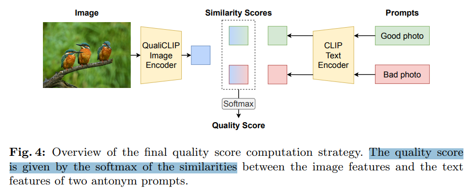
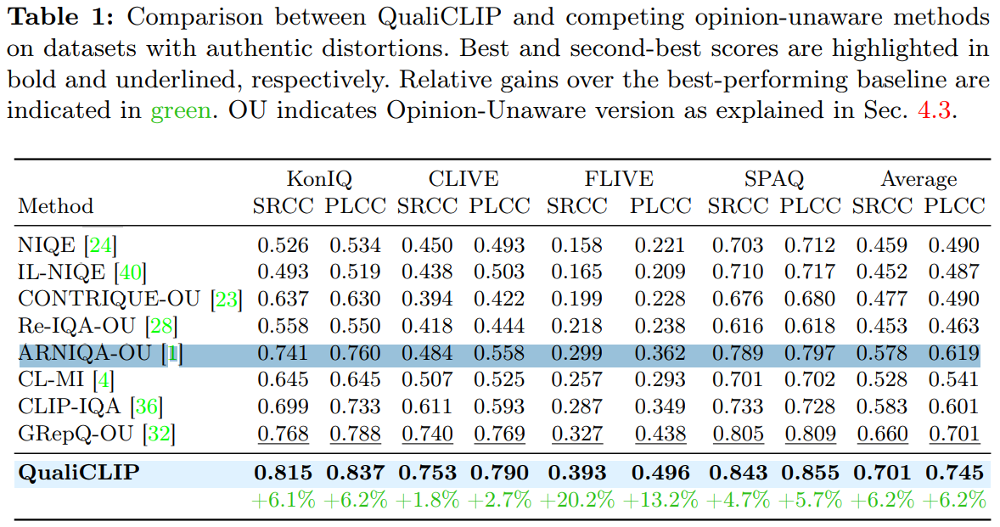

# Quality-Aware Image-Text Alignment for Real-World Image Quality Assessment

> "Quality-Aware Image-Text Alignment for Real-World Image Quality Assessment" Arxiv, 2024 Mar 17, `QualiCLIP`
> [paper](http://arxiv.org/abs/2403.11176v1) [code](https://github.com/miccunifi/QualiCLIP.) [pdf](./2024_03_Arxiv_Quality-Aware-Image-Text-Alignment-for-Real-World-Image-Quality-Assessment.pdf) [note](./2024_03_Arxiv_Quality-Aware-Image-Text-Alignment-for-Real-World-Image-Quality-Assessment_Note.md)
> Authors: Lorenzo Agnolucci, Leonardo Galteri, Marco Bertini

## Key-point

- Task: NR-IQA(No-Reference)
- Problems
  - The reliance on annotated Mean Opinion Scores (MOS) in the majority of state-of-the-art NR-IQA approaches limits their scalability and broader applicability to real-world scenarios

- :label: Label:

## Contributions

- 提出 qualiCLIP 自监督学习

> To overcome this limitation, we propose QualiCLIP (Quality-aware CLIP), a CLIP-based self-supervised opinion-unaware method that does not require labeled MOS

## Introduction

## methods

Inference 得到的是一个接近于 positive prompt 特征的相似度，范围 [0,1] 越接近 1 越好

> At inference time, given an image I, we extract its features x using the CLIP image encoder.
>
>  Then, we compute the cosine similarity between x and the features tp and tn of the antonym prompts, resulting in sp and sn. Finally, similar to [36], we obtain the final quality score q∈[0, 1] by using the softmax:

## Experiment

> ablation study 看那个模块有效，总结一下

真实退化上效果

## Limitations

## Summary :star2:

> learn what & how to apply to our task

