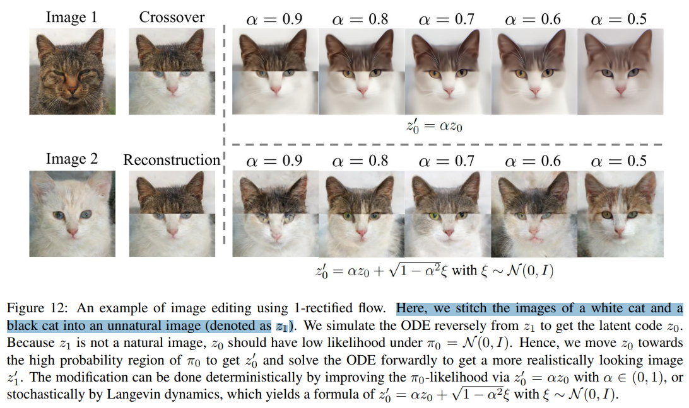
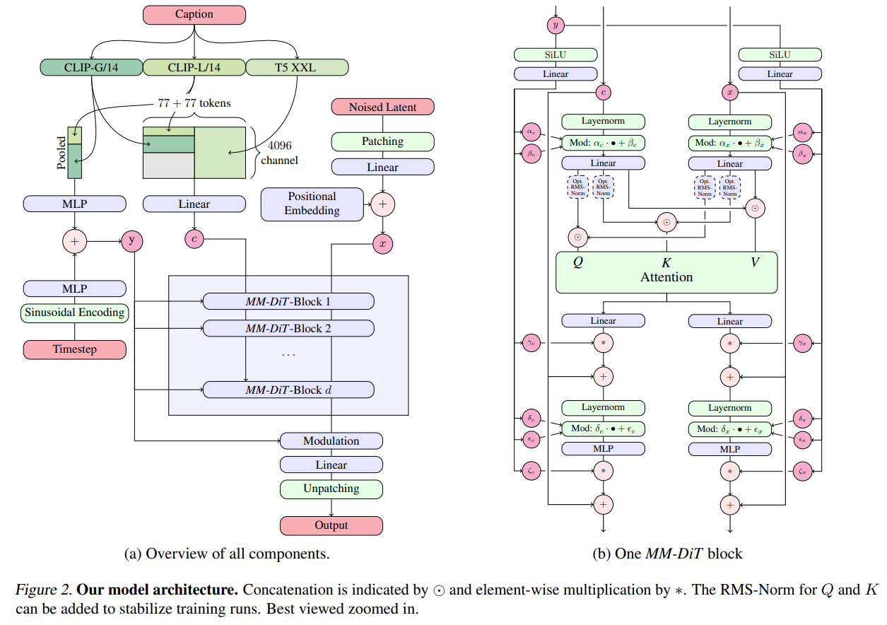

# Scaling Rectified Flow Transformers for High-Resolution Image Synthesis

> "Scaling Rectified Flow Transformers for High-Resolution Image Synthesis" Arxiv, 2024 Mar 5, `SD3`
> [paper](http://arxiv.org/abs/2403.03206v1) [code]() [weights](https://huggingface.co/stabilityai/stable-diffusion-3-medium) [web_paper](https://stability.ai/news/stable-diffusion-3-research-paper) [pdf](./2024_03_Arxiv_Scaling-Rectified-Flow-Transformers-for-High-Resolution-Image-Synthesis.pdf) [note](./2024_03_Arxiv_Scaling-Rectified-Flow-Transformers-for-High-Resolution-Image-Synthesis_Note.md)
> Authors: Patrick Esser, Sumith Kulal, Andreas Blattmann, Rahim Entezari, Jonas Müller, Harry Saini, Yam Levi, Dominik Lorenz, Axel Sauer, Frederic Boesel, Dustin Podell, Tim Dockhorn, Zion English, Kyle Lacey, Alex Goodwin, Yannik Marek, Robin Rombach

## Key-point

- Task
- Problems
- :label: Label:

8B 参数量模型可以放进 24G 4090 推理 1024x1024 图像，50step 30s 一张图；SD3 有多个变体，参数量从 800M to 8B

> In early, unoptimized inference tests on consumer hardware our largest SD3 model with 8B parameters fits into the 24GB VRAM of a RTX 4090 and takes 34 seconds to generate an image of resolution 1024x1024 when using 50 sampling steps.

考虑了 text & image，新的结构叫做 `MMDiT(multiple modalities Diffusion Transformer)`

> For text-to-image generation, our model has to take both modalities, text and images, into account. 

使用 3 个 text 编码器，2个 CLIP 1个 T5 提升学习文本 & 图像能力

> Specifically, we use three different text embedders - two CLIP models and T5 - to encode text representations, and an improved autoencoding model to encode image tokens.

## Contributions

- 用 3 个文本编码器，能够理解更加复杂的文本

## Introduction

> [web_paper](https://stability.ai/news/stable-diffusion-3-research-paper) 简略过一遍大致的改动

### **MMDiT block**

 使用 3 个文本编码器分别提取 text, image 特征，在**各自空间学习特征不被另一个模态破坏**；

- Q：为什么要用 3个文本编码器？

认为文本和图像两种模态，差异还是很大；想要**各用一种 transformer 在各自特征空间（text or image）学习特征，再同时考虑入另一个模态，保持本身的模态特征不被破坏**；

从训练角度验证了两个模态用同一个 CLIP embedding 标识，缺失会降低特征表示能力，分开后主观指标搞了很多！

- Q：**变成了多模态，paper 说如何进一步调整到 video 模态？**:star:

TODO

- Q：MMDiT Block 层数？

实验了 15 层（0.45B） -> 38 层(8B)的网络，从训练角度 38层的更优

> We train models ranging from 15 blocks with 450M parameters to 38 blocks with 8B parameters and observe a smooth decrease in the validation loss as a function of both model size and training steps 

用 GenEval & ELO 指标评估主观表现

> evaluate automatic image-alignment metrics ([GenEval](https://arxiv.org/abs/2310.11513)) as well as human preference scores (ELO) (bottom row)

- Q： 什么是 GenEval ？

> "GENEVAL: An Object-Focused Framework for Evaluating Text-to-Image Alignment"
> [paper](https://arxiv.org/pdf/2310.11513)

利用目标检测方法去验证生成内容，与 text 是否匹配

### RF

- Q：啥是 RF?

> Stable Diffusion 3 employs a Rectified Flow (RF) formulation ([Liu et al., 2022](https://arxiv.org/abs/2209.03003); [Albergo & Vanden-Eijnden,2022](https://arxiv.org/abs/2209.15571); [Lipman et al., 2023](https://arxiv.org/abs/2210.02747)), where data and noise are connected on a linear trajectory during training.

**学习一个 drift v 实现 X1 到 X0 特征的变换**，使用现有的优化方法去优化 least square error

能利用 RF 进行特征编辑，在两个 x1_T 和 x2_T 找到一个特征空间的路径，去学习如何从一个到另一个特征

### Flexible Text Encoders

**如果要降低显存，可以去掉**T5 text encoder 4.7B 参数，去掉显存降低很多，但牺牲了一丢丢图文一致性 (win46%)

> By removing the memory-intensive 4.7B parameter T5 text encoder for inference, SD3’s memory requirements can be significantly decreased with only small performance loss.

**建议还是带上 T5 text encoder**，发现不加生成带文字的图像很烂，win rate 降低到38%

> we recommend including T5 for using SD3’s full power in generating written text, since we observe larger performance drops in typography generation without it (win rate 38%) as seen in the examples below

- **Q：DiT 为啥要加入调制，解调？**

> "Scalable Diffusion Models with Transformers" Arxiv, 2022 Dec 19, `DiT`
> [paper](http://arxiv.org/abs/2212.09748v2) [code]() [pdf](./2022_12_Arxiv_Scalable-Diffusion-Models-with-Transformers.pdf) [note](./2022_12_Arxiv_Scalable-Diffusion-Models-with-Transformers_Note.md)
> Authors: William Peebles, Saining Xie

## methods

3个文本编码器

## setting

## Experiment

> ablation study 看那个模块有效，总结一下

## Limitations

## Summary :star2:

> learn what & how to apply to our task

