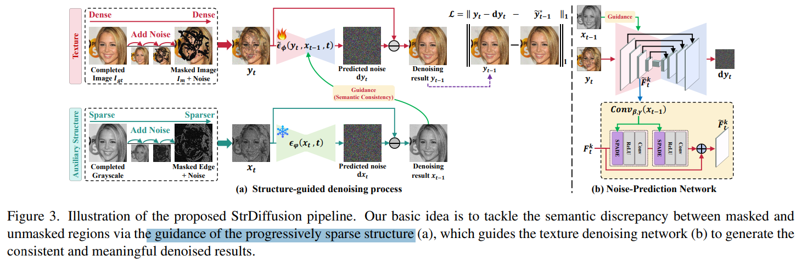

# Structure Matters: Tackling the Semantic Discrepancy in Diffusion Models for Image Inpainting

> "Structure Matters: Tackling the Semantic Discrepancy in Diffusion Models for Image Inpainting" Arxiv, 2024 Mar 29
> [paper](http://arxiv.org/abs/2403.19898v2) [code](https://github.com/htyjers/StrDiffusion.) [pdf](./2024_03_Arxiv_Structure-Matters--Tackling-the-Semantic-Discrepancy-in-Diffusion-Models-for-Image-Inpainting.pdf) [note](./2024_03_Arxiv_Structure-Matters--Tackling-the-Semantic-Discrepancy-in-Diffusion-Models-for-Image-Inpainting_Note.md)
> Authors: Haipeng Liu, Yang Wang, Biao Qian, Meng Wang, Yong Rui

## Key-point

- Task

- Problems

  - 先前 diffusion inpainting 方法 masked 区域和 unmasked 区域不一致；

    > suffer from the semantic discrepancy between the masked and unmasked regions despite of the meaningful semantics for the masked regions during the denoising process
    >
    > semantically dense **unmasked texture fails to be completely degraded** while the masked regions turn to the pure noise in diffusion process

    引入

    > StrDiffusion via the guidance of the auxiliary sparse structure, yielding the consistent and meaningful denoised results. The experiments are conducted on PSV

- :label: Label:


分析 unmasked 区域如何影响 denoising 过程

> we aim to answer how the unmasked semantics guide the texture denoising process


发现 `semantically sparse structure` 有助于降低 masked 生成结果和原图的不一致；

> 1) the **semantically sparse structure** is beneficial to tackle the semantic discrepancy in the early stage, while the dense texture generates the reasonable semantics in the late stage; 
> 2) the **semantics from the unmasked regions** essentially offer the time-dependent structure guidance for the texture denoising process

从原图提取高级语义特征，简化 diffusion 去噪目标 denoising objective 

> denoising process, a structure-guided neural network is trained to estimate the simplified denoising objective by exploiting the consistency of the denoised structure between masked and unmasked regions

提出一个**衡量结构-纹理一致性的采样方式**，判断 semantic 是否有能力引导去噪

> we devise an adaptive resampling strategy as a formal criterion as whether the structure is competent to guide the texture denoising process, while regulate their semantic correlations


## Contributions

- motivation-exp 发现使用图像&结构特征，能够实现更好纹理，结构一致性

  > utilizing the grayscale or edge map of the masked image as an alternative, the discrepancy issue is largely alleviated

- 去噪早期结构帮助大，后期主要是纹理；因此使用结构信息作为引导，设计采样策略在去噪过程根据一致性得分，将结构特征融入去噪过程

> sparse structure benefits the semantic consistency in the early stage while the dense texture tends to generate the meaningful semantics in the late stage 


## Introduction

- Q：motivating experiments？

> whether the sparse structure is beneficial to alleviating the discrepancy issue during the denoising process for image inpainting


显示去噪过程，masked 区域和 unmasked 区域，去噪得到的语义图和 **GT 得到的语义图的差异** :star:

> The shadow area indicates the discrepancy between the masked and unmasked regions during the denoising process.
>
> The PSNR (higher is better) reflects the recovered semantics for the masked (unmasked) regions compared to the completed image (i.e., ground truth) by calculating the semantic similarity between them


1. 灰度图去噪更简单，一致性更高

2. 灰度图 or 边缘图可以获取到 sparse structure，更容易学习背景纹理？

   > the unmasked semantics combined with the Gaussian noise is further set as the sparse structure

3. StrDiffusion 去噪的一致性最低


高级语义信息更容易修复、训练 inpainting


- "Image restoration with mean-reverting stochastic differential equations" `IR-SDE`, 2023 Jan
  [paper](https://arxiv.org/abs/2301.11699)

早期用 diffusion 做 image inpaint 


## methods

**Structure-Guided** Texture Diffusion Models 利用高级语义信息作为引导信息，



structure guidance

the structure denoising network is **pre-trained as an auxiliary** to obtain the denoised structure

a multi-scale spatially adaptive normalization strategy


- Q：semantic discrepancy between the masked and unmasked regions？

纹理生成还行，但结构不行；

> the texture performs well in producing meaningful semantics, while suffers from the large semantic discrepancy;

稀疏的结构特征有帮助，**想用结构特征作为辅助信息**；**发现去噪过程中一致性逐渐变差，想在去噪过程中都加入结构引导**

> semantically sparse structure benefits the consistent semantics


### Q：怎么用 structure-guided？

> How does the Structure Guide the Texture Denoising Process?

使用 spatially adaptive normalization and denormalization strategy **融合 semantic network 中的 semantic 特征**

> deploys the spatially adaptive normalization and denormalization strategy [24] to incorporate the statistical information over the feature map across varied layers

**修改 SDE 优化公式**


### Q：structure 引导生成是否有效？

> whether the structure guides the texture well


使用一个鉴别器去衡量纹理 & 结构之间的一致性A

> To measure correlation between the structure and texture, we adopt a discriminator network D to yield the correlation score 

使用 GAN Loss & triplet-loss 训练鉴别器，网络输入纹理图（输出图 y_t）& 结构信息（x_t）；

**想要约束去噪过程，对结构特征 $x_{t-1}$ 希望与当前步一致 $y_{t-1}$，与上一步不一致 $y_{t}$** :star:


> denoised texture $y_{t−1}$


**希望 Eq14 Loss 更多关注于 masked 区域，使用 triplet loss 实现**

> Eq.(14) is encouraged to focus more on the unmasked regions, which is achieved via a triplet loss:


**训练鉴别器的整体 loss 变为**


### Q: Adaptive Resampling Strategy

> regulates the semantic correlation between the texture (e.g., yt−1) and structure (e.g., xt−1) according to the score value from a discriminator 

去噪过程中发现一致性较差时候，对结构特征 $x_{t-1}$ 加噪一步再去噪，更新一下

> when the score value of the semantic correlation between yt−1 and xt−1 is smaller than a specific threshold ∆ 


### SDE backward process

**Forward Texture Diffusion Process**


**Reverse Texture Denoising Process**


用网络去学 score function


优化 loss


## Experiment

> ablation study 看那个模块有效，总结一下

- "Repaint: Inpainting using denoising diffusion probabilistic models" CVPR


生成结构更优


### Ablation

对比 IR-SDE，显示去噪过程，mask 区域消失得更快，T=40 已经基本上补全了结构


- Q: 高级结构特征**要多稀疏才有效**？

> Why Should the Semantic Sparsity of the Structure be Strengthened over Time?

尝试多种结构特征作为网络的输入输出，发现 gray2edge 对于结构一致性帮助最大

> replace the initial and terminal structure state, yielding several alternatives as **gray2gray, edge2edge and edge2gray**


- Q：Adaptive Resampling Strategy？

```
A: repaint
B: 消除鉴别器，不在去噪过程中去进一步约束结构纹理一致性
C: StrDiffusion 去除采样策略（所有去噪时间步都加结构信息） !!!!!!!!!
D: StrDiffusion
```

**发现只在部分去噪过程中融入结构信息，能够提升最终主观指标（纹理更自然）**


### setting

DDPM 网络结构，去除 group norm && self-atten 层

> The noise-prediction network is constructed by removing group normalization layers and self-attention layers in the U-Net in DDPM [12] for inference efficiency

- Adam  β1=0.9 and β2 = 0.99 & 加噪去噪 T=100 步
- All the experiments are implemented with the pytorch framework and run on 4 NVIDIA 2080TI GPU


three typical **datasets**

- Paris StreetView (PSV)

  street view images in Paris, consisting of 14.9k images for training and 100 images for validation

- CelebA

  human face dataset with 30k aligned face images, which is split into 26k training images and 4k validation

- Places2

  1.8M natural images from varied scenes.

trained using **256×256 images with irregular masks**

使用如下工作的 mask 

- "Image inpainting for irregular holes using partial convolutions"


## Limitations

高级语义是需要训练、预测的，结构信息仔细看也不是很好


## Summary :star2:

> learn what & how to apply to our task

- 高级语义信息的加入 && 使用鉴别器动态使用结构信息，能够更容易修复、训练 inpainting

  

- 对比 IR-SDE，显示去噪过程，mask 区域消失得更快，T=40 已经基本上补全了结构

  
