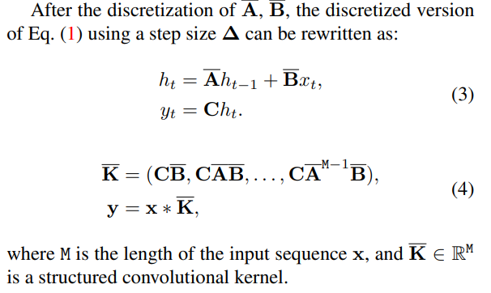
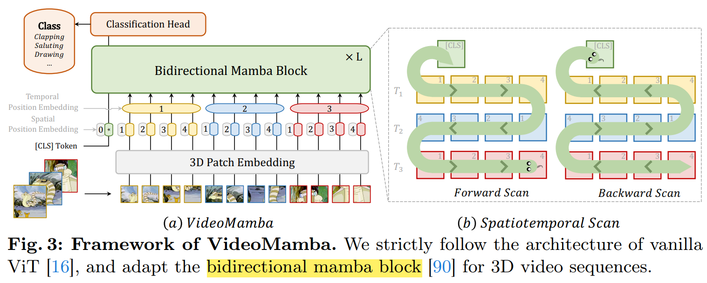
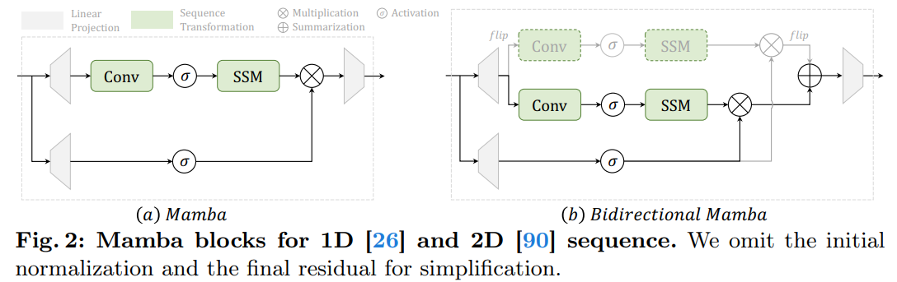
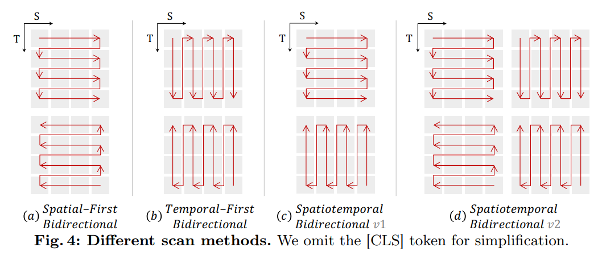
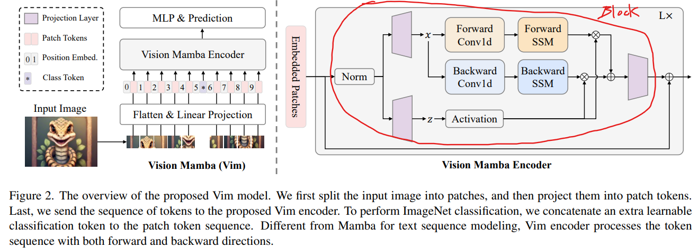

# VideoMamba: State Space Model for Efficient Video Understanding

> "VideoMamba: State Space Model for Efficient Video Understanding" Arxiv, 2024 Mar
> [paper](http://arxiv.org/abs/2403.06977v1) [code](https://github.com/OpenGVLab/VideoMamba) [pdf](./2024_03_Arxiv_VideoMamba--State-Space-Model-for-Efficient-Video-Understanding.pdf) [note](./2024_03_Arxiv_VideoMamba--State-Space-Model-for-Efficient-Video-Understanding_Note.md)
> Authors: Kunchang Li, Xinhao Li, Yi Wang, Yinan He, Yali Wang, Limin Wang, Yu Qiao

## Key-point

- Task
- Problems
- :label: Label:

## Contributions

## Introduction

### SSM(S4)

SSM 用于映射时序数据 $x\to y$
$$
y(t) = C*h_t \\
h_{t+1} = A*h_t + B *x_t \\
$$

> State Space Models (SSMs) are commonly considered as linear time-invariant systems, which map a 1-D function or sequence x(t) ∈ R 7→ y(t) ∈ R through differential equations (ODEs),

为了匹配训练过程中的采样率（batch），让模型更好地提取数据中的特征，需要进行 **ODE 离散化**；

> The discretization is introduced to primarily transform the ODE into a discrete function. This transformation is crucial to **align the model with the sample rate of the underlying signal embodied in the input data**, enabling computationally efficient operations.

通过时序变量 $\Delta$ (Delta)对连续变量 A,B 处理为 $\bar{A}, \bar{B}$
$$
y = x * \bar{K}, ~\bar{K} = (C\bar{B}, C\bar{A}\bar{B}, \dots, C\bar{A}^{M-1}\bar{B})
$$
$\bar{K}$ 用一个全局的 convolution 实现

> where M is the length of the input sequence x, and K ∈ R M is a structured convolutional kernel





## methods






### scan methods



- Q：Fig4(b) temporal first 前后帧在 1D 序列中同一位置 token 可能不对齐？


- Q: To counter the overfitting issues observed in VMamba


## Code

> - Q: torch reshape 如何操作？

the core in training forward [code](https://github.com/OpenGVLab/VideoMamba/blob/f0b158381bb955dbeeb67f1ae8eecd14a636e3c9/videomamba/video_sm/engines/engine_for_finetuning.py#L15)

```python
def train_class_batch(model, samples, target, criterion):
    outputs = model(samples)  # videomamba_middle
    loss = criterion(outputs, target)
    return loss, outputs
```

模型定义

`def videomamba_middle(pretrained=False, **kwargs):` [code](https://github.com/OpenGVLab/VideoMamba/blob/f0b158381bb955dbeeb67f1ae8eecd14a636e3c9/videomamba/video_sm/models/videomamba.py#L440)

```python
"""
	elif 'videomamba' in args.model:
        model = create_model(
            args.model,
            img_size=args.input_size,
            pretrained=False if args.finetune else True,
            num_classes=args.nb_classes,  # 400
            fc_drop_rate=args.fc_drop_rate,  # 0.0
            drop_path_rate=args.drop_path,  # 0.1
            kernel_size=args.tubelet_size,  # --tubelet_size 1 \
            num_frames=args.num_frames,  # --num_frames 8 \
            use_checkpoint=args.use_checkpoint,
            checkpoint_num=args.checkpoint_num,
        )
"""

def videomamba_middle(pretrained=False, **kwargs):
    model = VisionMamba(
        patch_size=16, 
        embed_dim=576, 
        depth=32, 
        rms_norm=True, 
        residual_in_fp32=True, 
        fused_add_norm=True, 
        **kwargs
    )
    model.default_cfg = _cfg()
    if pretrained:
        print('load pretrained weights')
        state_dict = torch.load(_MODELS["videomamba_m16_in1k"], map_location='cpu')
        load_state_dict(model, state_dict, center=True)
    return model
```


### Patch Embedding

图像分类任务，先用 3D 卷积压缩到  `576 x T x H/16 x W/16`

> we first use 3D convolution (i.e., 1×16×16) to project the input videos Xv ∈ R 3×T ×H×W into L non-overlapping spatiotemporal patches Xp ∈ R L×C , where L=t×h×w (t=T, h= H 16 , and w= W 16 ).

```python
class PatchEmbed(nn.Module):
    """ Image to Patch Embedding
    """
    def __init__(self, img_size=224, patch_size=16, kernel_size=1, in_chans=3, embed_dim=768):
        super().__init__()
        img_size = to_2tuple(img_size)
        patch_size = to_2tuple(patch_size)
        num_patches = (img_size[1] // patch_size[1]) * (img_size[0] // patch_size[0])
        self.img_size = img_size
        self.patch_size = patch_size
        self.num_patches = num_patches
        self.tubelet_size = kernel_size

        self.proj = nn.Conv3d(
            in_chans, embed_dim, 
            kernel_size=(kernel_size, patch_size[0], patch_size[1]),
            stride=(kernel_size, patch_size[0], patch_size[1])
        )

    def forward(self, x):
        x = self.proj(x)
        return x
```


- **Q: 如何针对 5D 视频数据转换为 1D 序列？**

类似于 `rearrange(x, "b t c h w -> (b t) (h w) c")` 转为 1D 序列 :star:

看一下 reshape 按什么顺序合并 BT 维度，后面 `temporal embedding` 与这里的 flatten 方式有关 :star:

```python
    def forward_features(self, x, inference_params=None):
        x = self.patch_embed(x)
        B, C, T, H, W = x.shape
        x = x.permute(0, 2, 3, 4, 1).reshape(B * T, H * W, C)  # this flatten method related with temporal-pos embd
```


### ClassToken & pos embd

`````python
		num_patches = self.patch_embed.num_patches  # 224//16 * 224 //16
	
        self.cls_token = nn.Parameter(torch.zeros(1, 1, self.embed_dim))  # (1,1,572)
        self.pos_embed = nn.Parameter(torch.zeros(1, num_patches + 1, self.embed_dim))
        self.temporal_pos_embedding = nn.Parameter(torch.zeros(1, num_frames // kernel_size, embed_dim))
        self.pos_drop = nn.Dropout(p=drop_rate)
`````

`forward` 加 class token ；每一帧都加 cls token，所以要先 expand！

每一帧都加 pos embd，在 HxW 上加

```python
        cls_token = self.cls_token.expand(x.shape[0], -1, -1)  # stole cls_tokens impl from Phil Wang, thanks
        x = torch.cat((cls_token, x), dim=1)  # BxT, num_patches + 1, C
        x = x + self.pos_embed  # BxT, num_patches + 1, C
```


- **Q: 如何加 temporal token？**

**`cls_tokens` 刚才加了 spatial_pos_embd 要先抽出来**；`cls_tokens` 尺寸`(1,1,C)`，刚才 expand 了 && 之后要匹配相加的尺寸，所以 B 维度取 B 个，HxW 维度按之前一样取 1 个

`temporal_pos_embedding` 尺寸 `(1,T,C)`，将 x  转换下 T 所在维度`'(b t) n m -> (b n) t m'`，在加 temporal_pos

最后再把 `cls_tokens` 加上，x 尺寸 `b (t n)+1 c`

```python
        # temporal pos
        cls_tokens = x[:B, :1, :]  # (b, 1, c)
        x = x[:, 1:]  # (b t) (h w) C
        x = rearrange(x, '(b t) n m -> (b n) t m', b=B, t=T)  # n == patch_num
        x = x + self.temporal_pos_embedding
        x = rearrange(x, '(b n) t m -> b (t n) m', b=B, t=T)
        x = torch.cat((cls_tokens, x), dim=1)  # b (t n)+1 c

        x = self.pos_drop(x)
```


### Mamba Encoder

- **Q: 用了几层 Video Mamba Encoder**

L=24 层 Mamba Encoder

内部先用 `fused_add_norm_fn` 做了一下 Norm，在过 `MambaBlock`；连续过 L 个 Mamba Encoder 再对残差（？）做一下 LayerNorm



```python
        # mamba impl
        residual = None
        hidden_states = x
        for idx, layer in enumerate(self.layers):
            hidden_states, residual = layer(
                hidden_states, residual, inference_params=inference_params
            )
        
        # residual: fused_add_norm == True
        # Set prenorm=False here since we don't need the residual
        fused_add_norm_fn = rms_norm_fn if isinstance(self.norm_f, RMSNorm) else layer_norm_fn
        hidden_states = fused_add_norm_fn(
            self.drop_path(hidden_states),
            self.norm_f.weight,
            self.norm_f.bias,
            eps=self.norm_f.eps,
            residual=residual,
            prenorm=False,
            residual_in_fp32=self.residual_in_fp32,
        )
```


#### `fused_add_norm_fn`

> [code](https://github.com/OpenGVLab/VideoMamba/blob/f0b158381bb955dbeeb67f1ae8eecd14a636e3c9/mamba/mamba_ssm/ops/triton/layernorm.py#L380)

输入 x 尺寸 `b (t n)+1 c` 仍是 1D 序列，做一下 LayerNorm

- **Q：RMSNorm 是啥，为啥要写一个 CUDA 算子？**

先做 RMSNorm(LayerNorm) 用 CUDA 保存了一下梯度？？

```
def rms_norm_fn(x, weight, bias, residual=None, prenorm=False, residual_in_fp32=False, eps=1e-6):
    return LayerNormFn.apply(x, weight, bias, residual, eps, prenorm, residual_in_fp32, True)
```


#### `class Mamba(nn.Module)`

> [code](https://github.com/OpenGVLab/VideoMamba/blob/f0b158381bb955dbeeb67f1ae8eecd14a636e3c9/mamba/mamba_ssm/modules/mamba_simple.py#L34)

输入已经做过 LayerNorm 了


Block 定义，参数`bimamba==True`; forward 参数 `inference_params=None`, 

```python
mixer_cls = partial(Mamba, layer_idx=layer_idx, bimamba=bimamba, **ssm_cfg, **factory_kwargs)
```

`class Mamba(nn.Module)` 定义 `__init__`

```python
class Mamba(nn.Module):
    def __init__(
        self,
        d_model,  # emb_dim
        d_state=16,
        d_conv=4,
        expand=2,
        dt_rank="auto",
        dt_min=0.001,
        dt_max=0.1,
        dt_init="random",
        dt_scale=1.0,
        dt_init_floor=1e-4,
        conv_bias=True,
        bias=False,
        use_fast_path=True,  # Fused kernel options
        layer_idx=None,
        device=None,
        dtype=None,
        bimamba=True,
    ):
        factory_kwargs = {"device": device, "dtype": dtype}
        super().__init__()
        self.d_model = d_model  # 576
        self.d_state = d_state  # 16
        self.d_conv = d_conv  # 4
        self.expand = expand  # 2
        self.d_inner = int(self.expand * self.d_model)  # 2*576
        self.dt_rank = math.ceil(self.d_model / 16) if dt_rank == "auto" else dt_rank  # 36
        self.use_fast_path = use_fast_path
        self.layer_idx = layer_idx
        self.bimamba = bimamba  # True

        self.in_proj = nn.Linear(self.d_model, self.d_inner * 2, bias=bias, **factory_kwargs)
        self.conv1d = nn.Conv1d(
            in_channels=self.d_inner,  # 1152
            out_channels=self.d_inner,
            bias=conv_bias,
            kernel_size=d_conv,  # 4
            groups=self.d_inner,
            padding=d_conv - 1,
            **factory_kwargs,
        )  # weight.shape>>[1152, 1, 4]; bias.shape>>[1152]

        self.activation = "silu"
        self.act = nn.SiLU()

        self.x_proj = nn.Linear(
            self.d_inner, self.dt_rank + self.d_state * 2, bias=False, **factory_kwargs
        )  # 576 >> 36 + (16*2)
        self.dt_proj = nn.Linear(self.dt_rank, self.d_inner, bias=True, **factory_kwargs)
        #>>> dt_proj.weight.shape torch.Size([1152, 36])
        #>>> dt_proj.bias.shape torch.Size([1152]
        self.dt_proj = nn.Linear(self.dt_rank, self.d_inner, bias=True, **factory_kwargs)

        # Initialize special dt projection to preserve variance at initialization
        dt_init_std = self.dt_rank**-0.5 * dt_scale
        if dt_init == "constant":
            nn.init.constant_(self.dt_proj.weight, dt_init_std)
        elif dt_init == "random":
            nn.init.uniform_(self.dt_proj.weight, -dt_init_std, dt_init_std)
        else:
            raise NotImplementedError
```

SSM 参数

```python
# S4D real initialization
A = repeat(
torch.arange(1, self.d_state + 1, dtype=torch.float32, device=device),
"n -> d n",

).contiguous()  # [16, 16]
A_log = torch.log(A)  # Keep A_log in fp32
self.A_log = nn.Parameter(A_log)
self.A_log._no_weight_decay = True

# D "skip" parameter
self.D = nn.Parameter(torch.ones(self.d_inner, device=device))  # Keep in fp32
self.D._no_weight_decay = True
```


**MLP in_projection 得到 `xz`**

输入 x 尺寸 `b (t n)+1 c -> b c*expand*2 (t n)+1`; 通道数从 C=576 >> 4*576

```python
        # We do matmul and transpose BLH -> HBL at the same time
        # NOTE: same as in_proj(hidden_states) but memory-efficient with the following operations
        xz = rearrange(
            self.in_proj.weight @ rearrange(hidden_states, "b l d -> d (b l)"),
            "d (b l) -> b d l",
            l=seqlen,
        )
        if self.in_proj.bias is not None:
            xz = xz + rearrange(self.in_proj.bias.to(dtype=xz.dtype), "d -> d 1")
```


#### `mamba_inner_fn_no_out_proj `:star:

> [code](https://github.com/OpenGVLab/VideoMamba/blob/f0b158381bb955dbeeb67f1ae8eecd14a636e3c9/mamba/mamba_ssm/ops/selective_scan_interface.py#L155)

执行 forward Conv + Forward SSM 的模块；输入 `xz` 尺寸 `b c=576*2*2 (t n)+1`

forward 流程，参考 Vim 一样做一次 forward SSM 和 backward SSM；最后把两个的输出相加过 MLP

```python
        A = -torch.exp(self.A_log.float())  # (d_inner, d_state)
        A_b = -torch.exp(self.A_b_log.float())
        out = mamba_inner_fn_no_out_proj(
        xz,
        self.conv1d.weight,
        self.conv1d.bias,
        self.x_proj.weight,
        self.dt_proj.weight,
        A,
        None,  # input-dependent B
        None,  # input-dependent C
        self.D.float(),
        delta_bias=self.dt_proj.bias.float(),
        delta_softplus=True,
        )
        out_b = mamba_inner_fn_no_out_proj(
        xz.flip([-1]),  # backward
        self.conv1d_b.weight,
        self.conv1d_b.bias,
        self.x_proj_b.weight,
        self.dt_proj_b.weight,
        A_b,
        None,
        None,
        self.D_b.float(),
        delta_bias=self.dt_proj_b.bias.float(),
        delta_softplus=True,
        )
        out = F.linear(rearrange(out + out_b.flip([-1]), "b d l -> b l d"), self.out_proj.weight, self.out_proj.bias)
```

调用 `MambaInnerFnNoOutProj`

```python
def mamba_inner_fn_no_out_proj(
    xz, conv1d_weight, conv1d_bias, x_proj_weight, delta_proj_weight,
    A, B=None, C=None, D=None, delta_bias=None, B_proj_bias=None,
    C_proj_bias=None, delta_softplus=True
):
    return MambaInnerFnNoOutProj.apply(xz, conv1d_weight, conv1d_bias, x_proj_weight, delta_proj_weight,
                              A, B, C, D, delta_bias, B_proj_bias, C_proj_bias, delta_softplus)
```


把 xz 拆开对 x 用一层 depth 卷积使用 `depthwise conv1d`

> Causal depthwise conv1d in CUDA, with a PyTorch interface [code](https://github.com/Dao-AILab/causal-conv1d)

```
x, z = xz.chunk(2, dim=1)
conv1d_bias = conv1d_bias.contiguous() if conv1d_bias is not None else None
conv1d_out = causal_conv1d_cuda.causal_conv1d_fwd(x, conv1d_weight, conv1d_bias, True)
```


#### `selective_scan` :star:

> [SSM code](https://github.com/OpenGVLab/VideoMamba/blob/f0b158381bb955dbeeb67f1ae8eecd14a636e3c9/mamba/csrc/selective_scan)

- Q：delta 是离散化参数？

```python
# We're being very careful here about the layout, to avoid extra transposes.
# We want delta to have d as the slowest moving dimension
# and L as the fastest moving dimension, since those are what the ssm_scan kernel expects.
x_dbl = F.linear(rearrange(conv1d_out, 'b d l -> (b l) d'), x_proj_weight)  # (bl d)
delta = rearrange(delta_proj_weight @ x_dbl[:, :delta_rank].t(), "d (b l) -> b d l", l = L)

B = x_dbl[:, delta_rank:delta_rank + d_state]  # (bl dstate)
B = rearrange(B, "(b l) dstate -> b 1 dstate l", l=L).contiguous()

C = x_dbl[:, -d_state:]  # (bl dstate)
C = rearrange(C, "(b l) dstate -> b 1 dstate l", l=L).contiguous()
```

调用 SSM CUDA :shit:

```python
        out, scan_intermediates, out_z = selective_scan_cuda.fwd(
            conv1d_out, delta, A, B, C, D, z, delta_bias, delta_softplus
        )
```


- Q：为什么要定义 `torch.autograd.Functional` 实现 SSM？

原始的SSM是微分方程，没法求解析解，需要用data-driven的方式来拟合近似解。既然要拟合，就得把原始SSM的连续形式改成离散的


### classification head

只对 `cls_token` 处理，先 dropout 再用一层 MLP 直接就分类了;

```python
self.head = nn.Linear(self.num_features, num_classes) if num_classes > 0 else nn.Identity()  #  `b 1 c -> b 1 ClassNum `
```


## Experiment

> ablation study 看那个模块有效，总结一下

## Limitations

## Summary :star2:

> learn what & how to apply to our task

