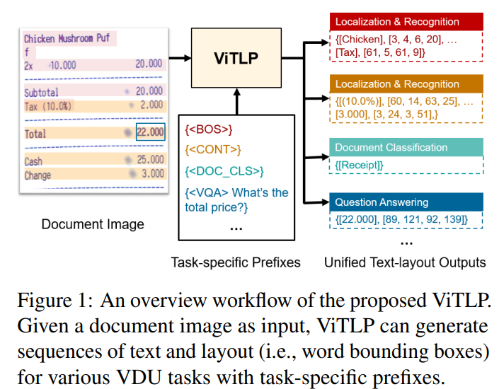
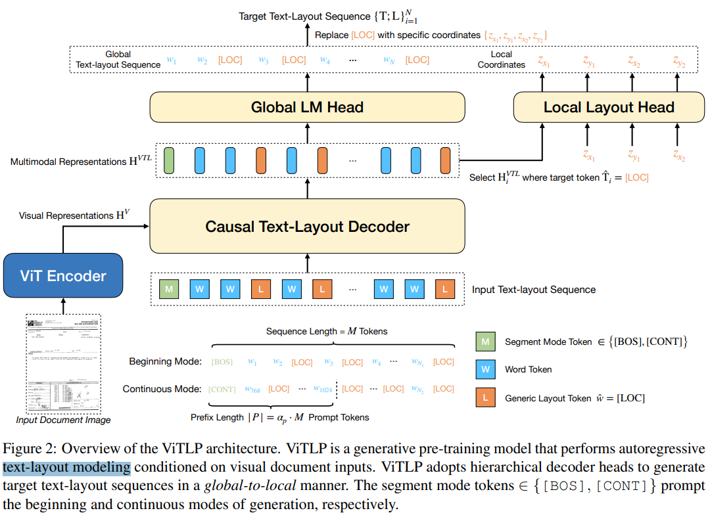
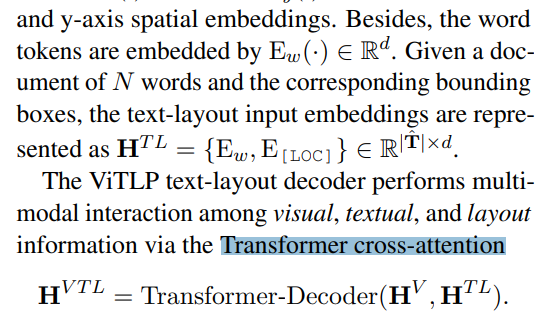
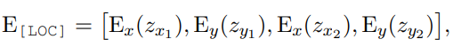
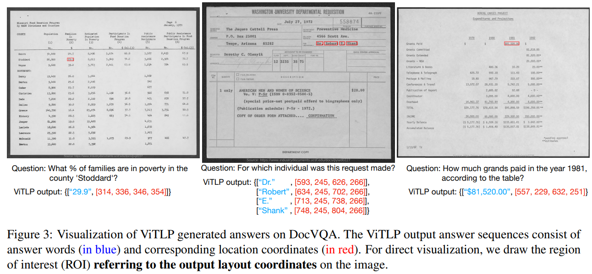
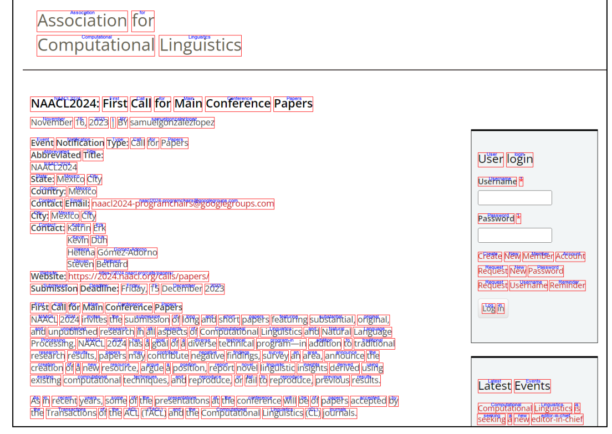

# Visually Guided Generative Text-Layout Pre-training for Document Intelligence

> "Visually Guided Generative Text-Layout Pre-training for Document Intelligence" Arxiv, 2024 Mar 25, `ViTLP`
> [paper](http://arxiv.org/abs/2403.16516v2) [code](https://github.com/Veason-silverbullet/ViTLP) [pdf](./2024_03_Arxiv_Visually-Guided-Generative-Text-Layout-Pre-training-for-Document-Intelligence.pdf) [note](./2024_03_Arxiv_Visually-Guided-Generative-Text-Layout-Pre-training-for-Document-Intelligence_Note.md)
> Authors: Zhiming Mao, Haoli Bai, Lu Hou, Jiansheng Wei, Xin Jiang, Qun Liu, Kam-Fai Wong (CUHK + Huawei)

## Key-point

- Task
- Problems
- :label: Label:

文档 OCR 理解 + 定位

## Contributions

- 提出 text & laytout 一起训练的策略

  > we propose **Visually guided generative Text-Layout Pre-training (ViTLP)** to jointly model text and layout information from document images.

- 设计 generative pre-train 策略，支持任意长度文本

> In addition, to address the limitation of processing long documents by Transformers, we introduce a straightforward yet effective multisegment generative pre-training scheme, facilitating ViTLP to process word-intensive documents of any length.

- ViTLP 也可以直接作为 OCR 模型
- SOTA

## Introduction

## methods

- Q：token 数量多，低效率

> To address the token-inefficiency issue discussed in Sec. 2.1, we design the globalto-local text-layout generation process as follows.

把图像和（文本 + layout) 做 cross-attn 来获取位置信息，这么搞效果居然还可以哈

- Q：bbox 怎么提取特征？

## setting

## Experiment

> ablation study 看那个模块有效，总结一下

- 针对回执 or 发票的问答

## Limitations

## Summary :star2:

> learn what

### how to apply to our task

把图像和（文本 + layout) 做 cross-attn 来获取位置信息，**这么搞效果居然还可以哈**

- Q：bbox 怎么提取特征？

