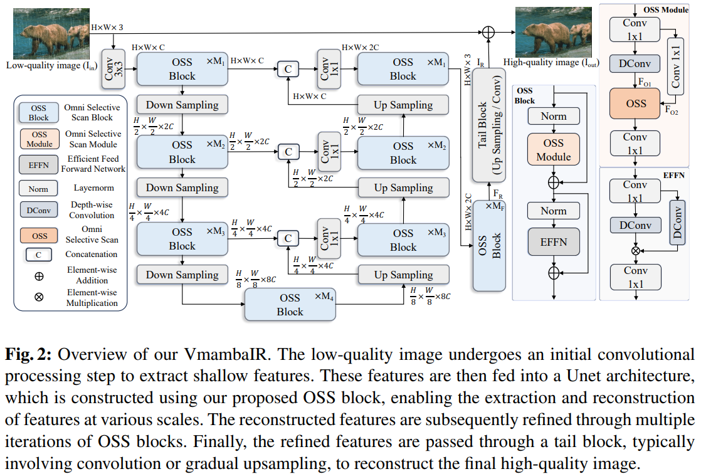
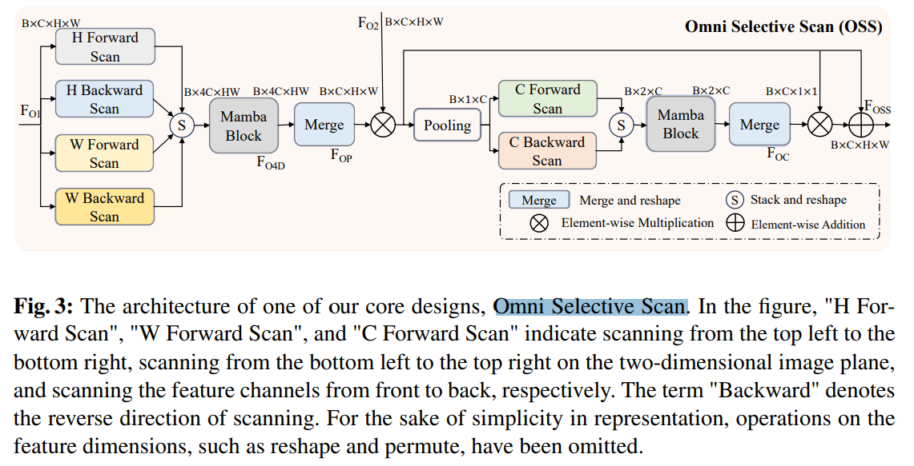

# VmambaIR: Visual State Space Model for Image Restoration

> "VmambaIR: Visual State Space Model for Image Restoration" Arxiv, 2024 Mar 18
> [paper](http://arxiv.org/abs/2403.11423v1) [code]() [pdf](./2024_03_Arxiv_VmambaIR--Visual-State-Space-Model-for-Image-Restoration.pdf) [note](./2024_03_Arxiv_VmambaIR--Visual-State-Space-Model-for-Image-Restoration_Note.md)
> Authors: Yuan Shi, Bin Xia, Xiaoyu Jin, Xing Wang, Tianyu Zhao, Xin Xia, Xuefeng Xiao, Wenming Yang

## Key-point

- Task

- Problems

  CNNs have limitations in capturing long-range dependencies

  DMs 计算量大

  Transformers have powerful modeling capabilities but face challenges due to quadratic complexity 复杂度高

- :label: Label:

## Contributions

## Introduction

## methods

提出的 Omni-SSM

## Experiment

> ablation study 看那个模块有效，总结一下

## Limitations

## Summary :star2:

> learn what & how to apply to our task

