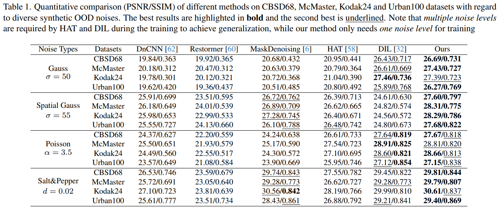

# Transfer CLIP for Generalizable Image Denoising

> "Transfer CLIP for Generalizable Image Denoising" CVPR, 2024 Mar 22
> [paper](http://arxiv.org/abs/2403.15132v1) [code]() [pdf](./2024_03_CVPR_Transfer-CLIP-for-Generalizable-Image-Denoising.pdf) [note](./2024_03_CVPR_Transfer-CLIP-for-Generalizable-Image-Denoising_Note.md)
> Authors: Jun Cheng, Dong Liang, Shan Tan

## Key-point

- Task: Image denoising
- Problems
- :label: Label:

## Contributions

发现 CLIP 某些层的特征 noise-invariant，提取 CLIP 中间层特征，训练一个 decoder 实现去噪

- This paper uncovers that certain dense features extracted from the frozen ResNet image encoder of CLIP exhibit distortion-invariant and content-related properties, which are highly desirable for generalizable denoising
- Leveraging these properties, we devise an asymmetrical encoder-decoder denoising network, which incorporates dense features including the noisy image and its multi-scale features from the frozen ResNet encoder of CLIP into a learnable image decoder to achieve generalizable denoising. 
- SOTA, synthetic noise, real-world sRGB noise, and low-dose CT image noise

## Introduction

## methods

使用 ResNet 版本的 CLIP

- Q：为啥不用 ViT CLIP?

> As the ViT architecture directly processes overly downsampled image features, it abandons spatial image details and hence is not suitable for image denoising.

## setting

## Experiment

> ablation study 看那个模块有效，总结一下

PSNR 有一丢丢提升，但不明显。。

## Limitations

## Summary :star2:

> learn what

### how to apply to our task

