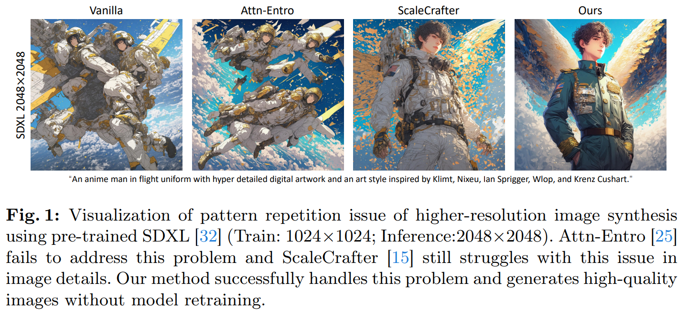
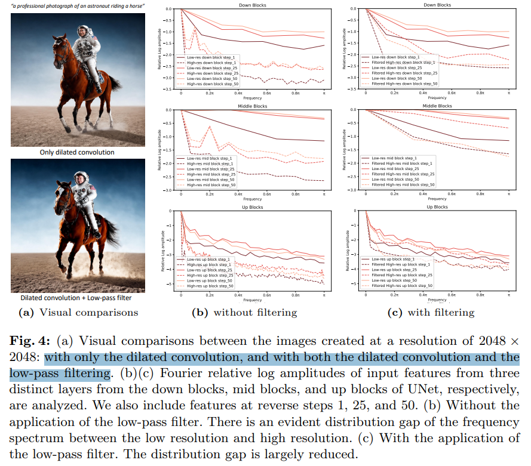
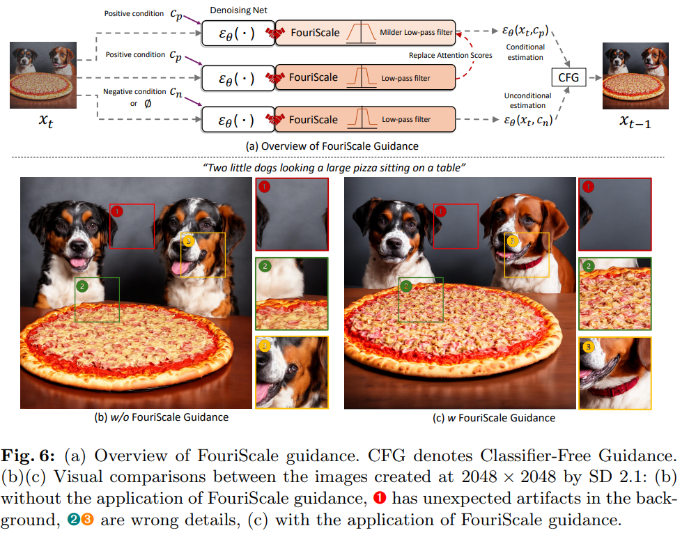
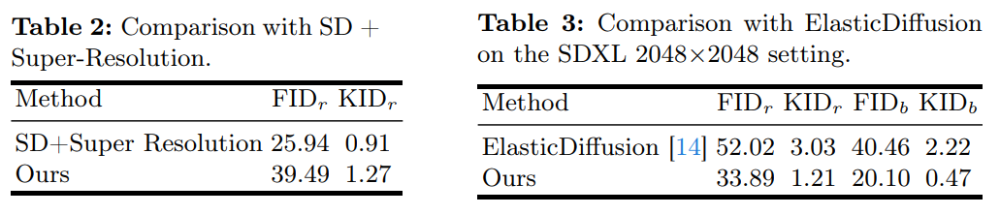
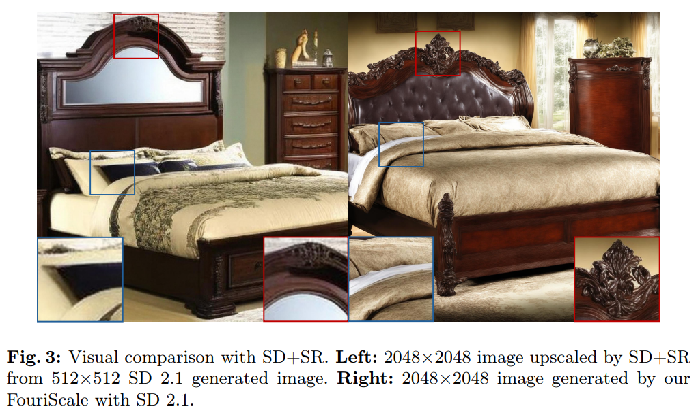

# FouriScale: A Frequency Perspective on Training-Free High-Resolution Image Synthesis

> "FouriScale: A Frequency Perspective on Training-Free High-Resolution Image Synthesis" ECCV, 2024 Mar 19
> [paper](http://arxiv.org/abs/2403.12963v1) [code](https://github.com/LeonHLJ/FouriScale.) [pdf](./2024_03_ECCV_FouriScale--A-Frequency-Perspective-on-Training-Free-High-Resolution-Image-Synthesis.pdf) [note](./2024_03_ECCV_FouriScale--A-Frequency-Perspective-on-Training-Free-High-Resolution-Image-Synthesis_Note.md)
> Authors: Linjiang Huang, Rongyao Fang, Aiping Zhang, Guanglu Song, Si Liu, Yu Liu, Hongsheng Li

## Key-point

- Task
- Problems
  - addressing persistent challenges, such as repetitive patterns and structural distortions,

- :label: Label:

## Contributions

- we introduce an innovative, training-free approach FouriScale from the perspective of **frequency domain** analysis.

- We replace the original convolutional layers in pre-trained diffusion models by incorporating a dilation technique along with a low-pass operation, intending to achieve structural consistency and scale consistency across resolutions, respectively

## Introduction

- ScaleCrafter 直接生成的细节不行

## methods

把 UNet 的 Conv Kernel 变成 dilated，去和 Low-frequency 特征相乘

高频细节更多

CFG 使用场景

## setting

## Experiment

> ablation study 看那个模块有效，总结一下

### vs SD+SR

> More importantly, as shown in Fig. 3, we find that our method **can generate much better details** than the cascaded pipeline. Due to a lack of prior knowledge in generation, super-resolution method can only utilize existing knowledge within the single image for upscaling the image, resulting in over-smooth appearance.

指标没有 SD+SR 高，但看图像细节会清晰超级多，但和原始的一致性不好。**后续工作 `FAM Diffusion` 也验证了本文的一致性较烂**

## Limitations

## Summary :star2:

> learn what

### how to apply to our task

