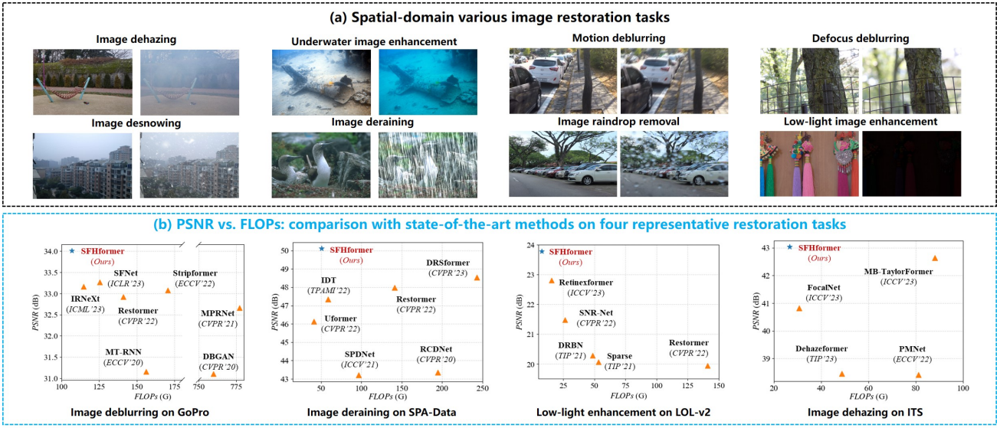
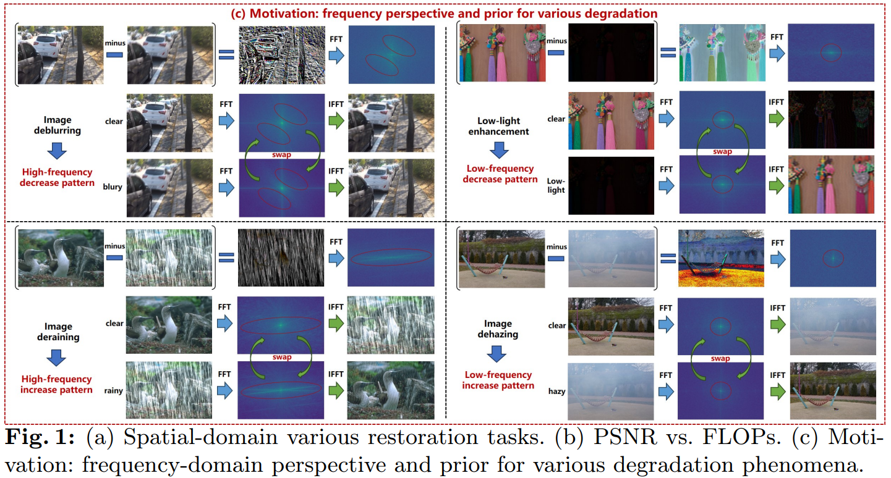
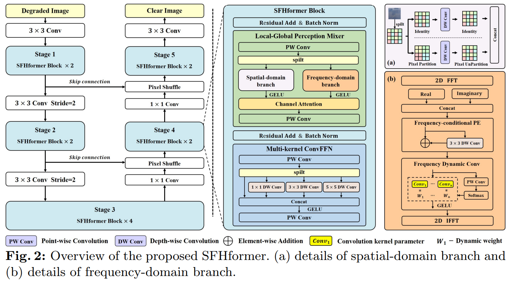
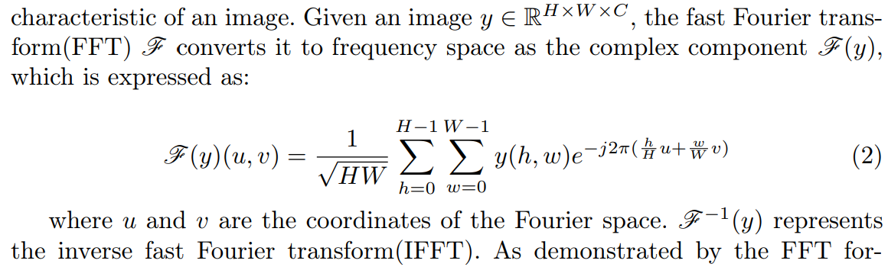
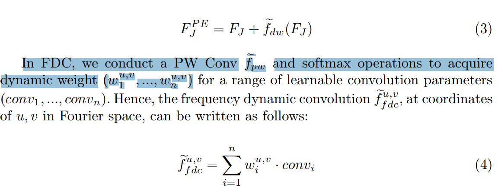
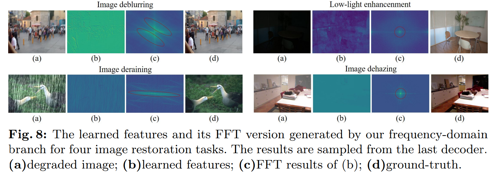
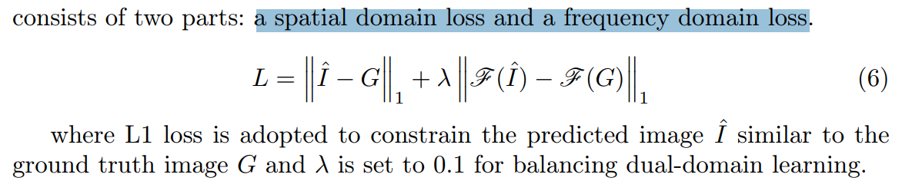

# When Fast Fourier Transform Meets Transformer for Image Restoration

> "When Fast Fourier Transform Meets Transformer for Image Restoration" ECCV, 2024 Mar 1, `SFHformer`
> [paper](https://www.ecva.net/papers/eccv_2024/papers_ECCV/papers/06190.pdf) [code](https://github.com/deng-ai-lab/SFHformer) [pdf](./2024_03_ECCV_When-Fast-Fourier-Transform-Meets-Transformer-for-Image-Restoration.pdf) [note](./2024_03_ECCV_When-Fast-Fourier-Transform-Meets-Transformer-for-Image-Restoration_Note.md)
> Authors: Xingyu Jiang, Xiuhui Zhang, Ning Gao, Yue Deng (Beihang University)

## Key-point

- Task
- Problems
  - Instead of exploring the commonality across different degradation phenomena, existing image restoration methods focus on the modification of network architecture under limited **restoration priors.**

- :label: Label:

## Contributions

- we propose an efficient image restoration framework, dubbed SFHformer, which incorporates the Fast Fourier Transform mechanism into Transformer architecture. 
- review various degradation phenomena from a frequency perspective as prior

- 空域 RGB 做 local，frequency 频域做 global；对 frequency 设计 position embedding. frequency dynamic convolution

> we design a dual domain hybrid structure for multi-scale receptive fields modeling, in which the **spatial domain and the frequency domain focuses on local modeling and global modeling**, respectively
>
> design unique positional coding and frequency dynamic convolution for each frequency component to extract rich frequency-domain features

- SOTA


## Introduction

指标 nb




看了一下 FFT 频谱图，**deblur 和 derain（划痕）属于高频信息问题**




## methods

> Specifically, SFHformer is comprised of two essential modules: LocalGlobal Perception Mixer(LGPM) and Multi-kernel ConvFFN(MCFN).




PW Conv 把通道数翻倍，然后通道上 split 分成 spatial 特征 & frequency 特征

> LGPM first applies a PW convolution $\tilde{f_{pw}}$ to double the channel dimension of the input features 
>
> $F_{sp}, F_{fr}$ which subsequently pass through the spatial-domain branch and the frequency-domain branch, respectively. 


### Spatial-domain Branch

直接看代码 + 图足够了

### Frequency-domain Branch

> The frequency-domain branch focuses on capturing frequency features for global modeling around the entire image



提出对每个 frequency component 加  FCPE 频域位置编码；提出 frequency dynamic convolution (FDC)

> we introduce two core components. Firstly, we implement **frequency-conditional positional encoding (FCPE)**, which assigns a distinct identity to each frequency component. Secondly, we introduce **frequency dynamic convolution (FDC)**, allowing flexible modeling based on the input of each frequency component. These designs utilize tailored processing methodologies to effectively leverage the unique characteristics of **each frequency component.**


先得到频域特征，实数 & 虚数部分

>  the input features Ff r first pass through a 2D FFT F to obtain the complex features: the real part FR ∈ R H×W×C and the imaginary part FI ∈ R H×W×C in frequency domain

先前工作都是把实数 & 虚数分开做，本文在 C 上合起来，$F_R \& F_I  \to F_J$ 

> Next, different from respectively extracting features from real and imaginary, we aggregate the real FR and imaginary FI in the channel dimension, yielding the joint features FJ ∈ R H×W×2C
>
> Then, FJ progressively passes through the two key modules: FCPE and FDC.

1. FCPE 用卷积实现去加位置编码
2. 频域 Conv 去获取 dynamic weight




- Q：是否有效？



看特征**学习到了退化的特征，后续作为 frequency residual**

> To substantiate the effectiveness of the proposed frequency-domain branch in modeling degradation patterns for various restoration tasks, we visualize the learned features alongside their corresponding frequency representations in Fig.8.
>
> As expected, our model adeptly captures the residual frequency patterns of various degradation (see red circle)

跟一开始测试的 FFT 频谱图很类似啊


### Loss




把实部虚部一起算 L1 Loss，频域 Loss 权重 $\lambda=0.1$

```python
criterion = nn.L1Loss()

def train(train_loader, network, criterion, optimizer):
    losses = AverageMeter()

    # torch.cuda.empty_cache()

    network.train()

    for batch in train_loader:
        source_img = batch['source'].cuda()
        target_img = batch['target'].cuda()

        pred_img = network(source_img)
        label_img = target_img
        l3 = criterion(pred_img, label_img)
        loss_content = l3

        label_fft3 = torch.fft.fft2(label_img, dim=(-2, -1))
        label_fft3 = torch.stack((label_fft3.real, label_fft3.imag), -1)

        pred_fft3 = torch.fft.fft2(pred_img, dim=(-2, -1))
        pred_fft3 = torch.stack((pred_fft3.real, pred_fft3.imag), -1)

        f3 = criterion(pred_fft3, label_fft3)
        loss_fft = f3

        loss = loss_content + 0.1 * loss_fft
        losses.update(loss.item())

        optimizer.zero_grad()
        loss.backward()
        # torch.nn.utils.clip_grad_norm_(network.parameters(), 0.01)
        optimizer.step()

    return losses.avg
```


### Code


- Q: 代码里面 Token Mixer 是啥？

> https://github.com/deng-ai-lab/SFHformer/blob/bd60f61b32d43b5477572195ad386965e0608b39/models/SFHformer.py#L209

spatial-Frequency 处理的那个模块


```python
class Mixer(nn.Module):
    def __init__(
            self,
            dim,
            token_mixer_for_local=TokenMixer_For_Local,
            token_mixer_for_gloal=TokenMixer_For_Gloal,
    ):
        super(Mixer, self).__init__()
        self.dim = dim
        self.mixer_local = token_mixer_for_local(dim=self.dim,)
        self.mixer_gloal = token_mixer_for_gloal(dim=self.dim,)

        self.ca_conv = nn.Sequential(
            nn.Conv2d(2*dim, dim, 1),
        )
        self.ca = nn.Sequential(
            nn.AdaptiveAvgPool2d(1),
            nn.Conv2d(2*dim, 2*dim//2, kernel_size=1),
            nn.ReLU(inplace=True),
            nn.Conv2d(2*dim//2, 2*dim, kernel_size=1),
            nn.Sigmoid()
        )

        self.gelu = nn.GELU()
        self.conv_init = nn.Sequential(
            nn.Conv2d(dim, 2*dim, 1),
        )

    def forward(self, x):
        x = self.conv_init(x)
        x = list(torch.split(x, self.dim, dim=1))
        x_local = self.mixer_local(x[0])
        x_gloal = self.mixer_gloal(x[1])
        x = torch.cat([x_local, x_gloal], dim=1)
        x = self.gelu(x)
        x = self.ca(x) * x
        x = self.ca_conv(x)

        return x
```


- PW Conv 就是 kernel=1 的 Conv & 通道翻倍


**时域频域模块**

- Local_mixer -》 Spatial Domain

把**通道分一半**，用不同的 dilation Conv 做一下，再合起来

- Global_mixer -> Frequency Domain

通道翻倍，普通卷积 + FFC，再把**通道弄回来**


- Channel Attention 后处理

用两个卷积，先把 channel 减半再搞回来

```python
        self.ca = nn.Sequential(
            nn.AdaptiveAvgPool2d(1),
            nn.Conv2d(2*dim, 2*dim//2, kernel_size=1),
            nn.ReLU(inplace=True),
            nn.Conv2d(2*dim//2, 2*dim, kernel_size=1),
            nn.Sigmoid()
        )
    	self.ca_conv = nn.Sequential(
            nn.Conv2d(2*dim, dim, 1),
        )
# x = self.ca(x) * x
# x = self.ca_conv(x)
```


#### freq


> https://github.com/deng-ai-lab/SFHformer/blob/bd60f61b32d43b5477572195ad386965e0608b39/models/SFHformer.py#L183

```python
class TokenMixer_For_Gloal(nn.Module):
    def __init__(
            self,
            dim
    ):
        super(TokenMixer_For_Gloal, self).__init__()
        self.dim = dim
        self.conv_init = nn.Sequential(
            nn.Conv2d(dim, dim*2, 1),
            nn.GELU()
        )
        self.conv_fina = nn.Sequential(
            nn.Conv2d(dim*2, dim, 1),
            nn.GELU()
        )
        self.FFC = FourierUnit(self.dim*2, self.dim*2)

    def forward(self, x):
        x = self.conv_init(x)
        x0 = x
        x = self.FFC(x)
        x = self.conv_fina(x+x0)

        return x
```


核心！通道数先翻倍再输入进来

```python
class FourierUnit(nn.Module):

    def __init__(self, in_channels, out_channels, groups=4):
        # bn_layer not used
        super(FourierUnit, self).__init__()
        self.groups = groups
        self.bn = nn.BatchNorm2d(out_channels * 2)

        self.fdc = nn.Conv2d(in_channels=in_channels * 2, out_channels=out_channels * 2 * self.groups,
                                                        kernel_size=1, stride=1, padding=0, groups=self.groups, bias=True)
        self.weight = nn.Sequential(
             nn.Conv2d(in_channels=in_channels * 2, out_channels=self.groups, kernel_size=1, stride=1, padding=0),
             nn.Softmax(dim=1)
        )

        self.fpe = nn.Conv2d(in_channels * 2, in_channels * 2, kernel_size=3,
                                        padding=1, stride=1, groups=in_channels * 2,bias=True)

    def forward(self, x):
        batch, c, h, w = x.size()

        # (batch, c, h, w/2+1, 2)
        ffted = torch.fft.rfft2(x, norm='ortho')
        x_fft_real = torch.unsqueeze(torch.real(ffted), dim=-1)
        x_fft_imag = torch.unsqueeze(torch.imag(ffted), dim=-1)
        ffted = torch.cat((x_fft_real, x_fft_imag), dim=-1)
        
        
        ffted = rearrange(ffted, 'b c h w d -> b (c d) h w').contiguous()
        ffted = self.bn(ffted)
        
        # position embedding here! Just One Conv
        ffted = self.fpe(ffted) + ffted
        
        dy_weight = self.weight(ffted)
        ffted = self.fdc(ffted).view(batch, self.groups, 2*c, h, -1)  # (batch, c*2, h, w/2+1)
        ffted = torch.einsum('ijkml,ijml->ikml', ffted, dy_weight)
        ffted = F.gelu(ffted)
        ffted = rearrange(ffted, 'b (c d) h w -> b c h w d', d=2).contiguous()
        ffted = torch.view_as_complex(ffted)
        output = torch.fft.irfft2(ffted, s=(h, w), norm='ortho')

        return output
```


使用 rfftn 在 w 维度会变成 (w/2 + 1)，相比 fftn 去除了冗余

> https://pytorch.org/docs/stable/generated/torch.fft.rfftn.html#torch-fft-rfftn
>
> so the full [`fftn()`](https://pytorch.org/docs/stable/generated/torch.fft.fftn.html#torch.fft.fftn) output contains redundant information. [`rfftn()`](https://pytorch.org/docs/stable/generated/torch.fft.rfftn.html#torch.fft.rfftn) instead omits the negative frequencies in the last dimension.

```shell
>>> t.shape
torch.Size([1, 4, 6, 64, 64])  # b c t h w
>>> a=torch.fft.rfftn(t, norm='ortho', dim=(-3,-2,-1))
>>> a.shape
torch.Size([1, 4, 6, 64, 33])

>>> torch.real(a).shape
torch.Size([1, 4, 6, 64, 33])
>>> torch.imag(a).shape
torch.Size([1, 4, 6, 64, 33]
>>> t2=torch.fft.irfftn(a, norm='ortho', dim=(-3,-2,-1))
>>> t2.shape
torch.Size([1, 4, 6, 64, 64])
```


## setting

## Experiment

> ablation study 看那个模块有效，总结一下

## Limitations

## Summary :star2:

> learn what

### how to apply to our task

- Q：frequency 怎么用？

