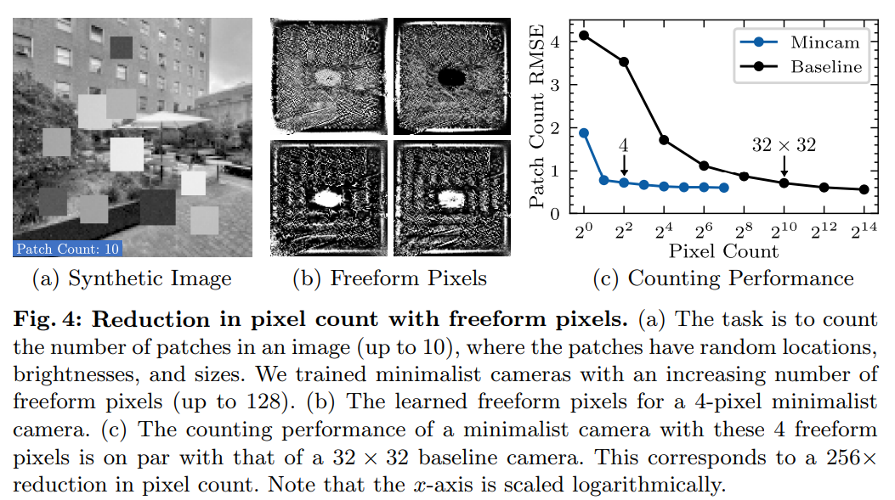

# Minimalist Vision with Freeform Pixels

> "Minimalist Vision with Freeform Pixels" ECCV_bestpaper, 2024 Mar 8
> [paper](https://www.ecva.net/papers/eccv_2024/papers_ECCV/papers/08113.pdf) [video](https://cave.cs.columbia.edu/old/projects/mincam_2024/videos/ECCV24_mincam.mp4) [web](https://cave.cs.columbia.edu/projects/categories/project?cid=Computational+Imaging&pid=Minimalist+Vision+with+Freeform+Pixels) [pdf](./2024_03_ECCV_bestpaper_Minimalist-Vision-with-Freeform-Pixels.pdf) [note](./2024_03_ECCV_bestpaper_Minimalist-Vision-with-Freeform-Pixels_Note.md)
> Authors: Caroline Rae, Shree K. Nayar

## Key-point

- Task: minimalist vision system 
- Problems
- :label: Label:

- Q：针对每个细节一一获取像素，对于特定的任务是否有必要？

传统 RGB 针对每个物体细节采样一个像素，太多冗余！针对 minimalist vision system  场景，例如统计场景中当前人数，车辆车速，RGB 存在太多不需要的细节信息，**提出在相机角度训练一个 NN 去提取大范围的信息代替提取 RGB 像素，称作 freeform pixel**

> We show that the hardware of **a minimalist camera can be modeled as the first layer of a neural network, where the subsequent layers are used for inference.** Training the network for any given task yields the shapes of the camera’s freeform pixels, each of which is implemented using a photodetector and an optical mask

发现 freeform pixel 只需要 4 个就可以人数统计任务，**计算消耗非常小，发现可以部署一个自己根据光来供电的相机完成任务**

> Second, since the number of measurements made by a minimalist camera is very small, we show that it can be fully **self-powered**, i.e., function without an external power supply or a battery.

## Contributions

- We introduce minimalist vision as an approach to solve lightweight tasks.

> In our context, traditional cameras that are used in virtually all vision systems today capture far more information than needed to solve a lightweight task.

- freeform pixel 正好解决了监控时的隐私问题
- pipeline 能量消耗非常少，可以完全使用光能 self-charge

>  a minimalist camera can be designed to function **using power harvested from just the light falling upon it,** without using an external power supply or a battery. In other words, minimalist cameras can be completely self-sustaining and hence more widely deployed

## Introduction

## methods

### Freeform Pixels

传统 RGB 相机使用正方形区域去采样

> While some other pixel tessellations have been suggested in the past [3,14], square pixels have persisted as the standard sensing element.

- 假设正方形这么搞有很多信息是冗余的

> We posit that there exists a large class of vision tasks for which the square pixel forces the camera to capture significantly more measurements than needed.

Freeform 含义是用**几层网络训练一个 mask**

- 实验 freeform pixel 数量，发现 4 个 freeform pixel 就足够以 <1RMSE 完成计数任务

## Experiment

> ablation study 看那个模块有效，总结一下

## Limitations

## Summary :star2:

> learn what

### how to apply to our task

