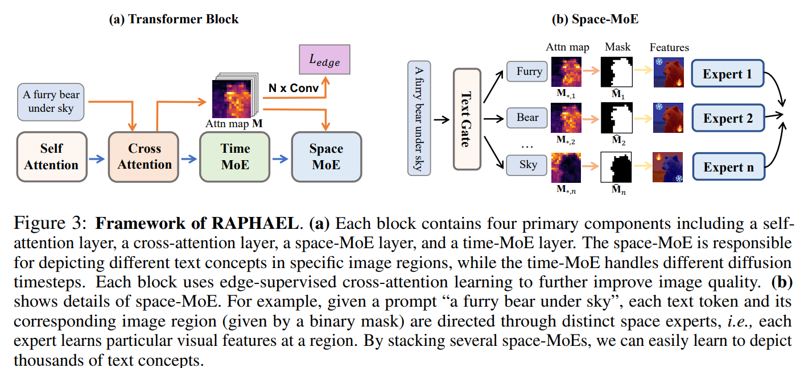
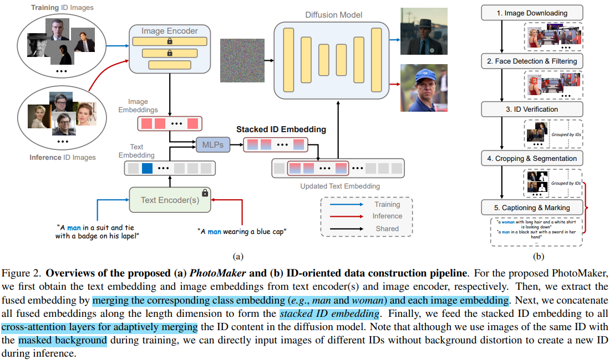

# ConsistentID: Portrait Generation with Multimodal Fine-Grained Identity Preserving

> "ConsistentID: Portrait Generation with Multimodal Fine-Grained Identity Preserving" Arxiv, 2024 Apr 25
> [paper](http://arxiv.org/abs/2404.16771v1) [code](https://github.com/JackAILab/ConsistentID) [pdf](./2024_04_Arxiv_ConsistentID--Portrait-Generation-with-Multimodal-Fine-Grained-Identity-Preserving.pdf) [note](./2024_04_Arxiv_ConsistentID--Portrait-Generation-with-Multimodal-Fine-Grained-Identity-Preserving_Note.md)
> Authors: Jiehui Huang, Xiao Dong, Wenhui Song, Hanhui Li, Jun Zhou, Yuhao Cheng, Shutao Liao, Long Chen, Yiqiang Yan, Shengcai Liao, Xiaodan Liang

## Key-point

- Task: personalized facial generation
- Problems
  - challenges in achieving high-fidelity and detailed identity (ID) consistency, primarily due to **insufficient fine-grained control over facial areas**
  - lack of a comprehensive strategy for ID preservation by fully **considering intricate facial details**

- :label: Label:

## Contributions

> ConsistentID comprises two key components: a multimodal facial prompt generator that combines facial features, corresponding facial descriptions and the overall facial context to enhance precision in facial details, and an ID-preservation network optimized through the facial attention localization strategy, aimed at preserving ID consistency in facial regions. 

- a multimodal facial prompt generator **融合多种 ID 特征信息，关注融合模块**

  - 文本 extracted from multimodal large language model LLaVA1.5

  > fine-grained multimodal feature extractor and a facial ID feature extractor

- ID-preservation network

  将 multimodal facial 融合模块提取到的特征，**按人脸区域提出一个策略进行融合**

> we feed them into the latter module, promoting ID consistency across each facial region via the facial attention localization strategy

- **Evaluation Framework**: one ID consistency **metrics; Dataset**, FGID, with over 500,00 facial images;

> over 500,000 facial images, offering greater diversity and comprehensiveness than existing public facial datasets.

- SOTA

## Introduction

### Text2Image

- GLIDE [30], DALL-E 2 [36], Imagen
- SD
- "eDiff-I: Text-to-Image Diffusion Models with an Ensemble of Expert Denoisers" Arxiv, 2022 Nov 2
  [paper](http://arxiv.org/abs/2211.01324v5) [code](https://deepimagination.cc/eDiff-I/) [pdf](./2022_11_Arxiv_eDiff-I--Text-to-Image-Diffusion-Models-with-an-Ensemble-of-Expert-Denoisers.pdf) [note](./2022_11_Arxiv_eDiff-I--Text-to-Image-Diffusion-Models-with-an-Ensemble-of-Expert-Denoisers_Note.md)
  Authors: Yogesh Balaji, Seungjun Nah, Xun Huang, Arash Vahdat, Jiaming Song, Qinsheng Zhang, Karsten Kreis, Miika Aittala, Timo Aila, Samuli Laine, Bryan Catanzaro, Tero Karras, Ming-Yu Liu

**可以支持分割图输入 text2image model !!!**

- "RAPHAEL: Text-to-Image Generation via Large Mixture of Diffusion Paths"
  [paper](https://arxiv.org/pdf/2305.18295)

看 teaser 图生成文字的能力接近 SDXL

### personalized

在兼顾参考图的同时，生成一致 && 逼真的面部细节

> The primary challenge in customized facial generation lies in maintaining facial image consistency across different attributes based on one or multiple reference images, leading to two key issues: ensuring accurate identity (ID) consistency and achieving high-fidelity, diverse facial details

现有一些引入结构信息引导的方法，和参考图的一致性不好 :star:

> Current text-to-image models [41,49,51,56,60], despite incorporating structural and content guidance, face limitations in particularly concerning the fidelity of generated images to reference images

#### **Test-time finetune**

需要收集一些参考图作为训练数据，对需要测试的数据**继续微调训练模型**

>  the quality of the generated output depends on the quality of manually collected data
>
>  providing a set of target ID images for post-training

Dreambooth & Textual Inversion 去**微调可学习的文本 token**；每换一个测试数据，都要去调一次，训练成本太大了；

> Dreambooth and Textual Inversion fine-tune a special token S* to learn the concept during the fine-tuning stage.
>
> learning process time-consuming and limiting their practicality

- "Multi-Concept Customization of Text-to-Image Diffusion" CVPR, 2022 Dec 8, `CustomDiffusion`
  [paper](http://arxiv.org/abs/2212.04488v2) [code]() [pdf](./2022_12_CVPR_Multi-Concept-Customization-of-Text-to-Image-Diffusion.pdf) [note](./2022_12_CVPR_Multi-Concept-Customization-of-Text-to-Image-Diffusion_Note.md)
  Authors: Nupur Kumari, Bingliang Zhang, Richard Zhang, Eli Shechtman, Jun-Yan Zhu

finetune KV projection matrices

对比 DreamBooth 效果差不多。。。这个还是挑的

#### **Direct inference**

一次训练完，不需要再针对小数据每次再调，训练成本更低；

>  adopts a single-stage inference approach. These models enhance global ID consistency by either utilizing the image as a **conditional input or manipulating image-trigger words**.

- "IP-Adapter: Text Compatible Image Prompt Adapter for Text-to-Image Diffusion Models" Arxiv, 2023 Aug
  [paper](http://arxiv.org/abs/2308.06721v1) [code](https://ip-adapter.github.io) [pdf](./2023_08_Arxiv_IP-Adapter--Text-Compatible-Image-Prompt-Adapter-for-Text-to-Image-Diffusion-Models.pdf) [note](./2023_08_Arxiv_IP-Adapter--Text-Compatible-Image-Prompt-Adapter-for-Text-to-Image-Diffusion-Models_Note.md)
  Authors: Hu Ye, Jun Zhang, Sibo Liu, Xiao Han, Wei Yang

> The global control adapter of Uni-ControlNet also projects the image embedding from CLIP image encoder into condition embeddings by a small network and concatenates them with the original text embeddings

- "PhotoMaker: Customizing Realistic Human Photos via Stacked ID Embedding" Arxiv, 2023 Dec, `PhotoMaker`
  [paper](http://arxiv.org/abs/2312.04461v1) [code](https://photo-maker.github.io/) [note](./2023_12_Arxiv_PhotoMaker--Customizing-Realistic-Human-Photos-via-Stacked-ID-Embedding_Note.md) [pdf](./2023_12_Arxiv_PhotoMaker--Customizing-Realistic-Human-Photos-via-Stacked-ID-Embedding.pdf)
  Authors: (TencentARC) Zhen Li, Mingdeng Cao, Xintao Wang, Zhongang Qi, Ming-Ming Cheng, Ying Shan

**zero-shot**

- "StoryDiffusion: Consistent Self-Attention for Long-Range Image and Video Generation" Arxiv, 2024 May 2
  [paper](http://arxiv.org/abs/2405.01434v1) [code](https://github.com/HVision-NKU/StoryDiffusion) [pdf](./2024_05_Arxiv_StoryDiffusion--Consistent-Self-Attention-for-Long-Range-Image-and-Video-Generation.pdf) [note](./2024_05_Arxiv_StoryDiffusion--Consistent-Self-Attention-for-Long-Range-Image-and-Video-Generation_Note.md)
  Authors: Yupeng Zhou, Daquan Zhou, Ming-Ming Cheng, Jiashi Feng, Qibin Hou

- "ID-Animator: Zero-Shot Identity-Preserving Human Video Generation" Arxiv, 2024 Apr 23
  [paper](http://arxiv.org/abs/2404.15275v1) [code](https://github.com/ID-Animator/ID-Animator.) [pdf](./2024_04_Arxiv_ID-Animator--Zero-Shot-Identity-Preserving-Human-Video-Generation.pdf) [note](./2024_04_Arxiv_ID-Animator--Zero-Shot-Identity-Preserving-Human-Video-Generation_Note.md)
  Authors: Xuanhua He, Quande Liu, Shengju Qian, Xin Wang, Tao Hu, Ke Cao, Keyu Yan, Man Zhou, Jie Zhang

- "LeftRefill: Filling Right Canvas based on Left Reference through Generalized Text-to-Image Diffusion Model" CVPR, 2023 May 19
  [paper](http://arxiv.org/abs/2305.11577v3) [code](https://github.com/ewrfcas/LeftRefill) [pdf](./2023_05_Arxiv_LeftRefill--Filling-Right-Canvas-based-on-Left-Reference-through-Generalized-Text-to-Image-Diffusion-Model.pdf) [note](./2023_05_Arxiv_LeftRefill--Filling-Right-Canvas-based-on-Left-Reference-through-Generalized-Text-to-Image-Diffusion-Model_Note.md)
  Authors: Chenjie Cao, Yunuo Cai, Qiaole Dong, Yikai Wang, Yanwei Fu

### 融合 multi-modal 信息

- "AnyText: Multilingual Visual Text Generation And Editing" ICLR-Spotlight, 2023 Nov
  [paper](http://arxiv.org/abs/2311.03054v4) [code](https://github.com/tyxsspa/AnyText) [pdf](./2023_11_ICLR_AnyText--Multilingual-Visual-Text-Generation-And-Editing.pdf) [note](./2023_11_ICLR_AnyText--Multilingual-Visual-Text-Generation-And-Editing_Note.md)

  Authors: (Alibaba Group) Yuxiang Tuo, Wangmeng Xiang, Jun-Yan He, Yifeng Geng, Xuansong Xie

### ID-consistency

多主体只使用一个 prompt 出现 ID 一致性问题，适用有多个人物的参考图像的情况

- "Fastcomposer: Tuning free multi-subject image generation with localized attention"
  [paper](https://arxiv.org/abs/2305.10431)

**小结**

- Test-time finetune 方法需要制作一个高质量的小数据集，在上面微调模型，制作数据要求高；
- Direst inference 一次训练完，之后直接推理；但先前方法基于 image condition && 训练文本 token，忽略了人脸一些细节特征，本文一致性看几个 example 稍稍好一些

Direct inference 方法一次训完，**主体一致性差了贼多**，发现是先前方法**没有利用好人脸特征**

> However, we observe that fine-grained facial features are not fully considered in the training process, easily leading to ID inconsistency or lower image quality

## methods

**对泛化的文本进行增强，初始的太泛化**

- 给图到 LLaVA1.5 **增加细节区域的文本描述**
- 分割图直接给到 Image Encoder

### Text Embedding

大致文本：输入 LLM 的文本 prompt 针对目标物体细节细化，增加 `including face, ears, eyes, nose, and mouth  `:star:

> we input the entire facial image into the Multimodal Large Language Model (MLLM) LLaVA1.5 [23] using the command prompt ‘Describe this person’s facial features, including face, ears, eyes, nose, and mouth

将上述文本**每个部位（face, ears）的 prompt 换为 `delimiter ‘<facial>’`**  ，之后和大致文本 concat 起来

>  Subsequently, we replace the words ‘face, ears, eyes, nose, and mouth’ in these feature-level descriptions with the delimiter ‘’ and concatenate them with the captions of the entire facial image.

推断：使用更精确的文本描述 & 图像特征，ID 一致性问题说是很大缓解

> effectively mitigates ID inconsistency issues in facial details

- **Q：多个 modality 的人脸特征、文本特征怎么融合？**

参考先前工作使用 BiSeNet 提取人脸特征

> Following the previous method [15, 18, 21, 48, 58, 59],we employ the pre-trained face model BiSeNet [57] to extract segmentation masks of facial areas, encompassing eyes, nose, ears, mouth, and other regions, from the entire face

**FaceEncoder 对 text-embedding 和 ID-embedding 融合**

和文本融合时候，**使用 visual token replace 处理 ，前面的 delimiter 换掉**:star:

- Q：分割图用什么 Image Encoder 提取特征？

### Face embedding

提升 ID 细节特征，想要针**对细节人脸区域再增强一下特征**

> To enrich the ID-preservation information, we delve into more fine-grained facial features, including eye gaze, earlobe characteristics, nose shape, and others.

先前方法发现单纯只有 text 或 图像特征，没法保留人脸细节特征！之后 IP-Adapter 尝试对**图像特征 和 text 特征分别用各自 cross-attention 处理**

> IP-Adapter makes the initial attempt to simultaneously inject multimodal information through two distinct decoupled cross-attention mechanisms, it overlooks ID information from crucial facial regions

- Q：怎么用两个 cross-atten ?

framework 模块B：用 CLIP & IP-Adapter 特征提取器提取特征；

 projection module **用 IPA-FaceID-Plus 模块训练一下，对提取的两个特征融合**

> pre-trained CLIP image encoder and the pre-trained face model from the specialized version of the IP-Adapter [56] model, IPA-FaceID-Plus
>
> a lightweight projection module, with parameters initialized by IPA-FaceID-Plus

### ID-Preservation network

- Q：先前工作发现由于 visual token 比较复杂， **visual prompts 只提供了粗粒度的控制**

> visual prompts alone often provide only coarse-grained control due to the semantic fuzziness of visual tokens.

模仿 IP-Adapter **使用 cross-attn 方式将特征注入 UNet**

> To solve this, we follow the IP-Adapter and integrate fine-grained multimodal ID prompts and overall ID prompts into the UNet model through the cross-attention module to achieve precise ID preservation

**参考 Fastcomposer， 利用人脸 mask找到 attn-map 对应的的区域, 并修改人脸区域对应的 attention map** 

> Motivated by Fastcomposer [54], we introduce an ID-consistent network to maintain consistency in local ID features by **directing the attention of facial features** to align with the corresponding facial regions. 
>
> Let P \in [0, 1]^{h \times w \times n} represent the cross-attention map that connects latent pixels to multimodal conditional embeddings at each layer, where P[i, j, k] signifies the attention map from the k-th conditional token to the (i, j) latent pixel. Ideally, the attention maps of facial region tokens should focus exclusively on facial feature areas, preventing the blending of identities between facial features and averting propagation to the entire facial image

- $P_i = P[:, :, i] \in [0, 1]^{h \times w}$ denote the cross-attention map
- M 为 mask; I 为前面替换 delimiter 的人脸部位的特征 token

希望每个部位对应的特征，在 attention map Pi 中的特征与学习到的 facial token 一致

> To achieve this, we introduce m_{j} and apply it to P_{i_j} to obtain its corresponding activation region, aligning with the segmentation mask m_{j} of the j-th facial feature token.

优化 cross-attention map and the segmentation mask 距离？？

> a balanced L1 loss is employed to minimize the distance between the cross-attention map and the segmentation mask

- "Fastcomposer: Tuning free multi-subject image generation with localized attention"
  [paper](https://arxiv.org/abs/2305.10431)

### Dataset

Our FGID dataset, comprising 525,258 images is a **compilation from diverse public datasets** such as FFHQ [17], CelebA [27], SFHQ [2], etc, including about 524,000 training data.

-  MLLM LLaVA1.5 is utilized to extract detailed information using an embedded prompt ‘Please describe the people in the image, including their gender, age, clothing, facial expressions, and any other distinguishing features’. 
- **Visual Data**: BiSeNet [57] and InsightFace [7] models are deployed to capture both whole-face ID information and facial feature information, ensuring comprehensive identity details.

## Exp Setting

- text prompt: LLaVA1.5

- 分割图: BiSeNet

- SDv1.5

- image feature

  CLIP-ViT-H [44] and utilize its image projection layers to initialize the learnable projection in the overall facial ID feature extractor

- 8x 3090, batchsize=16; LR=$ 1 \times 10^{-4} .$ ; Adam

metrics

- CLIP-I [8], CLIP-T [35], DINO [6], FaceSim [43], FID [10], and inference speed

训练策略

- probabilistically remove 50% of the background information from the characters with a 50% probability to mitigate interference
-  there is a 10% chance of replacing the original updated text embedding with a zero text embedding
- utilize a 50-step DDIM [45] sampler
- employ delayed topic conditioning [17, 54] to resolve conflicts between text and ID conditions ？？？

## Experiment

> ablation study 看那个模块有效，总结一下

主观效果和 InstantID 差不多，**至少比 IP-Adapter 好**，验证了这么提取更多人脸特征 && 修改 cross-attn map && 增强文本 prompt 能提升一些 ID 一致性

**stylization and action instruction**

**user study**

**ablation: 对比 ablation study**

ID 一致性优于 IP-Adapter

- **更新 cross-attn map 有必要！**
- 使用更细节的特征能提升一些主观效果

## Limitations

- 推理很慢 16s 一张图

## Summary :star2:

> learn what & how to apply to our task

- **主观效果和 InstantID 差不多**，至少比 IP-Adapter 好，验证了这么提取更多人脸特征 && 修改 cross-attn map && 增强文本 prompt 能提升一些 ID 一致性

  - 验证修改 cross-attn map 一起优化能够提升性能

- visual prompt 获取

  - 可学习的 query 融合 ID 特征 && 用 FFN 处理一下 :star:

  - 和文本融合时候，**使用 visual token replace 处理** :star:

- 先前工作发现由于 visual token 比较复杂， **visual prompts 只提供了粗粒度的控制**

> How to apply to our work? :star:

-  Q：发现传统 cross-attn map 倾向于处理图像整体区域，导致细节特征的丢失？

> This optimization strategy is derived from the **observation that traditional cross-attention maps tend to simultaneously focus on the entire image,** posing a challenge in maintaining ID features during the generation of **facial regions.**

**多主体 or 多区域**只使用一个 prompt 出现 ID 一致性问题，**适用有多个物体想要补充细节的情况**

- "Fastcomposer: Tuning free multi-subject image generation with localized attention"
  [paper](https://arxiv.org/abs/2305.10431)

