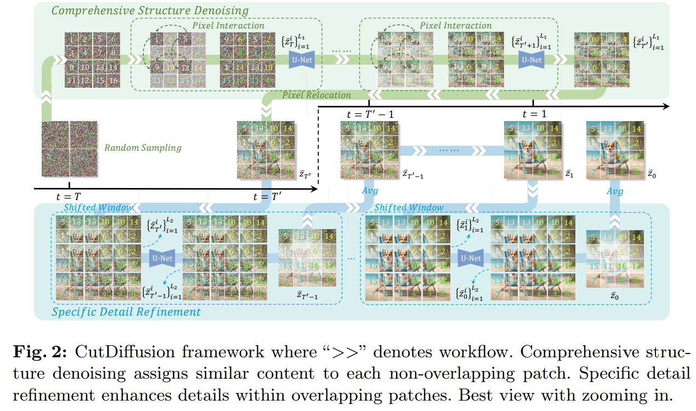

# CutDiffusion: A Simple, Fast, Cheap, and Strong Diffusion Extrapolation Method

> "CutDiffusion: A Simple, Fast, Cheap, and Strong Diffusion Extrapolation Method" Arxiv, 2024 Apr 23
> [paper](http://arxiv.org/abs/2404.15141v1) [code]() [pdf](./2024_04_Arxiv_CutDiffusion--A-Simple--Fast--Cheap--and-Strong-Diffusion-Extrapolation-Method.pdf) [note](./2024_04_Arxiv_CutDiffusion--A-Simple--Fast--Cheap--and-Strong-Diffusion-Extrapolation-Method_Note.md)
> Authors: Mingbao Lin, Zhihang Lin, Wengyi Zhan, Liujuan Cao, Rongrong Ji

## Key-point

- Task
- Problems
- :label: Label:

## Contributions

## Introduction

## methods

## setting

## Experiment

> ablation study 看那个模块有效，总结一下

## Limitations

## Summary :star2:

> learn what

### how to apply to our task

