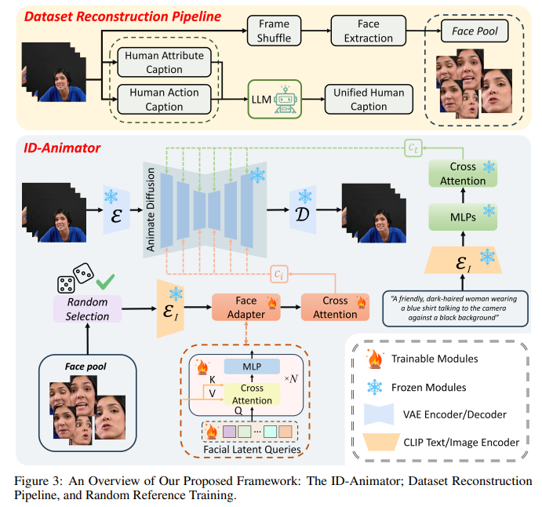

# ID-Animator: Zero-Shot Identity-Preserving Human Video Generation

> "ID-Animator: Zero-Shot Identity-Preserving Human Video Generation" Arxiv, 2024 Apr 23
> [paper](http://arxiv.org/abs/2404.15275v1) [code](https://github.com/ID-Animator/ID-Animator.) [pdf](./2024_04_Arxiv_ID-Animator--Zero-Shot-Identity-Preserving-Human-Video-Generation.pdf) [note](./2024_04_Arxiv_ID-Animator--Zero-Shot-Identity-Preserving-Human-Video-Generation_Note.md)
> Authors: Xuanhua He, Quande Liu, Shengju Qian, Xin Wang, Tao Hu, Ke Cao, Keyu Yan, Man Zhou, Jie Zhang

## Key-point

- Task
- Problems
- :label: Label:

## Contributions

## Introduction

## methods

## Experiment

> ablation study 看那个模块有效，总结一下

## Limitations

## Summary :star2:

> learn what & how to apply to our task

