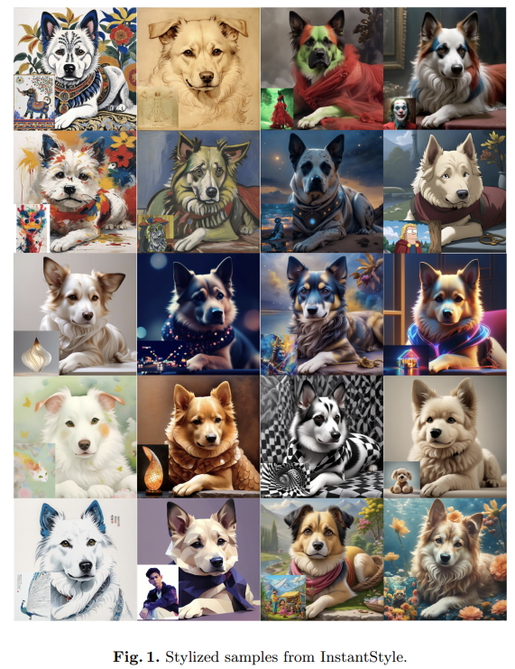
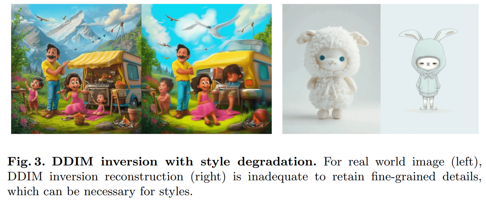
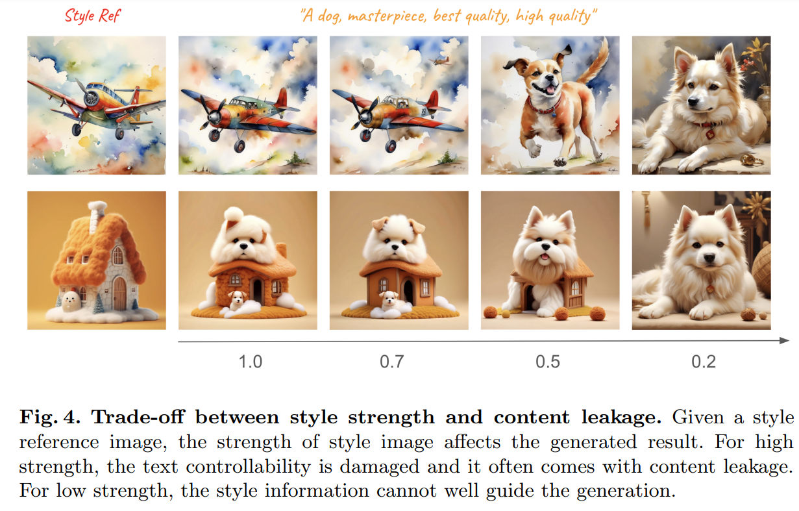
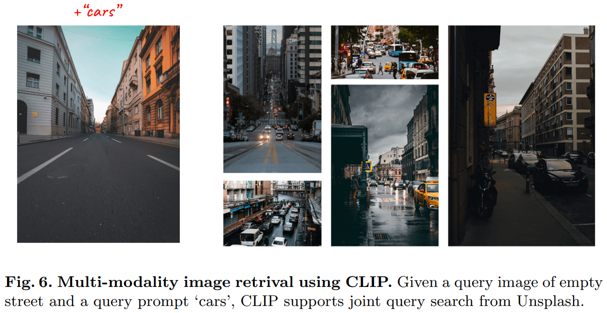
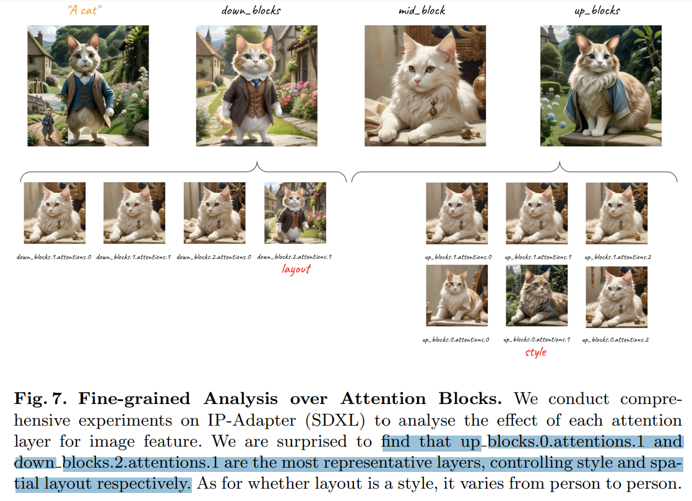
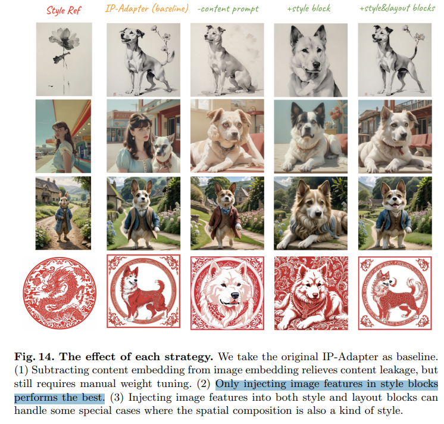

# InstantStyle: Free Lunch towards Style-Preserving in Text-to-Image Generation

> "InstantStyle: Free Lunch towards Style-Preserving in Text-to-Image Generation" Arxiv, 2024 Apr 3
> [paper](http://arxiv.org/abs/2404.02733v2) [code](https://github.com/InstantStyle/InstantStyle) [pdf](./2024_04_Arxiv_InstantStyle--Free-Lunch-towards-Style-Preserving-in-Text-to-Image-Generation.pdf) [note](./2024_04_Arxiv_InstantStyle--Free-Lunch-towards-Style-Preserving-in-Text-to-Image-Generation_Note.md)
> Authors: Haofan Wang, Matteo Spinelli, Qixun Wang, Xu Bai, Zekui Qin, Anthony Chen

## Key-point

- Task: 风格迁移

- Problems

  - 风格的概念有很多，例如颜色，材质。。没被研究过

  - inversion 方法会损失物体细节

    >  inversionbased methods are prone to style degradation, often resulting in the loss of fine-grained details. 

  - adapter-based 训练耗时

    > adapter-based approaches frequently require meticulous weight tuning for each reference image

- :label: Label:

## Contributions

- 解耦 style & 物体特征

> A straightforward mechanism that decouples style and content from reference images within the feature space

- 只把 reference 特征注入 UNet 负责 style 的层，避免无效 finetune，style-leak

  > The injection of reference image features exclusively into style-specific blocks, thereby preventing style leaks and eschewing the need for cumbersome weight tuning

- 

## Introduction

**DDIM inversion 会出现细节丢失的问题 :star:，对 style 的保留倒是很好**

> For real world image (left), DDIM inversion reconstruction (right) is inadequate to retain fine-grained details, which can be necessary for styles.

reference 引导和 reference 内容泄露（生成的图中很明显） 存在一个 trade-off

### CLIP-feature

**CLIP 特征相加减居然还是有语义的！**

> Don’t forget that CLIP’s feature space has good compatibility, and features in the same feature space can be added and subtracted, as shown in Figure 6. 

### UNet blocks effect

> The impact of different blocks is not equal

发现 UNet 有 2 个 block 对于 layout 的生成作用很显著

> We are surprised to find that `up blocks.0.attentions.1` and `down blocks.2.attentions.1` are the most representative layers, controlling style and spatial layout respectively. 

## methods

## setting

## Experiment

> ablation study 看那个模块有效，总结一下

## Limitations

## Summary :star2:

> learn what

- **DDIM inversion 会出现细节丢失的问题 :star:，对 style 的保留倒是很好**

  > For real world image (left), DDIM inversion reconstruction (right) is inadequate to retain fine-grained details, which can be necessary for styles.

  

- 发现 UNet 有 2 个 block 对于 layout 的生成作用很显著

  > We are surprised to find that `up blocks.0.attentions.1` and `down blocks.2.attentions.1` are the most representative layers, controlling style and spatial layout respectively. 

  

### how to apply to our task

