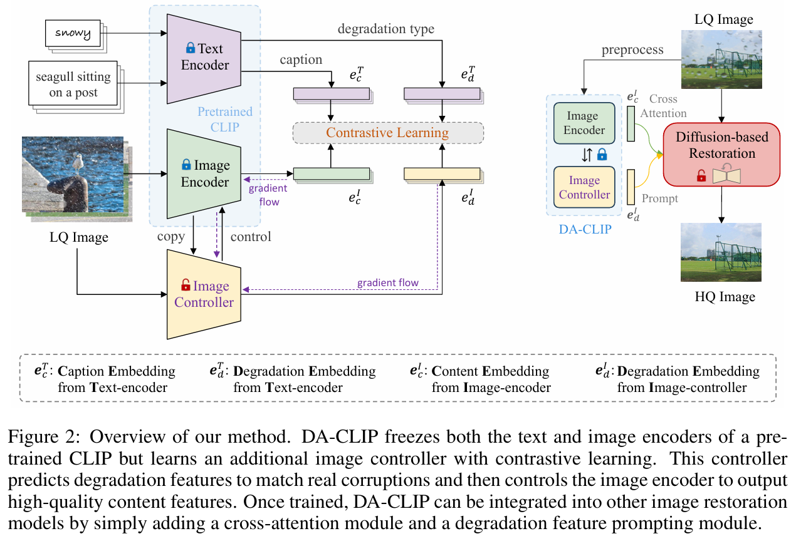
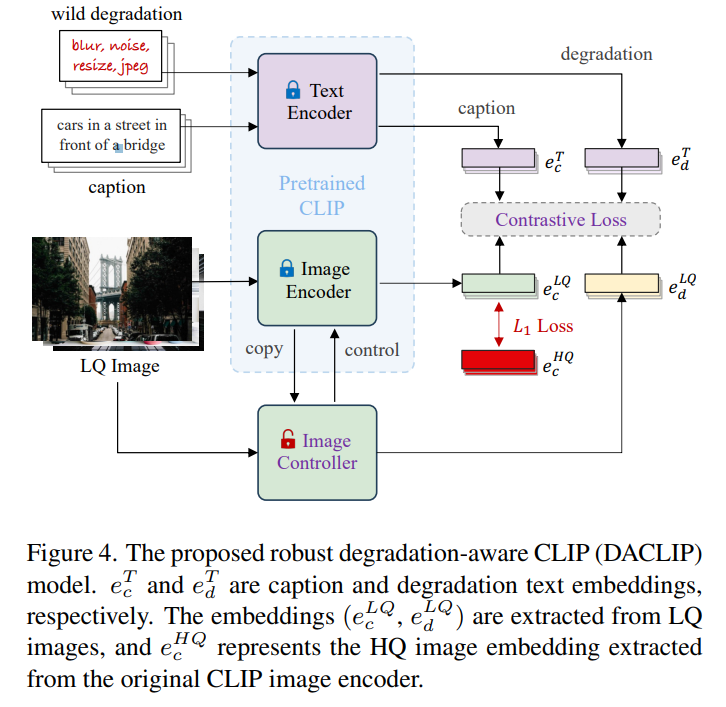
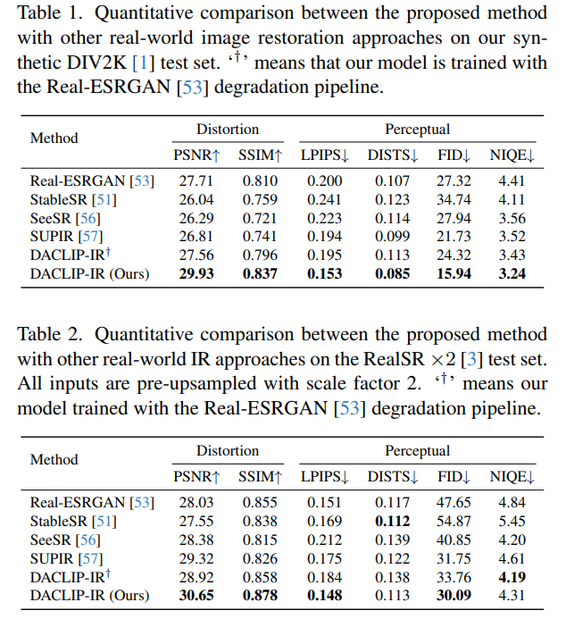
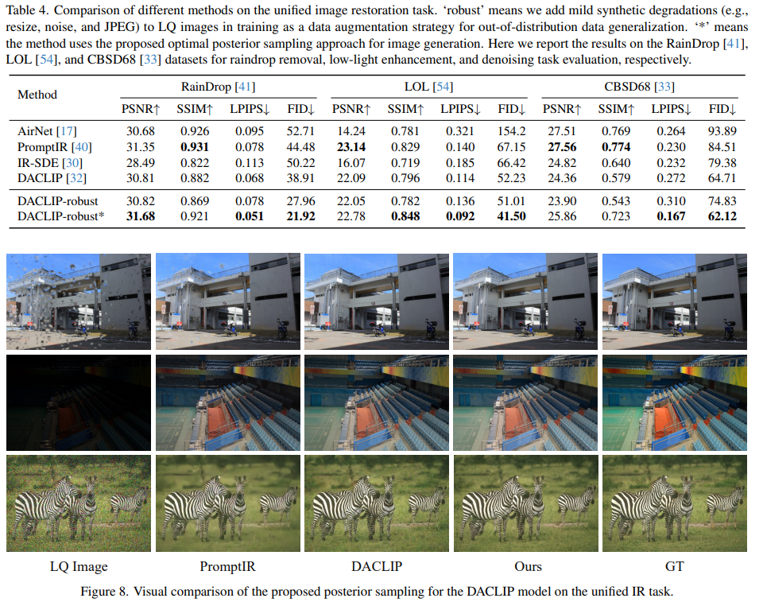

# Photo-Realistic Image Restoration in the Wild with Controlled Vision-Language Models

> "Photo-Realistic Image Restoration in the Wild with Controlled Vision-Language Models" Arxiv, 2024 Apr 15, `DA-CLIP-robust` 
> [paper](http://arxiv.org/abs/2404.09732v1) [code]() [pdf](./2024_04_Arxiv_Photo-Realistic-Image-Restoration-in-the-Wild-with-Controlled-Vision-Language-Models.pdf) [note](./2024_04_Arxiv_Photo-Realistic-Image-Restoration-in-the-Wild-with-Controlled-Vision-Language-Models_Note.md)
> Authors: Ziwei Luo, Fredrik K. Gustafsson, Zheng Zhao, Jens Sjölund, Thomas B. Schön

## Key-point

- Task
- Problems
- :label: Label:

DA-CLIP robust 版本

## Contributions

- 数据DA 

  > present a new synthetic image generation pipeline

- we modify DACLIP to reduce the embedding distance of LQ-HQ pairs

-  propose a posterior sampling strategy for IRSDE [30] and show that it is the optimal reverse-time path,

## Introduction

- "Controlling Vision-Language Models for Multi-Task Image Restoration" ICLR, 2023 Oct 2
  [paper](http://arxiv.org/abs/2310.01018v2) [code](https://github.com/Algolzw/daclip-uir.) [pdf](./2023_10_ICLR_Controlling-Vision-Language-Models-for-Multi-Task-Image-Restoration.pdf) [note](./2023_10_ICLR_Controlling-Vision-Language-Models-for-Multi-Task-Image-Restoration_Note.md)
  Authors: Ziwei Luo, Fredrik K. Gustafsson, Zheng Zhao, Jens Sjölund, Thomas B. Schön

## methods

原始 DA-CLIP

本文在原始 DA-CLIP 上，**增加一个 L1 Loss**

原始 DA-CLIP 的模型 ViT-B-32

> The base CLIP model uses **ViT-B-32** as the backbone for its image encoder, with weights pretrained on the LAION-2B dataset (Schuhmann et al., 2022). Built upon it, we fine-tune the DA-CLIP on the mixed degradation dataset with a batch size of 3136 (784 × 4) and learning rate 3 × 10−5.

**这里更换更大的模型，换为 ViT-L-14**

> Specifically, we first generate clean captions using HQ images and then train the ViT-L-14 (rather than ViT-B-32 in DACLIP) based on the synthetic image-caption-degradation pairs, where the LQ images are generated following the pipeline in Fig. 2.

对于 wild degradation，舍弃 controlnet 的 degradation embedding

> we thus abandon the use of degradation embeddings for wild image restoration

## setting

- baseline

  > We use IR-SDE [30] for realistic image generation and insert the image content embedding into the U-Net via cross-attention [44], analogously to what was done in [32].

> All models are implemented with PyTorch [38] and trained on a single A100 GPU for about 3-4 days.

## Experiment

> ablation study 看那个模块有效，总结一下

对比原始 DA-CLIP 提升蛮明显的

不用 post sampling，效果和原始 DA-CLIP 差不多。。。

## Limitations

## Summary :star2:

> learn what

### how to apply to our task

