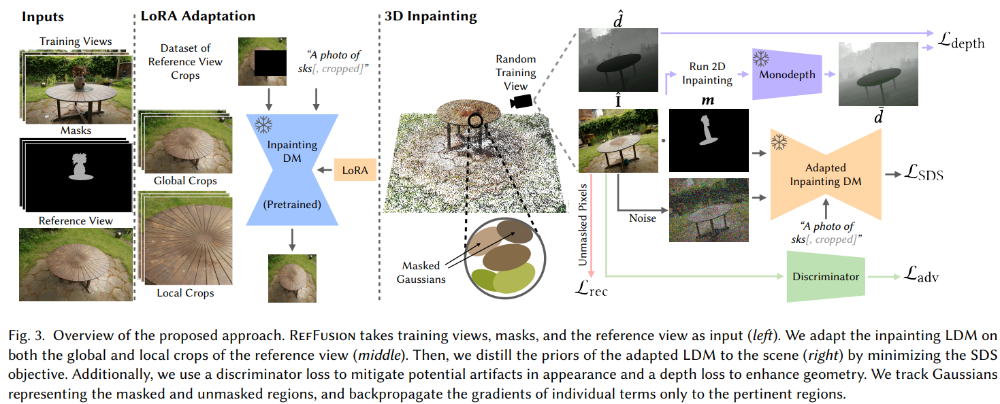

# RefFusion: Reference Adapted Diffusion Models for 3D Scene Inpainting

> "RefFusion: Reference Adapted Diffusion Models for 3D Scene Inpainting" Arxiv, 2024 Apr 16
> [paper](http://arxiv.org/abs/2404.10765v1) [code]() [pdf](./2024_04_Arxiv_RefFusion--Reference-Adapted-Diffusion-Models-for-3D-Scene-Inpainting.pdf) [note](./2024_04_Arxiv_RefFusion--Reference-Adapted-Diffusion-Models-for-3D-Scene-Inpainting_Note.md)
> Authors: Ashkan Mirzaei, Riccardo De Lutio, Seung Wook Kim, David Acuna, Jonathan Kelly, Sanja Fidler, Igor Gilitschenski, Zan Gojcic

## Key-point

- Task
- Problems
- :label: Label:

## Contributions

## Introduction

## methods

## Experiment

> ablation study 看那个模块有效，总结一下

## Limitations

## Summary :star2:

> learn what & how to apply to our task

