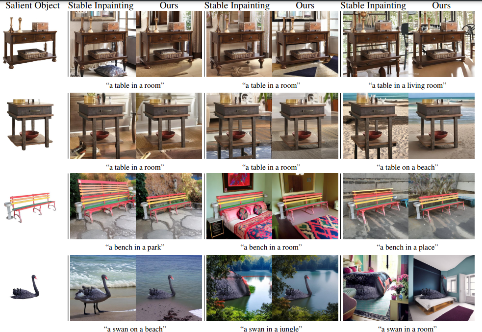
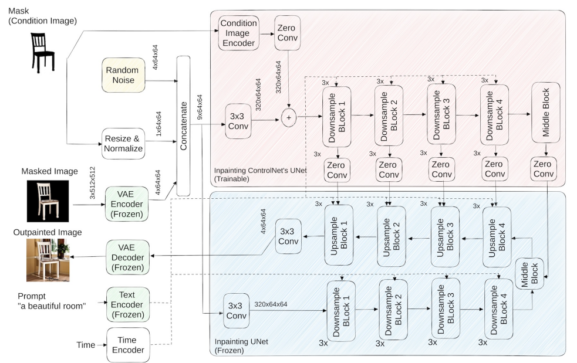

# Salient Object-Aware Background Generation using Text-Guided Diffusion Models

> "Salient Object-Aware Background Generation using Text-Guided Diffusion Models" CVPR-workshop, 2024 Apr 15
> [paper](http://arxiv.org/abs/2404.10157v1) [code]() [pdf](./2024_04_CVPR-workshop_Salient-Object-Aware-Background-Generation-using-Text-Guided-Diffusion-Models.pdf) [note](./2024_04_CVPR-workshop_Salient-Object-Aware-Background-Generation-using-Text-Guided-Diffusion-Models_Note.md)
> Authors: Amir Erfan Eshratifar, Joao V. B. Soares, Kapil Thadani, Shaunak Mishra, Mikhail Kuznetsov, Yueh-Ning Ku, Paloma de Juan

## Key-point

- Task: image completion, Generating background scenes 生成背景

- Problems

  -  object expansion 问题：**原始物体在 outpainting 后不一致**

    > inpainting models frequently extend the salient object’s boundaries and thereby change the object’s identity

  

- :label: Label: SDv2, inpaint

本工作针对**静态物体改进，抠出来物体，生成背景**，生成内容比 outpaint 多

> introduces a model for adapting inpainting diffusion models to the salient object outpainting task using Stable Diffusion and ControlNet architectures.

效果比 SDv2 在指标上好 3.6x

## Contributions

- A novel study of diffusion-based inpainting models applied to salient object-aware background generation.
- SOTA

## Introduction

## methods

训练了一个 ControlNet 接收 condition，很标准的 ControlNet

**生成物体的 mask：用预训练的分割模型拿到一个 mask，从里面取点输入 SAM**

## Experiment

> ablation study 看那个模块有效，总结一下

### setting

> Stable Diffusion v2-base [40], referred to as SD2, was initially trained for 550k steps at 256×256 pixel resolution on a subset of LAION-5B && 512 x 512 pixel resolution, resulting in more detailed and visually appealing images.
>
> Stable Diffusion v2-inpainting is built on top of SD2 and trained for an additional 200k steps

trained on 8 NVIDIA V100 GPUs

We use ground truth captions for COCO and **obtain the captions for the salient objects datasets using BLIP-2** 

salient object segmentation datasets

- CSSD [50], ECSSD [38], DIS5k [31], DUTS [44], DUT-OMRON [51], HRSOD [52], MSRA-10k [4], MSRA-B [43], and XPIE

  背景不够丰富，加上 COCO

- COCO

## Limitations

## Summary :star2:

> learn what & how to apply to our task

- **生成物体的 mask：用预训练的分割模型拿到一个 mask，从里面取点输入 SAM**

  

- `SI2 + ControlNet` 效果比 `SD2 + ControlNet` 好一些

  

