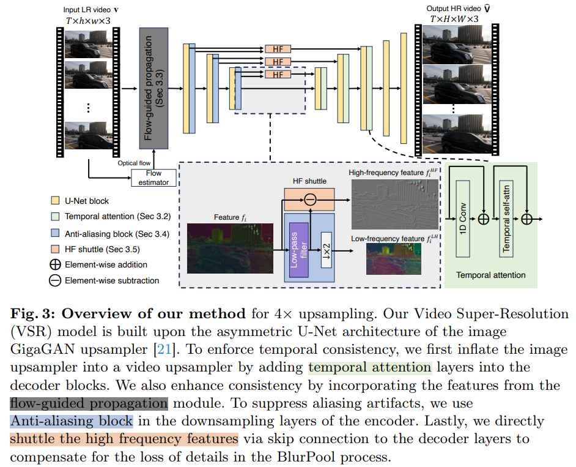

# VideoGigaGAN: Towards Detail-rich Video Super-Resolution

> "VideoGigaGAN: Towards Detail-rich Video Super-Resolution" ECCV, 2024 Apr 18 
> [paper](http://arxiv.org/abs/2404.12388v2) [code](https://github.com/danaigc/videoGigaGanHub) :warning: [web](https://videogigagan.github.io/) [pdf](./2024_04_ECCV_VideoGigaGAN--Towards-Detail-rich-Video-Super-Resolution.pdf) [note](./2024_04_ECCV_VideoGigaGAN--Towards-Detail-rich-Video-Super-Resolution_Note.md)
> Authors: Yiran Xu, Taesung Park, Richard Zhang, Yang Zhou, Eli Shechtman, Feng Liu, Jia-Bin Huang, Difan Liu(Adobe)

## Key-point

- Task: VSR
- Problems
  - This raises a fundamental question: can we extend the success of a generative image upsampler to the VSR task while preserving the temporal consistency?

- :label: Label:

> VideoGigaGAN builds upon a large-scale image upsampler – GigaGAN

## Contributions

## Introduction

### ImageGigaGAN

- "Scaling up GANs for Text-to-Image Synthesis" CVPR, 2023 Mar 9,`GigaGAN`
  [paper](http://arxiv.org/abs/2303.05511v2) [code](https://github.com/lucidrains/gigagan-pytorch) [pdf](./2023_03_CVPR_Scaling-up-GANs-for-Text-to-Image-Synthesis.pdf) [note](./2023_03_CVPR_Scaling-up-GANs-for-Text-to-Image-Synthesis_Note.md)
  Authors: Minguk Kang, Jun-Yan Zhu, Richard Zhang, Jaesik Park, Eli Shechtman, Sylvain Paris, Taesung Park

## methods

- 在 UNet decoder 加 temporal attention

- 加 flow-guided propagation

- 有伪影，在 Encoder Downsample 模块加 anti-aliasing block

- 细节不足？提取高频特征作为残差，导入 Decoder :star:

  > Lastly, we directly shuttle the high frequency features via skip connection to the decoder layers to compensate for the loss of details in the BlurPool process.

### alias

> In the GigaGAN upsampler, the downsampling operation in the encoder is achieved by strided convolutions with a stride of 2. To address the aliasing issue in our output video, we apply BlurPool layers to replace all the strided convolution layers in the upsampler encoder inspired by [61].
>
> - "Making convolutional networks shift-invariant again. "

把 Conv stride=2 的下采样模块，替换为 BlurPool

### Flow-guided

光流显存占用比 Conv3D少

> The temporal modules alone are insufficient to ensure temporal consistency, mainly due to the high memory cost of the 3D layers.

- Q：视频 Temporal 分块，分别做 Temporal Attn -> 闪烁？

T block 做 temporal attn 的时间片段短，对于较大的 motion 效果烂

> For input videos with long sequences of frames, one could partition the video into small, non-overlapping chunks and apply temporal attention. However, this leads to temporal flickering between different chunks. 
>
> Even within each chunk, the spatial window size of the temporal attention is limited, meaning a large motion (i.e., exceeding the receptive field) cannot be modeled by the attention module (see Fig. 5).

使用 Optical flow 能降低噪声

只加 temporal attention LPIPS 指标高，但 FVD 时序一致性很烂

### High-frequency shuttle

> We present a simple yet effective approach to address the conflict of highfrequency details and temporal consistency, called high-frequency shuttle (HF shuttle)

对于一个尺度的特征，分解高低频特征

> More specifically, at the feature resolution level i, we decompose the feature map fi into low-frequency (LF) feature and high-frequency (HF) components.

对特征过 Low-pass filter -> 低频特征；再与原始特征相减得到高频特征；
把高频特征作为 residual 传到 UNet decoder

> while the HF feature map is computed from the residual as f HF i = fi − f LF
>
> The HF feature map f HF i containing high-frequency details are injected through the skip connection to the decoder (Fig. 3). 

## setting

没有和 diffusion 的模型对比

> At this point we cannot include Upscale-AVideo [63] since there is no available code.

### Loss

视频逐帧计算 loss ，每一帧的 loss 取平均作为最终的 loss

## Experiment

> ablation study 看那个模块有效，总结一下

- PSNR 对于模糊的图像指标更高！比较 LPIPS 主观指标

> PSNR does not align well with human perception and favor blurry results
>
>  Compared to previous VSR approaches, our model can produce more realistic textures and more fine-grained details.

只比较了 PSNR，LPIPS，FVD

## Limitations

推理慢，参数量多

## Summary :star2:

> learn what

### how to apply to our task

- Q：参考一下高低频特征如何提取？

low-pass filter 获取低频特征，参考下 free-noise；

与原始特征相减得到高频特征
