# Inf-DiT: Upsampling Any-Resolution Image with Memory-Efficient Diffusion Transformer

> "Inf-DiT: Upsampling Any-Resolution Image with Memory-Efficient Diffusion Transformer" ECCV, 2024 May 7
> [paper](http://arxiv.org/abs/2405.04312v2) [code](https://github.com/THUDM/Inf-DiT) [pdf](./2024_05_Arxiv_Inf-DiT--Upsampling-Any-Resolution-Image-with-Memory-Efficient-Diffusion-Transformer.pdf) [note](./2024_05_Arxiv_Inf-DiT--Upsampling-Any-Resolution-Image-with-Memory-Efficient-Diffusion-Transformer_Note.md)
> Authors: Zhuoyi Yang, Heyang Jiang, Wenyi Hong, Jiayan Teng, Wendi Zheng, Yuxiao Dong, Ming Ding, Jie Tang

## Key-point

- Task: `ultra-high-resolution SR`

- Problems

  - 大分辨率图显存爆掉

    > quadratic increase in memory during generating ultra-high-resolution images(e.g. 4096 × 4096), the resolution of generated images is often limited to 1024 ×1024 .

  - global dependencies 各个 patch 全局一致性

- :label: Label: `ultra-high-resolution SR` 


## Contributions

- propose Unidirectional Block Attention (UniBA) 实现全局一致性 & 降低推理时候的显存占用

  4096x4096 每次只预测 1/16 居然可以保持全局一致性很牛逼

- 训练了一个 DiT 实现多分辨率（没说是任意分辨率很严谨）& SOTA

  >  adopt the DiT structure for upsampling and develop an infinite super-resolution model capable of upsampling images of **various shapes and resolutions**.

- 设计了多种 tricks 维持局部 & 全局一致性

  > design multiple techniques to further enhance local and global consistency, and offer a zero-shot ability for flexible text control


## Introduction

**强调最大的问题是显存占用！**

- Q：ultra-high-resolution images 显存限制不好生成？

> 行文：说问题，再说一下衍生出来的应用上的受限

先前方法 **cascaded generation**, DALLE2, Imagen 通过此方法生成 1024 分辨率的图像

> first produces a low-resolution image, then applies multiple upsampling models to increase the image’s resolution step by step. This approach breaks down the generation of high-resolution images into multiple tasks. Based on the results generated in the previous stage, the models in the later stages only need to perform local generation.

- "Cascaded diffusion models for high fidelity image generation"

- Q：什么是 cascaded generation？

TODO


- Q：最大的问题是显存限制，没法搞超大分辨率图像

> The biggest challenge for upsampling to much higher resolution images is the significant GPU memory demands

推理都要 80G 不好搞，训练要存储梯度，需要更大显存

> Specifically, generating a 4096×4096 resolution image, which comprises over 16 million pixels requires more than 80GB of memory, exceeding the capacities of standard RTX 4090 or A100 graphics cards. Furthermore, the process of training models for high-resolution image generation exacerbates these demands, as it necessitates additional memory for storing gradients, optimizer states, etc

- Q：降低显存方式？

LDM 使用 VAE 转换到 latent 处理，但**过高的压缩比导致信息丢失很严重**；

如果为了显存继续提升 f 压缩比，质量会更烂


- Q：先前方式都是整张图去训练，推理为啥一定就要这么搞？:star:

提出 UniBA 保持多个 block 的一致性，**维持 global consistency**

> propose a Unidirectional Block Attention (UniBA) algorithm that can dramatically reduce the space complexity of gen
>
> 分析下时间复杂度 $O(N^2) \to O(N)$

还有一些 tricks **维持 local consistency**

>  design several techniques including providing **global image embedding** to enhance the global semantic consistency and offer zero-shot text control ability, and provision of all neighboring low-resolution(LR) blocks through cross-attention mechanisms


###  block-based generation methods

- "Multidiffusion: Fusing diffusion paths for controlled image generation"
- "Mixture of diffusers for scene composition and high resolution image generation"
- "Exploiting diffusion prior for real-world image super-resolution"


## methods

- Q：How to avoid storing the entire image’s hidden state in memory becomes the key issue？

类似 RVRT 的方式，划分滑动窗口；这里是指空间上的

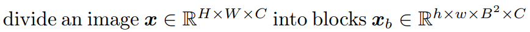

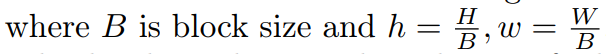


### Unidirectional block attention


- Q：在 layer 里面对特征划分 patch？:star:

> When the image is fed into the network, the channel size and resolution of a block may change, but the layout and the relative positional relationships between blocks will remain unchanged.

只输入一部分 patch 的特征到模型里面降低显存

> If there is a way to apply sequential batch generation of blocks where each batch simultaneously produces a subset of the blocks, only a small number of block hidden states have to be kept in memory simultaneously, making it possible to generate ultra-high-resolution images.

- Q：relative positional relationships between blocks will remain unchanged？设个 pos 怎么设计？


- Q：如何定义两个 block 是相关的？

> define that blockA is dependent on blockB if the generation of blockA involves the hidden state of blockB in computation

之间的关系是双向的，两个block 放到 UNet Conv Layer 都会在一起处理，所以**理解为双向（彼此都要用到对方信息），因此先前 UNet 多个 block 是要一起生成的**

> dependencies between blocks are bidirectional in most previous structures

- Q：怎么理解双向？

**相邻的 patch** 的特征在 CNN 里面会一起处理，来做到双向；这里也只是**相邻的 patch 也有个局部性**

> Take UNet as an example: two adjacent elements in neighboring blocks use each other’s hidden state in the convolution operation, therefore all pairs of neighboring blocks must be generated simultaneously

- Q：分 patch 后，这个 bidirectional 怎么办？:star:


本工作目标设计一个算法，可以把各个 blocks 拆分成一个个 batch 进行处理（提升效率？）

> Given the aim to save the memory of blocks’ hidden states, we hope to devise an algorithm that allows the blocks in the same image to be divided into several batches for generation

定义一下情况可以把 blocks 按顺序分别推理，**做了一些假设限定**

> Generally, an image generation algorithm can perform such a sequential batch generation among blocks if it meets the following conditions
>
> 1. The generative dependency between blocks are **unidirectional**, and can form a directed acyclic graph (DAG). 
> 2. Each block has only **a few direct (1st-order) dependencies on other blocks**, since the hidden states of the block and its direct dependencies should simultaneously be kept in the memory

- Q：ensure consistency across the whole image？（**多次推理的全局一致性！**）

首先保证 block 有足够的信息，能理解到是啥

> the blocks have a large enough receptive field to manage long-range dependencies.

设计 UniBA 模块

>  For each layer, every block directly depends on three 1st-order neighboring blocks


- Q：如何加上这个 relative pos embedding?

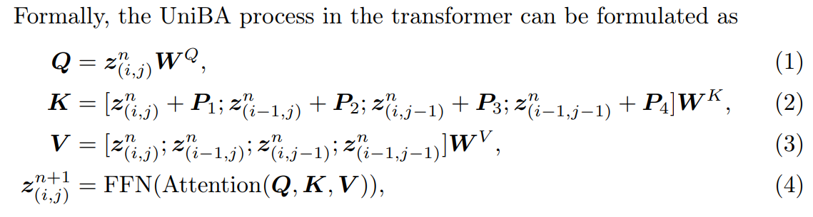


- Q：针对全图，边缘的块没有相邻块咋搞？

**在 Appendix A 实现了一个更加高效的 UniBA 模块** :star:

> We also implement an efficient approach to apply UniBA for full image in pytorch style

类似 SwinTransformer 复制了边缘的块，高效在于边缘的块不用单独写模块处理。。


**时间复杂度变成 O(N)，推理时候不需要的 KV 就丢掉了**

> we implement a simple but effective inference process. As illustrated in Fig. 3, we generate n × n blocks at once, from the top-left to bottom-right. After generating a set of blocks, we discard hidden states i.e. KV-cache that are no longer used and append newly generated KV-cache to the memory.

一次生成 nxn 个 blocks**，实验发现这个 n 越大越好，显存节省越多**

> it’s optimal to choose the largest n allowed by the memory limitation


#### pseudocode


#### Unstable Train

- Q：大部分 diffusion 模型使用 FP16 训练的，**训练不稳定咋搞？**

> many large diffusion models are trained under FP16 (16-bit precision) to reduce GPU memory and computation time. In practice, however, **a sudden increase in loss** often occurs after training for several thousand steps.

发现当 block 数量太多，QKV 数值贼大，导致了训练不稳定 :star:

> We observe that when the number of patches in a single attention window is too many (e.g. there are 4096 patches with block size = 128 and patch size = 4), the attention score QT K/√ d can become very large, leading to unstable gradients or even overflow.

参考 ViT 中训练 trick 对 Q，K 分别都做 Norm

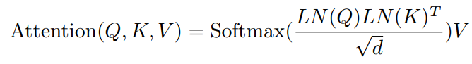


#### Initial Noise

初始噪声影响很大的。。用 LR 作为 prior

> Previous experience [8] shows that the diffusion modal tends to generate images that are closely aligned with the initial noise, which may lead to color mismatching with the original image during upsampling, e.g. Fig. 11. 

xLR 是 resized 的 LR 图像，从而得到 XT

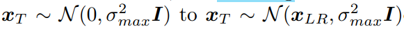

- Q：这里替换均值是几个意思？

在 xLR 上再加噪声。。。:face_with_head_bandage:

- Q：如何验证上面初始噪声的影响？？:star:

直接拿纯黑图像来做 SR 看看，设计的 toy example 很巧妙


- Q： 发现这么搞输出图像有可能变得很模糊

> However, this method can sometimes lead to the generated images appearing somewhat blurred just like LR images.

没说咋解决。。


### Framework


DiT 验证了使用 ViT 方式分 patch 再处理更高效，可扩展性更好

> DiT [17], which applies Vision Transformer (ViT) [6] to diffusion models and proves its efficacy and scalability

**Model input**

在 RGB 空间分 patch

> Inf-DiT first partitions input images into multiple non-overlapping blocks, which are further divided into patches with a side length equal to the patch size

模型没有用类似 VAE 的东西对输入下采样，类似 SDv2 x4 SR 直接把 LR 作为输入，最后只对输出过 VAE 上采样得到 x4

> Unlike DiT, considering the compression loss such as color shifting and detail loss, the patchifying of Inf-DiT is conducted in RGB pixel space instead of latent space.


#### Position Encoding

UNet 的 pos embedding 在 Conv，Attn 里面了

> UNet-based diffusion models [21] that can perceive positional relationships through convolution operations, all operations including self-attention, FFN in transformers are permutation invariant functions.

LLM 一些工作发现相对 pos embedding 更有效，**因此使用 Rotary Positional Encoding (RoPE)** :star:

> relative positional encoding is more effective in capturing word position relevance compared to absolute positional encoding


- Q：具体使用 RoPE 方式？

和 StableSR 一样，没区别

> Specifically, we divide channels of hidden states in half, one for encoding the x-coordinate and the other for the y-coordinate, and apply RoPE in both halves.

**随机取 LR 的 patch 来学习到完整的 relative pos table** :star:

> To ensure all parts of the positional encoding table can be seen by the model during training, we employ the Random Starting Point: For each training image, we randomly assign a position (x, y) for the top-left corner of the image, instead of the default (0, 0).


- Q：block 的 relative pos embedding 咋搞？:star: :warning:

> we additionally introduce block-level relative position encoding P1∼4, which assigns a distinct learnable embedding based on the relative position before attention.

如何获取 T 维度的 embedding？？


### Global  Consistency :star:

> The global semantic information within low-resolution (LR) images, such as artistic style and object material, plays a crucial role during upsampling.

加入全局图，减轻模型理解图像内容的负担？？

> However, compared to text-to-image generation models, **the upsampling model has an additional task understanding and analyzing the semantic information of LR images,** which significantly increases the model’s burden

**是因为没有 paired text 导致不好理解**？所以用 CLIP image embedding 作为全局特征

> This is particularly challenging when training without text data, as high-resolution images rarely have high-quality paired texts, making these aspects difficult for the model.

对 LR 图提取特征加到 t-embedding 上

> Inspired by DALL·E2 [20], we utilize the image encoder from pre-trained CLIP [19] to extract image embedding ILR from low-resolution images, which we refer to as Semantic Input.
>
> We **add the global semantic embedding to the time embedding of the diffusion transformer** and **input it into each layer,** enabling the model to learn directly from high-level semantic information.


- Q：与文本冲突？？

使用 CLIP 还有个好处是能让模型通过 text CLIP embedding 引导 :star:

> using the aligned image-text latent space in CLIP, we can use text to guide the direction of generation, even if our model has not been trained on any image-text pairs.

**使用 Pos & Negative Prompt**，也没说一定有用！:star: :star:

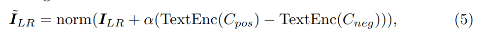

> Cpos = “clear” and Cneg = “blur” sometimes help.


### Local Consistency

- Q：把 LR 和 noise concat 作为 prior 有用，但还是会有局部不连续的问题

**猜测分析**了一下为啥，因为设计的 UniBA 模块是单向的，右边的 block 没考虑；**如果右边的 block 信息更丰富，会导致左边 block 差异**

> The reason is that, there are several possibilities of upsampling for a given LR block, which require analysis in conjunction with several nearby LR blocks to select one solution. Assume that the upsampling is only performed based on the LR blocks to its left and above, it may select an HR generation solution that conflicts with the LR block to the right and below. Then when upsampling the LR block to the right, if the model considers conforming to its corresponding LR block more important than being continuous with the block to the left, a HR block discontinuous with previous blocks would be generated.

在 transformer 第一层，加上 3x3 领域做 cross-attn

> we **introduce Nearby LR Cross Attention**. In the first layer of the transformer, each block conducts cross-attention on the surrounding 3 × 3 LR blocks to capture nearby LR information.

实验发现能够明显降低不一致


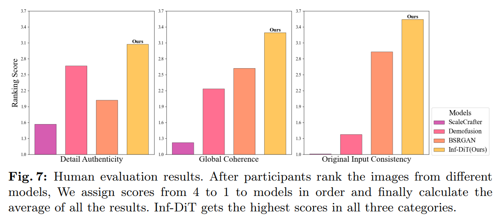


## Setting

-  LAION-5B [25] with a resolution higher than 1024×1024 and aesthetic score higher than 5, and 100 thousand high-resolution wallpapers from the Internet

- we use fixed-size image crops of 512×512 resolution during training.

- 评估使用 FID

  > [FID score for PyTorch](https://github.com/mseitzer/pytorch-fid/blob/master/src/pytorch_fid/fid_score.py)

  **分数越低代表两组图像越相似**，或者说二者的统计量越相似，FID 在最佳情况下的得分为 0.0，表示**两组图像**相同

  用 torchvision 中**预训练好的 InceptionV3 模型**（修改了几层），提取第几个 block 的输出。对每个图像弄成 dimens 尺寸的 embedding。对这个 embedding 提取均值和方差

  ```python
  def calculate_activation_statistics(files, model, batch_size=50, dims=2048,
                                      device='cpu', num_workers=1):
      """Calculation of the statistics used by the FID"""
      mu = np.mean(act, axis=0)
      sigma = np.cov(act, rowvar=False)
      return mu, sigma
  ```

  $ d^2 = ||mu_1 - mu_2||^2 + Tr(C_1 + C_2 - 2*sqrt(C_1*C_2)).$


**Data Processing** 》》Real-ESRGAN

1. rescale 512
2. random crop 512

训练时候随机取哪种方式

> When processing training images with a resolution higher than 512, there are two alternative methods: directly performing a random crop, or resizing the shorter side to 512 before performing a random crop. While the direct cropping method preserves high-frequency features in high-resolution images, the resizethen-crop method avoids frequently cropping out areas with a single color background, which is detrimental to the model’s convergence. Therefore, in practice, we randomly select from these two processing methods to crop training images.

**Training settings**

block size = 128 and patch size = 4, which means every training image is divided into 4 × 4 blocks and every block has 32×32 patches.

- mean and std of training noise distribution to −1.0 and 1.4.
- BF16 format due to its broader numerical range
- we first resize LR images to 224 × 224 and then input them to CLIP.


## Experiment

> ablation study 看那个模块有效，总结一下

说明显存爆炸的问题（完全可以用 Swin3D & Mamba 展示一下）

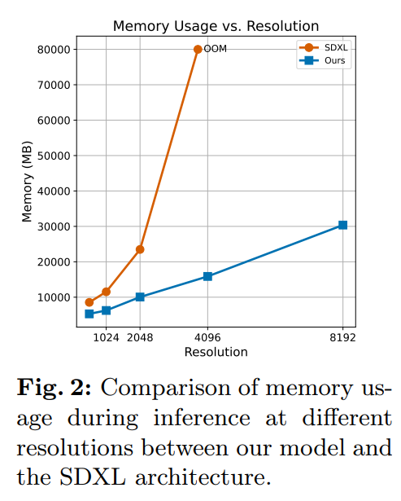

**HPDV2 dataset**

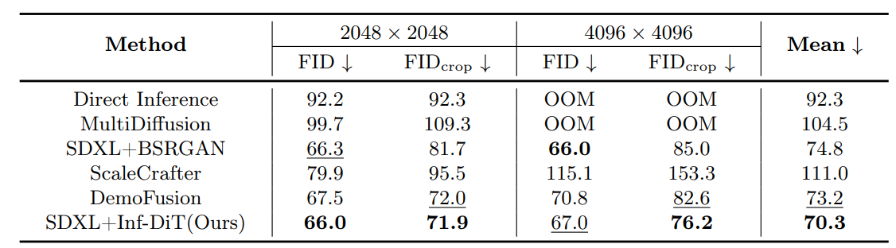

主观结果，基于 patch 的方式细节好，但是 patch 之间 blocking 太明显

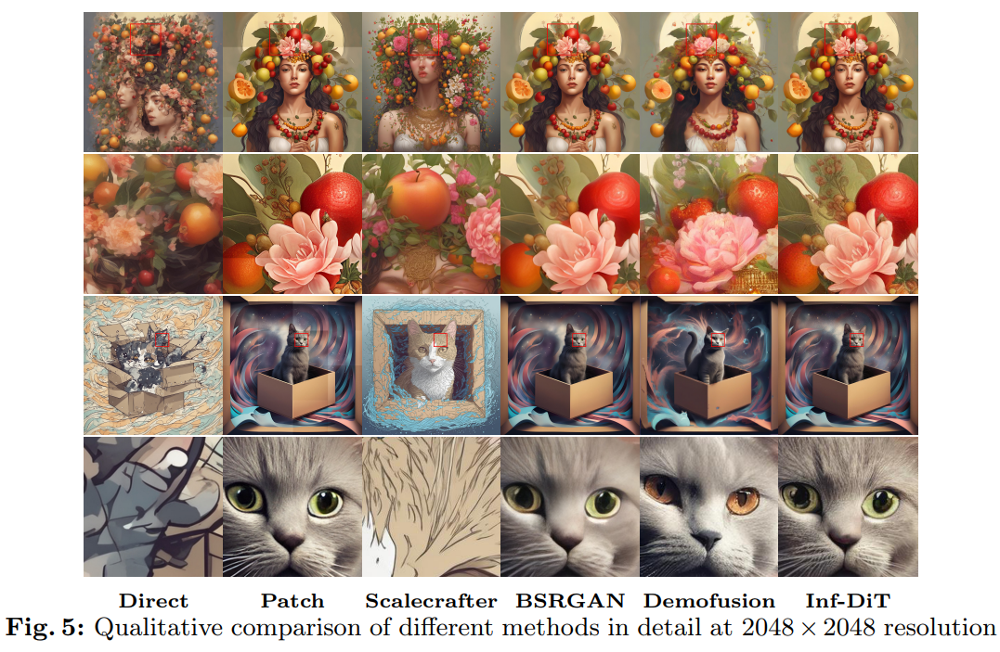


LR=1024 数据

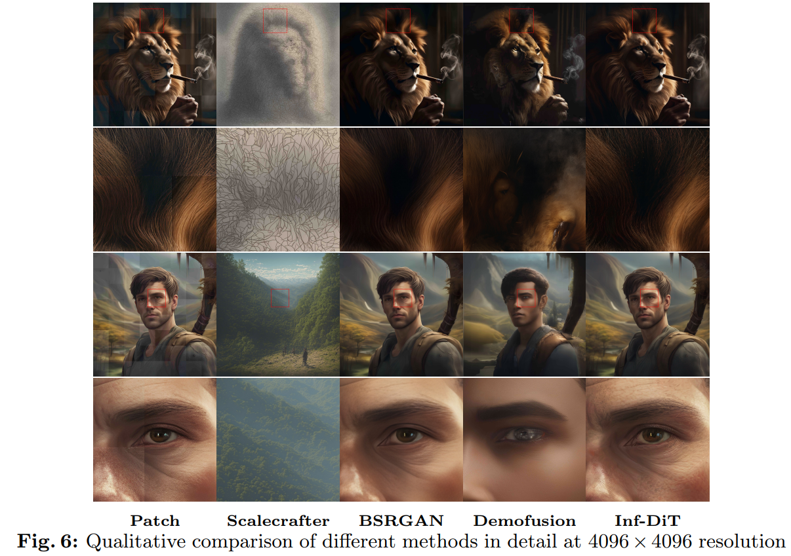


对比 RealSR 方法，效果居然接近 StableSR

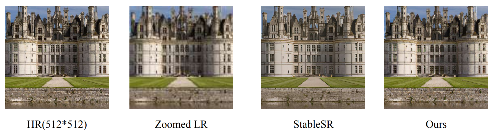

效果比 SDv2 x4SR 好太多了，看起来纹理扭曲得问题得到了解决？？纹理细节更加清晰了

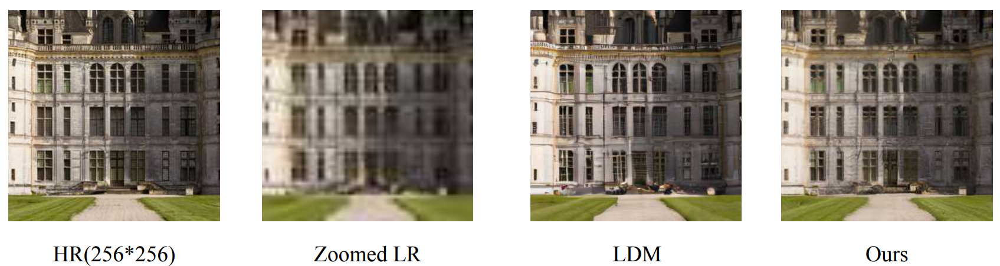


### Iterative SR

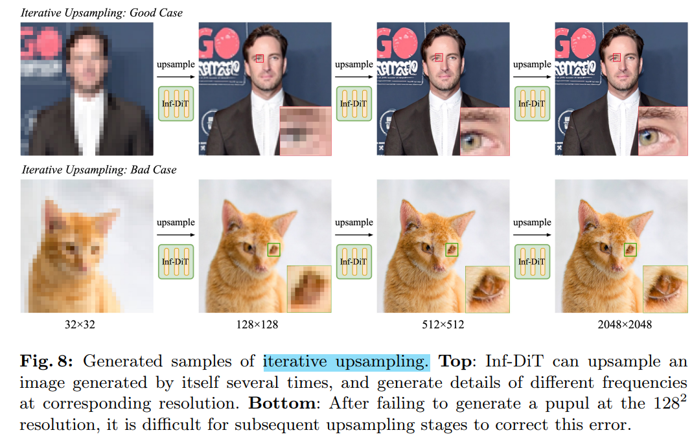

- Q：细节还是很渣渣?

没有搞文本，没理解内容是啥？

**迭代的搞，一开始错了后面都挂了**

> However, it is hard for the model to correct inaccuracies generated in earlier stages

### ablation

FID 看不出来差异

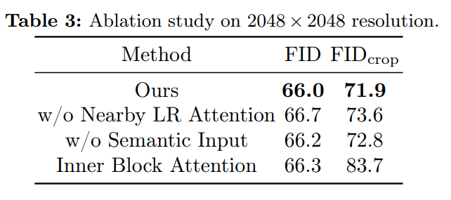


### Semantic Input

整图 LR 的 Semantic Input 影响很大的！！！:star:

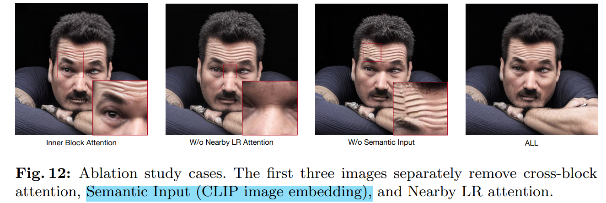


### base-model

除了 DiT 试试看别的

**SDv2 也是可以这么搞得！**

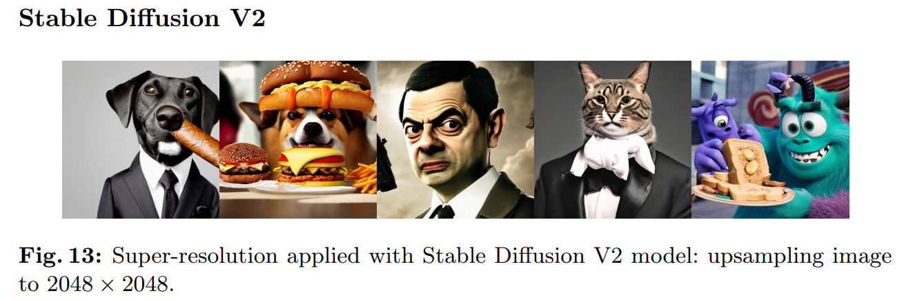

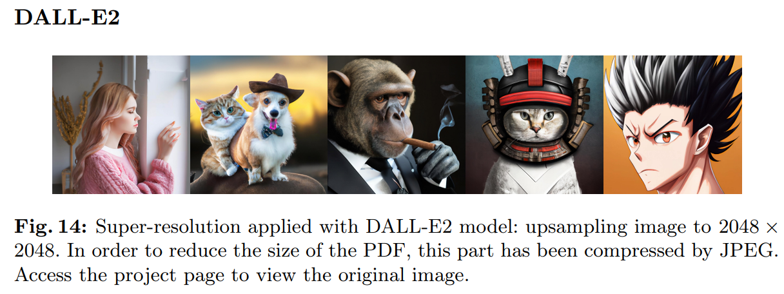

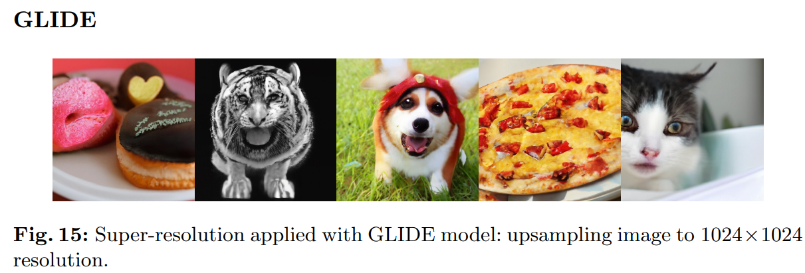


## Code


## Limitations

- Q： 发现 LR 加噪声作为 xT 输出图像有可能变得很模糊

> However, this method can sometimes lead to the generated images appearing somewhat blurred just like LR images.

没说咋解决。。目前大家都这么搞


## Summary :star2:

> learn what

- 主打显存更低

  - save more than 5× memory when generating 4096 × 4096 images

    对比下直接过

- 主观可视化，搞一个窗口可以看 LQ，生成结果

  https://imgsli.com/MjYyMTU5

- 初始噪声的影响很大的:star:

直接拿纯黑图像来做 SR 看看，设计的 toy example 很巧妙


### how to apply to our task

- 全局的 embedding 维持 global 一致性怎么搞？要不要给局部的坐标？

