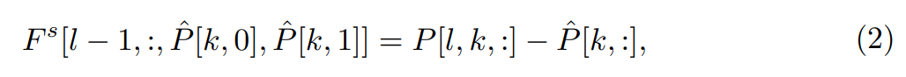
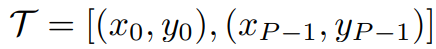

# MOFA-Video: Controllable Image Animation via Generative Motion Field Adaptions in Frozen Image-to-Video Diffusion Model

> "MOFA-Video: Controllable Image Animation via Generative Motion Field Adaptions in Frozen Image-to-Video Diffusion Model" ECCV, 2024 May 30
> [paper](http://arxiv.org/abs/2405.20222v2) [code](https://github.com/MyNiuuu/MOFA-Video) [web](https://myniuuu.github.io/MOFA_Video/) [pdf](./2024_05_Arxiv_MOFA-Video--Controllable-Image-Animation-via-Generative-Motion-Field-Adaptions-in-Frozen-Image-to-Video-Diffusion-Model.pdf) [note](./2024_05_Arxiv_MOFA-Video--Controllable-Image-Animation-via-Generative-Motion-Field-Adaptions-in-Frozen-Image-to-Video-Diffusion-Model_Note.md)
> Authors: Muyao Niu, Xiaodong Cun, Xintao Wang, Yong Zhang, Ying Shan, Yinqiang Zheng
>
> 测试文档：https://u1zh6ha8by.feishu.cn/docx/TKRXdntydooyE8x3Donc2ZxWnMN

## Key-point

- Task: Image-to-Video
- Problems
- :label: Label:


支持同时使用多种控制信号 & 不需要重复训练；每次训练一种 adapter 即可

> manual trajectories animation，面部关键点作为 condition


## Contributions

- SVD 基础上加入多种控制信号（frame, face landmarks, drag）
- SOTA 效果测完是真好！:star:


## Introduction

- SadTalker


目前开源的 text2image 模型，用于 I2V 后，由于原先用于 Image generation 生成的动作很单调

> Thanks to the large-scale generative prior of the text-to-image model, i.e., Stable Diffusion [29], these methods [1, 2, 7, 11, 39] have proved the possibility of open domain image animation

- Q：能否有一个 framework 同时支持多种 condition？

> is there a general image animation framework that supports meticulous control abilities over in-the-wild images?

**发现 motion 可以用关键帧去传播得到**

> We then find that all the animations can be formulated by the motion propagation of the sparse key-points (or key-frame) as the control handle

使用 ControlNet，提取 image condition 特征

> Different from the previous ControlNet-like Adapter [38, 51] for video generation, the proposed MOFA-Adapter models the frame-wise motion explicitly


- Q：如何维持时序一致性？

通过关键帧计算 sparse motion，用一个 motion network 预测 dense motion

> first utilize the given sparse motion hint to generate the dense motion fields using a **sparse-to-dense motion generation network**, then, we warp the multi-scale features of the first frame as the conditional features for the diffusion generation process

sparse-to-dense motion generation network 能够提升时序一致性

> **sparse-to-dense motion generation** provides a good balance between the provided motion guidance and the generation process


### I2V

- Gen-2. https://runwayml.com/ai-magic-tools/gen-2/ (2023)
- Genmo. https://www.genmo.ai/ (2023)
- I2vgen-xl. https : / / modelscope . cn / models / damo / Image - to - Video / summary (2023)
- Pika labs. https://www.pika.art/
- "Dynamicrafter: Animating open-domain images with video diffusion priors"

用图像编码器引入参考图，但首帧一致要求不高

> employ an image encoder to extract semantic features from a reference image to guide video generation, without requiring the generated video to precisely  include the given image as the first frame


引入轨迹，但空间矫正很弱

- "Dragnuwa: Finegrained control in video generation by integrating text, image, and trajectory"

>  trajectory of the generation via adaptive normalization, weak spatial correction


- "Motionctrl: A unified and flexible motion controller for video generation"

> control the object and camera motions


### Motion-I2V :star: 

最相似的工作，但提供的移动太单一

- "Motion-I2V: Consistent and Controllable Image-to-Video Generation with Explicit Motion Modeling" Arxiv, 2024 Jan 29
  [paper](http://arxiv.org/abs/2401.15977v2) [code](https://xiaoyushi97.github.io/Motion-I2V/) [pdf](./2024_01_Arxiv_Motion-I2V--Consistent-and-Controllable-Image-to-Video-Generation-with-Explicit-Motion-Modeling.pdf) [note](./2024_01_Arxiv_Motion-I2V--Consistent-and-Controllable-Image-to-Video-Generation-with-Explicit-Motion-Modeling_Note.md)
  Authors: Xiaoyu Shi, Zhaoyang Huang, Fu-Yun Wang, Weikang Bian, Dasong Li, Yi Zhang, Manyuan Zhang, Ka Chun Cheung, Simon See, Hongwei Qin, Jifeng Dai, Hongsheng Li

> only focuses on the natural motion of the objects. which is hard to fully control


#### Optical Flow

- "Unifying Flow, Stereo and Depth Estimation" TPAMI, 2022 Nov 10, `UniMatch`
  [paper](http://arxiv.org/abs/2211.05783v3) [code](https://github.com/autonomousvision/unimatch) [pdf](./2022_11_TPAMI_Unifying-Flow--Stereo-and-Depth-Estimation.pdf) [note](./2022_11_TPAMI_Unifying-Flow--Stereo-and-Depth-Estimation_Note.md)
  Authors: Haofei Xu, Jing Zhang, Jianfei Cai, Hamid Rezatofighi, Fisher Yu, Dacheng Tao, Andreas Geiger

> Sparse Motion Vectors from Dense Optical Flow


#### CMP

- "Self-Supervised Learning via Conditional Motion Propagation" CVPR, 2019 Mar 27, `CMP`
  [paper](http://arxiv.org/abs/1903.11412v3) [code](http://mmlab.ie.cuhk.edu.hk/projects/CMP/) [pdf](./2019_03_CVPR_Self-Supervised-Learning-via-Conditional-Motion-Propagation.pdf) [note](./2019_03_CVPR_Self-Supervised-Learning-via-Conditional-Motion-Propagation_Note.md)
  Authors: Xiaohang Zhan, Xingang Pan, Ziwei Liu, Dahua Lin, Chen Change Loy

参考同样的结构实现 SparseToDense Module


### SVD :rocket:

SVD 的动态效果比 SDv1.5+AnimateDiff-MoitionModule 更丝滑；官网示例展示了视频上的效果

- "Stable Video Diffusion: Scaling Latent Video Diffusion Models to Large Datasets" Arxiv, 2023 Nov 25
  [paper](http://arxiv.org/abs/2311.15127v1) [code](https://github.com/Stability-AI/generative-models) [web](https://stability.ai/news/stable-video-diffusion-open-ai-video-model) [pdf](./2023_11_Arxiv_Stable-Video-Diffusion--Scaling-Latent-Video-Diffusion-Models-to-Large-Datasets.pdf) [note](./2023_11_Arxiv_Stable-Video-Diffusion--Scaling-Latent-Video-Diffusion-Models-to-Large-Datasets_Note.md)
  Authors: Andreas Blattmann, Tim Dockhorn, Sumith Kulal, Daniel Mendelevitch, Maciej Kilian, Dominik Lorenz, Yam Levi, Zion English, Vikram Voleti, Adam Letts, Varun Jampani, Robin Rombach

> https://github.com/huggingface/diffusers/blob/main/docs/source/en/using-diffusers/svd.md


看一下其他工作如何去**高效训练 SVD**

- "VividPose: Advancing Stable Video Diffusion for Realistic Human Image Animation" `VividPose`
  [paper](https://arxiv.org/pdf/2405.18156v1) [web](https://kelu007.github.io/vivid-pose/)

都在优化 ID 一致性

- "Follow-Your-Click: Open-domain Regional Image Animation via Short Prompts"
  [code](https://github.com/mayuelala/FollowYourClick)
- "StreamingT2V: Consistent, Dynamic, and Extendable Long Video Generation from Text"
  [code](https://github.com/Picsart-AI-Research/StreamingT2V/tree/main/t2v_enhanced)


## methods

- 提出 MOFA-Adapter 实现多 condition 融合

  > motion field adapter (MOFA-Adapter) that can accept sparse motion control signals as the condition and produce the detailed control abilities for a frozen Stable Video Diffusion


### MOFA-Adapter


多个 condition 都去更新 flow，**以 flow 作为最终的 condition 去融合 image feature**


- Q：参考图特征怎么提取？

reference image encoder 参考 ControlNet 原始的特征提取

> reference image encoder is a multi-scale conv, extracts the multi-scale features of the first frame for warping
>
> "Adding conditional control to text-to-image diffusion models"


- Q：S2D 模块是啥？

**用于获取 dense motion field 每一帧的光流**？结构参考 CMP 工作

>  As for the sparse-to-dense motion generator, we use the same network structure as CMP [47] for adaption
>
> - "Self-supervised learning via conditional motion propagation" CVPR, 2019 Mar, `CMP`
>   [paper](https://arxiv.org/abs/1903.11412) [web](https://mmlab.ie.cuhk.edu.hk/projects/CMP/)

输入首帧 & **稀疏的运动 condition，转化为 dense motion field**

> accepts the first frame image and the sparse hint of the motion, and produces the dense motion fields

- Q：图像 condition 信息如何补全到多帧？

最后将 reference feature 通过 motion field 光流 warp 到目标帧

>  When the dense motion field is generated, we warp the referenced features and then add them to the feature map of the corresponding levels of a copied SVD encoder, which is then added to the feature space of the decoder of the pre-trained SVD similar to ControlNet

- Q：什么是 dense motion field?

TODO


### Train Adapter


> Fig. 2 illustrates the training pipeline of our whole framework. Given a video clip V ∈ R L×3×H×W in L frames, we first extract the sparse motion vectors which serves as the input of the S2D network. e.g., for open-domain, we handle the motion hint as the sparse motion vectors sampled from the extracted dense optical flow

由于 CMF 是从稀疏 motion vectore -> dense motion vector，下面各种 condition 是为了提取 motion vector（提取出来 GT 帧的为关键点，**转为与首帧关键点的距离向量**）

1. 提取 sparse motion vectors 输入 S2D；**用 S2D 输出的光流来整合多种模态** :star:

   **本工作选取2 种控制信息：光流、人体人脸关键点**

   - for open-domain，从 dense optical flow 中采样作为稀疏的运动向量

   > extract the sparse motion vectors which serves as the input of the S2D network. e.g., for open-domain, we handle the motion hint as the sparse motion vectors **sampled from the extracted dense optical flow**

   - As for human motion，人体的运动用人脸关键点

   > As for human motion, we generate the motion hints from structural key-points, e.g., facial landmarks.

2. ControlNet 里面 warp 特征


#### Dense Optical flow :star:

将光流作为通用的视频运动信息，采样后作为 Spare Motion Vectors

>  By considering the dense optical flow as a general motion representation between video frames, we first utilize Unimatch [42] to extract the forward optical flow

$$
\text{utilize Unimatch [42] to extract the forward optical flow} \\
F\in\mathbb{R}^{(L-1)\times2\times H\times W}
$$

- Q：光流 $F_{i}\in\mathbb{R}^{2\times H\times W}$ 里面数值的含义？

TODO


- Q：只用了 forward 的光流是否合理？

TODO


- Q：Unimatch 的 Dense 光流如何转换到 sparse flow 输入 S2D 模块？

使用 CMP 工作里面的 `watershed sampling strategy` ，对 L 帧的每一帧随机选取 n 个点，得到 L 个 $Mask \in \mathbb{R}^{H \times W}$；

> Based on the flow sequence F, we sample n spatial points from each frame Fi using the watershed sampling strategy [47]

每一帧的 Mask 中的 01，1 代表采样点，其余点设置为 0

> value for the sampled spatial points is set to 1, and other points are set to 0

就是按采样点过滤掉一些光流，**直接把光流作为 Sparse Motion Vector**


- Q：什么是 `watershed sampling strategy`，如何对光流采样？


- Q：给定一个视频提取完 dense optical flow，是逐帧提取 mask 还是只用第一帧的？

To generate a 25-frame video, let's assume you choose 10 spatial points from the initial frame. According to the forward warping concept, the 24 masks should be identical, with the coordinates of 10 spatial points marked as 1 and the remaining coordinates as 0.

You can then utilize these 24 masks to obtain the corresponding sparse motion vectors by performing element-wise multiplication between the masks and the forward dense optical flows.

> https://github.com/MyNiuuu/MOFA-Video/issues/19#issuecomment-2191197257


####  Structural Human Key-Points

这个 0，1 下标是因为 optical flow 是 C=2；把**逐位置的关键点距离**作为 motion vector $F^s$



>  given a series of 2D facial landmarks P ∈ R L×K×2 extracted from an L-frames portrait video, we consider the motion difference between the landmarks of reference (first) frame Pˆ and P, calculating point-wise sparse flow F s via


#### 训练过程参考 SVD code

>  following the training process of stable video diffusion


- Q：如何做 Image2video 训练？初始 xT 怎么计算？

TODO


### inference: trajectory

- Q：轨迹（图像上面画一个箭头标识起始，终点位置）怎么融入模型？



轨迹分解为 L 个小的轨迹，每一个和起始点计算位移向量，作为 motion vector；**这个 motion vector 再输入 CMP 得到稠密光流**

> bicubicly interpolate this trajectory to L points


主观效果


### Motion Brushes

用于控制动态区域 control the animation region，将 motion 分为区域内 & 区域外，生成对应区域的光流；

若光流在区域外，则削减 dense flow 的程度；

> Given this mask, we divide the trajectory set T into two groups: Tin and Tout. For each trajectory, we distribute it to Tˆ in if its start points lie in the mask, otherwise to Tˆ out. We then respectively obtain the dense optical flow Fin and Fout via the S2D network, and mask out all the values that is located outside the mask

### Plugin Combinations

上述各种 condition 整合起来不用重复训练

> supplementary materials


### Longer Animation

文章用的 SVD-14frames 版本

- Q：计算量大，如何用于长视频？

参考  Gen-L-Video

> The computational complexity of temporal attention scales quadratically with the number of frames, making it difficult to directly generate ultra-long videos.


### Portrait

对比 StyleHEAT [44], SadTalker


### train Code

> https://github.com/MyNiuuu/MOFA-Video/blob/main/Training/train_stage2.py

使用 fp16 训练

> https://github.com/MyNiuuu/MOFA-Video/blob/main/Training/train_stage2.sh  


## Setting

The trajectory-based model

- $LR=2 \times 10^{-5}$, training iterations is 100,000 it, batch=8

> The portrait-based model is trained on a self-compiled dataset which includes 5,889 different human portrait videos.


### Q&A

- module 'cupy.cuda' has no attribute 'compile_with_cache'

  gradion 版本换掉


## Code

提取 GT 的光流输入 CMP 模型得到 dense optical flow

`def add_tracking_points` 从稀疏点获取光流

> https://github/MyNiuuu/MOFA-Video/blob/main/MOFA-Video-Traj/run_gradio.py#L372

```python
viz_flow = DragNUWA_net.get_cmp_flow_from_tracking_points(tracking_points, motion_brush_mask, first_frame_path)
```

`get_cmp_flow_from_tracking_points` **根据轨迹点获取 cmp 光流**

输入帧 resize 到 `(384,384)` 和 原始尺寸，分辨提取轨迹点，进行插值

```
        input_first_frame_384 = F.interpolate(input_first_frame, (384, 384))
        input_first_frame_384 = input_first_frame_384.repeat(num_frames - 1, 1, 1, 1).unsqueeze(0)

        input_drag_384_inmask = input_drag_384_inmask.permute(0, 1, 4, 2, 3)  # [1, 13, 2, 384, 384]
        mask_384_inmask = input_mask_384_inmask.unsqueeze(2).repeat(1, 1, 2, 1, 1)  # [1, 13, 2, 384, 384]
        input_drag_384_outmask = input_drag_384_outmask.permute(0, 1, 4, 2, 3)  # [1, 13, 2, 384, 384]
        mask_384_outmask = input_mask_384_outmask.unsqueeze(2).repeat(1, 1, 2, 1, 1)  # [1, 13, 2, 384, 384]
```


motion brush mask 对轨迹点分类

```
        motion_brush_mask_384 = cv2.resize(motion_brush_mask, (384, 384), cv2.INTER_NEAREST)

        resized_all_points_384_inmask, resized_all_points_384_outmask = \
            divide_points_afterinterpolate(resized_all_points_384, motion_brush_mask_384)
```

计算 sparse motion 向量（前后点计算向量）

```
            input_drag_384_inmask, input_mask_384_inmask = \
                get_sparseflow_and_mask_forward(
                    resized_all_points_384_inmask, 
                    self.model_length - 1, 384, 384
                )
```


**计算光流**

> https://vscode.dev/github/MyNiuuu/MOFA-Video/blob/main/MOFA-Video-Traj/run_gradio.py#L236

```
        if in_mask_flag:
            flow_inmask = self.get_flow(
                input_first_frame_384, 
                input_drag_384_inmask, mask_384_inmask, motion_brush_mask_384
            )
```

> 复制单图 > frames
>
> ```python
> from einops import rearrange, repeat
> import torch.nn.functional as F
> 
> # input_drag_384_inmask = torch.from_numpy(input_drag_384_inmask).unsqueeze(0).to(self.device)
> input_first_frame = image2arr(first_frame_path)
> input_first_frame = repeat(first_frames_transform(input_first_frame), 'c h w -> b c h w', b=1).to(self.device)
> input_first_frame_384 = F.interpolate(input_first_frame, (384, 384))
> input_first_frame_384 = input_first_frame_384.repeat(num_frames - 1, 1, 1, 1).unsqueeze(0)  # b t c h w
> # assert bool((input_first_frame_384[0,0] == input_first_frame_384[0,1]).all())
> controlnet_flow = self.get_cmp_flow(
>     input_first_frame[:, 0:1, :, :, :].repeat(1, fl, 1, 1, 1), 
>     sparse_optical_flow_384, 
>     mask_384, motion_brush_mask
> )
> ```


CMP model 获取 dense 光流

> https://vscode.dev/github/MyNiuuu/MOFA-Video/blob/main/MOFA-Video-Traj/run_gradio.py#L112-L116
>
> forward https://vscode.dev/github/MyNiuuu/MOFA-Video/blob/main/MOFA-Video-Traj/models/svdxt_featureflow_forward_controlnet_s2d_fixcmp_norefine.py#L26

`output >> (b, t, 2, h, w)`

in_mask 和 out_mask 分别提取一个光流

```
        if in_mask_flag:
            flow_inmask = self.get_flow(
                input_first_frame_384, 
                input_drag_384_inmask, mask_384_inmask, motion_brush_mask_384
            )
        else:
            fb, fl = mask_384_inmask.shape[:2]
            flow_inmask = torch.zeros(fb, fl, 2, self.height, self.width).to(self.device, dtype=self.weight_dtype)

        if out_mask_flag:
            flow_outmask = self.get_flow(
                input_first_frame_384, 
                input_drag_384_outmask, mask_384_outmask
            )
        else:
            fb, fl = mask_384_outmask.shape[:2]
            flow_outmask = torch.zeros(fb, fl, 2, self.height, self.width).to(self.device, dtype=self.weight_dtype)
        
        inmask_no_zero = (flow_inmask != 0).all(dim=2)
        inmask_no_zero = inmask_no_zero.unsqueeze(2).expand_as(flow_inmask)

        controlnet_flow = torch.where(inmask_no_zero, flow_inmask, flow_outmask)
```


controlnet_flow 为了可视化取最后一帧的光流，`2 h w -> h w 2`

> https://vscode.dev/github/MyNiuuu/MOFA-Video/blob/main/MOFA-Video-Traj/utils/flow_viz.py#L241
>
> 可视化代码参考：https://github.com/gengshan-y/VCN NIPS :star:


controlnet forward

> https://vscode.dev/github/MyNiuuu/MOFA-Video/blob/main/MOFA-Video-Traj/run_gradio.py#L335

```
        controlnet_flow = torch.where(inmask_no_zero, flow_inmask, flow_outmask)

        val_output = self.pipeline(
            input_first_frame_pil, 
            input_first_frame_pil,
            controlnet_flow, 
            height=height,
            width=width,
            num_frames=num_frames,
            decode_chunk_size=8,
            motion_bucket_id=127,
            fps=7,
            noise_aug_strength=0.02,
            controlnet_cond_scale=ctrl_scale, 
        )
```


### ControlNet 输入

```python
inp_noisy_latents = torch.cat(
                    [inp_noisy_latents, conditional_latents], dim=2)
```

输入 T 帧用 unimatch 提取 t-1 个光流，**watershed 去筛选一下目标光流**

> https://vscode.dev/github/MyNiuuu/MOFA-Video/blob/main/Training/train_stage2.py#L110-L118

```
def get_cmpsample_mask(flows):
    fb, fl, fc, fh, fw = flows.shape
    masks = []
    for i in range(fb):
        temp_flow = flows[i, -1].permute(1, 2, 0).cpu().numpy()  # [h, w, 2]
        _, temp_mask = flow_sampler(temp_flow, ['grid', 'watershed'])
        masks.append(temp_mask)
    masks = torch.from_numpy(np.stack(masks, axis=0)).to(flows.device, flows.dtype)  # [b, h, w, 2]
    masks = masks.unsqueeze(1).repeat(1, fl, 1, 1, 1).permute(0, 1, 4, 2, 3)  # [b, l, 2, h, w]
```


### flow_encoder 获取 warped 光流

> https://vscode.dev/github/MyNiuuu/MOFA-Video/blob/main/Training/models/svdxt_featureflow_forward_controlnet_s2d_fixcmp_norefine.py#L300-L301

```
controlnet_cond_features = [controlnet_cond] + self.flow_encoder(controlnet_cond)  # [4]
```


```
warped_cond_feature = self.get_warped_frames(cond_feature, scale_flows[fh // ch])
```


## Experiment

> ablation study 看那个模块有效，总结一下

- Q：**光流是否准确？**

将各种 condition 通过 CMP 转化为稠密光流，以光流作为最终 condition 输入 controlnet；:star:

- Q：存在输出视频和 condition 不对齐？
- Q：SVD 没搞文本？


- Q：如何融合 reference image？


## Limitations

- Image ref 未出现内容区域，移动被显示出来后纹理很烂
- 光流有噪声


## Summary :star2:

> learn what & how to apply to our task

