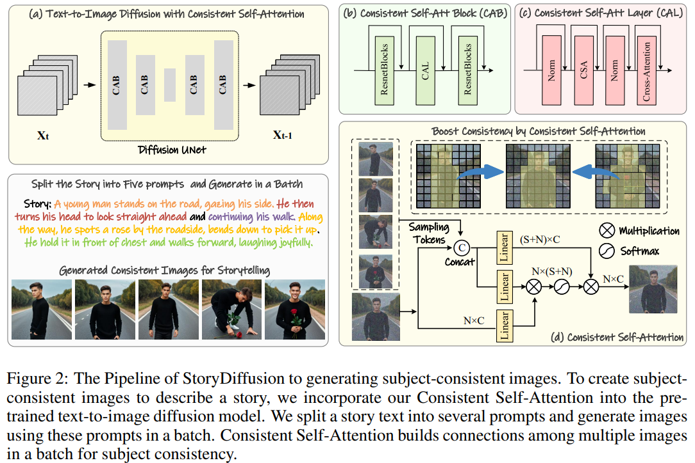
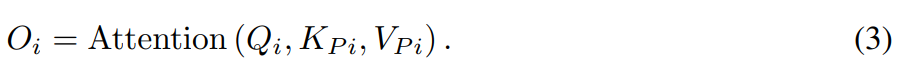

# StoryDiffusion: Consistent Self-Attention for Long-Range Image and Video Generation

> "StoryDiffusion: Consistent Self-Attention for Long-Range Image and Video Generation" Arxiv, 2024 May 2
> [paper](http://arxiv.org/abs/2405.01434v1) [code](https://github.com/HVision-NKU/StoryDiffusion) [pdf](./2024_05_Arxiv_StoryDiffusion--Consistent-Self-Attention-for-Long-Range-Image-and-Video-Generation.pdf) [note](./2024_05_Arxiv_StoryDiffusion--Consistent-Self-Attention-for-Long-Range-Image-and-Video-Generation_Note.md) [website](https://storydiffusion.github.io/)
> Authors: Yupeng Zhou, Daquan Zhou, Ming-Ming Cheng, Jiashi Feng, Qibin Hou

## Key-point

- Task: Story Video Generation
- Problems
- :label: Label:

根据 story text, reference image 生成一致性较高的 batch 图像，能够转为视频

## Contributions

- 提出 `Consistent Self-Attention`，zero-shot & plugin module 不需要训练，保持生成的 batch 图像生成的一致性
- 提出 `Semantic Motion Predictor`，对生成地 batch 图像之间补足运动，使得生成的视频更连贯

基于两个模块的改进，提出 `StoryDiffusion`，首个故事生成图像 or 视频的方法

> StoryDiffusion, can describe a text-based story with consistent images or videos encompassing a rich variety of contents. The proposed StoryDiffusion encompasses pioneering explorations in visual story generation with the presentation of images and videos

## Introduction

- Q：先前 diffusion 难以生成主体（人物面部，衣服细节）一致的内容

`IP-Adapter` 基于参考图像来做，但**文本的作用相对更弱**

> the controllability over the generated content of the text prompts is reduced
>
> - "Ip-adapter: Text compatible image prompt adapter for text-to-image diffusion models"

**identity preservation methods** 对人体（面部）能够较好保持一致，但**没办法保持人物着装 or 场景一致性**

- InstantID
- PhotoMaker

**此论文想基于故事文本，生成出来的人物图像在 identity & 着装 & 场景都一致**

> Hence, in this paper, we aim to find a method that can generate images and videos with consistent characters in terms of both identity and attire while maximizing the controllability of the user via text prompts.

- Q：保持多帧一致性方法？

使用 `temporal module` 加一个 transformer block 在 T 维度做 attention

> - "Align your latents: High-resolution video synthesis with latent diffusion models"
> - "Video diffusion models."

**先前方法验证了 self-attention 足以维持整体结构 & 内容**

> self-attention is one of the most important modules for modeling the overall structure of the generated visual content

使用 zero-shot module 得到 batch 的效果，**不需要训练！此种方式类似生成关键帧，再插帧，能够生成长视频 （12s），虽然一些不足的细节还是有问题**

https://storydiffusion.github.io/MagicStory_files/longvideo/demo_0065.mp4

### related

- "Ip-adapter: Text compatible image prompt adapter for text-to-image diffusion models" 
  [paper](https://arxiv.org/pdf/2308.06721)

- "Sparsectrl: Adding sparse controls to text-to-video diffusion models"
  [paper](https://arxiv.org/pdf/2311.16933)

能够支持多种 condition

- ""Animatediff: Animate your personalized text-to-image diffusion models without specific tuning" ICLR

## methods

把故事文本分段作为一个 batch，去生成一个 batch 的图像；使用 ` Consistent Self-Attention` 维持 batch 一致性

> split a story text into several prompts and generate images using these prompts in a batch

### **Consistent Self-Attention**

使用预训练的 SD，在原始 attention 位置插入这个 attention 实现 training-free and pluggable;

给定 B 张图，原始 attention

> The original self-attention is performed within each image feature Ii in I independently.

**替换为 CrossAttention**

> After sampling, we pair the sampled tokens Si and the image feature Ii to form a new set of tokens Pi; 
> We then perform linear projections on Pi to generate the new key KP i and value VP i for Consistent Self-Attention

对 batch image 做 cross-attention

> Given the paired tokens, our method performs the self-attention across a batch of images, facilitating interactions among features of different images. This type of interaction promotes the model to the convergence of characters, faces, and attires during the generation process

- Q：RandSample 怎么采样？
- Q：代替原始的 attention 还是后面加一个？

### Semantic Space Motion Predictor

- Q：SparseCtrl & SEINE 对 2 个 condition 没法稳定地生成帧

> SparseCtrl (Guo et al., 2023) and SEINE (Chen et al., 2023), cannot join two condition images stably when the difference between the two images is large. We argue that this limitation stems from their sole reliance on temporal modules to predict intermediate frames

原因分析：temporal module 缺少对 spatial 上的关联，对 large motion 没法生成有意义的区域

> The temporal module **operates within pixels on each spatial location independently,** therefore, there may be insufficient consideration of spatial information when inferring intermediate frames

**预测中间帧的特征**

使用预训练 CLIP image encoder （E） 将图像转化到特征空间，进行插值，使用  transformer blocks （B） 预测特征；

> To effectively model the character’s large motions, we encode the conditional images into the image semantic space for encoding spatial information and predict the transition embeddings

- Q：如何插值？
- Q：插值数量 F 如何确定？

**解码为图像**

参考 IP-Adapter 把图像特征作为 condition，通过 **cross-attention 方式**加入 video diffusion 中进行 decode。

> Inspired by the image prompt methods (Ye et al., 2023), we position these image semantic embeddings P1, P2, ..., PL as control signals, and the video diffusion model as the decoder to leverage the generative ability of the video diffusion model.

输入原始 UNet 视频特征 Vi，将文本特征 Ti 与预测帧的特征 Pi `concat` 起来进行 cross-attention

给定 GT 视频帧 $G$，输出的预测帧 $O$，参考先前方法使用 MSE loss 进行优化

> Similar to previous video generation approaches, we optimize our model by calculating the MSE loss between L frames predicted transition video O = (O1, O2, ..., OL) and L frame ground truth G = (G1, G2, ..., GL)

### use-ControlNet

> ControlNet (Zhang et al., 2023b) to introduce pose control in the generation of subjec-consistent images.

## Experiment

> ablation study 看那个模块有效，总结一下

### setting

生成一致的 batch 图像

- Stable Diffusion XL and Stable Diffusion 1.5
- All comparison models utilize 50-step DDIM sampling, and the classifier-free guidance score is consistently set to 5.0‘

视频生成

- SDv1.5 + AnimateDiff 中的 temporal module (**AnimateDiff V2 motion module**)作为 video diffusion model；预训练 image-encoder 使用 OpenCLIP ViT-H-14；Our Semantic Motion Predictor incorporates 8 transformer layers, with a hidden dimension of 1024 and 12 attention heads
- All comparison models adopt a 7.5 classifier-free guidance score and 50-step DDIM sampling
- **使用 Webvid10M 数据集 训练 transition video model**
- set our learning rate at 1e-4 and conduct training 100k iterations on **8 A100 GPU**s

### consistent-image

- IP-Adapter
- Photo Maker

use GPT-4 to generate twenty character prompts and one hundred activity prompts to describe specific activities

> For each test case, we use the three comparison methods to generate a group of images that depict a person engaging in different activities to test the model’s consistency.

比较的方法需要参考图，就先成第一张

> Since IP-Adapter and PhotoMaker require an additional image to control the ID of the generated images, we first generate an image of a character to serve as the control image.

每一帧计算与 prompt 的 text similarity & 主观看

### video

LPIPS-frames and CLIPSIM-frames 计算前后帧的相似性；LPIPS-first 计算第一帧和其他帧，衡量视频的一致性

主观效果，插值方式

User Study

### ablation

#### ID Generation

#### Sampling Rate

sampling rate >= 0.5 才有点用

## Limitations

- exist inconsistencies in some minor clothing details；
  may require more detailed prompts to maintain consistency across images
- 只能生成 12s 视频，不适用超长视频

## Summary :star2:

> learn what & how to apply to our task

- latent-space 插值 + Transformer block 训练能提升插值生成内容可信度
- cross-attention 有能力维持 batch image 的一致性，能够有 temporal layer 接近效果
- 
