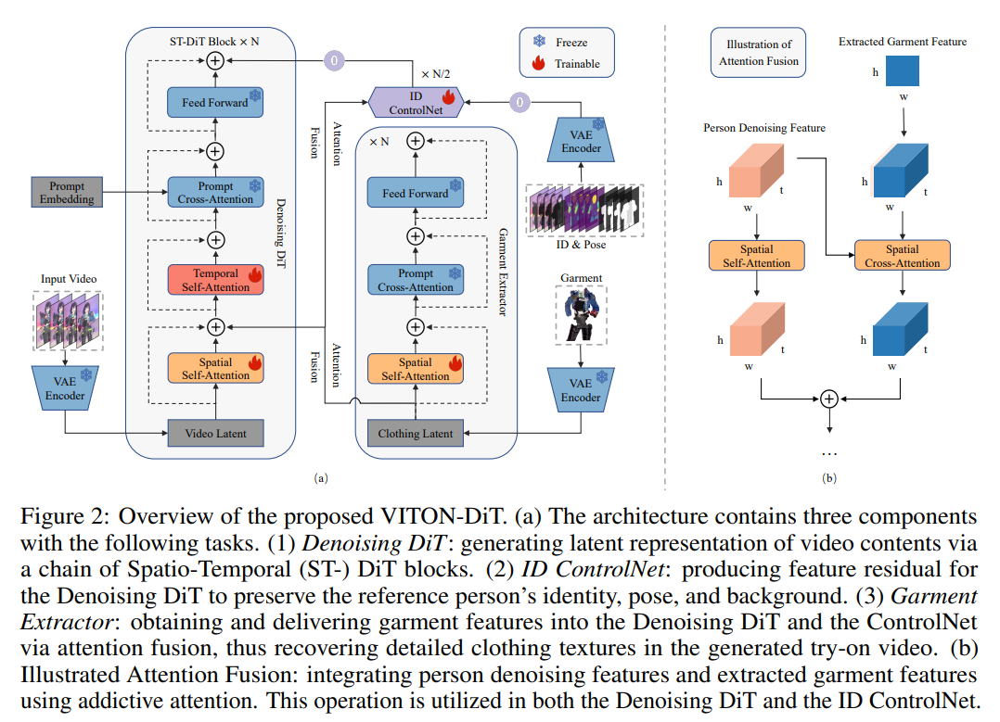

# VITON-DiT: Learning In-the-Wild Video Try-On from Human Dance Videos via Diffusion Transformers

> "VITON-DiT: Learning In-the-Wild Video Try-On from Human Dance Videos via Diffusion Transformers" Arxiv, 2024 May 28
> [paper](http://arxiv.org/abs/2405.18326v1) [code]() [pdf](./2024_05_Arxiv_VITON-DiT--Learning-In-the-Wild-Video-Try-On-from-Human-Dance-Videos-via-Diffusion-Transformers.pdf) [note](./2024_05_Arxiv_VITON-DiT--Learning-In-the-Wild-Video-Try-On-from-Human-Dance-Videos-via-Diffusion-Transformers_Note.md)
> Authors: Jun Zheng, Fuwei Zhao, Youjiang Xu, Xin Dong, Xiaodan Liang

## Key-point

- Task
- Problems
- :label: Label:

## Contributions

## Introduction

## methods

> Inspired by OpenSora [17], we adopt a modified Spatio-Temporal DiT (ST-DiT) as the backbone of our VITON-DiT

- Q：单个图像如何处理？

直接把图像特征 repeat 为 T 帧和 DiT 的特征做 cross-attention

> the clothing image is encoded by E and passes through N garment extractor blocks

- Q：为什么训练 STDiT backbone 的 SA?

- Q:ID Controlnet 结构

> It drops the temporal attention as the input contains only a single clothing image c

图像特征 repeat 为 T 帧特征

> the extracted garment feature rc is firstly repeated along the temporal dimension, matching the shape of the person denoising feature rp from the same location in the denoising DiT and the ControlNet

## Setting

- fixed VAE

  c=4 f=8

- Q：latent pachify?

- 使用 OpenSora 预训练权重

  > Note during training, we load pre-trained weights from OpenSora [17] and freeze the PCA & feed-forward layer to retain its original generation ability

## Experiment

> ablation study 看那个模块有效，总结一下

## Limitations

## Summary :star2:

> learn what & how to apply to our task

