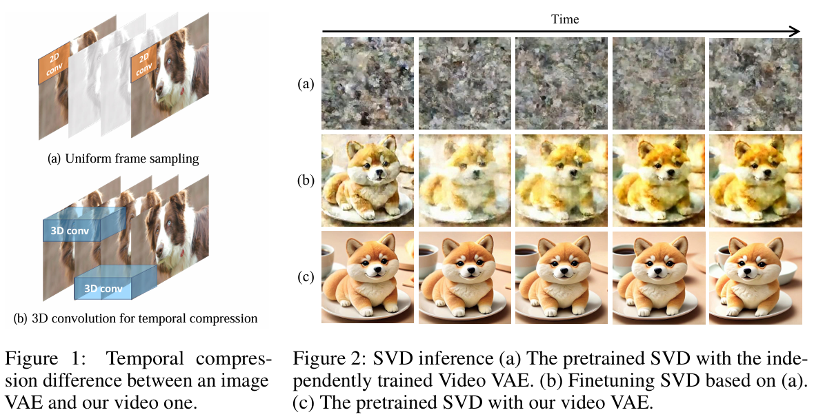

# CV-VAE: A Compatible Video VAE for Latent Generative Video Models

> "CV-VAE: A Compatible Video VAE for Latent Generative Video Models" NIPS, 2024 May 30
> [paper](http://arxiv.org/abs/2405.20279v2) [code](https://github.com/AILab-CVC/CV-VAE) [pdf](./2024_05_NIPS_CV-VAE--A-Compatible-Video-VAE-for-Latent-Generative-Video-Models.pdf) [note](./2024_05_NIPS_CV-VAE--A-Compatible-Video-VAE-for-Latent-Generative-Video-Models_Note.md)
> Authors: Sijie Zhao, Yong Zhang, Xiaodong Cun, Shaoshu Yang, Muyao Niu, Xiaoyu Li, Wenbo Hu, Ying Shan

## Key-point

- Task: 3D-VAE

- Problems

  -  The temporal compression is simply realized by uniform frame sampling which results in unsmooth motion between consecutive frames

  - 直接不考虑 T2I 模型训练 VAE，特征空间不一致

    > directly training a video VAE without considering the compatibility with existing T2I models will result in a latent space gap between them, which will take huge computational resources for training to bridge the gap even with the T2I models as initialization. 

    

- :label: Label:

## Contributions

- 提出微调 3D-VAE ，保持与预训练 SD VAE space 一致

  > To address this issue, we propose a method for training a video VAE of latent video models, namely CV-VAE, whose latent space is compatible with that of a given image VAE, e.g., image VAE of Stable Diffusion (SD).

- latent space regularization, which involves formulating a regularization loss using the image VAE.

- 代替了原始逐帧 VAE 的方式，3D-VAE 压缩 temporal，实现更长时序生成

  > Benefiting from the latent space compatibility, video models can be trained seamlessly from pre-trained T2I or video models in a truly spatio-temporally compressed latent space, rather than simply sampling video frames at equal intervals.

- To improve the training efficiency, we also design a novel architecture for the video VAE.

## Introduction

在 Latent Space 做提升效率

> On the other hand, Phenaki [33], MAGVIT [41], VideoCrafter [6], AnimateDiff [15], VideoPeot [20], and SORA, etc, are representative latent generative video models that are trained in the latent space formed using variational autoencoders (VAEs). The latter category is more prevalent due to its training efficiency.

VAE 使用还有两种

> Furthermore, latent video generative models can be classified into two groups according to the type of VAEthey utilize: LLM-like and diffusion-based video models.

- 3DVQ-VAE

> The 3D-VQVAE is inflated from the 2D-VQVAE [32] used in image generation. TATS [14] and MAGVIT [41] use 3D-VQGAN for better visual quality by **employing discriminators,** while Phenaki [33] utilizes a transformer-based encoder and decoder, namely CViViT.

- 用 2D VAE 逐帧提取特征，生成缺少 smoothness

> Almost all high-performing latent video models are trained with the SD image model [28] as initialization for the inflated UNet or DiT. Examples include Align-your-latent [5], VideoCrafter1 [6], AnimateDiff [15], SVD [4], Modelscope [34], LaVie [35], MagicVideo [44], Latte [24], etc. Temporal compression is simply achieved by uniform frame sampling while ignoring the motion information between frames (see Fig. 1). Consequently, the trained video models may not fully understand smooth motion, even when FPS is set as a condition. 

Open-Sora Plan 开源的 3D-VAE 和其他 SVD 不兼容

## methods

## setting

## Experiment

> ablation study 看那个模块有效，总结一下

## Limitations

## Summary :star2:

> learn what

### how to apply to our task

