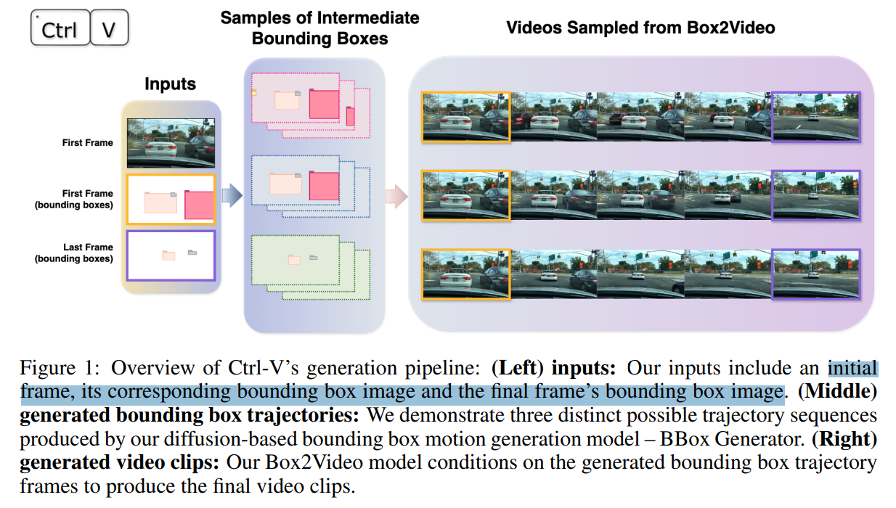
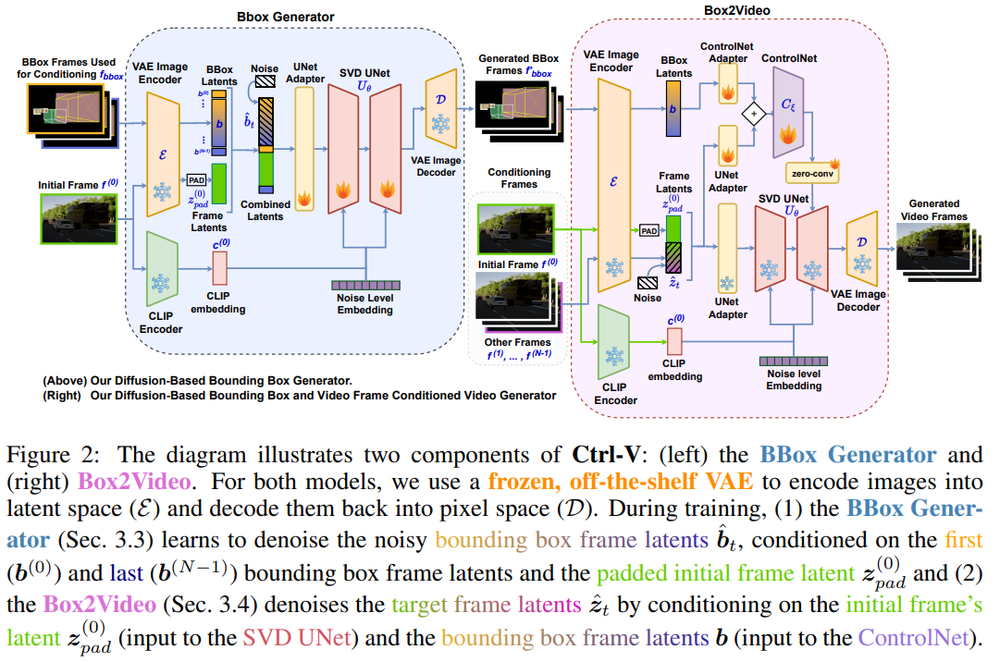

# Ctrl-V: Higher Fidelity Video Generation with Bounding-Box Controlled Object Motion

> "Ctrl-V: Higher Fidelity Video Generation with Bounding-Box Controlled Object Motion" Arxiv, 2024 Jun 9
> [paper](http://arxiv.org/abs/2406.05630v3) [code]() [web](https://anongreenelephant.github.io/ctrlv.github.io/) [pdf](./2024_06_Arxiv_Ctrl-V--Higher-Fidelity-Video-Generation-with-Bounding-Box-Controlled-Object-Motion.pdf) [note](./2024_06_Arxiv_Ctrl-V--Higher-Fidelity-Video-Generation-with-Bounding-Box-Controlled-Object-Motion_Note.md)
> Authors: Ge Ya Luo, Zhi Hao Luo, Anthony Gosselin, Alexia Jolicoeur-Martineau, Christopher Pal

## Key-point

- Task: driving video generation(image+bbox 2 video)
- Problems
- :label: Label:

## Contributions

- 搞了两个 SVD，一个生成车辆 bbox 的运动轨迹，再用生成的 bbox 作为下一个 SVD 的 condition

> Our method, Ctrl-V, leverages modified and fine-tuned Stable Video Diffusion (SVD) models to solve both trajectory and video generation

## Introduction

模型输入首帧 + 首&尾帧的 bbox 图

## methods

GT frames 过完 VAE 加噪，再和 condition frames concat 起来；

controlnet 输入特征：condition 特征过完 conv layers；UNet 输入特征过 conv layers 再加起来

## setting

## Experiment

> ablation study 看那个模块有效，总结一下

## Limitations

- consistency 垃圾的不行。。。
- 首帧上的字都没维持住。。。

## Summary :star2:

> learn what

### how to apply to our task

