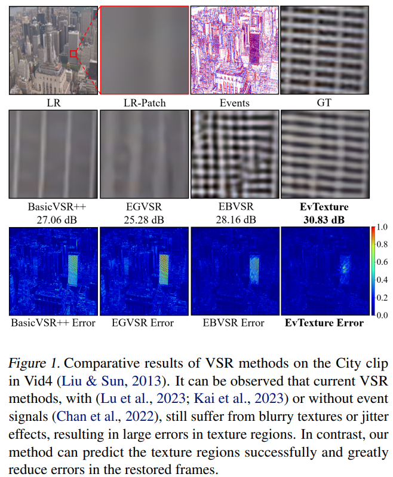
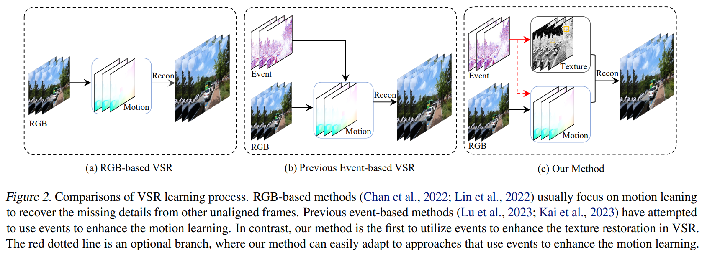
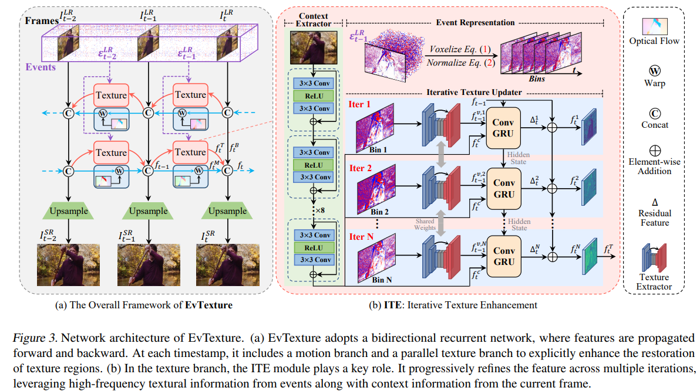
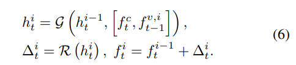
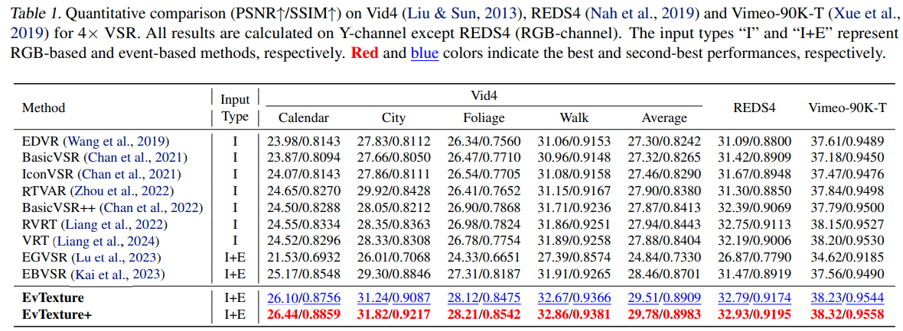
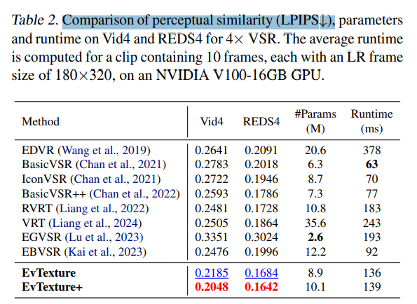
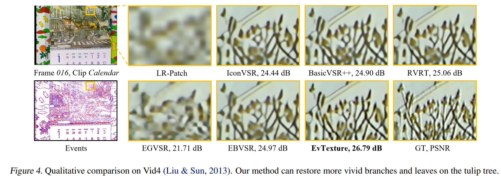
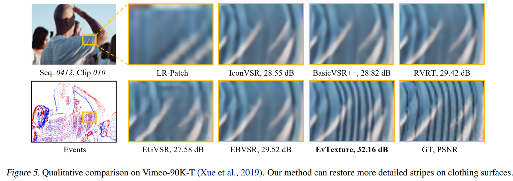
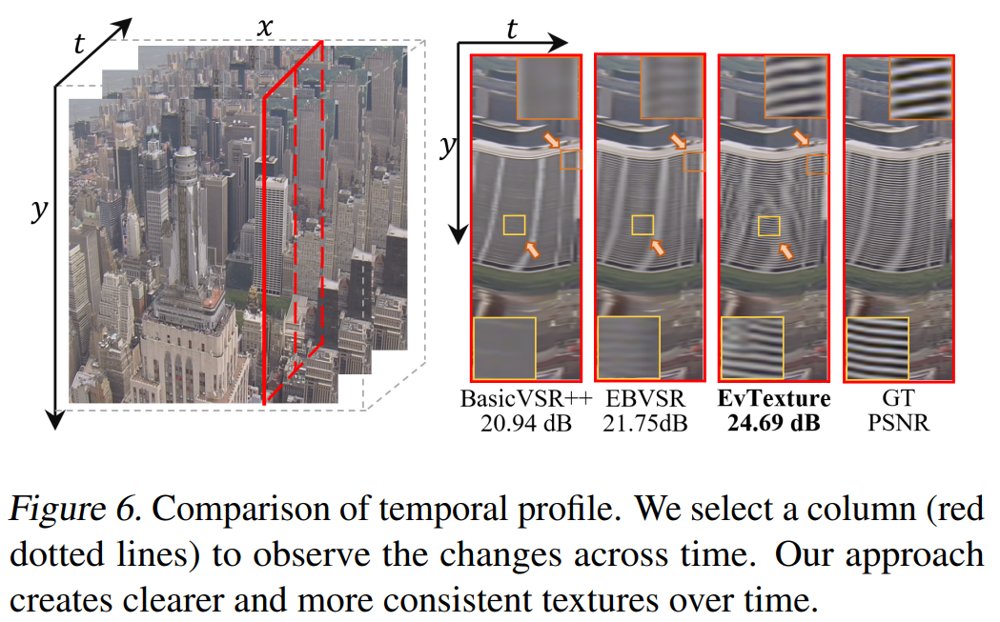
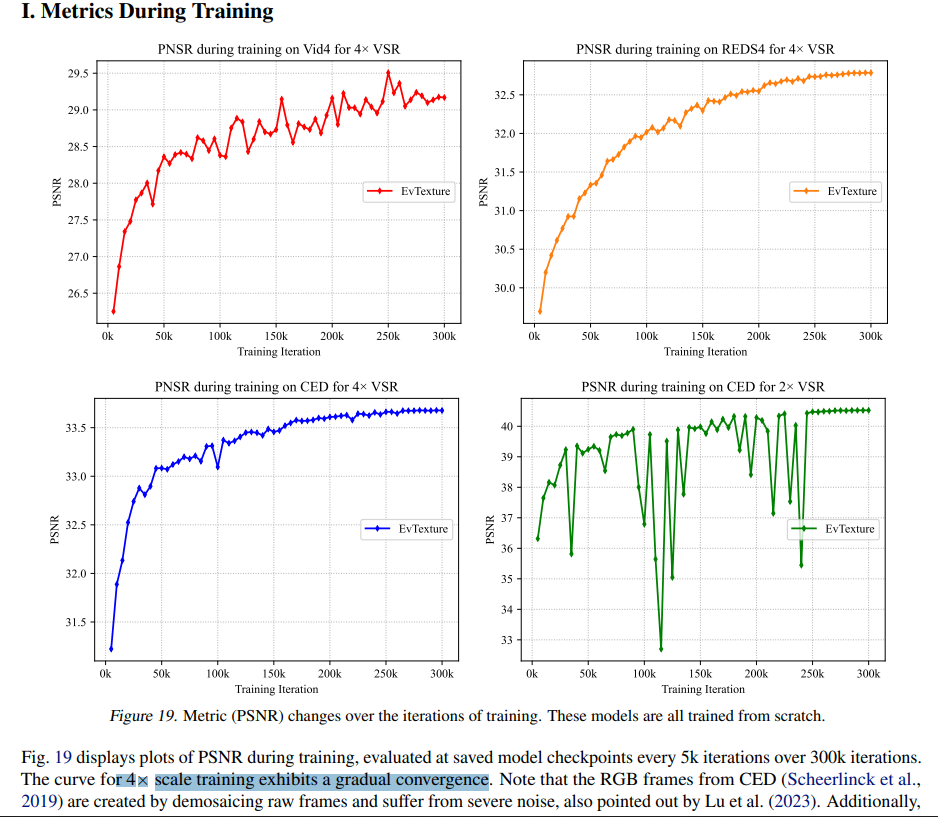

# EvTexture: Event-driven Texture Enhancement for Video Super-Resolution

> "EvTexture: Event-driven Texture Enhancement for Video Super-Resolution" Arxiv, 2024 Jun 19, `EvTexture`
> [paper](http://arxiv.org/abs/2406.13457v1) [code](https://github.com/DachunKai/EvTexture) [pdf](./2024_06_Arxiv_EvTexture--Event-driven-Texture-Enhancement-for-Video-Super-Resolution.pdf) [note](./2024_06_Arxiv_EvTexture--Event-driven-Texture-Enhancement-for-Video-Super-Resolution_Note.md)
> Authors: Dachun Kai, Jiayao Lu, Yueyi Zhang, Xiaoyan Sun

## Key-point

- Task: Event-based vision
- Problems
- :label: Label:

Our method, called EvTexture, leverages high-frequency details of events to better recover texture regions in VSR

## Contributions

- texture enhancement branch is presented

- **iterative texture enhancement module** to progressively explore the hightemporal-resolution event information for **texture restoration**

  multiple iterations, leading to more accurate and rich high-resolution details. 

- SOTA, PSNR 提升了 0.4db

  > Vid4 dataset with rich textures, our method can get up to 4.67dB gain compared with recent event-based methods.

## Introduction

- Q：没有 event signal 辅助，BasicVSR 等 **RGB-based 方法**修复的细节还是和 GT 差距很远？

> without event signals (Chan et al., 2022), still suffer from blurry textures or jitter effects, resulting in large errors in texture regions

**Event signals 含有更多细节的纹理的特征**

总结先前方法 :star:

**RGB-based methods** (Chan et al., 2022; Lin et al., 2022) usually focus on **motion leaning to recover the missing details** from other unaligned frames.

- Q：problem?

学习运动信息（光流），对于大幅运动效果很好，但由于 **LR 图像缺失了高频细节，因此对于复杂纹理的修复很烂**

> However, while these methods get good results in large motion regions, they struggle for hard cases with complex textures, as highfrequency information is lost in LR videos.

- Q：event 信息怎么得到呢？

需要 Event cameras，额外的信号，之前拍摄好的视频没发搞？

> Event cameras, also known as neuromorphic cameras, are a new type of visual sensor that operates on the principle of asynchronously capturing brightness changes 

## methods

光流传播的方法类似 basicVSR；**增加了额外的 event signals ，搞了一个 event signals 的传播分支**，得到传播后的 event signal；

把每一帧各自传播后的**光流特征 $f_t^C$ 和 event signal 特征 $f_t^T$  concatenate 拼接**

-  Q：concatenate 后如何输入 texture 模块？

## setting

- Real-world datasets. Following previous event-based VSR studies (Lu et al., 2023; Kai et al., 2023), we use the CED (Scheerlinck et al., 2019) dataset for training and evaluating on real-world scenes. The dataset is captured with a DAVIS346 (Brandli et al., 2014) event camera, which outputs temporally synchronized events and frames at a resolution of 260×346.

用 event camera 拍摄的数据集

-  8 NVIDIA RTX3090 GPUs

## Experiment

> ablation study 看那个模块有效，总结一下

按 badcase 找出来分别计算指标hhh

数据集 LPIPS 能做到 0.2 了

主观上和 RVRT 在不知道 GT 长啥样的情况下，差不多

### Appendix

PSNR 对于 x4 更稳定

## Limitations

## Summary :star2:

> learn what & how to apply to our task

光流传播的方法类似 basicVSR；**增加了额外的 event signals ，搞了一个 event signals 的传播分支**，得到传播后的 event signal；

把每一帧各自传播后的**光流特征 $f_t^C$ 和 event signal 特征 $f_t^T$  concatenate 拼接**

- **Event signals 含有更多细节的纹理的特征，但需要 event camera**
- 按 badcase 找出来分别计算指标hhh
- 参考实验设计 :star:

