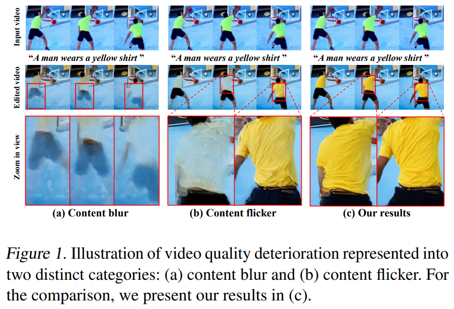
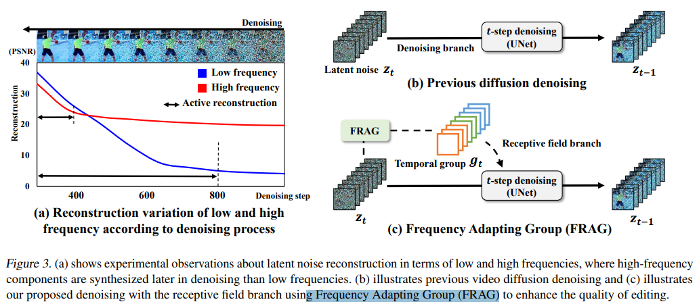
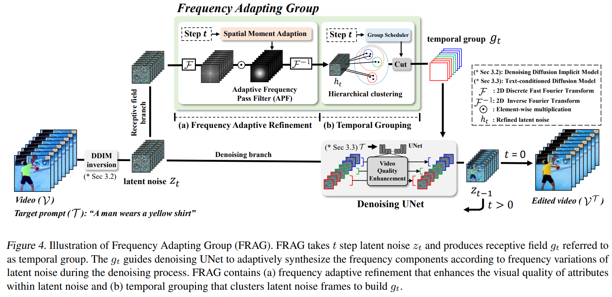

# FRAG: Frequency Adapting Group for Diffusion Video Editing

> "FRAG: Frequency Adapting Group for Diffusion Video Editing" ICML, 2024 Jun 10
> [paper](http://arxiv.org/abs/2406.06044v1) [code](https://github.com/dbstjswo505/FRAG) [web](https://dbstjswo505.github.io/FRAG-page/) [pdf](./2024_06_Arxiv_FRAG--Frequency-Adapting-Group-for-Diffusion-Video-Editing.pdf) [note](./2024_06_Arxiv_FRAG--Frequency-Adapting-Group-for-Diffusion-Video-Editing_Note.md)
> Authors: Sunjae Yoon, Gwanhyeong Koo, Geonwoo Kim, Chang D. Yoo

## Key-point

- Task: video edit

- Problems

  - 闪烁，模糊

    > quality deterioration such as blurring and flickering is routinely observed in recent diffusion video editing systems

- :label: Label:

## Contributions

- 认为是高频信息丢失导致 blur，设计 FRAG 提升 denoising 高频信息

  > To this end, we devise Frequency Adapting Group (FRAG) which enhances the video quality in terms of consistency and fidelity by introducing a novel receptive field branch to preserve high-frequency components during the denoising process

## Introduction

先前在 temporal 做文章，编辑效果在颜色，形状上编辑质量很烂

1. content blur
2. content flicker

> However, a significant challenge persists as these systems often struggle with maintaining the quality of various attributes, including the color and shape of objects. This inconsistency manifests not just over time but also across the spatial dimensions of the video, leading to a deterioration in the overall quality of the edits.

分析了下为什么 blur,flicker

>  the content blur denotes that attributes (e.g., color and shape) synthesized for a content (e.g., shirt) are irregularly mixed with other unintended contents (e.g., background) in the entire video, which makes the content faint or unclear.
>
> content flicker. This indicates a disruption of visual continuity in a synthesized attribute at a certain moment, causing the attribute (e.g., shirt color) to display contrasting characteristics (e.g., light and dark) at different times.

diffusion 去噪生成高频特征的能力不足

> Our observation suggests that blurring and flickering are due to a high-frequency leak in the diffusion denoising process. The high-frequency leak denotes a shortfall of the video diffusion model’s ability to accurately synthesize highfrequency attributes during the denoising process, leading to the lack of high-frequency components. 

## methods

发现**高频细节特征**，在去噪后期生成

## setting

## Experiment

> ablation study 看那个模块有效，总结一下

## Limitations

## Summary :star2:

> learn what

### how to apply to our task

- 参考一下如何实现 adaptive frequency，需要特别高频率的划痕过滤掉，中高频率的纹理保留，低频不动

