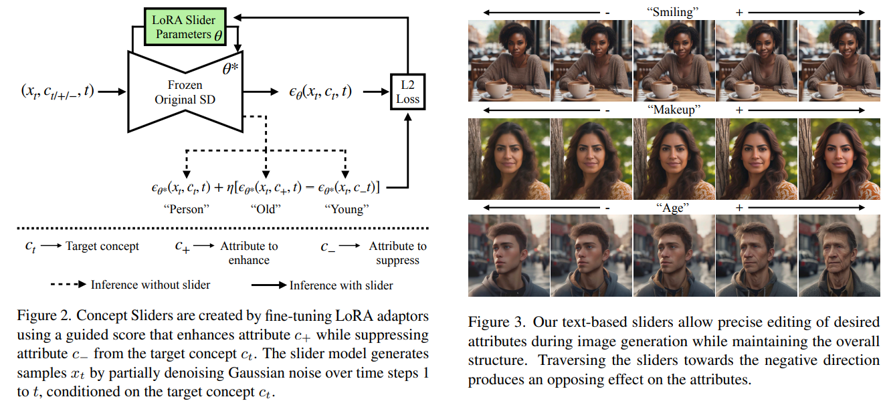
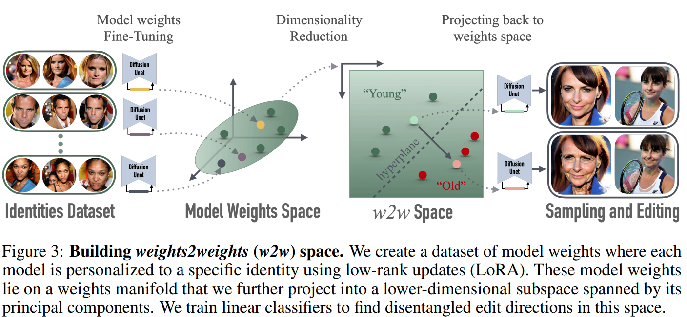

# Interpreting the Weight Space of Customized Diffusion Models

> "Interpreting the Weight Space of Customized Diffusion Models" Arxiv, 2024 Jun 13
> [paper](http://arxiv.org/abs/2406.09413v2) [code](https://github.com/snap-research/weights2weights) [web](https://snap-research.github.io/weights2weights/) [pdf](./2024_06_Arxiv_Interpreting-the-Weight-Space-of-Customized-Diffusion-Models.pdf) [note](./2024_06_Arxiv_Interpreting-the-Weight-Space-of-Customized-Diffusion-Models_Note.md)
> Authors: Amil Dravid, Yossi Gandelsman, Kuan-Chieh Wang, Rameen Abdal, Gordon Wetzstein, Alexei A. Efros, Kfir Aberman

## Key-point

- Task: image edit, 分析 diffusion 特征的特性
- Problems
- :label: Label:

## Contributions

- **探索对模型的权重做编辑实现图像编辑**，得到一个新的模型权重，再去 sample 得到编辑后的图像 :star:

搞了 6k 个对单个人物微调的 diffusion model，把这些模型的权重去构成一个 weights space

> model the underlying manifold of these weights as a subspace, which we term weights2weights

能做到编辑，保持一致性

> we find linear directions in this space corresponding to semantic edits of the identity (e.g., adding a beard). These edits persist in appearance across generated samples. 

能修复！

> we show that inverting a single image into this space reconstructs an realistic identity, even if the input image is out of distribution (e.g., a painting)

**finetune 的 diffusion 构成的特征可以解释了！**

> Our results indicate that the weight space of fine-tuned diffusion models behaves as an **interpretable latent space of identities**

## Introduction

> 看 [web](https://snap-research.github.io/weights2weights/) 视频，介绍了 motivation！:star:

- Q: motivation?

1. Dataset of Images

   Linear latent space 1990s 发现**对图像插值**能够实现图像编辑；

2. Dataset of Latent Vectors

   GAN -> 在**图像的特征维度**实现更丰富的编辑；

本文先要进一步抽象一下编辑的本质，**对模型的权重做编辑，实现图像的编辑 **  :star:

- Datset of Model weights

- Q: why think possible?

DreamBooth 能够实现 personalization，保持 identity 说明有一定能够解释性；

训练了 6k 个 DreamBooths，把模型权重来组成一个 space; 对权重编辑完，再去 sample 新的 model space 去生成新的图像

- Q：能否理解为？用一个模型表示一个物体，能生成各种场景的图像；如果物体属性变了，改变模型权重去生成类似的图像，只是物体特征改了一点

### GANs feature(one-step)

> single-step generative models, such as Generative Adversarial Networks (GANs) [15, 26], has been shown to **linearly encode meaningful concepts in the output images**.

- "GANSpace: Discovering Interpretable GAN Controls" 
  https://arxiv.org/pdf/2004.02546

发现 PCA 找到 principal directions 可以实现 GAN 的可控编辑

> We identify important latent directions based on Principal Component Analysis (PCA) applied either in latent space or feature space. Then, we show that a large number of interpretable controls can be defined by layer-wise perturbation along the principal directions. Moreover, we show that BigGAN can be controlled with layer-wise inputs in a StyleGAN-like manner.

### diffusion (multi-step) :star:

发现 Dreambooth 能实现用一个模型标识一个物体（维持一致性）

> Dreambooth [50] or Custom Diffusion [31], may hint at where such an interpretable latent space can exist in diffusion models

- Q：diffusion 多个 step，**怎么找到 diffusion 一个类似的空间，有 GAN 特征空间类似的效果？**

diffusion 多个 step 的特征空间是有噪声的，尝试别的方法：Dreambooth 可以用一个模型标识物体，**假设 GAN 特征空间类似的空间隐含在 diffusion 模型权重里面！** :star:

> Rather than searching for a latent code that represents an identity in the input noise space, these approaches customize diffusion models by fine-tuning on subject images, which results in identity-specific model weights. We therefore hypothesize that a latent space can exist in the weights themselves

- Q：**学习一下如何根据假设去设计实验！**

> - Q：视频修复任务，diffusion 修复前后的模型权重有什么联系？》》模型权重角度去看能否做到提速？
> - Q：short video clip 就是一个场景，用 DreamBooth 去学？
> - Q：视频修复要训我这么久？多个 iteration 究竟在学什么？

微调 6k 个模型，用 LoRA & PCA 降低特征维度，去构成一个 weight space (weights2weights). 

> To test our hypothesis, we fine-tune over 60,000 personalized models on individual identities to obtain points that lie on a manifold of customized diffusion model weights. To reduce the dimensionality of each data point, we use low-rank approximation (LoRA) [20] during fine-tuning and further apply Principal Components Analysis (PCA) to the set of data points. **This forms our final space: weights2weights (w2w)**

GAN 对特征编辑可以看作 feature2feature.	VS 	Diffusion 用 weights2weights

> Unlike GANs, which model the pixel space of images, we model the weight space of these personalized models. Thus, each sample in our space corresponds to an identity-specific model which can consistently generate that subject

发现

> 1. sampling model weights from w2w space corresponds to a **new identity**
>
> 2. we **find linear directions in this space** corresponding to semantic edits of the identity
>
> 3. enforcing weights to live in this space enables a diffusion model to learn an identity given a single image, even if it is out of distribution.
>
>    学习能力更强

### edit

- finetune

> methods for personalization and customization have been developed which aim to insert user-defined concepts via fine-tuning [13, 31, 36, 50]

- operating in specific model layers
- 修改 text-embedding
- training hypernetworks

> Various works try to reduce the dimensionality of the optimized parameters for personalization either by operating in specific model layers [31] or in text-embedding space [13], by training hypernetworks [51], and by constructing a linear basis in text embedding space [66].

### latent space

- **Linear latent space**

PCA-based representations >> operating directly in **pixel and keypoint space [49].**

- StyleGAN series :star:

> linear directions can be found in their latent space to conduct semantic edits by **training linear classifiers or applying PCA** [17, 56]

- Q:  diffusion models architecturally lack such a latent space？咋找类似 StyleGAN 特征空间的 diffusion 空间？

1. UNet bottleneck layer [32, 37]
2. noise space [8]
3. text-embedding space [3]
4. Concept Sliders [14] explores the weight space for semantic image editing by conducting low-rank training with contrasting image or text pairs. :star:

> - "Concept Sliders: LoRA Adaptors for Precise Control in Diffusion Models" Arxiv, 2023 Nov 20 :star:
>   [paper](http://arxiv.org/abs/2311.12092v2) [web](https://sliders.baulab.info/) [code](https://github.com/rohitgandikota/sliders) [pdf](./2023_11_Arxiv_Concept-Sliders--LoRA-Adaptors-for-Precise-Control-in-Diffusion-Models.pdf) [note](./2023_11_Arxiv_Concept-Sliders--LoRA-Adaptors-for-Precise-Control-in-Diffusion-Models_Note.md)
>   Authors: Rohit Gandikota, Joanna Materzynska, Tingrui Zhou, Antonio Torralba, David Bau
>
> 能实现修复！
>
> 

## methods

### build space

- Q：如何编辑？

训练一个 linear classifiers 去找解耦的编辑方向

>  We train linear classifiers to find disentangled edit directions in this space.

## setting

## Experiment

> ablation study 看那个模块有效，总结一下

## Limitations

## Summary :star2:

> learn what

- GAN 对特征编辑可以看作 feature2feature.	VS 	Diffusion 用 weights2weights

### Writing

### how to apply to our task

- Q：视频修复结果，在一些细节 or 色差的差异，是由什么原因导致的？

