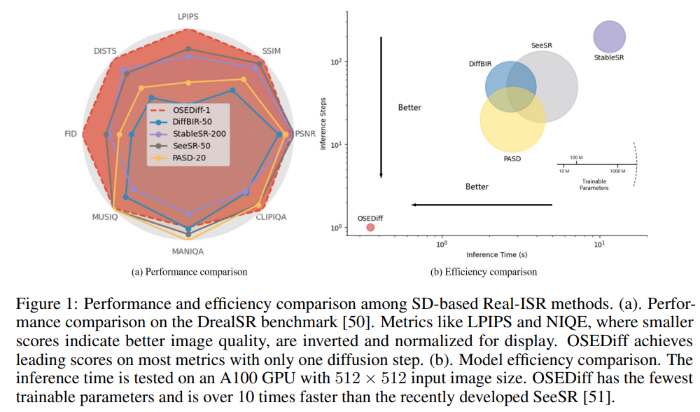

# One-Step Effective Diffusion Network for Real-World Image Super-Resolution

> "One-Step Effective Diffusion Network for Real-World Image Super-Resolution" Arxiv, 2024 Jun 12, `OSEDiff`
> [paper](http://arxiv.org/abs/2406.08177v2) [code](https://github.com/cswry/OSEDiff.) [pdf](./2024_06_Arxiv_One-Step-Effective-Diffusion-Network-for-Real-World-Image-Super-Resolution.pdf) [note](./2024_06_Arxiv_One-Step-Effective-Diffusion-Network-for-Real-World-Image-Super-Resolution_Note.md)
> Authors: Rongyuan Wu, Lingchen Sun, Zhiyuan Ma, Lei Zhang

## Key-point

- Task

- Problems

  太慢

  > ISR methods require multiple diffusion steps to reproduce the HQ image, increasing the computational cost

  随机噪声带来不确定性

  > the random noise introduces uncertainty in the output, which is unfriendly to image restoration tasks.

- :label: Label:

认为 LQ 已经有足够信息，可以直接去噪;

加了 KL 散度约束

> To ensure that the one-step diffusion model could yield HQ Real-ISR output, we apply variational score distillation in the latent space to conduct KL-divergence regularization

## Contributions

## Introduction

## methods

- 训练 LoRA 能够实现程度较小的去噪（噪声、细微划痕）

## setting

## Experiment

> ablation study 看那个模块有效，总结一下

学习一下这个图，很漂亮！:star:

为了评估速度，调整的参数量

比的主观指标参考一下

## Limitations

## Summary :star2:

> learn what & how to apply to our task

