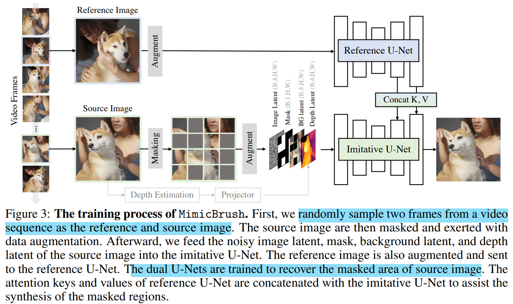

# Zero-shot Image Editing with Reference Imitation

> "Zero-shot Image Editing with Reference Imitation" Arxiv, 2024 Jun 11, `MimicBrush`
> [paper](http://arxiv.org/abs/2406.07547v1) [code](https://github.com/ali-vilab/MimicBrush) [pdf](./2024_06_Arxiv_Zero-shot-Image-Editing-with-Reference-Imitation.pdf) [note](./2024_06_Arxiv_Zero-shot-Image-Editing-with-Reference-Imitation_Note.md)
> Authors: Xi Chen, Yutong Feng, Mengting Chen, Yiyang Wang, Shilong Zhang, Yu Liu, Yujun Shen, Hengshuang Zhao

## Key-point

- Task: reference-based inpainting, `imitative editing`

- Problems

  文本没法很细致描述图像纹理 or 形状；

  先前 reference-source 数据很少；

  reference 需要指定目标区域一些场景能否简化

- :label: Label:


## Contributions


## Introduction

- Q：it is not feasible to describe the desired outcomes only with texts

>  A potential limitation is that only using text prompts could not fully express the user’s intention for some specific demands

- Q：reference 多余的信息很难判断啥不要
- Q：reference 图像对很难弄


### Image Customization

- "RealFill: Reference-Driven Generation for Authentic Image Completion" Arxiv, 2023 Sep 28
  [paper](http://arxiv.org/abs/2309.16668v1) [code](https://realfill.github.io) [pdf](./2023_09_Arxiv_RealFill--Reference-Driven-Generation-for-Authentic-Image-Completion.pdf) [note](./2023_09_Arxiv_RealFill--Reference-Driven-Generation-for-Authentic-Image-Completion_Note.md)
  Authors: Luming Tang, Nataniel Ruiz, Qinghao Chu, Yuanzhen Li, Aleksander Holynski, David E. Jacobs, Bharath Hariharan, Yael Pritch, Neal Wadhwa, Kfir Aberman, Michael Rubinstein

> RealFill requires 3-5 images for the same scene, and the finetuned model could only complete local regions of the trained scene


- "CLiC: Concept Learning in Context" CVPR, 2023 Nov 28 :star:
  [paper](http://arxiv.org/abs/2311.17083v1) [code]() [pdf](./2023_11_CVPR_CLiC--Concept-Learning-in-Context.pdf) [note](./2023_11_CVPR_CLiC--Concept-Learning-in-Context_Note.md)
  Authors: Mehdi Safaee, Aryan Mikaeili, Or Patashnik, Daniel Cohen-Or, Ali Mahdavi-Amiri

>  CLiC [35] could customize the local patterns to edit different objects, but it only demonstrates inner-category generalizations and still requires subject-specific fine-tuning

- "Dreambooth: Fine tuning text-to-image diffusion models for subject-driven generation"
- "Cones: Concept neurons in diffusion models for customized generation"


### Image composition

都是 inserting the full-object 的方法，没做到针对需要的区域优化

- Paint-by-example
- ObjectStitch

> use a CLIP image encoder to extract the representation of the object

- "AnyDoor: Zero-shot Object-level Image Customization" CVPR, 2023 Jul 18
  [paper](http://arxiv.org/abs/2307.09481v2) [code](https://damo-vilab.github.io/AnyDoor-Page/) [pdf](./2023_07_CVPR_AnyDoor--Zero-shot-Object-level-Image-Customization.pdf) [note](./2023_07_CVPR_AnyDoor--Zero-shot-Object-level-Image-Customization_Note.md)
  Authors: Xi Chen, Lianghua Huang, Yu Liu, Yujun Shen, Deli Zhao, Hengshuang Zhao

> uses DINOv2 [27] encoders and collects training samples from videos

- Reference-only controlnet. https://github.com/Mikubill/sd-webui-controlnet/ discussions/1236, 2023


### SD-correspondence

- "Emergent correspondence from image diffusion. In NeurIPS, 2023"
- "A tale of two features: Stable diffusion complements dino for zero-shot semantic correspondence." n NeurIPS, 2023

> prove that the pre-trained diffusion models contain strong prior to capture semantic correspondence


## methods




使用视频的两帧进行训练，reference 取另外一帧，source mask 掉，从而实现让 controlnet 自己去学习选选用 reference 具体区域；

> we randomly pick two frames from a video clip as the training samples of MimicBrush.
>
> MimicBrush learns to locate the corresponding visual information (e.g., the dog’s face)

没有用 text 信息

> raw video clips without text or tracking annotations

没有 masked 的 source 提取深度图作为可选输入？？？

> a depth map is extracted from the unmasked source image and then added to the imitative U-Net as an optional condition


### **Imitative U-Net**

**主体 UNet，**基于 SDv1.5 inpaint. 把输入通道数变为 13 通道;

> The imitative U-Net is initialized with a stable diffusion-1.5 [33] inpainting model. It takes a tensor with 13 channels as the input. 

- Q：text 怎么用？不用

CLIP text embedding 换为 CLIP image-embedding；学一个 MLP 统一通道数

> The original U-Net also takes the CLIP [31] text embedding as input via cross-attention. In this work, we replace it with the CLIP image embedding extract from the reference image
>
> add a trainable projection layer after the image embedding


- Q：train?

整个 UNet 和 ImageEmbedding MLP 都训练

> all the parameters of the imitative U-Net and the CLIP projection layer are optimizable


### Reference U-Net

initialized from a standard stable diffusion-1.5 

- Q：为啥用整个 UNet 作为 controlnet？

先前工作这么搞

> Recently, a bunch of works [56, 17, 46, 6, 58, 45] prove the effectiveness of leveraging an additional U-Net to extract the fine-grained features from the reference image.


参考 Magicanimate 对 Controlnet 过来的残差 concat 起来输入主体 UNet

- "Magicanimate: Temporally consistent human image animation using diffusion model"


- Q：实现？

TODO


### Conidtion

1. ControlNet 输入 reference image
2. 提取深度图

>  leverage Depth Anything [48] to predict the depth maps of the unmasked source image as a shape control, which enables MimicBrush to conduct texture transfer

- Q:train?

学一个 MLP 映射到 4 channel

> We freeze the depth model and add a trainable projector, which projects the predicted depth map (3-channel) to the depth latent (4-channel)

训练过程中选择性不要，来实现 optional

> we set a probability of 0.5 to drop the input of the depth model as all-zero maps.


### Train

为了保证鲁棒的 imitative edit，收集数据时候保证

1. reference 一定要相关；
2. source & reference 需要较大不同


从 Pexels 收集 10w 个视频

> We collect 100 k high-resolution videos from open-sourced websites like Pexels

使用 SAM 数据集，含有高质量 mask，有一千万图像 & 十亿 mask

> , we use the SAM [20] dataset that contains 10 million images and 1 billion object masks. We construct pseudo frames by applying strong data augmentations on the static images from SAM and leverage the object segmentation results for masking the source image.

视频数据和 SAM 做DA的数据 7 3 开

> During training, the sampling portions of the video and SAM data are 70% versus 30% as default.


#### sourcec & reference 选取

对于视频数据，SSIM 选取 source & reference

> Following [7], we use SSIM [42] as an indicator of the similarity between video frames
>
> We discard the frame pairs with too-big or too-small similarities to guarantee that the selected image pair contains both semantic correspondence and visual variations.

- Q：阈值？？


造数据

> collecting high-quality images is much easier than videos, we also construct pseudo frames by applying augmentations on the static images and leveraging the object segmentation results for masking the source image.


#### 对 source DA 

> applying the aggressive **color jitter, rotation, resizing, and flipping**, we also implement random projection transformation to simulate the stronger deformation


#### Mask 选取

SIFT 匹配点更高的区域更大概率去 mask

> To find more discriminative regions, we apply SIFT [25] matching between the source and reference images and get a series of matching points.
>
> Specifically, we increase the masking possibility of the grids with matched feature points


###  Evaluation Benchmark

Inter ：**source 和 ref 目标区域是不同物体**，source 中没有 inpaint 物体信息，迁移 ref 中的物体特征，没有 GT;

Inner：inpaint 区域 source 和 ref 为**同一物体**，有 GT


> [2,000+张最精彩的“Swan”图片 · 100%免费下载 · Pexels素材图片](https://www.pexels.com/zh-cn/search/swan/)

**根据 fashion, animal, product, and scenario 类别去这个网站上找** ，每个类别找 30 个 image-reference 对

Mask 手动画

> We manually draw the source mask to define the composition requirement

指标：DINO, CLIP similarities

> Thus, we could follow DreamBooth [34] to calculate the DINO [27] and CLIP [31] image similarities between the generated region and the annotated reference region.


 **inner-ID track**

找 image-reference 含有同一个物体的 pair，用 PSNR，SSIM，LPIPS 评估

> we collect 30 image pairs from **DreamBooth dataset**


**Texture transfer**

只改变纹理，因此提供原图的 depth，保证形状一致性；例如只改变帽子的纹理


## setting

- For the images with different aspect ratios, we first **pad the images as a square and then resize them to 512 × 512.**

- use the Adam [19] optimizer and set the learning rate as 1e-5

- a total batch size of 64 on 8× A100 GPUs

  每张卡 batchsize=8

- CFG

  > reference U-Net as classifier-free guidance and drop it during training with the probability of 10%. During inference, the guidance scale is 5 as default.

### Mask Strategy

- Q：如何 Mask 策略？

对 source 加 mask

>   For the masking strategy of the source image, we randomly choose the grid number N × N from 3 to 10. We set 75% chances to drop the grid with SIFT-matched features and set 50% chances for other regions.

SIFT

> As introduced in Sec. 3.3, these purely random masking strategies could cause a large number of low-quality training samples. In contrast, we leverage SIFT matching to enhance the masking and reach better performances (bottom row)


## Experiment

> ablation study 看那个模块有效，总结一下

主观效果

Row2 Row4 reference 中保持的**细节一致性很好**，文本都没有糊？


AnyDoor 可以指定 Mask，学习 correspondence 的负担更小，因此主观指标好一些；Fig5 挑了一些 AnyDoor 表现差的图和自己比，认为 AnyDoor 一致性很烂；


和 GT 的一致性很烂，PSNR 才 17 。。。


> We should note that the reference mask is given to AnyDoor. Therefore, it could forcedly locate the reference regions thus taking some advantages for the evaluation.


应用场景


### SD_correspondence

先前工作证明了 SD 具有对齐的能力

- "Emergent correspondence from image diffusion. In NeurIPS, 2023"
- "A tale of two features: Stable diffusion complements dino for zero-shot semantic correspondence." n NeurIPS, 2023

> prove that the pre-trained diffusion models contain strong prior to capture semantic correspondence


对比 SDv1.5 initialized Controlnet 和 DINOv2 的输入 cross-attention 的特征

**验证了SDv1.5 ControlNet 本身具有对齐的能力，并且生成细节纹理比 DINO 特征更逼真，但纹理一致性还是不足（看起来假），存在色偏**

> We replace the reference U-Net with the CLIP/DINOv2 image encoder and inject the 16 × 16 patch tokens within the cross-attention layers


### training data

verify the effectiveness of the “video-based” training pipeline 

- using the statistics images only, the performance for each task drops significantly

**验证了只用 DA 的图像训练效果很烂，而视频中的真实的画面变化能显著提升效果**

> object deformation or variation in videos is vital for realizing imitative editing


- 去除部分 DA 操作

> remove the strong color jitter, resizing, and projection transformation

发现如果不加 DA，不同物体的 reference 对应能力很烂，**验证了 DA 能够增加对齐的鲁棒性**

> We observe a clear degradation in part composition, specifically for the inter-ID track.


- 探索不同 mask 策略

> explore the different masking strategies

对比 `当前使用 SIFT 对 mask 区域筛选` vs `纯随机 mask 正方形区域（ using a single box and different gid ratios. ）`，验证了 SIFT 加入能够显著提升 mask 方式训练效果，提升 correspondence 学习能力

> we leverage SIFT matching to enhance the masking and reach better performances (bottom row)

主要看 DINO ，CLIP 主观指标；


- Q：texture transfer 怎么算 PSNR？


## Code

- target: 复现训练代码

**目前只有 gradio 推理代码 & 有模型结构**，从里面看一下目前有哪些 DA 写好的代码；**需要开发的 Dataset 处理流程**

- SSIM 筛选相似但不完全一样的 source，ref
- SIFT 匹配点更高的区域更大概率去 mask
- mask 使用 类似 MAE 方式处理
- depth
- background 如何获取？


gradio example


### **mask 预处理**

- 01mask: 1 标识要 inpaint 的区域，0 为已有不需要改的区域
- 结果融合：对 mask blur 一下再 fuse

```python
mask = np.where(mask > 128, 1, 0).astype(np.uint8)
mask_3 = np.stack([mask,mask,mask],-1).astype(np.uint8) * 255  # do blur after turn to 255
mask_alpha = mask_3.copy()
for i in range(10):
    mask_alpha = cv2.GaussianBlur(mask_alpha, (3, 3), 0)

# process
pass
synthesis, depth_pred = inference_single_image(ref_image.copy(), image.copy(), mask.copy(), *args)

# fuse
mask_3_bin = mask_alpha / 255
synthesis = synthesis * mask_3_bin + image * (1-mask_3_bin)
```


**pad 设置长宽一样长**

```
ref_image = pad_img_to_square(ref_image)
```


**贴图 collage**

需要补图的区域，在原图位置变为 0

```python
target_image = collage_region(target_image_low, target_image, target_mask)

def collage_region(low, high, mask):
    mask = (np.array(mask) > 128).astype(np.uint8)
    low = np.array(low).astype(np.uint8) 
    low = (low * 0).astype(np.uint8) 
    high = np.array(high).astype(np.uint8)
    mask_3 = mask 
    collage = low * mask_3 + high * (1-mask_3)
    collage = Image.fromarray(collage)
    return collage
```


### forward

> https://github.com/ali-vilab/MimicBrush/blob/main/mimicbrush/mimicbrush_referencenet.py#L82

```python
    pred, depth_pred = mimicbrush_model.generate(pil_image=ref_image, depth_image = depth_image, num_samples=1, num_inference_steps=num_inference_steps,
                            seed=seed, image=target_image, mask_image=mask_pt, strength=1.0, guidance_scale=guidance_scale)
```

- `pil_image=ref_image`
- `image=target_image,` 要 inpaint 的区域设置为了 0
-  `mask_image=mask_pt`


#### `clip_image embedding`

```python
from transformers import CLIPImageProcessor, CLIPVisionModelWithProjection

# load image encoder
self.image_encoder = CLIPVisionModelWithProjection.from_pretrained(self.image_encoder_path).to(
self.device, dtype=torch.float16
)
self.clip_image_processor = CLIPImageProcessor()

@torch.inference_mode()
def get_image_embeds(self, pil_image=None, clip_image_embeds=None):
    if isinstance(pil_image, Image.Image):
        pil_image = [pil_image]
        clip_image = self.clip_image_processor(images=pil_image, return_tensors="pt").pixel_values

        clip_image = clip_image.to(self.device, dtype=torch.float16)
        clip_image_embeds = self.image_encoder(clip_image, output_hidden_states=True).hidden_states[-2]
        image_prompt_embeds = self.image_proj_model(clip_image_embeds).to(dtype=torch.float16)

        uncond_clip_image_embeds = self.image_encoder(
            torch.zeros_like(clip_image), output_hidden_states=True
        ).hidden_states[-2]
        uncond_image_prompt_embeds = self.image_proj_model(uncond_clip_image_embeds)
        return image_prompt_embeds, uncond_image_prompt_embeds
```

由于输入数据增多了，要在搞一个 MLP 调整一下输入 Unet 的通道数

```python
    def init_proj(self):
        image_proj_model = LinearResampler(
            input_dim=1280,
            output_dim=self.pipe.unet.config.cross_attention_dim,  
        ).to(self.device, dtype=torch.float16)
        return image_proj_model
```

- Q：训练时候用 fp16？

TODO


#### depth

```
transform = Compose([
    Resize(
        width=518,
        height=518,
        resize_target=False,
        keep_aspect_ratio=True,
        ensure_multiple_of=14,
        resize_method='lower_bound',
        image_interpolation_method=cv2.INTER_CUBIC,
    ),
    NormalizeImage(mean=[0.485, 0.456, 0.406], std=[0.229, 0.224, 0.225]),
    PrepareForNet(),
])
```

forward

```
depth_image = depth_image.to(self.device)
depth_map = self.depth_estimator(depth_image).unsqueeze(1)
depth_feature = self.depth_guider(depth_map.to(self.device, dtype=torch.float16))
```


#### **pipeline**

- source_image=pil_image, >> reference 参考图
- image 为 source 图

```python
pipe = MimicBrushPipeline.from_pretrained(
    base_model_path,
    torch_dtype=torch.float16,
    scheduler=noise_scheduler,
    vae=vae,
    unet=unet,
    feature_extractor=None,
    safety_checker=None,
)

# forward
images = self.pipe(
    prompt_embeds=image_prompt_embeds , # image clip embedding 
    negative_prompt_embeds=uncond_image_prompt_embeds,  # uncond image clip embedding 
    guidance_scale=guidance_scale,
    num_inference_steps=num_inference_steps,
    generator=generator,
    referencenet=self.referencenet,
    source_image=pil_image,
    image = image,
    clip_image_embed= torch.cat([uncond_image_prompt_embeds, image_prompt_embeds], dim=0), # for reference U-Net
    depth_feature = depth_feature,
    **kwargs,
).images
```


- reference img 获取 VAE 特征；source image 初始 VAE 特征使用 noise；

```python
        source_image = source_image.to(device=device, dtype=dtype)
        source_image_latents = self._encode_vae_image(image=source_image, generator=generator)

        if latents is None:
            noise = randn_tensor(shape, generator=generator, device=device, dtype=dtype)
            # if strength is 1. then initialise the latents to noise, else initial to image + noise
            latents = noise if is_strength_max else self.scheduler.add_noise(image_latents, noise, timestep)
            # if pure noise then scale the initial latents by the  Scheduler's init sigma
            latents = latents * self.scheduler.init_noise_sigma if is_strength_max else latents
        else:
            noise = latents.to(device)
            latents = noise * self.scheduler.init_noise_sigma
```

- Mask resize
- Masked_source_image 提取 VAE 特征，作为 background feature

> https://github.com/ali-vilab/MimicBrush/blob/main/models/pipeline_mimicbrush.py#L690


- UNet 输入

```python
latent_model_input = torch.cat([latents] * 2) if self.do_classifier_free_guidance else latents
# concat latents, mask, masked_image_latents in the channel dimension
latent_model_input = self.scheduler.scale_model_input(latent_model_input, t)
#latent_model_input = torch.cat([latent_model_input, mask, masked_image_latents], dim=1)
latent_model_input = torch.cat([latent_model_input, mask, masked_image_latents, torch.cat([depth_feature] * 2)], dim=1)
```


## Limitations

- Q：完全不相关的图咋搞？

- 图中存在多个参考 or 参考区域很小，效果很烂；需要手动 crop + resize 放大

  > region is too small or multiple candidates exist in the reference image


## Summary :star2:

> learn what & how to apply to our task

- 对比 SDv1.5 initialized Controlnet 和 DINOv2 的输入 cross-attention 的特征，**验证了SDv1.5 ControlNet 本身具有对齐的能力 :star:，并且生成细节纹理比 DINO 特征更逼真，但纹理一致性还是不足（看起来假），存在色偏**

  与 GT 计算客观指标 PSNR=17，SSIM=0.7 都很低，主观指标 LPIPS 还ok

数据集上做更多 DA 尝试，也能发

- 验证了只用 DA 的图像训练效果很烂，而**视频中的真实的画面变化能显著提升效果**
- 发现如果不加 DA，不同物体的 reference 对应能力很烂，**验证了 DA 能够增加对齐的鲁棒性**
- 对比 `当前使用 SIFT 对 mask 区域筛选` vs `纯随机 mask 正方形区域（ using a single box and different gid ratios. ）`，验证了 **SIFT 加入能够显著提升 mask 方式训练效果**，提升 correspondence 学习能力


