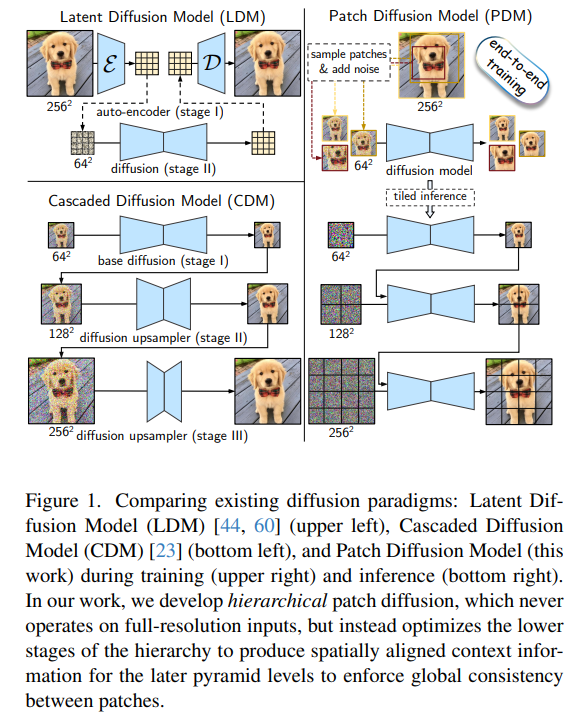

# Hierarchical Patch Diffusion Models for High-Resolution Video Generation

> "Hierarchical Patch Diffusion Models for High-Resolution Video Generation" CVPR, 2024 Jun 12, `HPDM`
> [paper](http://arxiv.org/abs/2406.07792v1) [code](https://github.com/snap-research/hpdm) [web](https://snap-research.github.io/hpdm) [pdf](./2024_06_CVPR_Hierarchical-Patch-Diffusion-Models-for-High-Resolution-Video-Generation.pdf) [note](./2024_06_CVPR_Hierarchical-Patch-Diffusion-Models-for-High-Resolution-Video-Generation_Note.md)
> Authors: Ivan Skorokhodov, Willi Menapace, Aliaksandr Siarohin, Sergey Tulyakov

## Key-point

- Task: High-Resolution Video Generation
- Problems
  - scaling Diffusion model to high-resolution inputs is challenging
- :label: Label:

## Contributions

- 提出了一个框架训练 patch diffusion models (PDMs)，预测 patches 之间的分布

  > In this work, we study **patch diffusion models (PDMs)** — a diffusion paradigm which models the distribution of patches, rather than whole inputs, keeping up to ≈0.7% of the original pixels
  >
  >  efficient during training and unlocks end-to-end optimization on high-resolution videos.

- 维持 **patches 之间一致性**：提出 deep context fusion 

  > to enforce consistency between patches, we develop deep context fusion — an architectural technique that propagates the context information from low-scale to high-scale patches in a hierarchical manner.

- 提出 adaptive computation 加速训练

  >  accelerate training and inference, we propose adaptive computation, which allocates more network capacity and computation towards coarse image details

- SOTA & our model is the **first diffusion-based architecture which is trained on such high resolutions**

  > sets a new state-of-the-art FVD score of 66.32 and Inception Score of 87.68 in class-conditional video generation on UCF-101 2562

  从 36 × 64 尺度到，upscale 达到 64×288×512 ！:open_mouth:

  > Then, we show that it can be rapidly fine-tuned from a base 36 × 64 low-resolution generator for high-resolution 64×288×512

## Introduction

- Q：先前做高分辨率输出咋搞？

**LDM 直接出图**，显存要求太高！

> requires an additional extensive hyperparameters search

**retraining an auto-encoder** requires retraining the latent generator, resulting in extra computational costs

### **Cascaded DM** 

多个 stage 有多个模型，不好训练，没法 end2end

>  Splitting the architecture into several stages but **having multiple components in the pipeline makes it harder to tune** and complicates downstream tasks like editing or distillation.

不方便迁移到下游任务

> Also, having multiple components complicates downstream applications

计算量太大，导致没法 end2end :star:

> The main obstacle to move a standard high-resolution DM onto end-to-end rails is an increased computational burden.

### patch-wise

>  In the past, patch-wise training proved successful for GAN training for high-resolution image [52], video (e.g., [53, 70]) and 3D (e.g., [48, 54]) synthesis, but, however, has not picked up much momentum in the diffusion space

**GAN-related**

high-resolution image

- "Aligning Latent and Image Spaces to Connect the Unconnectable" 
  [paper](https://arxiv.org/abs/2104.06954)

video

- "StyleGAN-V: A Continuous Video Generator with the Price, Image Quality and Perks of StyleGAN2"
  [paper](https://arxiv.org/pdf/2112.14683)
- "Generating Videos with Dynamics-aware Implicit Generative Adversarial Networks" 
  [paper](https://arxiv.org/abs/2202.10571)

3D

- "Graf: Generative radiance fields for 3d-aware image synthesis"

- " Epigraf: Rethinking training of 3d gans"

**diffusion**

> none of them considers the required level of input sparsity to scale to high-resolution videos

- "Patch Diffusion: Faster and More Data-Efficient Training of Diffusion Models" :star:
  [paper](https://arxiv.org/pdf/2304.12526)

> PatchDiffusion still relies on full-resolution training for 50% of its optimization (so it is not purely patch-wise),

单个 patch 为单位去训练，本文用的多个 patch 一起训练

> For our patch-wise training, we consider a hierarchy of patches instead of treating them independently [64], which means that the synthesis of high-resolution patches is **conditioned on the previuosly generated low-resolution ones**

- "Fast training of diffusion models with masked transformers" `MAskDiT`

> MaskDIT preserves ≈50% of the original input.

**能在 $1024^2$ 尺寸图像生成的 diffusion 模型**

- " Scalable high-resolution pixel-space image synthesis with hourglass diffusion transformers"
- "Matryoshka diffusion models"
- "simple diffusion: End-to-end diffusion for high resolution images"
- "Understanding the diffusion objective as a weighted integral of elbos"

> w exist end-to-end image diffusion models that are able to train even on 10242 resolution

本文实验只保留 0.7% 的信息量用于训练，framework参考

- "Scalable adaptive computation for iterative generation" `RIN`

加上 adaptive computation 能降低 4GB 显存！:star:

不同于 `PatchDiffusion` 以单个 patch为单位，本文用类似 cascaded DM 的方法将多个 patch 同时训练

> For our patch-wise training, we consider a hierarchy of patches instead of treating them independently [64], which means that the synthesis of high-resolution patches is conditioned on the previuosly generated low-resolution one

- "Cascaded diffusion models for high fidelity image generation" `CascadedDMs`

> we develop two principled techniques: deep context fusion and adaptive computation

提出 2 个模块

> we develop two principled techniques: deep context fusion and adaptive computation

-  deep context fusion 融合全局信息
- Adaptive computation 融合多个 patch

用 RIN 作为 baseline 改进

- "Scalable adaptive computation for iterative generation" `RIN`

- 在 UCF-101 数据集上 $64 \times 256^2$ 做 text2video 实验

### LDM vs CDM

> two main conceptual paradigms on how to structure a high-resolution diffusion-based generator: latent diffusion models (LDM) [[44] and cascaded diffusion models (CDM)

### VideoDM

按时间线介绍了一下

- "Video diffusion models"
- "Vidm: Video implicit diffusion models" AAAI
- "Imagen video: High definition video generation with diffusion models"

> achieving photorealistic quality

- "Video probabilistic diffusion models in projected latent space"

> trains a diffusion model in a spatially decomposed latent space.

- "Make-a-video: Text-to-video generation without text-video data"

> unsupervised video collection in training a text-to-video generator by fine-tuning a text-to-image generator

- "Preserve your own correlation: A noise prior for video diffusion models" `PYoCo`
- "Videofusion: Decomposed diffusion models for high-quality video generation" `VideoFusion`

> design specialized noise structures for video generation

**limited resources by fine-tuning a publicly available StableDiffusion**

- "Align your latents: High-resolution video synthesis with latent diffusion models"
- "Animatediff: Animate your personalized text-to-image diffusion models without specific tuning"
- "Videofusion: Decomposed diffusion models for high-quality video generation" `VideoFusion`

-  time-continuous diffusion models?

"Elucidating the design space of diffusion-based generative models"

### RIN

- "Scalable adaptive computation for iterative generation"

  [paper](https://arxiv.org/pdf/2212.11972)

> RIN blocks do not employ an expensive self-attention mechanism [61] and instead rely on **linear cross-attention layers with a set of learnable latent token**s. This allows to scale gracefully with input resolution without sacrificing communication between far-away input locations

## methods

PatchDiffusion 引入整张图，本文不需要全图

> Our high-level patch diffusion design is different from PatchDiffusion [64] in that our model never operates on full-resolution inputs. 

提出使用多个 scale 的 patch，节省显存

> Instead, we consider a hierarchical cascade-like structure consisting of L stages and patch scales sℓ decrease exponentially: sℓ = 1/2 ℓ for ℓ ∈ {0, 1, ..., L}. Patches are always of the same resolution r = (rf , rh, rw)

用原始尺寸的 p 作为 loss 训练

> Hierarchical patch diffusion is trained to jointly denoise a combination of these patches

后面有 3 个模块！

> we elaborate on three fundamental components of our method that allow a patch-wise paradigm to achieve state-of-the-art results in video generation: **deep context fusion, adaptive computation and overlapped sampling**

**训练 framework**，只用一个 patch 去训练模型，会 rescale 多个 patch 一起去噪，然后 LR stage 提取特征融合到后面 stage :star:

推理的 framework还是很类似 Cascaded DMs，所以**会有多个 scale 的 LR 图像**

### Deep Context Fusion

- Q: Cascaded DMs 问题？

> The main struggle of patch-wise models is preserving the **consistency between the patches**

Cascaded DMs 直接把先前 LR 图像 resize concat 到现在的 latents 上，但本文实验**发现性能降低很多**。。

也限制了信息在跨越多个 stage 间的传递

> While it can provide the global context information when the model operates on a full-resolution input, for patch-wise models, this leads to **drastic context cutouts**, which, as we demonstrate in our experiments, severely worsens the performance.
>
> Also, it limits the knowledge sharing between lower and higher stages of the cascade

提出 DCF 用**前面 stage 的特征作为全局信息**引入到当前 stage

> To address this issue, we introduce **deep context fusion (DCF),** a context fusion strategy that conditions the higher stages of the pyramid on **spatially aligned, globally pooled features** from the previous stages.

> For this, we use the patch coordinates to grid-sample the activations with trilinear interpolation from all previous pyramid stages, average them, and concatenate to the current-stage features.

**看前面 framework 图，推理也是类似 CascadedDMs 方式做的，区别在于：**（看下面 fig3 理解就ok了）

在过当前 stage 之前，把前几个 LR stage 中对应位置去 **grid-sample 采样更小 scale 图像的激活层特征** :star: ，平均一下concat 到当前层上面

> For this, we use the patch coordinates to grid-sample the activations with trilinear interpolation from all previous pyramid stages, average them, and concatenate to the current-stage features.

- 多个 scale 激活层的特征取平均，作为前面全局特征 $ctx^b_l$
- 当前 scale 特征 $a_l$ ，对应 patch 在原图中的坐标：$\hat{c_l}(c_l, c_k)$ 

3个特征 concat 起来过一个 MLP，发现略微提升了一点点一致性。。。（可以看作几乎没有了）

- Q： other aggregation strategies ？为啥要把之前 stage 特征取平均？

> We considered other aggregation strategies, like concatenating all the levels’s features or averaging, but the former one blows up the dimensionalities,

太耗显存了。。

- Q: 坐标怎么 concat？:question:

- Q：对比 cascaded DMs 融合的效果（直接把 LR 图像 resize concat 到 latents 上）?

训练 framework 是**同时去噪多个 patch**，因此前面 stage 的特征用到后面，可以 push 模型 early stage 学习对于后面 stage 有用的信息

> An additional advantage of DCF compared to shallow context fusion of regular cascaded DMs is that the gradient can flow from the small-scale patch denoising loss to the lower levels of the hierarchy, **pushing the earlier cascade stages to learn such features that are more useful to the later ones**

效果好了一丢

> We found that this is indeed helpful in practice and improves the overall performance additionally by ≈5%

### Adaptive Computation

生成高清细节，比生成低分辨率结构更简单。。**因此对于高分辨率的 patch 不想用这么多资源**

> Naturally, generating high-resolution details is considered to be easier than synthesizing the low-resolution structure [12]
>
> - "Swagan: A style-based wavelet-driven generative model" `TOG`

在高 scale 的分支，减少计算模块的数量，因此称作 `adaptive computation` :star:

> In this way, allocating the same amount of network capacity on high-resolution patches can be excessive, that is why we propose to use only some of the computational blocks when running the last stages of the pyramid

block 个数的选取，越多性能越好

> We chose to allocate the later blocks to perform full computation to make the low-level context information go through more processing before being propagated to the higher stages.  For the block allocations, we observed that simply increasing the computation assignments linearly with the block index worked well in practice.

### Tiled Inference

这种 CascadedDMs 把 text2image 问题分解：先生成大致结构，再去生成细节纹理 :star:

patch scale s = 1/2

> to generate a complete video x ∈ R Rf ×Rh×Rw , we first generate (2Rf −1)×(2Rh−1)×(2Rw −1) **patches with 50% of the coordinates overlapping between two neighboring patches.** Then, we run the reverse diffusion process for each patch

### Miscellaneous techniques

> there are several other techniques that played an important role in bolstering the performance

**Integer patch coordinates**

> Integer patch coordinates. We noticed that sampling a patch on the L-th cascade level at integer coordinates allows to prevent blurry artifacts in generated videos: they appear due to oversmoothness effects of trilinear interpolation.

noise 加的程度逐渐减小

> use exponentially smaller input noise scaling with each increase in pyramid level.
>
> - "On the importance of noise scheduling for diffusion models"

**Cached inference**，推理的时候把之前的特征 CPU offloading :star:

## setting

- Training

we launched a large-scale experiment for HPDM with **≈4B parameters** on a text/video dataset consisting of **≈95M samples**

- Eval
  - FVD
  - Inception Score (IS)
  - an FVD variant computed on just 512 generated videos

说了用一个 80G A100

- caching 

 However, for the large model, **caching needs to be implemented with CPU offloading** to prevent GPU out-of-memory errors.

## Experiment

> ablation study 看那个模块有效，总结一下

- 微调很快，it15000 就ok

## Limitations

列出的样例，不一致还是很明显的。。。

误差传播 :star:

- 不一致情况还是很明显，也有误差传播，纹理细节也不是很好（人脸都糊掉了），对于复杂纹理，是否合适这种先生成粗略的，再细化的方式呢

  还是原本就该搞一个 3D 高分辨率的，只不过是去用不同的焦距去看

## Summary :star2:

> learn what

- 生成高清细节，比生成低分辨率结构更简单。**因此对于高分辨率的 patch 不想用这么多资源**

  在高 scale 的分支，减少计算模块的数量，因此称作 `adaptive computation` :star:

- 这种 CascadedDMs 把 text2image 问题分解：先生成大致结构，再去生成细节纹理 :star:

- 看下怎么把 coordinate 引入 :star:

- **训练 framework**，只用一个 patch 去训练模型，会 rescale 多个 patch 一起去噪，然后 LR stage 提取特征融合到后面 stage

### how to apply to our task

- Q：时序上怎么维持一致性？

  单个 patch 内部依赖模型本身 & **前后 patch 多个尺度同时训练**

- **Cached inference**，推理的时候把之前的特征 CPU offloading :star:

- 不一致情况还是很明显，也有误差传播，纹理细节也不是很好（人脸都糊掉了），对于复杂纹理，是否合适这种先生成粗略的，再细化的方式呢

  还是原本就该搞一个 3D 高分辨率的，只不过是去用不同的焦距去看

