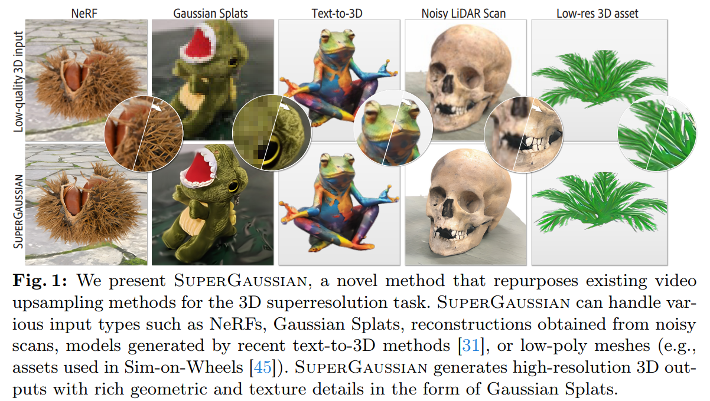

# SuperGaussian: Repurposing Video Models for 3D Super Resolution

> "SuperGaussian: Repurposing Video Models for 3D Super Resolution" ECCV, 2024 Jun 2
> [paper](http://arxiv.org/abs/2406.00609v4) [code]() [pdf](./2024_06_ECCV_SuperGaussian--Repurposing-Video-Models-for-3D-Super-Resolution.pdf) [note](./2024_06_ECCV_SuperGaussian--Repurposing-Video-Models-for-3D-Super-Resolution_Note.md)
> Authors: Yuan Shen, Duygu Ceylan, Paul Guerrero, Zexiang Xu, Niloy J. Mitra, Shenlong Wang, Anna Frühstück

## Key-point

- Task
- Problems
- :label: Label:

## Contributions

- re-purposing pretrained video upsampling models for 3D super-resolution

## Introduction

## methods

## setting

- Our models are trained on 64 A100 GPUs, each with 80GB VRAM.

## Experiment

> ablation study 看那个模块有效，总结一下

## Limitations

## Summary :star2:

> learn what

### how to apply to our task

