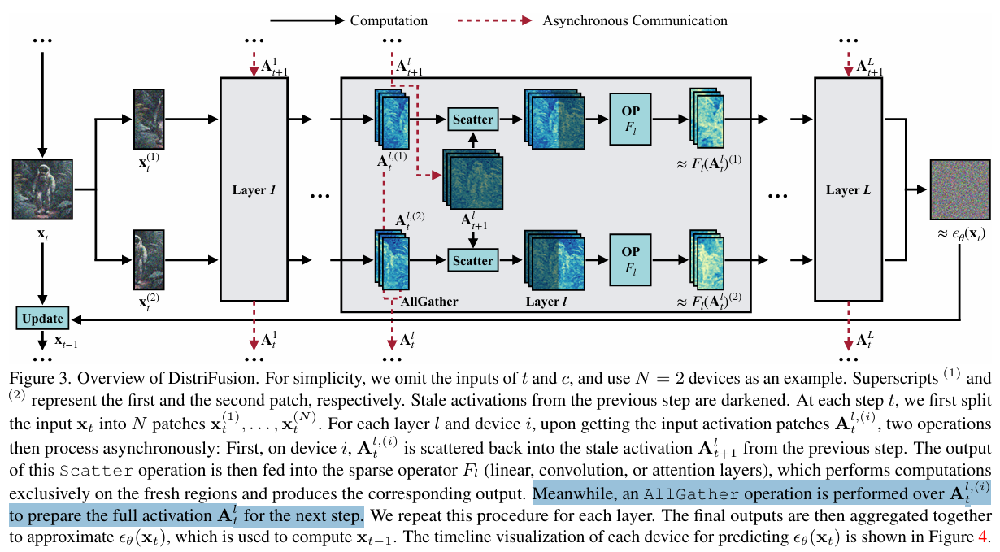
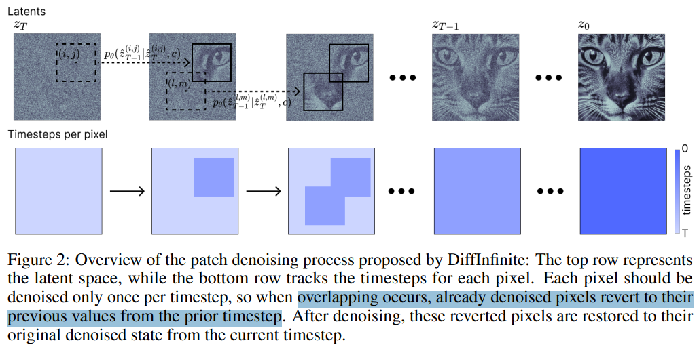

# Is One GPU Enough? Pushing Image Generation at Higher-Resolutions with Foundation Models

> "Is One GPU Enough? Pushing Image Generation at Higher-Resolutions with Foundation Models" NIPS, 2024 Jun 11, `DiffInfinite`
> [paper](http://arxiv.org/abs/2406.07251v3) [code](https://github.com/Thanos-DB/Pixelsmith) [pdf](./2024_06_NIPS_Is-One-GPU-Enough--Pushing-Image-Generation-at-Higher-Resolutions-with-Foundation-Models.pdf) [note](./2024_06_NIPS_Is-One-GPU-Enough--Pushing-Image-Generation-at-Higher-Resolutions-with-Foundation-Models_Note.md)
> Authors: Athanasios Tragakis, Marco Aversa, Chaitanya Kaul, Roderick Murray-Smith, Daniele Faccio

## Key-point

- Task
- Problems
- :label: Label:

## Contributions

- We are the first to show that it is possible to scale the output of a pre-trained diffusion model by a factor of 1000, opening the road for gigapixel image generation at no additional cost.
- 提出一个 slider 模块

> For the guidance, we introduce the Slider, a tunable mechanism that fuses the overall structure contained in the first-generated image with enhanced fine details. 

- 逐个 patch 处理

> At each inference step, we denoise patches rather than the entire latent space, minimizing memory demands such that a single GPU can handle the process

- SOTA + reduce artifact

## Introduction

- 192x340 做 x16 SR 纹理完全就改掉了。。。但 patch 一致性还可以啊，只能说明 24G 上能跑

### patch sample

- "DistriFusion: Distributed Parallel Inference for High-Resolution Diffusion Models" CVPR, 2024 Feb 29
  [paper](http://arxiv.org/abs/2402.19481v4) [code](https://github.com/mit-han-lab/distrifuser.) [pdf](./2024_02_CVPR_DistriFusion--Distributed-Parallel-Inference-for-High-Resolution-Diffusion-Models.pdf) [note](./2024_02_CVPR_DistriFusion--Distributed-Parallel-Inference-for-High-Resolution-Diffusion-Models_Note.md)
  Authors: Muyang Li, Tianle Cai, Jiaxin Cao, Qinsheng Zhang, Han Cai, Junjie Bai, Yangqing Jia, Ming-Yu Liu, Kai Li, Song Han

> distribute this load across multiple GPUs, but this requires expensive hardware. 

- "DiffInfinite: Large Mask-Image Synthesis via Parallel Random Patch Diffusion in Histopathology" NIPS, 2023 Jun 23
  [paper](http://arxiv.org/abs/2306.13384v2) [code]() [pdf](./2023_06_NIPS_DiffInfinite--Large-Mask-Image-Synthesis-via-Parallel-Random-Patch-Diffusion-in-Histopathology.pdf) [note](./2023_06_NIPS_DiffInfinite--Large-Mask-Image-Synthesis-via-Parallel-Random-Patch-Diffusion-in-Histopathology_Note.md)
  Authors: Marco Aversa, Gabriel Nobis, Miriam Hägele, Kai Standvoss, Mihaela Chirica, Roderick Murray-Smith, Ahmed Alaa, Lukas Ruff, Daniela Ivanova, Wojciech Samek, Frederick Klauschen, Bruno Sanguinetti, Luis Oala

用这篇做 baseline

> To address this, we adapted and refined the DiffInfinite sampling method Aversa et al. [2024] for text-to-image DMs, enabling ultra-highresolution generation efficiently on a single GPU.

## methods

流程和 DemoDiffusion 差不多，加了一个 FFT，把 residual 相位取均值，幅值用新的

> Left of Slider (Guided Generation): guidance latents control the image generation. The framework fuses guidance latents (green patches) with high-resolution latents (purple patches) using the Fast Fourier Transformation (FFT). The phases are averaged and combined with the amplitude, then transformed back via the inverse FFT (iFFT)

overlap 区域的一致性通过再次加噪 + 去噪实现

### overlap

> Overlapping patches can sometimes cause visible differences at their borders. To address this, we introduce a transition zone where the values of overlapping patches at timestep t are averaged, producing a smooth and seamless denoised output

1. 重叠区域重复加噪有点用，但作用不明显
2. overlap 区域只对边缘取 avg，纹理糊掉了。。。

## setting

- Pixelsmith is tested on a single RTX 3090 GPU, with all tested resolutions requiring 8.4 GB of memory

## Experiment

> ablation study 看那个模块有效，总结一下

- 右下角船只的纹理不一致。。。

对比 DemoFusion，DemoFusion 是重复物体。。。这篇是纹理改变超级多，方法没法细看。。。

这里 SR 改变了纹理，美其名曰说是 correction 。。。

## Limitations

- 192x340 做 x16 SR 纹理完全就改掉了。。。

## Summary :star2:

> learn what

### how to apply to our task

1. overlap 区域重复加噪用处不明显，还是有 artifact
2. overlap 区域也只是 avg，纹理糊掉了。。。
3. 对比 DemoFusion，DemoFusion 是重复物体。。。这篇是纹理改变超级多，方法没法细看。。。
4. 这里 SR 改变了纹理，美其名曰说是 correction 。。。

