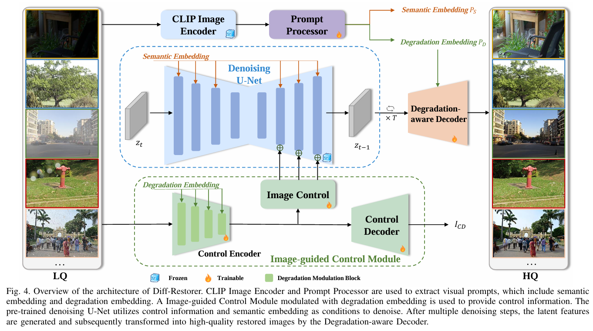
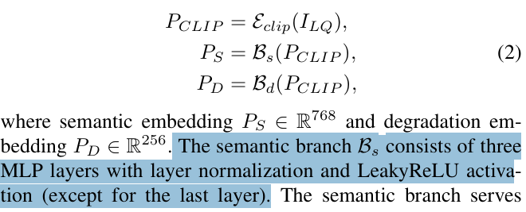
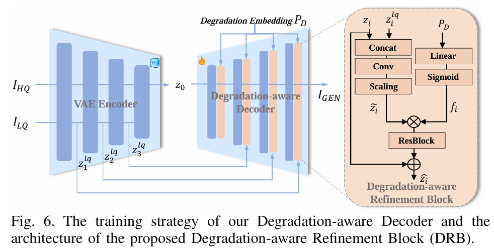
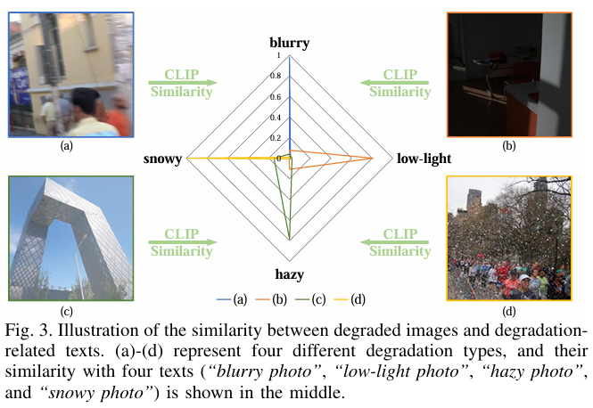
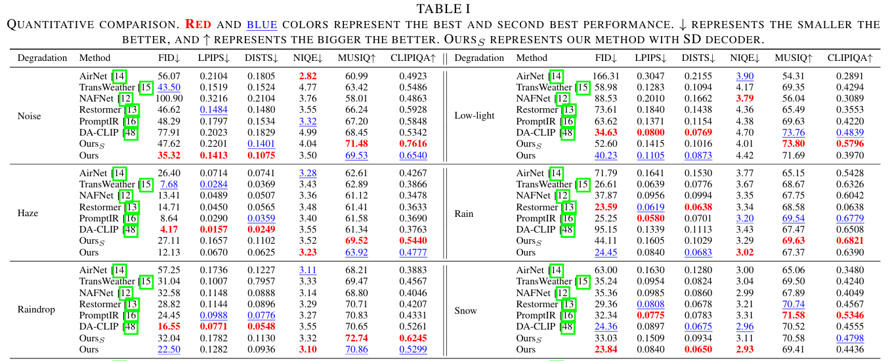

# Diff-Restorer: Unleashing Visual Prompts for Diffusion-based Universal Image Restoration

> "Diff-Restorer: Unleashing Visual Prompts for Diffusion-based Universal Image Restoration" Arxiv, 2024 Jul 4
> [paper](http://arxiv.org/abs/2407.03636v1) [code]() [pdf](./2024_07_Arxiv_Diff-Restorer--Unleashing-Visual-Prompts-for-Diffusion-based-Universal-Image-Restoration.pdf) [note](./2024_07_Arxiv_Diff-Restorer--Unleashing-Visual-Prompts-for-Diffusion-based-Universal-Image-Restoration_Note.md)
> Authors: Yuhong Zhang, Hengsheng Zhang, Xinning Chai, Zhengxue Cheng, Rong Xie, Li Song, Wenjun Zhang

## Key-point

- Task: Image restoration
- Problems
  -  it is challenging for a model trained for single tasks to handle real-world restoration problems effectively
  - suffer from over-smoothing and lack of realism in the restored results

- :label: Label:

## Contributions

- leverage the prior knowledge of Stable Diffusion to remove degradation while generating high perceptual quality restoration results

- 优化 CLIP Image

  > we utilize the pre-trained visual language model to extract visual prompts from degraded images, including semantic and degradation embeddings. The semantic embeddings serve as content prompts to guide the diffusion model for generation.

- CLIP degraded embeddings 引导 diffusion 生成结构信息

  >  the degradation embeddings modulate the Image-guided Control Module to generate spatial priors for controlling the spatial structure of the diffusion process

- we design a **Degradation-aware Decoder** to perform structural correction and convert the latent code to the pixel domain.

## Introduction

- "Controlling Vision-Language Models for Multi-Task Image Restoration" ICLR, 2023 Oct 2
  [paper](http://arxiv.org/abs/2310.01018v2) [code](https://github.com/Algolzw/daclip-uir.) [pdf](./2023_10_ICLR_Controlling-Vision-Language-Models-for-Multi-Task-Image-Restoration.pdf) [note](./2023_10_ICLR_Controlling-Vision-Language-Models-for-Multi-Task-Image-Restoration_Note.md)
  Authors: Ziwei Luo, Fredrik K. Gustafsson, Zheng Zhao, Jens Sjölund, Thomas B. Schön

## methods

### prompt processor

> For the universal image restoration task, we aim to extract both semantic information and degrada tion information from the low-quality image.
>
> **The semantic information** is fed into the U-Net of the diffusion model through cross-attention, guiding the image generation process.
>
> **The degradation information** helps to differentiate between different degradation tasks and assist the Image-guided Control Module for the restoration task. 

直接用 CLIP 特征，生成图像会有 degradation pattern

>  If the input image ILQ is degraded, the image embedding $P_{CLIP}$ from CLIP image encoder Eclip will inherently contain corresponding degradation information. Due to the presence of degradation in the embedding, the synthesized image will inevitably reflect the associated degradation patterns.

有两个分支

> we propose a Prompt Processor that consists of two branches: a semantic branch Bs for extracting semantic information PS and a degradation branch Bd for identifying degradation information PD. 

1.  a semantic branch 提取无噪声的图像特征，与文本对齐

   > **The semantic branch Bs consists of three MLP layers with layer normalization and LeakyReLU activation** (except for the last layer). The semantic branch serves two purposes: first, to generate a degradation-independent semantic representation by excluding the degradation informa tion contained in PCLIP, and second, to align with the text embedding commonly used in the T2I diffusion model. 

2. a degradation branch

   > The degradation branch Bd consists of two MLP layers with layer normalization and LeakyReLU activation (except for the last layer) to identify the degradation information in PCLIP and assist the image restoration process.

- Q：semantic embedding 看起来像是代替 文本 prompt 输入 SD？

TODO

- Q：degradation branch 怎么学习？

> To ensure that the degradation branch effectively learns the degradation information, we draw inspiration from [18] and design a degradation-aware guidance loss to guide the network in learning useful degradation information. 

学一个 MLP 分类头，增加一个分类的 loss

> we design a simple MLP layer as a classification network C with the degradation type as the target, such that d = C(Ed), where d ∈ RN and N represents the number of degradation types.

### VAE modified

直接用原来的 VAE 有 distortion。因此设计了 Degradation aware Decoder **微调 VAE Decoder**，引入 Encoder 中间特征 & 加入 RDB 模块引入 CLIP 的 degradation 特征。

> The pre-trained SD adopts the VAE to compress the images into latent codes for diffusion and reduce computational costs. However, due to the compression of VAE, employing the original SD VAE’s decoder to decode the latent codes can result in certain issues of details distortion [51]

- 训练参考 "Designing a better asymmetric vqgan for stablediffusion"

## setting

- We employ the pre-trainedSD 1.5 3model as thebasepre-trainedmodel
- ControlNet 训练，2 个 A100, 150h （6days)

> wefinetune themodelwithAdamWoptimizer [69] for 100 epochs. The batch size and the learning rate are set to16 and 1e-5. All experiments are conducted on twoNVIDIA A100GPUs. The training time is about 150hours.

- VAE 训练 75 h， (3 day)

  > To train theDegradation-awareDecoder,wefinetune themodel withAdamWoptimizer [69] for25epochs.Thebatchsizeis 4andthelearningrateisthesameasthetrainingofdiffusion model.Thetrainingtimeof thedecoder isabout75hours.

## Experiment

> ablation study 看那个模块有效，总结一下

- This experimental observation indicates that CLIP can serve as an indicator to distinguish different degradation types of images.

- 学习下，**每个退化类型数据作为一个小的子集，测试指标**
- 5 个 related 方法足够了

## Limitations

## Summary :star2:

> learn what

### how to apply to our task

- 直接用原来的 VAE 有 distortion。因此设计了 Degradation aware Decoder **微调 VAE Decoder**，引入 Encoder 中间特征 & 加入 RDB 模块引入 CLIP 的 degradation 特征。

