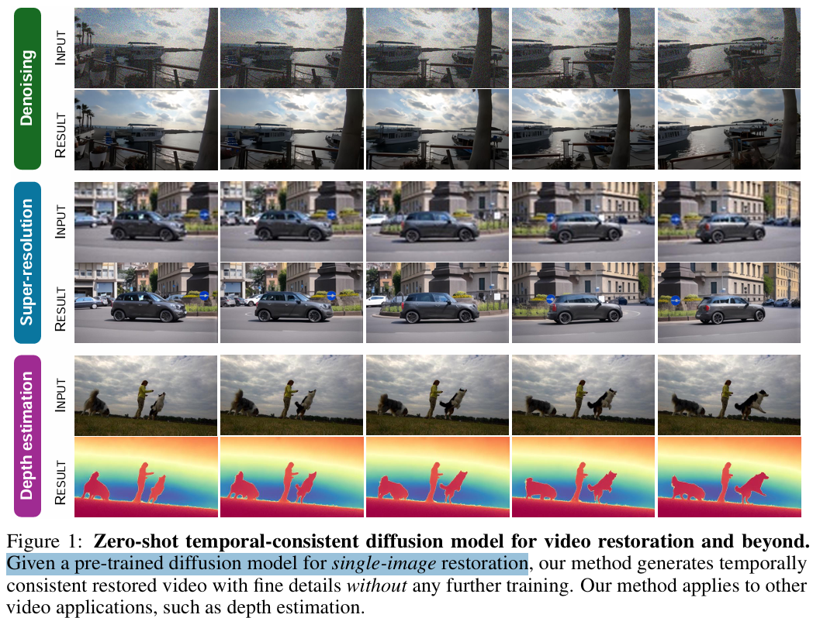
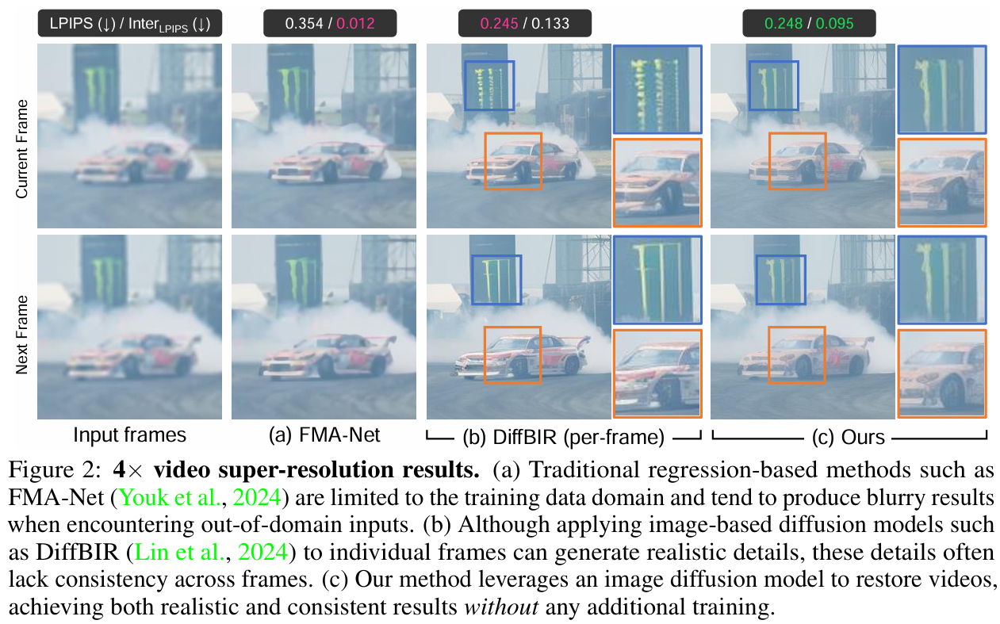
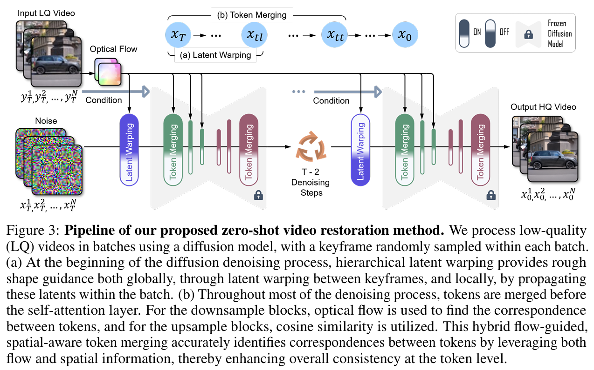
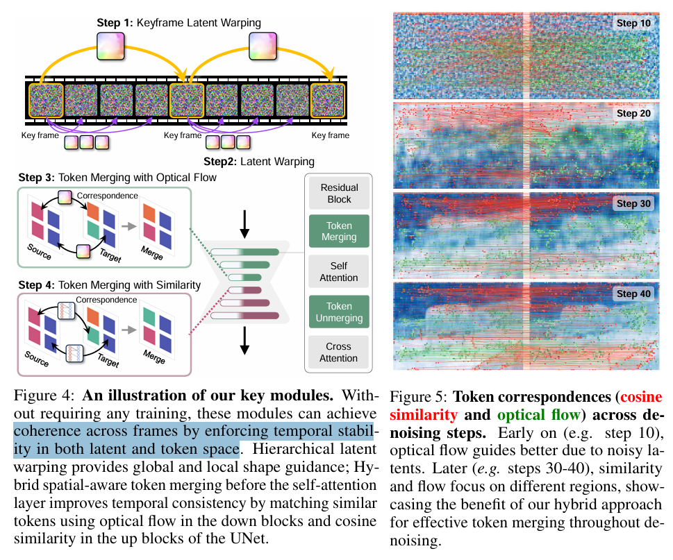

# DiffIR2VR-Zero: Zero-Shot Video Restoration with Diffusion-based Image Restoration Models

> "DiffIR2VR-Zero: Zero-Shot Video Restoration with Diffusion-based Image Restoration Models" Arxiv, 2024 Jul 1
> [paper](http://arxiv.org/abs/2407.01519v3) [web](https://jimmycv07.github.io/DiffIR2VR_web/) [code](https://github.com/jimmycv07/DiffIR2VR-Zero) [pdf](./2024_07_Arxiv_DiffIR2VR-Zero--Zero-Shot-Video-Restoration-with-Diffusion-based-Image-Restoration-Models.pdf) [note](./2024_07_Arxiv_DiffIR2VR-Zero--Zero-Shot-Video-Restoration-with-Diffusion-based-Image-Restoration-Models_Note.md)
> Authors: Chang-Han Yeh, Chin-Yang Lin, Zhixiang Wang, Chi-Wei Hsiao, Ting-Hsuan Chen, Hau-Shiang Shiu, Yu-Lun Liu

## Key-point

- Task: zero-shot video restoration using pre-trained image restoration diffusion models
- Problems
- :label: Label:

## Contributions

- zero-shot 使用 Image Diffusion 做 video restoration；
- 支持多种任务，修复 & SR & 深度估计
- 使提出一个混合的 warping strategy，用光流 & 关键点匹配

> Our approach uses a hierarchical latent warping strategy for keyframes and local frames, combined with token merging that uses a hybrid correspondence mechanism that integrates spatial information, optical flow, and feature-based matching.

- SOTA in zero-shot

## Introduction

x4 超分，能看出来车子的形态都和变化了超级多

## methods

提出在 self-attn 之前使用 token merging 策略。**基于光流 warp 各个帧的特征**

> Throughout most of the denoising process, tokens are merged before the self-attention layer. For the downsample blocks, optical flow is used to find the correspondence between tokens, and for the upsample blocks, cosine similarity is utilized.

在每一个 attention 模块都用光流 warp 一下，代替 AnimateDiff temporal attn 模块

- Q：光流有噪声的。。。
- Q：有效性验证？

对各帧的特征用关键点匹配，**发现去噪 step 的增加，匹配点数逐渐增加，来说明特征用光流做匹配还是有点用的**

> 看效果来说，有点用但不多

- Q：720p 视频咋推理？

??

> For video super-resolution, we evaluate on REDS4 (Nah et al., 2019), Vid4 (Liu &Sun, 2013) and DAVIS (Perazzi et al., 2016a) testing sets, with downsample scales ×4 and ×8, following the degradation pipeline of RealBasicVSR (Chan et al., 2022). 

## setting

## Experiment

> ablation study 看那个模块有效，总结一下

## Limitations

https://jimmycv07.github.io/DiffIR2VR_web/ 里面展示的 DAVIS 数据，超级模糊；不一致很严重

x4 超分，能看出来车子的形态都和变化了超级多，效果不理想

## Summary :star2:

> learn what

### how to apply to our task

- 参考下怎么把 Image Diffusion 直接用到视频上，代替掉 pretrained AnimateDiff（0.4B 参数没法和 Controlnet 一起训练）

