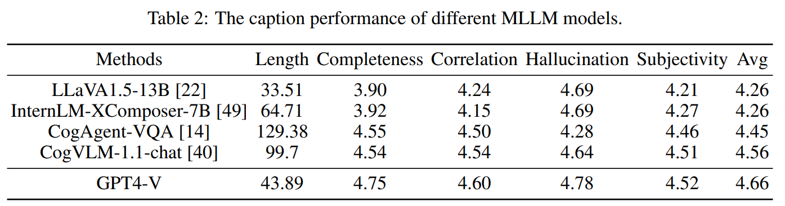

# Kolors: Effective Training of Diffusion Model for Photorealistic Text-to-Image Synthesis

> "Kolors: Effective Training of Diffusion Model for Photorealistic Text-to-Image Synthesis" Arxiv, 2024 Jul 7
> [paper](https://github.com/Kwai-Kolors/Kolors/blob/master/imgs/Kolors_paper.pdf) [code](https://github.com/Kwai-Kolors/Kolors) [pdf](./2024_07_Arxiv_Kolors--Effective-Training-of-Diffusion-Model-for-Photorealistic-Text-to-Image-Synthesis.pdf) [note](./2024_07_Arxiv_Kolors--Effective-Training-of-Diffusion-Model-for-Photorealistic-Text-to-Image-Synthesis_Note.md)
> Authors: Kolors Team

## Key-point

- Task:  text-to-image synthesis
- Problems
- :label: Label:


## Contributions

- 提升中文、英文理解能力

  is built upon the General Language Model 

  employ a multimodal large language model to recaption the extensive training dataset for fine-grained text understanding

- 设计 2 阶段训练，画质细节很好

  we divide the **training of Kolors into two phases**: the concept learning phase with broad knowledge and the quality improvement phase with specifically curated high-aesthetic data.

-  investigate the critical role of the **noise schedule** and introduce a novel schedule to optimize high-resolution image generation.

- propose a category-balanced benchmark **KolorsPrompts**, which serves as a guide for the training and evaluation of Kolors.

- 与闭源 SOTA 效果接近 or 超过 Stable Diffusion 3 [9], DALL-E 3 [3], and Playground-v2.5


## Introduction

- UNet
  - SDXL
  - Imagen [34] from Google, and Emu [6] from Meta
- DiT
  - PixArt-α [5] and Stable Diffusion 3


- Q：中文理解不行

> these models are currently unable to directly interpret Chinese prompts, thereby limiting their applicability in generating images from Chinese text.

rely on **CLIP for Chinese text encoding.**

- AltDiffusion
- PAI-Diffusion [39], Taiyi-XL [42], and Hunyuan-DiT


### ChatGLM3

- "ChatGLM: A Family of Large Language Models from GLM-130B to GLM-4 All Tools"
  [paper](https://arxiv.org/pdf/2406.12793) [code](https://github.com/THUDM/ChatGLM3?tab=readme-ov-file)

做了人类喜好的**对齐**，强化学习？5 个答案，给他排序；因为很多原先结果答非所问 & 安全性

 [ChatGLM1](https://github.com/THUDM/ChatGLM-6B?tab=readme-ov-file) FP16 只占用 16G 显存！！

> 网页版体验：https://chatglm.cn/main/alltoolsdetail


### CogVLM

- CogVLM-1.1-chat 生成训练用的 caption 
  [code](https://github.com/THUDM/CogVLM)
- CogVLM2
  [code](https://github.com/THUDM/CogVLM2/blob/main/README_zh.md)

支持图文

> 网页版  http://36.103.203.44:7861/ :star:


## methods

基于 SDXL，搞了一个 GLM 提升中文理解能力；

> In this report, we present Kolors, a diffusion model incorporating the classic U-Net architecture [27] with the General Language Model (GLM) [8] in the latent space [32] for text-to-image synthesis.

- Q：为什么不基于 DiT 搞？

本文不是为了研究结构优越性的，先不考虑

> Although optimizing a more advanced backbone could potentially improve model performance, it falls outside the scope of this study

基于 SDXL 结构，发现也在其他 Diffusion 结构上，提出的方法同样有效，但没说在啥其他的结构上测试过

> For the backbone, we strictly adhere to the U-Net architecture as utilized in SDXL [27].


### Text Encoder choice

整理了先前方法用的 text-encoder，探索 text-encoder 对于生成的影响；先前方法大多基于 CLIP & T5

> Generally, the CLIP [28] and T5 [29] series dominate as text encoders. 


**SDv1.5 使用 CLIP**

> Classic methods, such as SD1.5 [32] and DALL-E 2 [30], employ the text branch of the CLIP model for text representation

- Q：CLIP 使用 contrastive loss 为了和图像对齐，因此得到的文本特征，对于多物体，位置，纹理的特征不够细致:star:

> However, since CLIP is trained with a contrastive loss to align entire images with text descriptions, it struggles to understand detailed image descriptions involving multiple subjects, positions, or colors.


**Imagen [34] and PixArt-α [5]. 使用 T5**

> Some methods extract text embeddings from an encoder-decoder Transformer T5, which carries more fine-grained local information, such as Imagen [34] and PixArt-α [5]

SD3 **使用多个 text-encoder**

> Additionally, other methods utilize multiple text encoders for enhanced text understanding. For instance, eDiff-I [2] proposes an integrated text encoder combining CLIP and T5 for both global and local text representation. SDXL [27] employs two CLIP encoders and achieves promising results in the open-source community.

LLama2 融合多个模态

> Recently, LuminaT2X proposes a unified framework to transform text into any modality by leveraging the pre-trained LLM model LLama2 [38].


- Q：理解中文不行，是因为用了 English Text Encoder CLIP

HunyuanDiT 使用双语 encoder

> HunyuanDiT [19] addresses this issue by employing a bilingual CLIP and a multilingual T5 [43] encoder for Chinese text-to-image generation.

但训练数据还是很少 2%

> the training corpus for **Chinese texts constitutes less than 2% of the multilingual T5’s dataset**, and the text embeddings produced by the bilingual CLIP are still inadequate for handling complex text prompts.


提出使用 GLM，利用完形填空的 loss 训练；

> GLM is a bilingual (English and Chinese) pre-trained language model based on an autoregressive blank infilling objective, which significantly outperforms both BERT and T5 in natural language understanding and generation tasks.

假定 ChatGLM 因为做过 human 对齐更适合，因此**使用预训练的 ChatGLM3 作为 text-encoder**

>  We **posit that the pre-trained ChatGLM3-6B-Base model is more suitable for text representation**, whereas the chat model ChatGLM3-6B, which has undergone human **preference alignmen**t training, excels in text rendering.
>
> Consequently, in Kolors, we utilize the open-source ChatGLM3-6B-Base as text encoder, which has been pre-trained with over 1.4 trillion bilingual tokens, resulting in a robust capability for Chinese language understanding.

提升特征长度能更好理解长文

> Compared with 77 tokens of CLIP, we directly set the text length of ChatGLM3 up to 256 for detailed complex text understanding.

- Q：具体用哪层的特征作为 text-embedding?

参考 SDXL，用倒数第二层特征

> Following SDXL, the penultimate output of ChatGLM3 is used for text representation.


###  Improved Detailed Caption

- Q：网上的数据，有很多噪声

参考 DALL-E3 再次 caption 一下

> To enhance the prompt-following capability of Kolors, we adopt a similar approach as DALL-E 3, re-captioning the text-image pairs with a multimodal large language model (MLLM).


- Q：如何衡量 text description 的质量?? :star:

> evaluate the quality of text descriptions based on the following five criteria

1. text 长度
2. 主体完整性：描述所有主体 score5
3. 前景关联性：描述所有前进物体
4. 幻觉（图文不匹配）：score5 代表没有不匹配
5. 主观性：摸棱两可的句子(例如人感觉很舒服)不要，score5

前面 4 个打分取平均

- Q：设计的指标是否合理？

GPT4 应该是要最好的，是一致的




- Q: 发现生成的中文 caption 比对应的 English 更烂

> Notably, LLaVA1.5 [22], CogAgent [14], and CogVLM [40] support Chinese text. However, we found that the generated Chinese captions were inferior to their English counterparts

先生成英文，再翻译为中文

> we first generated English image captions and then translated them into Chinese. In contrast, we used the Chinese prompt directly with InternLM-XComposer-7B [49] and GPT-4V.


- Q：GPT4 太贵了

> It is evident that GPT4V achieves the highest performance. However, processing hundreds of millions of images with **GPT-4V is prohibitively expensive and time-consuming.** 

使用 CogVLM-1.1 去生成 caption

> we selected the state-of-the-art vision-language model CogVLM-1.1-chat to generate synthetic detailed


使用 CLIP embedding 存在主体缺失的问题（少生成一个主要人物），细节一致性不匹配（帽子颜色错误）


- Q: MLLM 也有问题，一些没见过的物体没法生成

参考 SD3, 50% 用重新打 caption 的数据，50% 用原始的

> Considering that MLLMs may fail to identify specific concepts in images that are not present in their knowledge corpus, we employ a strategy of using a 50% original text to 50% synthetic captions ratio

### 生成中文文字

- Q：中文文字生成很烂？

> However, current models encounter significant challenges in accurately rendering Chinese text.

文字本身细节很复杂；训练数据不足


- 使用**合成数据**：中文文字-图文对数据
- **真实数据**：OCR + MLLM 对于真实图像生成 Caption

>  for the Chinese corpus, we select the **50,000 most frequently used words** and construct a training dataset of tens of millions image-text pairs through data synthesis.

对于中文生成烂的问题，发现增加数据微调后，生成效果得到很大提升

> We observe that although the synthetic data in the training dataset initially lacked realism, the realism of the generated text images significantly improves after incorporating real data and high-quality text images into the training process.


### Training

- Q：LDM 生成视觉质量仍然存在问题

通过数据 & 训练策略去缓解

> Enhancing the visual quality of LDMs remains a significant challenge. In this work, we address this issue by advancing data and training methodologies.

设计 2 阶段训练

> The training of Kolors is divided into two distinct phases: the concept learning phase and the quality improvement phase

**concept learning phase 在数十亿的图文对上训练**

> a large-scale dataset comprising billions of image-text pairs. The data for this phase is sourced from public datasets (e.g. , LAION [35], DataComp [11], JourneyDB [37]) as well as proprietary datasets.

employing a category-balanced strategy, this dataset ensures extensive coverage of a wide range of visual concepts.


**在高分辨率数据上训练**，先前工作发现此阶段最重要的是数据质量

> In the quality improvement phase, the focus shifts to enhancing image details and aesthetics at high resolutions

>  Previous works [6, 18] have also emphasized the critical importance of data quality during this stage
>
> - "Emu: Enhancing image generation models using photogenic needles in a haystack"
> - "Playground v2. 5: Three insights towards enhancing aesthetic quality in text-to-image generation."

用了一系列传统方法（分辨率，OCR，人脸检测）去过滤数据；最后在**人工标注**，按图像质量分等级进一步筛选

> To acquire high-quality image-text pairs, we initially apply traditional filters (such as resolution, OCR accuracy, face count, clarity, and aesthetic score) to our dataset, thereby reducing it to approximately tens of millions of images.

- Q：人工如何避免标注 bias？

每张图标注 3 次，最后投票

- Q：人工如何提升标注质量？标注**结果分类**，

设计了 5 个 level，**把数据量从数十亿过滤到百万**

> These images are subsequently subjected to manual annotation, with the annotations categorized into **five distinct levels**. To mitigate subjective bias, **each image is annotated three times, and the final levels are determined through a voting process.**

1. NSFW
2. exhibiting signs of artificial synthesis，例如水印
3. Low-level 退化：blurriness, overexposure, underexposure
4. 照片主题不明确 snapshots taken without much consideration
5. Photographs of high aesthetic value，**图像退化很少 & 主题明确**


### 高分辨率

参考 SDXL 方式加噪，**发现低分辨率 & 高分辨率图同样加噪 T=1000 步之后，高分辨率图像仍然能够保留很多结构信息，而低分辨率倾向于纯高斯噪声** :star:

> Diffusion models often underperform at high resolutions due to inadequate disruption of the image during the forward diffusion process.
>
> . Since the model must start from pure Gaussian noise during inference, this discrepancy can cause inconsistencies between training and inference at high resolutions.


> In Kolors, we adopt a DDPM-based training approach [13] with an epsilon prediction objective

- During the low-resolution training phase for concept learning, we employ the same noise schedule as SDXL
-  high-resolution training, we introduce a new schedule, which simply extends the number of steps from the original 1000 to 1100, enabling the model to achieve a lower terminal signal-to-noise ratio

高分辨率数据多加噪一些**实现更低的信噪比**


## setting

### Eval

we compute two automatic evaluation metric

- Multi-dimensional Preference Score (MPS)
- FID
- Human Evaluation


## Experiment

> ablation study 看那个模块有效，总结一下


Human eval


## Limitations

- 人体结构还是很烂，例如：多出来的手指
- 人物一致性好了很多，例如输入 Kobe Bryant 能够看出来是 kobe，且衣着一致性很高，比 SD2 好了很多。但还是有一些瑕疵

**keling 图生视频**

- 多人场景，背景人物运动，骨架运动不符合生理；出现左右脚互换，手臂变长
- 运镜下脸部逐渐失真

### test

```
kobe bryant 在湖人主场扣篮，双肘位于脑后，镜头从篮板上放向下，黄色主场球衣
```


一些涉及专业名词的场景，生成结构不好，只能认识 prompt 中的主体

```
一名球员在底角三分投篮被 kobe bryant 盖帽，镜头从中场指向底角
```


**keling 单图生视频**

- 基本没怎么动，只是放大了
- 人物一致性很烂，看人物细节例如手臂纹身，球鞋都不对；缺少赋值信息直接生成很难

[kobe+bryant+扣篮_篮球扣入篮筐落下.mp4](docs/2024_07_Arxiv_Kolors--Effective-Training-of-Diffusion-Model-for-Photorealistic-Text-to-Image-Synthesis_Note/kobe+bryant+扣篮_篮球扣入篮筐落下.mp4)


## Summary :star2:

> learn what & how to apply to our task

- CLIP 使用 contrastive loss 为了和图像对齐，因此得到的文本特征，对于多物体，位置，纹理的特征不够细致 or 不匹配:star:


- 假定 ChatGLM 因为做过 human 对齐更适合，因此**使用预训练的 ChatGLM3 作为 text-encoder**
  - GPT4 效果好但太贵了，**使用 CogVLM-1.1 去生成训练用的 caption**
  - 发现生成的中文 caption 比对应的 English 更烂，**先生成英文再翻译**
- 对于中文生成烂的问题，发现增加数据（合成 + 真实）微调后，生成效果得到很大提升
- 获取高质量图像，人工标注
  - 人工如何避免标注 bias？每张图标注 3 次，最后投票
  - 设计了 5 个 level 分类图像质量，**把数据量从数十亿过滤到百万**


- 参考 SDXL 方式加噪，**但发现低分辨率 & 高分辨率图同样加噪 T=1000 步之后，高分辨率图像仍然能够保留很多结构信息，而低分便能率的则不行** :star:


