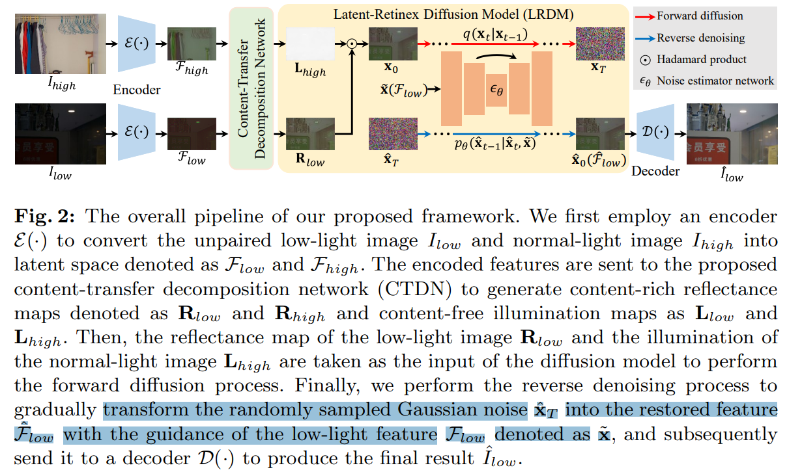
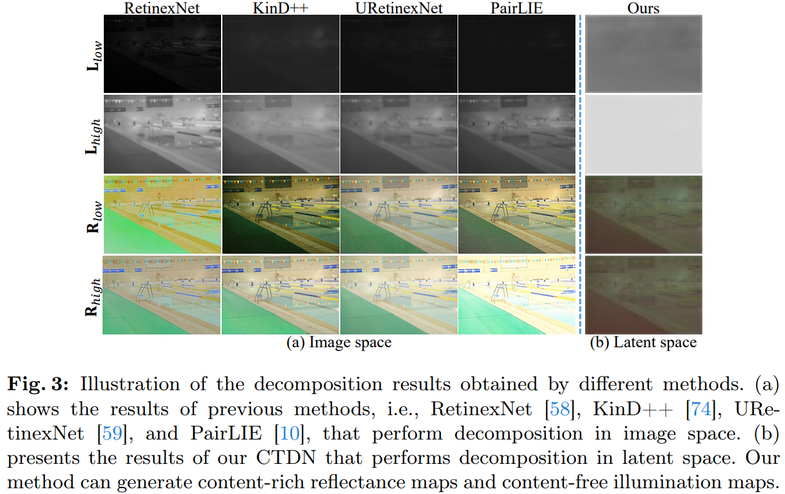
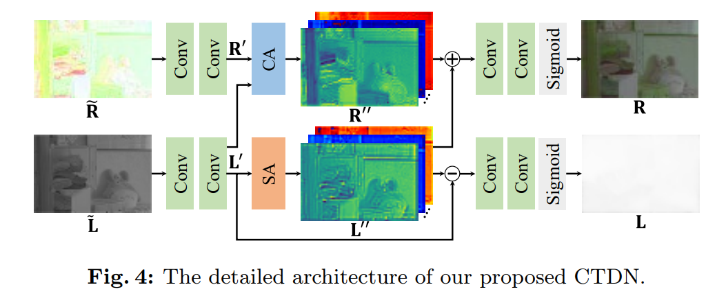
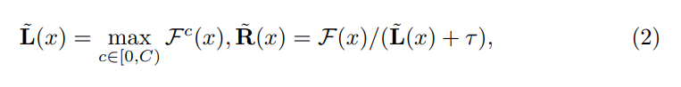
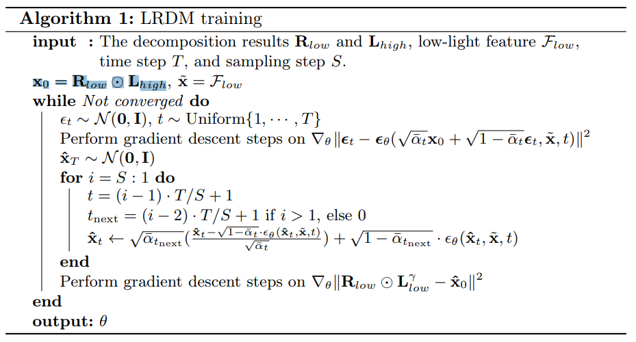
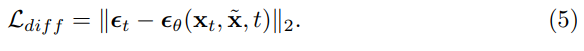
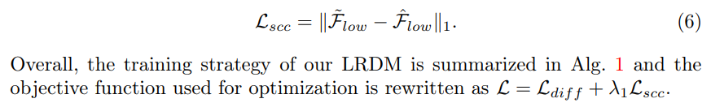
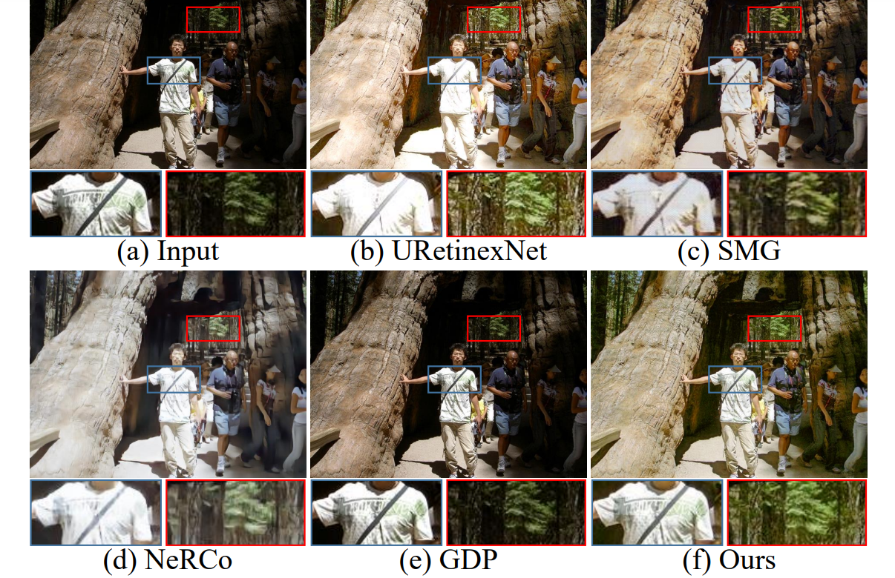

# LightenDiffusion: Unsupervised Low-Light Image Enhancement with Latent-Retinex Diffusion Models

> "LightenDiffusion: Unsupervised Low-Light Image Enhancement with Latent-Retinex Diffusion Models" Arxiv, 2024 Jul 12
> [paper](http://arxiv.org/abs/2407.08939v1) [code](https://github.com/JianghaiSCU/LightenDiffusion.) [pdf](./2024_07_Arxiv_LightenDiffusion--Unsupervised-Low-Light-Image-Enhancement-with-Latent-Retinex-Diffusion-Models.pdf) [note](./2024_07_Arxiv_LightenDiffusion--Unsupervised-Low-Light-Image-Enhancement-with-Latent-Retinex-Diffusion-Models_Note.md)
> Authors: Hai Jiang, Ao Luo, Xiaohong Liu, Songchen Han, Shuaicheng Liu

## Key-point

- Task: low-light image enhancement
- Problems
- :label: Label: `unsupervised `, `Retinex`

## Contributions

- propose a diffusion-based **unsupervised framework** that incorporates physically **explainable Retinex** theory

- a content-transfer decomposition network that performs Retinex decomposition within the **latent space**

  > encoded features of unpaired low-light and normal-light images to be decomposed into **content-rich reflectance maps and content-free illumination maps**

- a **self-constrained consistency loss** is further proposed to eliminate the interference of normal-light content on the restored results

- LightenDiffusion outperforms **state-of-the-art unsupervised** competitors and is comparable to supervised methods while being **more generalizable to various scenes**

## Introduction

### Retinex theory

assumes that an image I can be decomposed into a **reflectance map R and an illumination map L** 
$$
I = R \dotproduct L
$$

## methods

- Q：如何体现 LDM?

  用编解码器先提取特征，**用这个特征去生成 reflectance map R and an illumination map L**，体现出实在 latent space 做

### CDTN

- Q：先前方法在 image space 做 Retinex Theory 分解不是很纯粹，分解出来的 illumination  包含了 reflectance  :star:

理想情况光照图含有越少物体信息越好 content-free illumination map; **验证了在 latent space 做 reflectance & illumination map 分解能更好减少耦合；**

> generate content-rich reflectance maps and content-free illumination maps

**CDTN 结构**

CDTN 输入要先预测一个 (R, L)，在先前基础上**对 reflectance and illumination map 用 CNN 优化** :star:；

> we first estimate the initial reflectance and illumination maps following [14]

### LDM

**Challenge**: Retinex Theory 分解，针对部分 case 还是不行

- Retinex decomposition inevitably encounters **information loss**
- the restored image would present **artifacts** once the illumination map of the reference normal-light image still contains stubborn content information

低光图像增强，illumination map 含有了物体信息造成了物体的 artifact; 
**验证了能够用生成的方式去弥补之前的 information loss**

> we propose a Latent-Retinex diffusion model (LRDM) that leverages the generative ability of diffusion models to compensate for content loss

- LDM 训练流程，多步训练
  - x0 用低光图像的 reflectance map 和正常图像的亮度图，**用Retinex Theory 拼接，体现无监督** :star:
  - 每次训练一次去噪 S 步，sampling step=S :star:
  - 低光图像的特征 $\tilde{x}$ 作为 condition
  - 训练时候**事先提取好每张图的各个特征**： reflectance map & illumination map，编码器的特征

对应 framework

**Loss 部分**

- diffusion loss

- Q：发现如果只用 diffusion loss 出图有 artifact ？

**亮度图还是包含不必要的物体信息，影响了学习到特征的分布**，导致 diffusion 回复出来的图有 artifact 

> However, as mentioned above, the input x0 would present artifacts once the estimated illumination map still contains content information, which may **affect the learned distribution** and result in the Fˆ low being disrupted.

目标就是**约束一下编码器出来的特征，更多保留低光图像的特征**

> Therefore, we propose a self-constrained consistency loss Lscc to enable the restored feature to share the same intrinsic information as the input low-light image

- Q：训练时候怎么加 consistency loss 呢？

> we first perform the reverse denoising process in the training phase following [20,22,76]

diffusion 输出的特征是 $\hat{F}$ 带 hat 的；监督信号用 Retinex Theory 合成的、符号为 tilde 的 $\tilde{F}_low=R_{low} \dotproduct L_{low}^{\gamma}$

- Q：$L_{low}^{\gamma}$ 是啥？

## setting

## Experiment

> ablation study 看那个模块有效，总结一下

## Limitations

## Summary :star2:

> learn what & how to apply to our task

- 验证了在 latent space 做 reflectance & illumination map 分解能更好减少耦合；

- 低光图像增强，illumination map 含有了物体信息造成了物体的 artifact

- Q：如何体现 LDM?

  用编解码器先提取特征，**用这个特征去生成 reflectance map R and an illumination map L**，体现出实在 latent space 做
