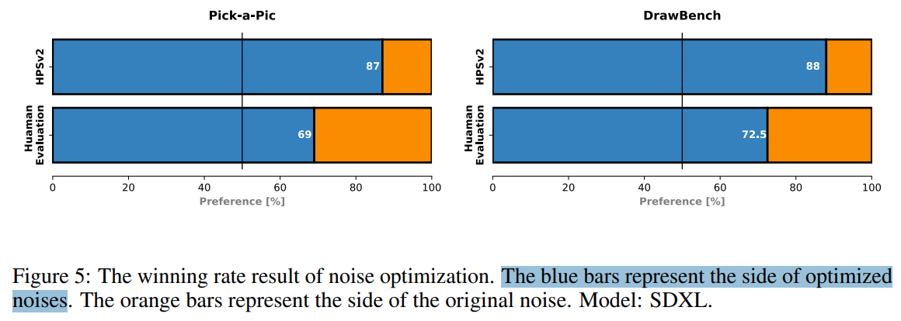

# Not All Noises Are Created Equally:Diffusion Noise Selection and Optimization

> "Not All Noises Are Created Equally:Diffusion Noise Selection and Optimization" Arxiv, 2024 Jul 19
> [paper](http://arxiv.org/abs/2407.14041v1) [code]() [pdf](./2024_07_Arxiv_Not-All-Noises-Are-Created-Equally-Diffusion-Noise-Selection-and-Optimization.pdf) [note](./2024_07_Arxiv_Not-All-Noises-Are-Created-Equally-Diffusion-Noise-Selection-and-Optimization_Note.md)
> Authors: Zipeng Qi, Lichen Bai, Haoyi Xiong, and Zeke Xie

## Key-point

- Task: `randomly sampled Gaussian noises` is right?
- Problems
- :label: Label:

> Are randomly sampled Gaussian noises equally good for diffusion models?

## Contributions

-  not all noises are created equally for diffusion models. We are the first to hypothesize and empirically observe that the generation quality of diffusion models significantly depend on the noise inversion stability
- **noise selection method** according to the inversion stability
- propose **a novel noise optimization method** that actively enhances the inversion stability of arbitrary given noises. Our method is the first one that works on noise space to generally improve generated results without fine-tuning diffusion models.
- extensive experiments demonstrate that the proposed noise selection and noise optimization methods both significantly improve representative diffusion models

## Introduction

## methods

### Noise Inversion Stability

- Q：fixed-point Gaussian noises 在去噪过程中是否也有稳定的性质？

将去噪看作一种变换 F，探索能否找到稳定的 fixed-point

> May the fixed-point Gaussian noises under the denoising-inversion transformation F also exhibit some advantages?

很难证明怎么找，做了几个假设

> finding the fixed points of this complex dynamical system is intractable, unfortunately, we cannot empirically verify it. Instead, we can formulate Definition 1 to measure the stability of noise for the denoising-inversion transformation F.

使用 cosine 相似度衡量噪声的稳定性

### Noise Selection

选取 stable noise

> we hypothesize that the noise with higher inversion stability can lead to better generated results.

### Noise Optimization

- Q：is it possible to actively optimize a given noise by maximizing the stability score?

为了要获取一个 stable fixed-noise, **去训练 noise**

loss 使用 1 - cosine

## setting

对比 SDXL-turbo，SDXL

> 目前生成效果最好的开源模型？

### noise selection experiments

select the (most) stable noise and the (most) unstable noise from 100 noise seeds according the noise inversion stability

> We evaluate generated results using human preference and objective evaluation metrics.
>
> we initialize the noise using one random seed and **perform GD to optimize the noise with 100 steps. The default values of the learning rate and the momentum are 100 and 0.5,** respectively :star:

### **Dataset**

- We use all 200 test prompts from the **DrawBench dataset**
- first 100 test prompts from the **Pick-a-Pic**

>  In case studies on color, style, text rendering, object co-occurrence, position, and counting, we specifically collected some prompts from the GenEval dataset 

### Evaluation metrics

- human preference

- HPS v2 :star:
- PickScore
- ImageReward

> HPS v2, PickScore, and ImageReward are all emerging human reward models that **approximate human preference** for text-to-image generation
>
> **HPS v2 is the state-of-the-art human reward model so far and offers a metric more close to human preference**
>
> human preference is regarded as the ground-truth and ultimate evaluation method for text-to-image generation. Thus, we regard **human preference and HPS v2 as the two most important metrics.**
>
> - "Human Preference Score v2: A Solid Benchmark for Evaluating Human Preferences of Text-to-Image Synthesis" Arxiv, 2023 Jun 15
>   [paper](http://arxiv.org/abs/2306.09341v2) [code](https://github.com/tgxs002/HPSv2) [pdf](./2023_06_Arxiv_Human-Preference-Score-v2--A-Solid-Benchmark-for-Evaluating-Human-Preferences-of-Text-to-Image-Synthesis.pdf) [note](./2023_06_Arxiv_Human-Preference-Score-v2--A-Solid-Benchmark-for-Evaluating-Human-Preferences-of-Text-to-Image-Synthesis_Note.md)
>   Authors: Xiaoshi Wu, Yiming Hao, Keqiang Sun, Yixiong Chen, Feng Zhu, Rui Zhao, Hongsheng Li
> - 

- AES

> AES indicates a conventional aesthetic score for images

## Experiment

> ablation study 看那个模块有效，总结一下

### Noise Selection

- objective evaluation scores 主观指标看下 visual quality

human preference 提升不明显，但 HPSv2 指标上有一些，因为是 text2image，生成出来 2 张不一样的东西。。**只是从图像质量角度来看稍微好一丢丢** :star:

### Noise Selection

- qualitative results of **noise selection**

从多个角度 & diffusion 生成比较困难的例子来评估

1. visual quality >> HPSv2 & human-preference :star:
2. Color （可以用）
3. style（可以用）
4. text rendering （可以用）
5. object co-occurrence
6. position
7. counting（也许我们的任务用不上）

> We not only care about the standard visual quality, but also further focus on those **challenging cases** for diffusion models, such as color, style, text rendering, object co-occurrence, position, and counting.

### Noise Optimization

优化一下主观好了更多！

使用 GD 对 noise 优化一下对生成颜色，物体内容（style），细节好了很多，错误生成似乎减少了。文字效果好了一些但不多

- SDXL 不同去噪步数下，优化 noise 的影响：步数越小，主观生成质量提升越明显 :star:

#### Application: 3D generation

## Limitations

- we still do not theoretically understand why not all noises are created for diffusion models

## Summary :star2:

> learn what

- **Diffusion 使用的 initial noise 需要优化，具有更好 stability 的 noise生成的质量更好:star:**

  > noises with higher inversion stability often lead to better generated results

- human preference 提升不明显，但 HPSv2 指标上有一些，因为是 text2image，生成出来 2 张不一样的东西。。**只是从图像质量角度来看稍微好一丢丢**

- 从多个角度 & diffusion 生成比较困难的例子来评估

  1. visual quality >> HPSv2 & human-preference :star:
  2. Color （可以用）
  3. style（可以用）
  4. text rendering （可以用）
  5. object co-occurrence
  6. position
  7. counting（也许我们的任务用不上）

  > We not only care about the standard visual quality, but also further focus on those **challenging cases** for diffusion models, such as color, style, text rendering, object co-occurrence, position, and counting.

- 使用 GD 对 noise 优化一下对生成颜色，物体内容（style），细节好了很多，错误生成似乎减少了。文字效果好了一些但不多 :star:

- SDXL 不同去噪步数下，优化 noise 的影响：步数越小，主观生成质量提升越明显 :star:

### how to apply to our task

- 主观评估指标！
- 使用 GD 对 noise 优化一下对生成颜色，物体内容（style），细节好了很多，错误生成似乎减少了。文字效果好了一些但不多
- 学一下这么简单易于理解的 idea，如何把 abstract 写的这么好 :star:
