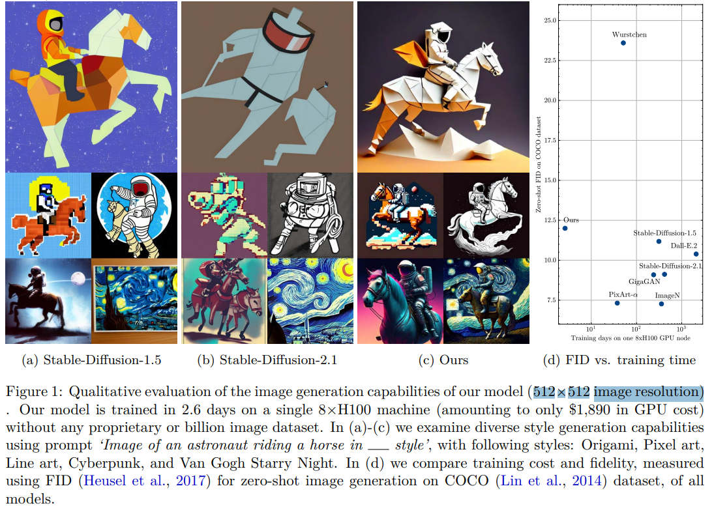
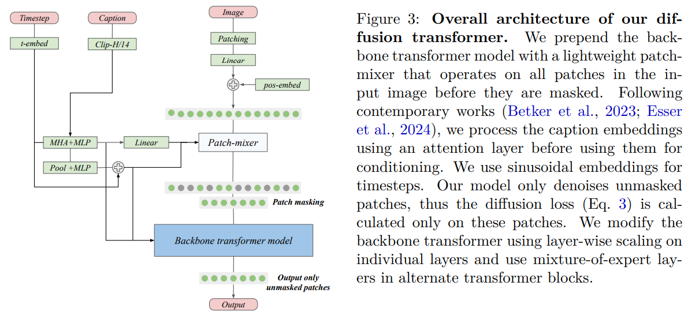

# Stretching Each Dollar: Diffusion Training from Scratch on a Micro-Budget

> "Stretching Each Dollar: Diffusion Training from Scratch on a Micro-Budget" Arxiv, 2024 Jul 22
> [paper](http://arxiv.org/abs/2407.15811v1) [code]() [pdf](./2024_07_Arxiv_Stretching-Each-Dollar--Diffusion-Training-from-Scratch-on-a-Micro-Budget.pdf) [note](./2024_07_Arxiv_Stretching-Each-Dollar--Diffusion-Training-from-Scratch-on-a-Micro-Budget_Note.md)
> Authors: Vikash Sehwag, Xianghao Kong, Jingtao Li, Michael Spranger, Lingjuan Lyu

## Key-point

- Task: 降低 T2I 训练金钱成本
- Problems
- :label: Label:

## Contributions

- we propose to randomly mask up to 75% of the image patches during training.

- We propose **a deferred masking strategy** that preprocesses all patches using a patch-mixer before masking, thus significantly reducing the performance degradation with masking, making it superior to model downscaling in reducing computational cost.
-  We also incorporate the latest **improvements in transformer architecture, such as the use of mixture-of-experts layers, to improve performance and further identify the critical benefit of using synthetic images in micro-budget training.** 
- SOTA, 2k $ 训练成本

> Finally, using only 37M publicly available real and synthetic images, we train a 1.16 billion parameter sparse transformer with only $1,890 economical cost and achieve a 12.7 FID in zero-shot generation on the COCO dataset. 

## Introduction

> With a focus on text-to-image (T2I) generative models, we aim to address this bottleneck by demonstrating very low-cost training of large-scale T2I diffusion transformer models.

**8卡 H100 训练 2.6 days, FID 指标接近 SDv1.5**

## methods

## setting

## Experiment

> ablation study 看那个模块有效，总结一下

## Limitations

## Summary :star2:

> learn what

### how to apply to our task

