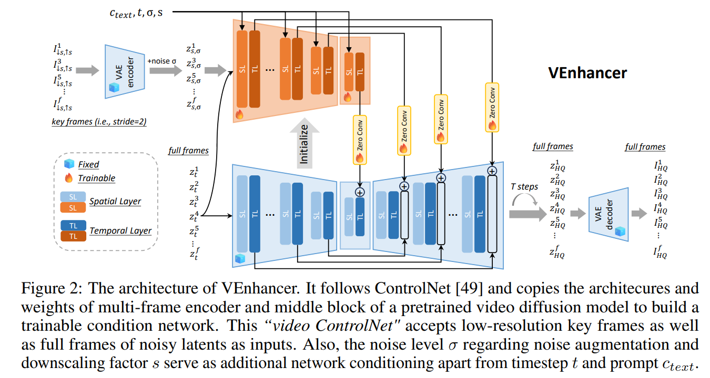
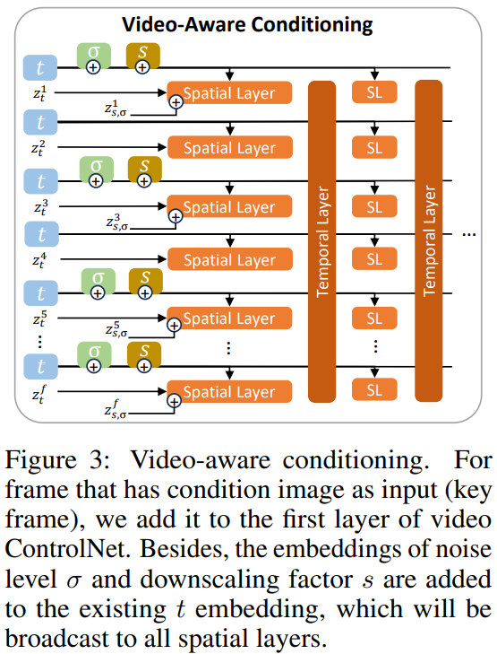

# VEnhancer: Generative Space-Time Enhancement for Video Generation

> "VEnhancer: Generative Space-Time Enhancement for Video Generation" Arxiv, 2024 Jul 10
> [paper](http://arxiv.org/abs/2407.07667v1) [code]() [pdf](./2024_07_Arxiv_VEnhancer--Generative-Space-Time-Enhancement-for-Video-Generation.pdf) [note](./2024_07_Arxiv_VEnhancer--Generative-Space-Time-Enhancement-for-Video-Generation_Note.md)
> Authors: Jingwen He, Tianfan Xue, Dongyang Liu, Xinqi Lin, Peng Gao, Dahua Lin, Yu Qiao, Wanli Ouyang, Ziwei Liu

## Key-point

- Task: Diffusion-VSR, Improve Quality, space-time enhancement
- Problems
- :label: Label:

## Contributions

- VEnhancer, a generative space-time enhancement framework that improves the existing text-to-video results by adding more details in spatial domain and synthetic detailed motion in temporal domain.

- 可以用于提升 video HxW, T 的尺寸 :star:

  > Given a generated low-quality video, our approach can increase its spatial and temporal resolution simultaneously with **arbitrary up-sampling space and time scales** through a unified video diffusion model.

- 可以去除生成的 artifact

  > VEnhancer effectively removes generated spatial artifacts and temporal flickering of generated videos.

- design space-time data augmentation as well as video-aware conditioning.
- 在 VBench 上性能最好

## Introduction

## methods

搞了一个 3D-ControlNet

> The main difference is that video ControlNet has temporal convolution or attention layer positioned after spatial convolution or attention layer, and the multi-frame control signals are aligned by temporal layers.

###  Space-Time Data Augmentation

>  To this end, we propose a novel data augmentation strategy for both space and time axes.

- T 维度设置滑动窗口，间隔随机在 1-8 选
- Spatial 维度设置 downsample 缩小图像，尺度 1-8

得到一个 Low-resolution(Spatial&Temporal) video

### Video-Aware Conditioning

跟 3D controlnet AnimateDiff 一样啊

## setting

## Experiment

> ablation study 看那个模块有效，总结一下

## Limitations

## Summary :star2:

> learn what

### how to apply to our task

- Q：Video VAE 咋搞？

