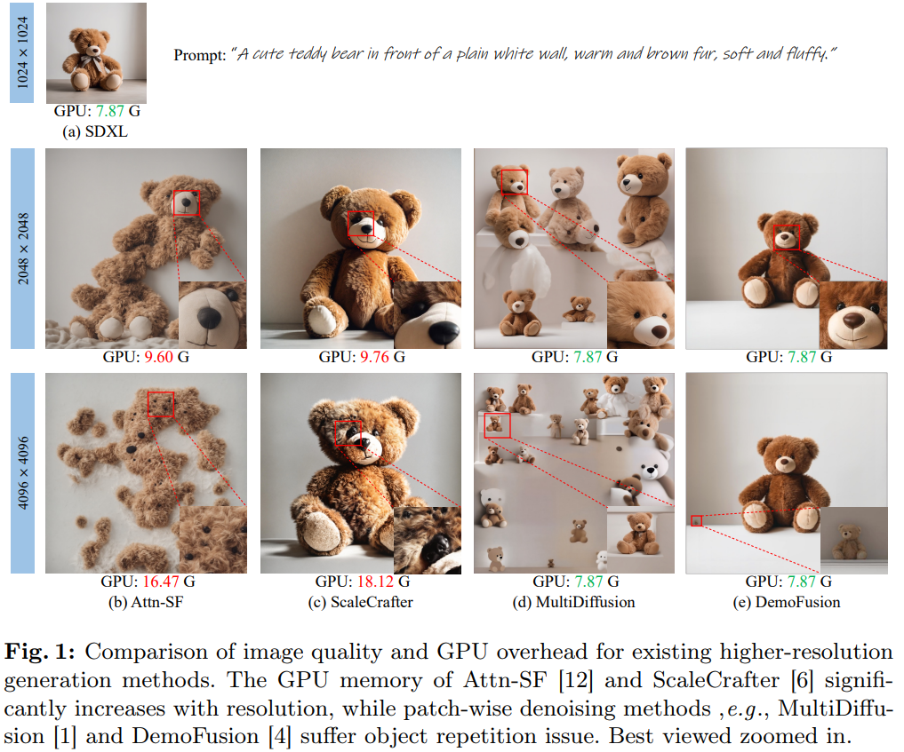
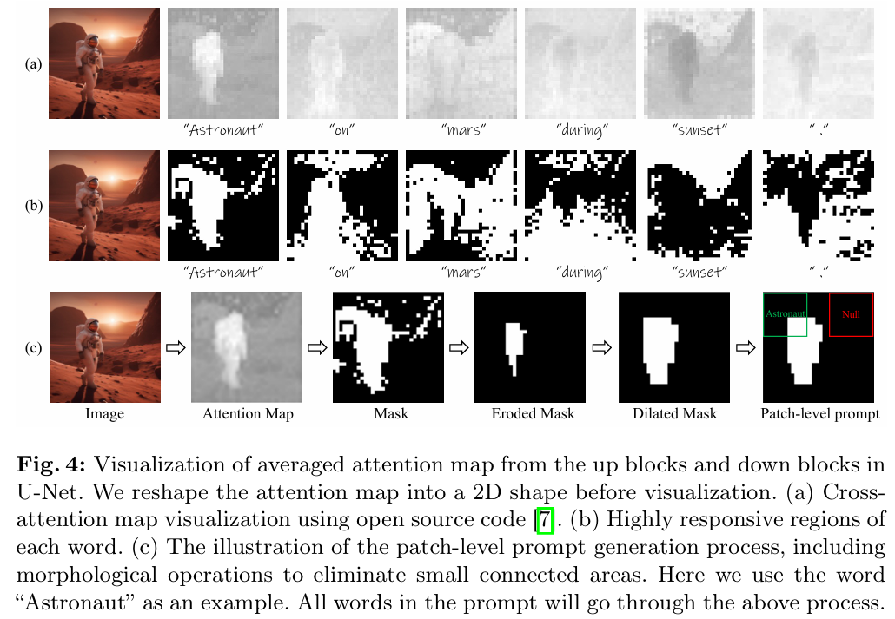

# AccDiffusion: An Accurate Method for Higher-Resolution Image Generation

> "AccDiffusion: An Accurate Method for Higher-Resolution Image Generation" ECCV, 2024 Jul 15
> [paper](http://arxiv.org/abs/2407.10738v2) [code](https://github.com/lzhxmu/AccDiffusion) [web](https://lzhxmu.github.io/accdiffusion/accdiffusion.html) [pdf](./2024_07_ECCV_AccDiffusion--An-Accurate-Method-for-Higher-Resolution-Image-Generation.pdf) [note](./2024_07_ECCV_AccDiffusion--An-Accurate-Method-for-Higher-Resolution-Image-Generation_Note.md)
> Authors: Zhihang Lin, Mingbao Lin, Meng Zhao, Rongrong Ji(Tencent)

## Key-point

- Task: patch-wise higher-resolution image generation
- Problems
  - Demofusion 实现 patch 一致性已经很好了，但**存在不同区域出现重复物体的问题** & 纹理结构与 LR 不一致的问题

- :label: Label:

## Contributions

- 不需要训练！

  > We propose AccDiffusion, an accurate method for patch-wise higher-resolution image generation without training.

- 分析 multi-diffusion 小物体出现重复生成的原因

  > An in-depth analysis in this paper reveals an identical text prompt for different patches causes repeated object generation, while no prompt compromises the image details

- patch-wise prompt

  > our AccDiffusion, for the first time, proposes to decouple the vanilla image-content-aware prompt into a set of patch-content-aware prompts, each of which serves as a more precise description of an image patch. 

- global consistency

  > AccDiffusion also introduces dilated sampling with window interaction for better global consistency in higher-resolution image generation

- SOTA

## Introduction

SDv1.5 训练 512x512 的模型要 256 A100 训练 20days，生成高分辨率图像训练消耗需要降低

> The demand for generating high-resolution images clashes with the expensive training costs involved

生成高分辨率图像，随着分辨率增大，GPU 显存消耗巨幅增加

- "Training-free diffusion model adaptation for variable-sized text-to-image synthesis" NIPS, `Attn-SF`
  [paper](https://arxiv.org/pdf/2306.08645)
- "Scalecrafter: Tuning-free higher-resolution visual generation with diffusion models" ICLR 
  [paper](https://arxiv.org/pdf/2310.07702)

基于 patch 的方案，会在多个 patch 出现重复物体 or 纹理 or 结构不一致

> **patch-wise denoising methods** suffer object repetition issue
>
> object repetition and inconsistent object structures

- "MultiDiffusion: Fusing Diffusion Paths for Controlled Image Generation" ICML, 2023 Feb 16
  [paper](http://arxiv.org/abs/2302.08113v1) [code](https://multidiffusion.github.io) [pdf](./2023_02_ICML_MultiDiffusion--Fusing-Diffusion-Paths-for-Controlled-Image-Generation.pdf) [note](./2023_02_ICML_MultiDiffusion--Fusing-Diffusion-Paths-for-Controlled-Image-Generation_Note.md)
  Authors: Omer Bar-Tal, Lior Yariv, Yaron Lipman, Tali Dekel
- "DemoFusion: Democratising High-Resolution Image Generation With No" CVPR, 2023 Nov 24
  [paper](http://arxiv.org/abs/2311.16973v2) [code](https://github.com/PRIS-CV/DemoFusion) [web](https://ruoyidu.github.io/demofusion/demofusion.html) [pdf](./2023_11_CVPR_DemoFusion--Democratising-High-Resolution-Image-Generation-With-No.pdf) [note](./2023_11_CVPR_DemoFusion--Democratising-High-Resolution-Image-Generation-With-No_Note.md)
  Authors: Ruoyi Du, Dongliang Chang, Timothy Hospedales, Yi-Zhe Song, Zhanyu Ma
- "SyncDiffusion: Coherent Montage via Synchronized Joint Diffusions" NIPS, 2023 Jun 8
  [paper](http://arxiv.org/abs/2306.05178v3) [code](https://syncdiffusion.github.io.) [pdf](./2023_06_NIPS_SyncDiffusion--Coherent-Montage-via-Synchronized-Joint-Diffusions.pdf) [note](./2023_06_NIPS_SyncDiffusion--Coherent-Montage-via-Synchronized-Joint-Diffusions_Note.md)
  Authors: Yuseung Lee, Kunho Kim, Hyunjin Kim, Minhyuk Sung

### DemoFusion

- "DemoFusion: Democratising High-Resolution Image Generation With No" CVPR, 2023 Nov 24
  [paper](http://arxiv.org/abs/2311.16973v2) [code](https://github.com/PRIS-CV/DemoFusion) [web](https://ruoyidu.github.io/demofusion/demofusion.html) [pdf](./2023_11_CVPR_DemoFusion--Democratising-High-Resolution-Image-Generation-With-No.pdf) [note](./2023_11_CVPR_DemoFusion--Democratising-High-Resolution-Image-Generation-With-No_Note.md)
  Authors: Ruoyi Du, Dongliang Chang, Timothy Hospedales, Yi-Zhe Song, Zhanyu Ma

分析 demoFusion 还会出现一小部分重复物体的原因，在于所有 patch 使用了同一个 prompt

> In this paper, our in-depth analysis of DemoFusion [4] indicates, as illus trated in Fig.2(a), small object repetition generation is the adversarial outcome of an identical text prompt on all patches, encouraging to generate repeated objects, and global semantic information from residual connection and dilated sampling, suppressing the generation of repeated objects. 

- 对于指定 patch 使用单独的 prompt

对于 Text 使用 SegMap CrossAttn Map 做 loss 实现

> propose to decouple the vanilla image-content-aware prompt into a set of patch-content-aware substrings
>
>  we utilize the cross-attention map from the low-resolution generation process to determine whether a word token should serve as the prompt for a patch.
>
> Specifically, we utilize the cross-attention map from the low-resolution generation process to determine whether a word token should serve as the prompt for a patch. **If a word token has a high response in the cross-attention map region corresponding to the patch, it should be included in the prompt, and vice versa.**

- DemoFusion 出现不一致 & noisy

> we observe that the dilated sampling operation in DemoFusion generates globally inconsistent and noisy information, disrupting the generation of higher-resolution images. Such inconsistency stems from the independent denoising of dilation samples without interaction.

对于不同区域的 dilation sample，融入 position 融合 noise?

> we employ a position-wise bijection function to enable interaction between the noise from different dilation samples.

### video

- https://arxiv.org/pdf/2410.13832
- https://arxiv.org/pdf/2406.13527
- "Fine-Tuning Image-Conditional Diffusion Models is Easier than You Think" Arxiv, 2024 Sep 17
  [paper](http://arxiv.org/abs/2409.11355v1) [code]() [pdf](./2024_09_Arxiv_Fine-Tuning-Image-Conditional-Diffusion-Models-is-Easier-than-You-Think.pdf) [note](./2024_09_Arxiv_Fine-Tuning-Image-Conditional-Diffusion-Models-is-Easier-than-You-Think_Note.md)
  Authors: Gonzalo Martin Garcia, Karim Abou Zeid, Christian Schmidt, Daan de Geus, Alexander Hermans, Bastian Leibe

使用 Multidiffusion 方式融合

### diffusion flaw

推理的时候有用到

- "Common Diffusion Noise Schedules and Sample Steps are Flawed" WACV, 2023 May 15
  [paper](http://arxiv.org/abs/2305.08891v4) [code]() [pdf](./2023_05_WACV_Common-Diffusion-Noise-Schedules-and-Sample-Steps-are-Flawed.pdf) [note](./2023_05_WACV_Common-Diffusion-Noise-Schedules-and-Sample-Steps-are-Flawed_Note.md)
  Authors: Shanchuan Lin, Bingchen Liu, Jiashi Li, Xiao Yang

> https://vscode.dev/github/lzhxmu/AccDiffusion/blob/main/accdiffusion_sdxl.py#L1434

### SDXL

- "SDXL: Improving Latent Diffusion Models for High-Resolution Image Synthesis" ICLR, 2023 Jul 4
  [paper](http://arxiv.org/abs/2307.01952v1) [code](https://github.com/Stability-AI/generative-models) [pdf](./2023_07_ICLR_SDXL--Improving-Latent-Diffusion-Models-for-High-Resolution-Image-Synthesis.pdf) [note](./2023_07_ICLR_SDXL--Improving-Latent-Diffusion-Models-for-High-Resolution-Image-Synthesis_Note.md)
  Authors: Dustin Podell, Zion English, Kyle Lacey, Andreas Blattmann, Tim Dockhorn, Jonas Müller, Joe Penna, Robin Rombach

1. 优化 UNet 结构，增加 transformer blocks 个数，**Unet 参数量从 SDv1.5 的 0.8B 增加到 2.6B**

2. 增加一个 refinement model，对第一阶段 UNet 出来的 latent 优化一下

3. 增加一个 text encoder concat 到一起

4. 训练 trick

   > 位置区域使用 Fourier Encoding 提取特征 concat 到 timestep 特征里面 :star:

   1. 增加 image size(图像分辨率) 作为 condition，更好利用 39% 的 size <256 or 512 的训练图像数据
   2. 增加 crop 区域作为 condition
   3. offset noise
   4. 多尺度（图像长宽比）训练
   5. 3 个训练 stage，从头训练，在 512x512 上训练，在 1024x1024 上训练

5. 重新训练了一个优化的 VAE

### cross-attn map visualize

参考 "Prompt-to-prompt image editing with cross attention control" :star:

## methods

使用 SDXL 作为基础模型，过 VAE 后**在 latent space 做融合！**

> - "SDXL: Improving Latent Diffusion Models for High-Resolution Image Synthesis" ICLR, 2023 Jul 4
>   [paper](http://arxiv.org/abs/2307.01952v1) [code](https://github.com/Stability-AI/generative-models) [pdf](./2023_07_ICLR_SDXL--Improving-Latent-Diffusion-Models-for-High-Resolution-Image-Synthesis.pdf) [note](./2023_07_ICLR_SDXL--Improving-Latent-Diffusion-Models-for-High-Resolution-Image-Synthesis_Note.md)
>   Authors: Dustin Podell, Zion English, Kyle Lacey, Andreas Blattmann, Tim Dockhorn, Jonas Müller, Joe Penna, Robin Rombach

### Patch-wise Denoising 先前工作

MultiDiffusion 对多个重叠的 VAE patch 逐个去噪，在每一个 timestep 结束融合成一个大的特征；逐步去噪

> MultiDiffusion [1] achieve higher-resolution image generation by fusing multiple overlapped denoising patches.

DemoFusion 引入 progressive upscale；noise inversion 的残差保留全局信息；patch noise 之间做 dilated sampling 进行 patch 之间的特征融合

> Based on MultiDiffusion, DemoFusion [4] additionally introduces: 1) progressive upscaling to gradually generate higher-resolution images; 2) residual connection to maintain global consistency with the lower-resolution image by injecting the intermediate noise-inversed representation. 3) dilated sampling to enhance global semantic information of higher-resolution images.

### 分析重复物体原因

- Q：为啥有重复物体？

以 DemoFusion 为 baseline，对生成要用的信息做 ablation study 看看效果

- 去掉 text prompt，没有重复物体了，但质量很烂

- noise 全局残差去掉，失效了 :star:

  说明 noise inversion 中全图的 noise bilinear 插值后有影响图像内容的全局信息

> Therefore, we can make asafe conclusion that small object repetition is the adversarial outcome of an identical text prompt on all patches and operations of residual connection & dilated sampling. 

总结一下，不同区域 prompt 一致造成混淆 & 需要全局 noise 残差 :star:

> The former encourages to generate repeated objects while the latter suppresses the generation of repeated objects.

#### patch prompt

- Q：如何改进 prompt？

对于 patch 角度，如果这个 patch 里面没有这个物体，就不要加入 patch 的 prompt

> Instead, we require more accurate prompts specifically tailored for each patch. That is, if an object is not present in a patch, the corresponding word in the text prompts should not serve as a prompt for that patch.

对于每个 patch 单独生成 prompt

> Instead, we generate more precise patch-content-aware prompts that adapt to the content of different patches.

- Q：如何生成 patch prompt?

**手工标注 or SAM 分割在对于每个 patch 查找，都很费时间 or 算力**

>  direct but cumbersome approach is to manually observe the patch content of low-resolution image and then set the prompt for each patch, which undermines the usability of stable diffusion. Another approach is to use SAM [13] to segment the upscaled low-resolution image and determine whether each object appears in the patch, introducing huge storage and computational costs of the segmentation model. How to automatically generate patch-content aware prompts without external models is the key to success.

参考 cross-attn map Loss 的方式，对于 prompt 中的 token 进行针对性加权

>  Inspired by image editing [7], instead we consider the cross-attention maps in low-resolution generation M ∈ RN×M, to determine patch-content-aware prompts.

> cross-attn map 可视化参考 "Prompt-to-prompt image editing with cross attention control" :star:

计算**所有 token 的 cross-attn map 的均值作为阈值**，对 map 进行二值化；实现 "关联大的 token，cross-attn map 约显著"，来找到关联大的 token

> To **find the highly relevant region of each word token**, we convert the attention map Minto a binary mask B

> - Q：要是 text 描述不全，这个细节本来就在 prompt 里面没有对应 token 就挂了。。。

- Q：fig4 b) map 很杂乱？

对二值化的 map 处理下，先 reshape 和原图一样大；**做下 fig4 c) 列举的图形学处理**

- Q：怎么用这个 map mask？

对处理过的 attn map (resize 过后已经和原图一样大了)，做一样的滑动窗口获取 patch mask，能和 patch feature 对应起来；

> Inspired by MultiDiffusion [1], we use a shifted window to sample patches from ˜ B′ j 

根据 patch mask 去删掉文本中无关的 token :star:

> The pre-given hyper-parameter c ∈ (0,1) determines whether a highly responsive region’s proportion of a word yj exceeds the threshold **for inclusion in the prompts of patch zi t.**

#### dilated sample

DemoFusion 中对 VAE feature **按固定步长取特征点**，组成一块特征记作 $D_t^k$。**做完采样后，能够得到和特征 zT 一样大的特征 $D_t$ ，单独对 $D_t$ 去去噪，然后重拍，加权到 $z_{t-1}$ 中**

> In DemoFusion [4], each sample $D_t^k$ is a subset of the latent representation $Z_t$, formulated as

- Q：从实验结果发现 fig3 c) 如果没有 window interaction 加上去，**造成不平滑**

根据 b) c) 结果，推断是由于**全局残差是 rescale 过的，会扰乱 latent 特征**

>  The sharp global semantic information disturbs the higher-resolution generation.

提出 window interation 策略，让每个 patch 里面的一个点**一一对应**到另一个 patch 中的点（双射）

> To solve above issue, as illustrated in Fig.5, we enable window interaction be tween different samples before each denoising process through **bijective function:**

重排一下 $D_t$ ，再 denoise 最后同样地恢复原状

> 看起来这个 window interaction 可解释性不强啊。。。

## setting

- 尝试了多种 SD 版本
  - 发布的版本用的 SDXL
  - SDv1.5, v2.1

- 用 DemoFusion 作为 baseline 继续做

> AccDiffusion follows the pipeline of DemoFusion

- compared methods
  - SDXL-DI [17], 直接生成那么大的
  - "Training-free Diffusion Model Adaptation for Variable-Sized Text-to-Image Synthesis" NIPS, 2023 Jun, Attn-SF 
    [paper](https://arxiv.org/abs/2306.08645)
  - ScaleCrafter [6]
  - MultiDiffusion

metrics

- FID (Frechet Inception Distance) [8], IS (Inception Score) [25], and CLIP Score [19]
- 下标带个 r 的是和 GT 比较的 （都要先 resize 到 299，会引入误差），指标看看就好

## Experiment

> ablation study 看那个模块有效，总结一下

- Q：期待一下，怎么衡量重复物体不见了？ :thinking:

人眼看的。。。

尝试了多种 SD 版本，支持 SDv1.5

时间换空间，推理一张 4096x4096  的需要 26 min，**居然时长是直接出图的 3 倍**

- 效果和 DemoFusion 差不了多少

### ablation prompt & window

肉眼看有无重复物体。。。还是挑出来的图

看起来 Prompt 修改后好了一些，还要再加上 window interaction 才可以几乎看不出来重复物体 :dog:

### ablate binary map

说明用 map 的均值作为阈值来二值化 attn map 还可以。。

还有一个超参 C，选 token 时候要用

> the c determines whether the proportion of a highly respon sive region for a word yj surpasses the threshold required for inclusion in the prompts of patch zi t.

## Limitations

- 推理慢

> As it follows the DemoFusion pipeline, similar drawbacks arise such as inference latency from progressive upscaling and over lapped patch-wise denoising

- 两阶段模型，要先出一张低分辨率的图，一开始烂结果也烂。。。
- 基于预训练 SD，对于局部区域没有景深的概念，生成的景深很垃圾

> As it follows the DemoFusion pipeline, similar drawbacks arise such as inference latency from progressive upscaling and over lapped patch-wise denoising

## Summary :star2:

> learn what

### how to apply to our task

用这篇文章的 inference！

- 尝试了多种 SD 版本，支持 SDv1.5
