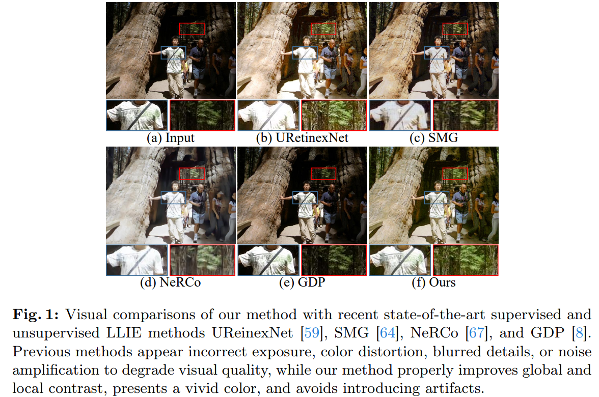
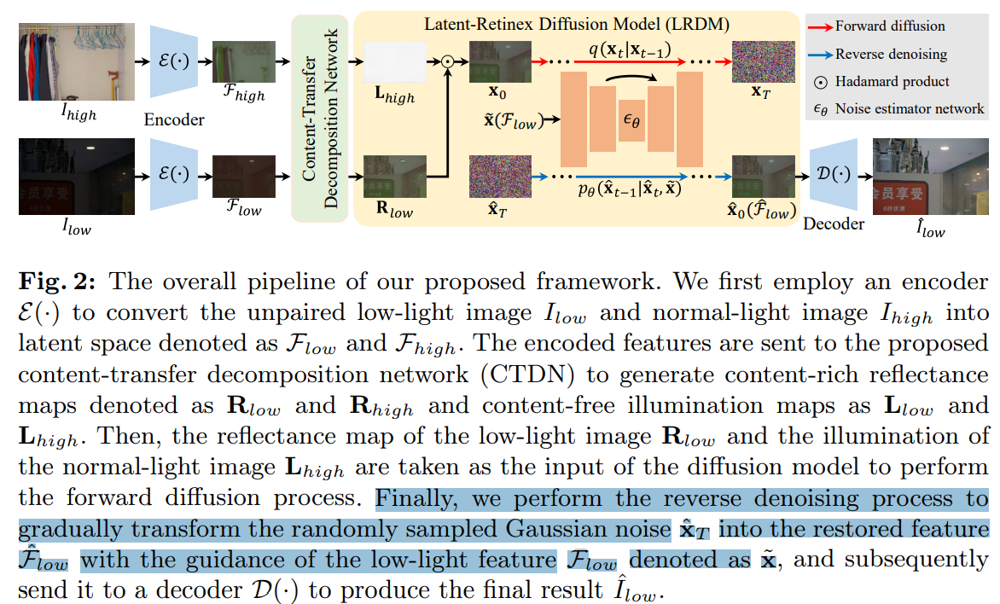
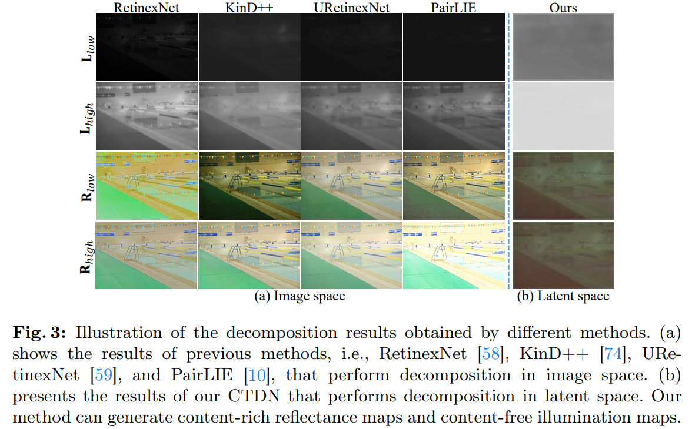

# LightenDiffusion: Unsupervised Low-Light Image Enhancement with Latent-Retinex Diffusion Models

> "LightenDiffusion: Unsupervised Low-Light Image Enhancement with Latent-Retinex Diffusion Models" ECCV, 2024 Jul 12
> [paper](http://arxiv.org/abs/2407.08939v1) [code](https://github.com/JianghaiSCU/LightenDiffusion) [pdf](./2024_07_ECCV_LightenDiffusion--Unsupervised-Low-Light-Image-Enhancement-with-Latent-Retinex-Diffusion-Models.pdf) [note](./2024_07_ECCV_LightenDiffusion--Unsupervised-Low-Light-Image-Enhancement-with-Latent-Retinex-Diffusion-Models_Note.md)
> Authors: Hai Jiang, Ao Luo, Xiaohong Liu, Songchen Han, Shuaicheng Liu

## Key-point

- Task
- Problems
- :label: Label:

## Contributions

- a diffusion-based **unsupervised framework**  && 利用 Retinex theory

  > enabling the encoded features of unpaired low-light and normal-light images to be decomposed into content-rich reflectance maps and content-free illumination maps.
  >
  > leverages the advantages of **Retinex theory** and the generative ability of diffusion models for **unsupervised low-light image** enhancement

- Latent 分解，获取反射 map + 光照图

  > content-transfer decomposition network that performs decomposition in the latent space

- SOTA

## Introduction

## methods

- 把 diffusion loss 基础上，**把预测得 noise 转为特征！和其他图像特征做 loss 很有效！！！！！！！**

VAE 空间可以分解出来亮度 + 内容 feature

## setting

## Experiment

> ablation study 看那个模块有效，总结一下

## Limitations

## Summary :star2:

> learn what

### how to apply to our task

